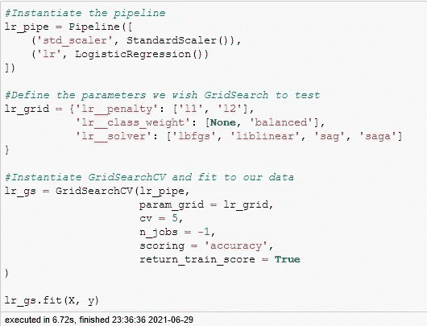

# 清除黑匣子:SHAP 的功能重要性

> 原文：<https://medium.com/analytics-vidhya/clearing-the-black-box-feature-importance-with-shap-afddfede5bf0?source=collection_archive---------8----------------------->

安德里亚·皮亚卡迪奥在[像素](https://www.pexels.com)上拍摄的照片

# 黑盒

机器和深度学习是创造预测的不可思议的工具。然而，随着它们变得越来越复杂，我们越来越不确定它们内部到底发生了什么。这就是“黑匣子”这个术语的由来。这是把一堆输入扔进一个盒子里，不知道里面发生了什么，然后让它抛出一个答案的想法。

虽然收到回复是件好事，但具体发生了什么还不太清楚。例如，选择的特征如何影响模型？

一个潜入黑盒子中寻找答案的图书馆是 [SHAP](https://github.com/slundberg/shap) 。

# 管道和 GridSearchCV 的功能效果

我们在这个例子中要查看的数据集将是[速配](https://www.kaggle.com/annavictoria/speed-dating-experiment)上的 [Kaggle](https://www.kaggle.com/) 数据集。我们将查看约会前获得的用户信息，以了解这些因素如何影响一个人是否约会的决定。

清理完数据后，我们将建立一个管道和 GridSearch 来测试几个逻辑回归超参数，并返回最佳模型。

太好了！我们运行这个来缩放我们的数据，并找到用于逻辑回归模型的最佳参数。现在，也许我们要对每个特征如何影响目标做出推论。我们能从逻辑回归模型中得出什么？

系数！逻辑回归为每个特征分配一个系数，作为其在模型中的影响。在这里，我们提取这些值:

检索系数

好的，很好，我们有系数了。但是它们是什么意思呢？问题就在这里。这些系数表示该特征在模型*中相对于其他特征*的影响。这意味着添加或移除特征将改变这些系数，可能从正变为负。那么我们能看到什么呢？

我们唯一能从中看出的是系数的影响大小(系数的大小)以及它的方向(负的或正的)。但是，这都与模型中的每个特征有关。最后，我们对这些特性没有多少了解。

这就是 SHAP 的用武之地。

# SHAP 特色解说

关于什么是 SHAP 值的解释可以在[这里](https://christophm.github.io/interpretable-ml-book/shapley.html)找到。但是，作为一个简单的解释，它通过查看与其他特征组合时的效果差异来计算该特征对目标的效果。

在我们的数据集的情况下，这将是一个特征对一个人是否同意约会的平均贡献。

首先，我们检索 SHAP 值。

检索 SHAP 值

注意:第一个参数是您的模型。在本例中，我们使用了 GridSearchCV 和管道。以下步骤解释了如何检索模型:

从 GridSearchCV 中检索最佳模型

现在已经检索了 SHAP 值，我们可以看一下特征。

首先要注意的是，除了 SHAP 值(一种评估特性影响的方法)之外，我们还可以看到特性的价值。因此，我们可以看到特性本身的价值如何影响模型。

此外，功能按影响顺序列出。所以对于这个模型，attr2_1 对 Logistic 回归模型的影响最大。

我们来看看前三个怎么样？

首先，所有特性都以字符串“attr”开头在这些调查中，所有三栏都与身体吸引力有关。

Attr2_1 代表了个体认为异性如何看待身体吸引力。较高的评级表示较高的重要性。

由此，我们可以看出，人们越相信身体吸引力的重要性，他们就越有可能同意和某人约会。

另一方面，attr1_1 和 attr4_1 分别是个人对身体吸引力的重要程度，以及个人认为大多数其他人寻找的东西。

我们可以看到，评分越低，模型就越倾向于预测个人会拒绝约会。

事实上，回到图像:

我们可以看到，在前九个特性中,“2_1”部分出现得相当多。尽管该模型包含人们所寻找的属性评级，但该模型更受人们认为异性所寻找的属性评级的影响，正如数据的关键所示。

# 洞察力

与查看系数列表相比，我们可以从 SHAP 的一个方面获得更多的洞察力。

SHAP 的力量不仅用于机器学习算法。它也可以用于深度学习，包括使用 Keras 进行图像识别。

SHAP 用来自 [SHAP 仓库](https://github.com/slundberg/shap)的图像识别

在这里，我们可以看到 Keras 用来区分这两种动物的不同方面。

这凸显了 SHAP 的多面性。能够查看哪些特征(甚至是图像中的特征)是最重要的，这允许用户更好地量化他们的结果。

以下是可用于深入了解 SHAP 的资源:

*   [SHAP 知识库](https://github.com/slundberg/shap)
*   [SHAP 文档](https://christophm.github.io/interpretable-ml-book/shap.html)