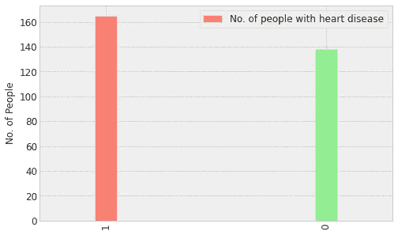
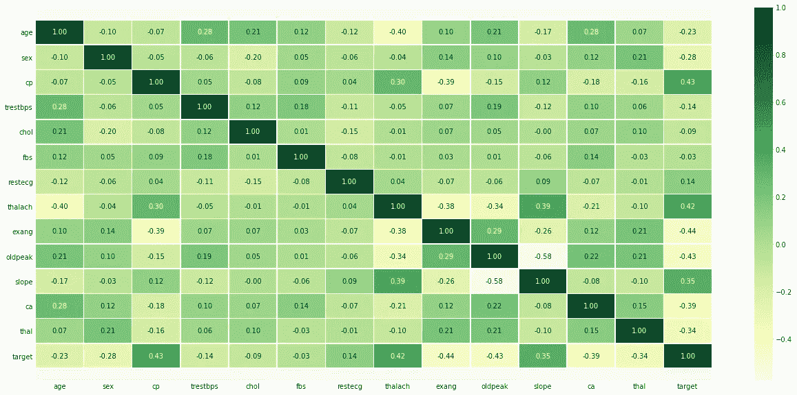
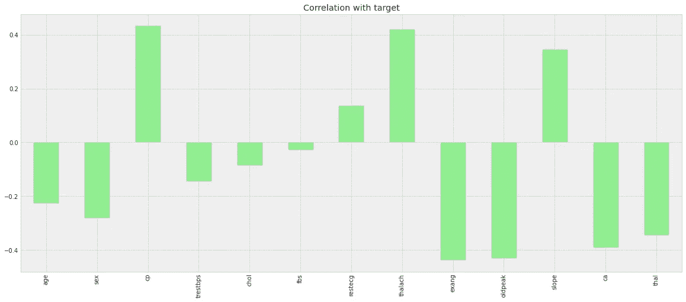
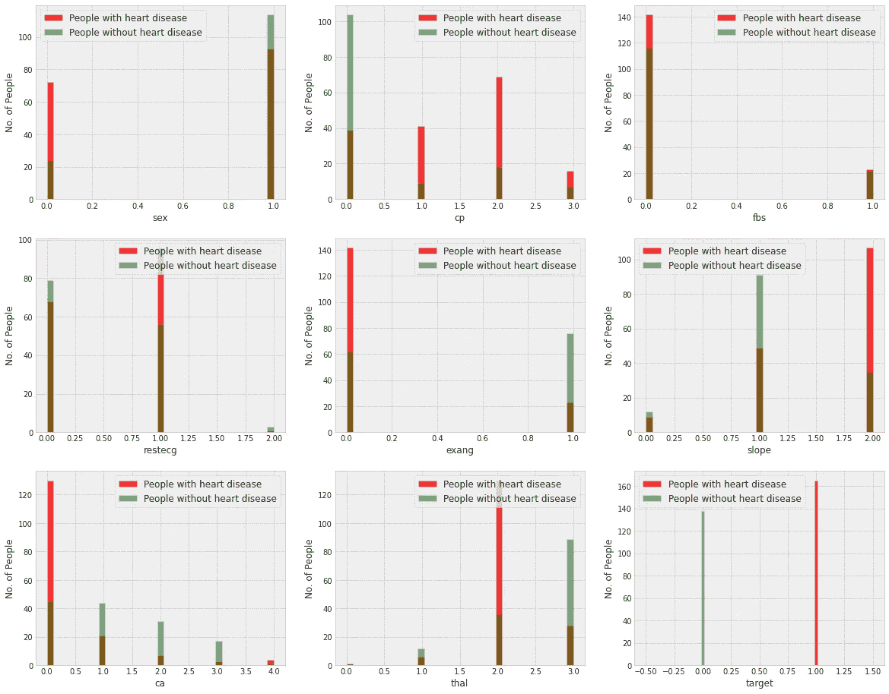
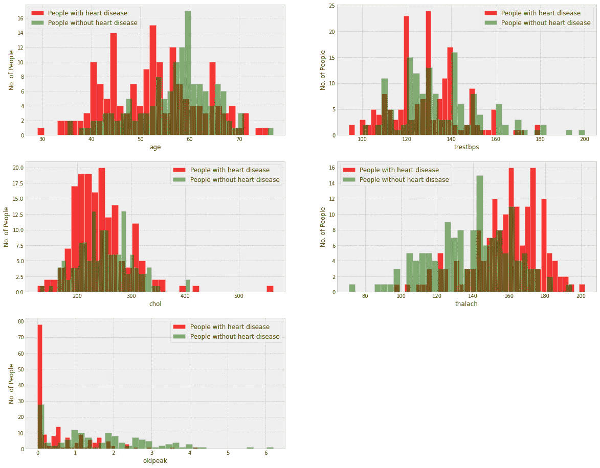
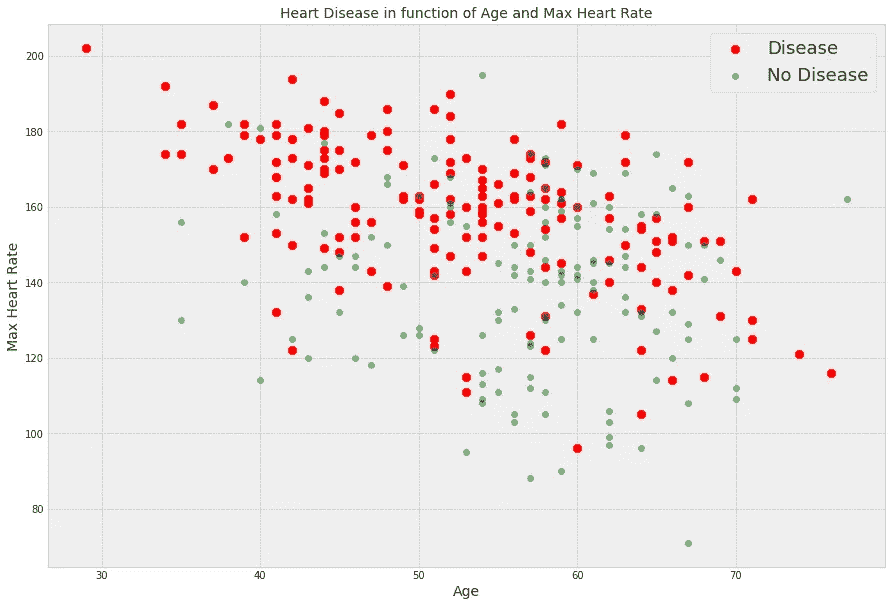
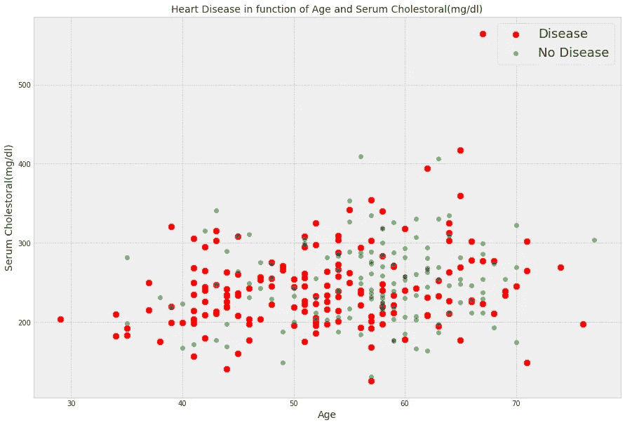
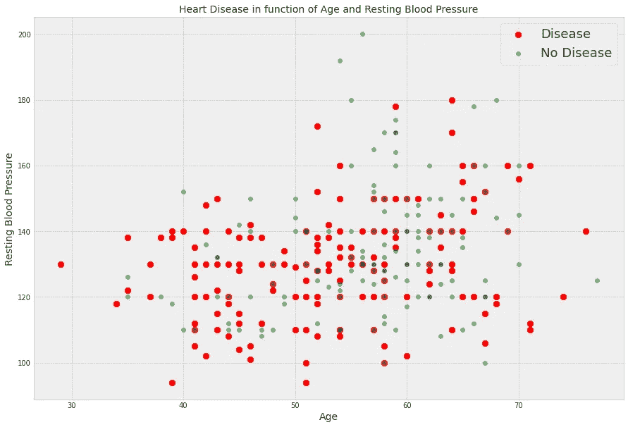

# ❤️‍🩹心脏病数据集[克里夫兰] — EDA📊📈

> 原文：<https://medium.com/analytics-vidhya/cleveland-eda-b73f0f62ebf8?source=collection_archive---------4----------------------->

# 克里夫兰心脏病数据集(UCI 知识库)—探索性数据分析

## **关于数据集:**

数据集始于 1988 年，由四个数据库组成:克利夫兰、匈牙利、瑞士和长滩 v。它包含 76 个属性，包括预测属性，但所有发表的实验都引用了其中 14 个属性的子集。“目标”字段是指患者是否存在心脏病。它是整数值，0 =疾病，1 =无疾病。

> 创作者:
> 
> 匈牙利心脏病研究所。布达佩斯:医学博士安朵斯·雅诺西
> 
> 瑞士苏黎世大学医院:威廉·斯坦布伦医学博士
> 
> 瑞士巴塞尔大学医院:马蒂亚斯·菲斯特勒医学博士
> 
> 弗吉尼亚医疗中心，长滩和克利夫兰诊所基金会:罗伯特·德特拉诺，医学博士，哲学博士。
> 
> 捐赠者:
> 大卫·w·阿哈(ics.uci.edu)(714)856–8779

UCI 心脏病机器学习知识库[数据集](http://archive.ics.uci.edu/ml/datasets/heart+disease)。

## **属性信息:**

— -

1.**年龄**:以年为单位的年龄

2.**性别** : 1 =男性；0 =女性

3. **cp** :胸痛型

-值 1:典型心绞痛

-值 2:非典型心绞痛

-价值 3:非心绞痛疼痛

-价值 4:无症状

4. **trestbps** :静息血压(入院时以毫米汞柱为单位)

5.**胆固醇**:血清胆固醇，单位为毫克/分升

6. **fbs** :空腹血糖> 120 mg/dl (1 =真；0 =假)

7.**静息心电图**:静息心电图结果

-值 0:正常

-值 1:有 ST-T 波异常(T 波倒置和/或 ST 抬高或压低> 0.05 mV)

-值 2:根据 Estes 标准显示可能或明确的左心室肥大

8. **thalach** :达到最大心率

9. **exang** :运动诱发心绞痛(1 =是；0 =否)

10. **oldpeak** :运动相对于休息诱发的 ST 段压低

11.**斜率**:运动 ST 段峰值的斜率

-价值 1:上升

-值 2:平面

-价值 3:下坡

12. **ca** :透视着色的主要血管数(0-3)

13. **thal** : 3 =正常；6 =修复缺陷；7 =可逆缺陷

— -

*请注意，这是一个相当老的数据集(1988 年)*

## 探索性数据分析:

1.  心脏病患者人数与非心脏病患者人数:

*   我们有 165 名心脏病患者和 138 名非心脏病患者，因此它平衡了我们的数据。

2.相关矩阵热图:

3.与目标的相关性:

*来自相关性的观察值:*

*   *fbs 和 chol 与目标变量的相关性最小。*
*   *所有其他变量都与目标变量有显著的相关性。*

4.分类值直方图:

*从上图观察:*

*   **CP {胸痛}**:*CP 1、2、3 的人比 cp 0 的人更容易患心脏病。*
*   **rest ECG {静息 EKG 结果}** : *值为 1(报告心律异常，症状从轻微到严重)的人更有可能患有心脏病。*
*   **exang {运动诱发的心绞痛}** : *数值为 0(否——运动诱发的心绞痛)的人比数值为 1(是——运动诱发的心绞痛)的人更易患心脏病*
*   **斜率{运动峰值 ST 段的斜率}** : *斜率值为 2(下降:心脏不健康的迹象)的人比斜率值为 2 的人更容易患心脏病斜率为 0(上升:运动时的最佳心率)或 1(下降:变化最小(典型的健康心脏))。*
*   **ca {透视染色的主要血管数(0–3)}**:*血液流动越多越好，所以 ca 等于 0 的人更容易患心脏病。*
*   **thal {铊压力结果}**:*thal 值为 2(缺陷已纠正:曾经是缺陷但现在可以了)的人更容易得心脏病。*

5.连续值直方图 **:**

*对上述地块的观察:*

*   **trestbps** : *任何高于 120–140 的静息血压都值得关注。*
*   **chol** : *大于 200 值得关注。*
*   **thalach** : *最高心率超过 140 的人更容易患心脏病。*
*   *运动诱发 ST 段压低与休息的旧峰看运动时心脏压力不健康的心脏压力会更大。*

6.散点图(年龄和最大心率的关系):

*从上图观察:*

*   极端值

7.散点图(年龄和血清胆固醇(mg/dl)关系):

8.散点图(年龄和静息血压关系):

*从上述地块观察(8 & 9):*

*   静息血压和血清胆固醇呈正相关，但相关程度不高。此外，静息血压和血清胆固醇很少有异常值，我们将在预处理步骤中去除。

我的 Jupyter 笔记本供代码参考:

*目前正在进行*心脏病预测*任务中各种研究方案的对比分析。*查看我的 [GitHub](https://github.com/shubamsumbria66) 个人资料了解更多详情。

如果你觉得这个故事信息丰富，请留下评论。✨

***感谢阅读！*🤗**