# 云计算应用系列:带有 AWS Lex、API Gateway 和 DynamoDB/Elasticsearch 的餐馆建议聊天机器人— 1.1

> 原文：<https://medium.com/analytics-vidhya/cloud-computing-applications-series-restaurant-suggestion-chatbot-with-aws-lex-api-gateway-and-81ca7e616e6e?source=collection_archive---------4----------------------->

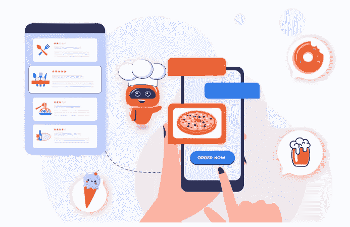

你好中等社区！

今天，我们将开始探索将云计算服务用于端到端应用。本系列的主题基于我在 2020 年秋季在哥伦比亚大学 Sambit Sahu 教授指导下作为云计算课程(COMS6998)的一部分承担的任务/小型项目。**(因此，类似 AWS 的 lambda 函数中使用的逻辑流代码将不会完整提供，而是根据教程上传重要部分的片段。)**

在我们开始我们的旅程之前，我想借此机会向所有读者致辞，并欢迎他们来到我的页面。这是我的第一篇文章，试图回馈给充满活力和令人惊叹的数据科学家、工程师和狂热的学习者社区，即媒体和未来数据科学社区。2017 年 9 月，我第一次开始了我的数据科学之旅，并且一直非常崇拜大量的在线文章、博客帖子和资源，这些都使自学和技能提升成为可能。

多年来，每当我陷入一个问题时，数据科学一直是我的求助资源，但每当我希望探索一个新的主题/领域时，它也是一个极好的起点。通过这篇文章和接下来的其他文章，我希望在数据科学/机器学习之旅中回馈和帮助个人，并希望我的文章可以帮助他们走向成功。

本文是一个三部分系列的开始，该系列将带您了解利用机器学习和云计算资源创建端到端应用程序的不同项目。由于每个项目都很复杂，涉及到许多活动的部分，我将把每个项目分解成更小的部分，一次解决一个。今天，我们将从第一个应用程序的第一部分开始，它根据您的位置、菜肴选择、用餐时间和聚会人数为您提供用餐/餐馆建议。说到这里，让我们开始着手手头的工作吧。

# 先决条件和 AWS 服务

在我们开始这个项目之前，我想对完成这个项目所需的技能和资源作出免责声明。因为我不会为项目的一些重要部分提供完整的代码，所以阅读本教程的人必须至少具备他们所选择的语言的基础到中级水平的编码专业知识。至于我，我**将使用 Python** 的大部分项目，但是，我也将使用 Javascript 和 HTML/CSS 的前端/网页的一部分。这是我们将在这个项目中使用的先决条件和资源的列表，以简洁明了的方式列出。

编程语言:

*   计算机编程语言
*   HTML/CSS(基本)
*   Javascript(基本)
*   YAML(使用 Swagger 框架)

AWS/云服务:

*   [API 网关](https://docs.aws.amazon.com/apigateway/latest/developerguide/welcome.html) (API 交互)
*   [λ](https://aws.amazon.com/lambda/)(函数)
*   [弹性搜索服务](https://aws.amazon.com/elasticsearch-service/)(弹性搜索数据库)
*   [DynamoDB](https://aws.amazon.com/dynamodb/) (NoSQL DB)
*   [亚马逊 Lex](https://aws.amazon.com/lex/) (对话代理)或任何其他类似 Lex 的对话代理(Google DialogFlow，IBM Watson 等。)

# 项目介绍

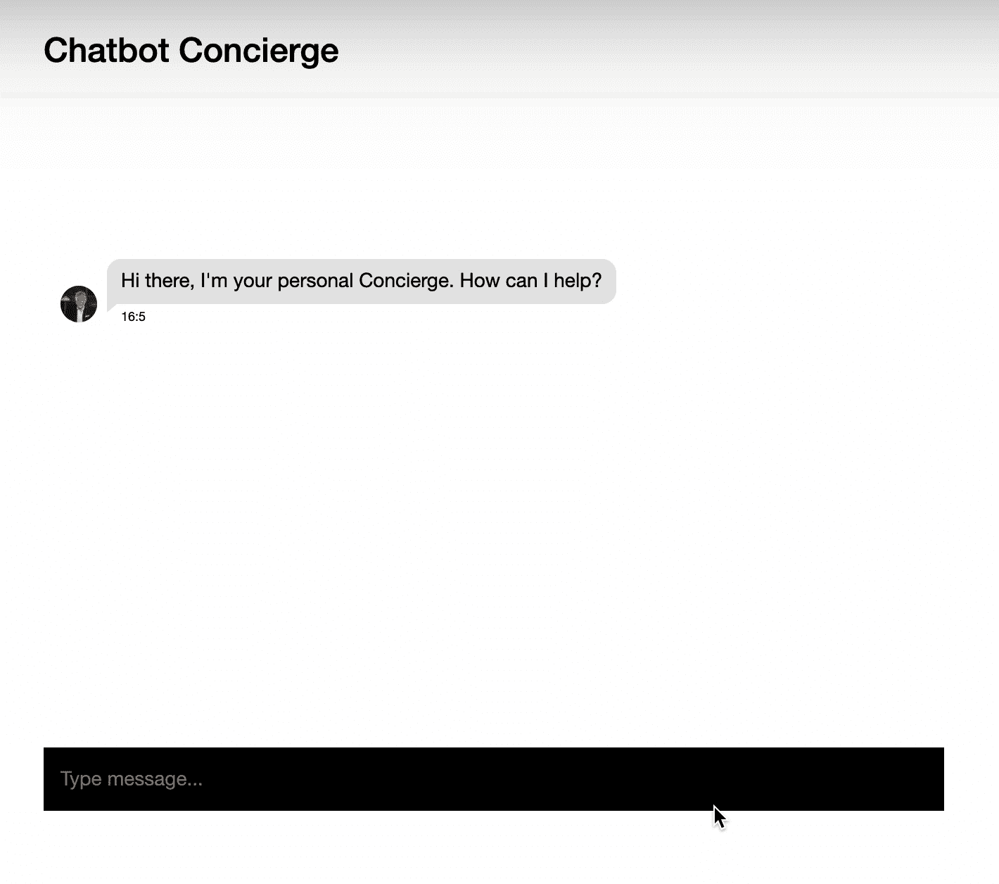

最终聊天机器人，我们将建立(是的，这实际上是我输入到前端)

在这个项目中，我们将实现一个无服务器、微服务驱动的 web 应用程序。具体来说，我们将构建一个餐饮礼宾聊天机器人，根据您通过对话提供给聊天机器人的一组偏好，向您发送餐厅建议。偏好包括诸如你的位置、你选择的菜肴、你想去餐馆的时间等细节。上面显示的是应用程序的前端，它将用于与用户进行对话，并获得 ***意图*** 和 ***插槽*** (稍后当我们讨论 **AWS Lex** 时，我们将深入研究其中的每一个细节)，它将用于查询我们的数据库并返回一个餐馆推荐。我们使用 Amazon Lex 进行对话理解，使用 Yelp API 收集关于餐馆的信息，并保存在 DynamoDB 和/或 Elasticsearch 中。为了简单起见，我们将把项目分成 5 个部分。今天我将浏览这个项目的第 1 部分、第 2 部分和第 3 部分的一半，然后在下周发布后续帖子来完成其余部分。

1.  前端和网站托管在 [S3](https://docs.aws.amazon.com/AmazonS3/latest/dev/Welcome.html)
2.  [API 网关](https://docs.aws.amazon.com/apigateway/latest/developerguide/welcome.html)和 [AWS Lambda](https://aws.amazon.com/lambda/)
3.  [亚马逊 Lex](https://aws.amazon.com/lex/) (意向、插槽和定制)
4.  [餐馆刮痧的 Yelp API](https://www.yelp.com/fusion) 和[DynamoDB](https://aws.amazon.com/dynamodb/)/[elastic search](https://aws.amazon.com/elasticsearch-service/)
5.  [AWS SQS](https://aws.amazon.com/sqs/) (简单排队服务)和 [AWS SNS](https://aws.amazon.com/sns/?whats-new-cards.sort-by=item.additionalFields.postDateTime&whats-new-cards.sort-order=desc) (简单通知服务)，用于分离的餐厅建议交付。

# 1.S3 的前端和网站托管

HTML，CSS，JavaScript 前端的三个主要组件

## 开发前端代码:

我们从使用 HTML/CSS 构建网页的前端开始。出于参考目的，这里有一段用于前端的代码(这段代码来自我们的课堂主持人/客座讲师[Andrei Papancea](https://www.linkedin.com/in/andreipapancea/)先生，不是我编写的。)

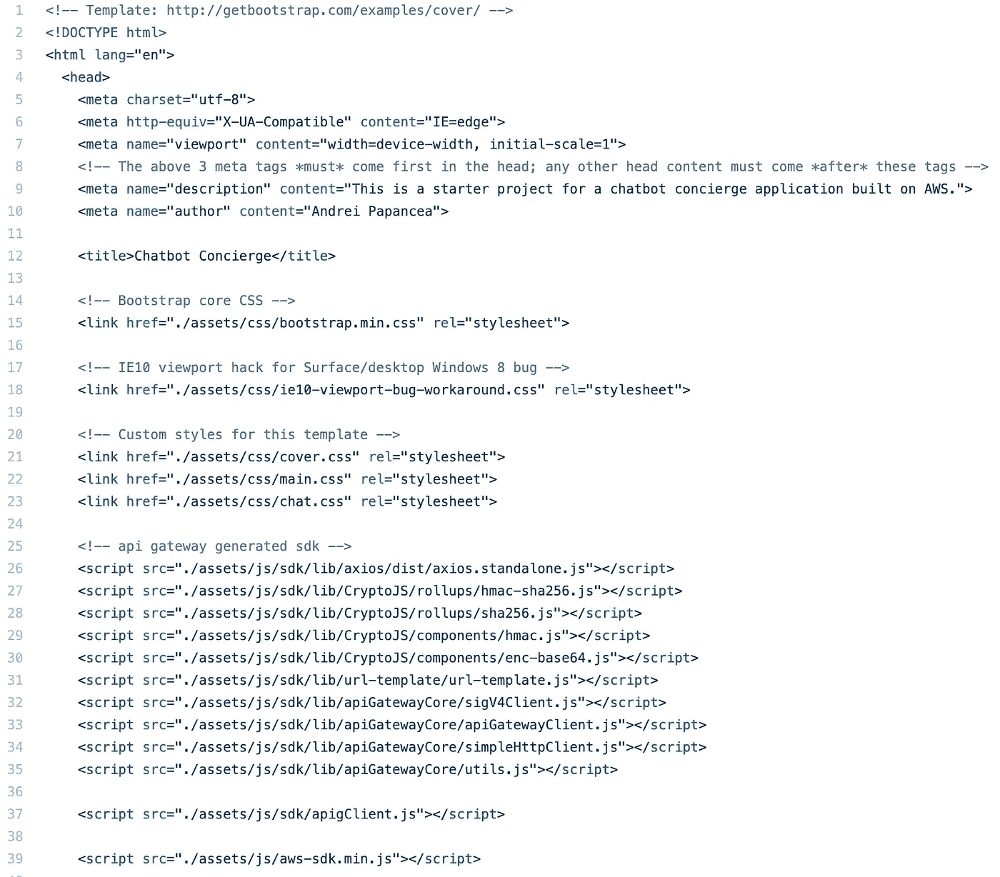

您可以自由使用您自己的前端 else [这里的](https://github.com/Royston2708/Cloud_Computing_Course_Projects/blob/main/restaurant-chatbot-lex/chat.html)是指向本项目中使用的前端代码的链接**(为了使前端代码完全按照简介部分中显示的那样出现和运行，需要访问带有前端逻辑的 javascript 文件，但是，由于该代码是哥伦比亚大学活动类的一部分，所以没有提供这个链接**。一旦我们有了想要使用的 HTML 页面，我们就可以开始设置我们的 S3 桶并托管我们的网页。

## S3 静态网页托管:

现在我们已经准备好了我们的前端网页，我们需要托管它，以便公众可以访问它。我们可以很容易地用亚马逊的 S3 水桶做到这一点。什么是 S3？ S3 代表简单存储服务，是亚马逊的存储服务，允许我们在任何时间从网络上的任何地方存储和检索任何数量的数据。通常，当处理机器学习项目时，我们需要存储和使用大量数据，这些数据应该易于访问、存储成本低廉并且高度可伸缩/灵活。亚马逊的 S3 在一个名为 S3 的简洁而强大的解决方案中为我们提供了所有这些功能(免费层允许我们每月存储 5GB 免费空间，并且[成本](https://aws.amazon.com/s3/pricing/)一般非常低)。使用 S3 存储桶，我们可以在网络上存储大量的数据，然后可以从我们的工作环境(IDE，Jupyter Notebook 等)中以编程方式[访问这些数据。)使用类似](https://stackoverflow.com/questions/48564598/load-csv-data-into-jupyter-notebook-from-s3) [boto3](https://boto3.amazonaws.com/v1/documentation/api/latest/index.html) (Python)的工具。有关 S3 及其优势的更多信息，请点击[此处！](https://docs.aws.amazon.com/AmazonS3/latest/dev/Introduction.html)

好了，现在让我们设置我们的桶，并为主机配置它。为了创建一个桶，我们遵循一个相当简单的过程。[这里的](https://docs.aws.amazon.com/AmazonS3/latest/gsg/CreatingABucket.html)是创建一个桶的指南，下面是相同的截图。

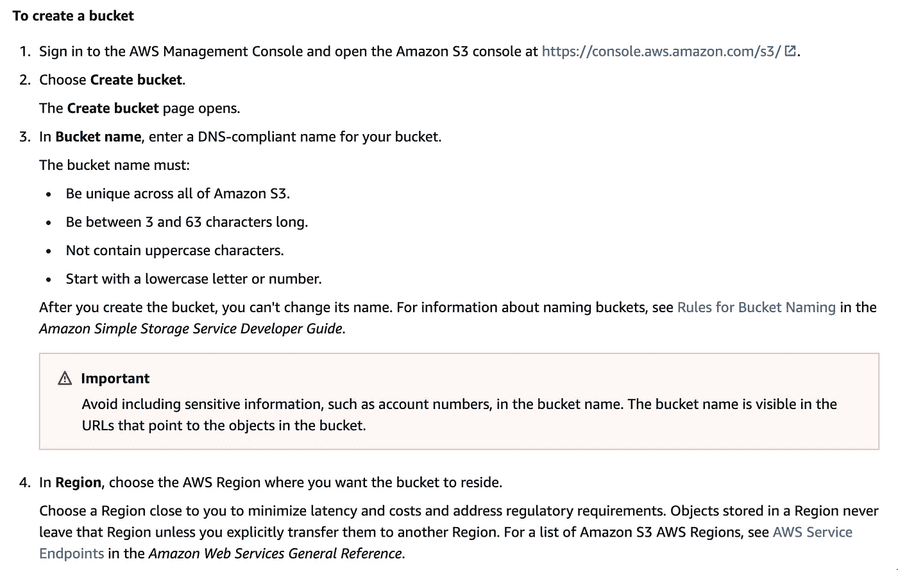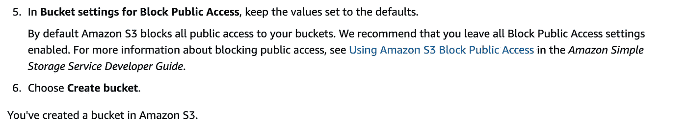

创建存储桶的步骤

在上述过程**中，我们将取消选中此框**，而不是在步骤 5 中阻止公共访问，以确保我们可以从任何设备访问我们的网站，并将其余设置保留为默认设置。现在，我们可以点击创建桶，我们应该有一个 S3 桶准备在短短几秒钟内使用。(截图附后)

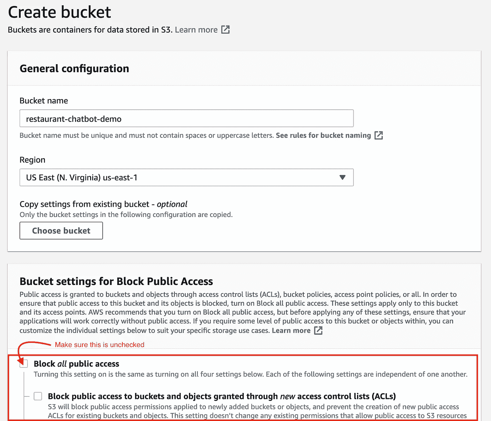

确保“允许”公众访问存储桶

一旦我们创建了我们的桶，我们将为网站托管配置桶。为此，在[跟随链接](https://docs.aws.amazon.com/AmazonS3/latest/dev/HostingWebsiteOnS3Setup.html)处遵循步骤 2 至步骤 6。我们基本上需要配置这个桶，使它允许公众访问这个桶。

**要点:**

*   在**步骤 4** 中，当**复制-粘贴策略时，请确保将“arn:aws:s3:::** `***example.com***` **/*”替换为您的 bucket arn，例如，在我的例子中，我的 bucket 称为 restaurant-chatbot-demo，因此 ARN 将是“arn:AWS:S3:::restaurant-chatbot-demo/* ”,这可以在您的 bucket 的 properties 选项卡上找到**。
*   在**步骤 2 中，我们需要指定索引文件**，它将作为网站的前端代码。在我的例子中，我上传了作为前端的 HTML 文件，并将其重命名为 index.html。
*   在我的例子中，我还将上传 **assets 文件夹**，其中包含我的前端运行所需的 javascript 文件。(如前所述，对资产文件夹的访问尚未公开，因为代码不归我所有。)

完成上述所有步骤后，我们现在有了一个 S3 桶，它将在一个特定的 URL 上托管 index.html 页面，这个 URL 可以被公众访问。下面附上我桶里的内容截图。

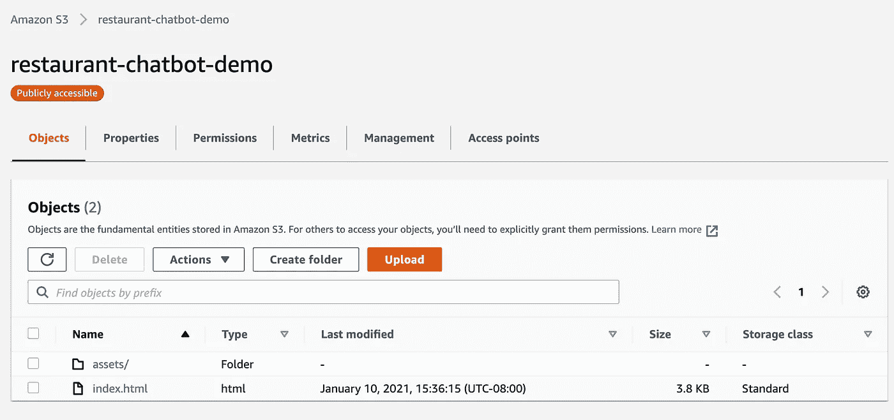

我的前端存储桶中对象的屏幕截图

# 2.API 网关和 AWS Lambda

## API 网关

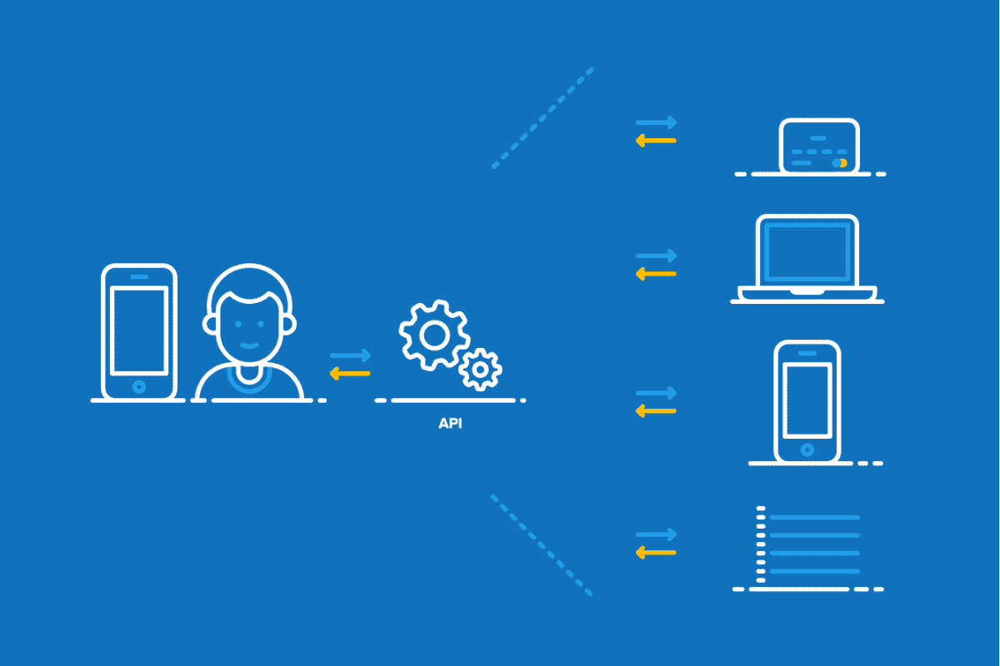

GIF 由 [JanisGraubins](/@JanisGraubins) 在[介质](/@JanisGraubins/open-banking-api-explained-in-3-gifs-b806f14ca2ca)上生成

在本节中，我们将讨论 AWS API Gatewate 和 AWS lambda。API 是现代应用和服务中极其重要的部分。API 充当看门人的角色，将外部世界与我们所有的应用程序、服务和业务逻辑连接起来，并处理用户请求和交互以显示适当的结果。就 AWS 而言，API Gateway 是他们的 API 服务，使我们能够将后端逻辑连接到前端。

API 网关不是特定 HTTP 请求的最终目的地。相反，它是发出请求的客户机和客户机使用的服务之间的中介。我们可以把 API 看作是连接用户和最重要的元素(即集成)的纽带。一旦您的请求通过了授权和验证，API Gateway 就会将它路由到集成中。有关 AWS API 网关的详细信息，请参考[这篇博客！](https://www.alexdebrie.com/posts/api-gateway-elements/#roadmap-the-three-basic-parts)

我们可以从零开始或者通过导入包含 API 定义和文档的 YAML 文件来构建 API 网关。当我们登录到 AWS API Gateway 时，我们会看到以下页面。

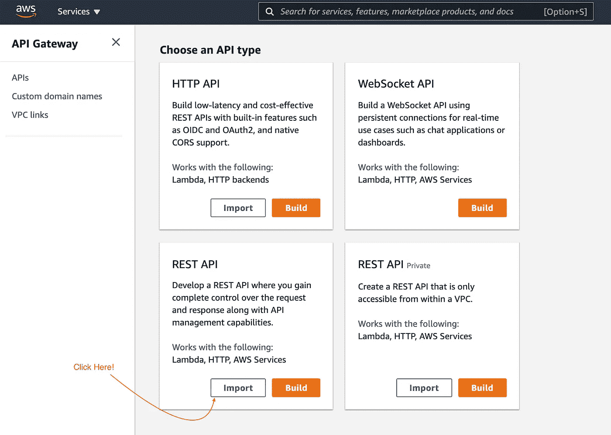

步骤 1:导入或构建 REST API

我们将通过导入课程主持人提供给我们的 YAML 文件之后的[来创建一个普通的 RestAPI。](https://github.com/001000001/aics-columbia-s2018/blob/master/aics-swagger.yaml)

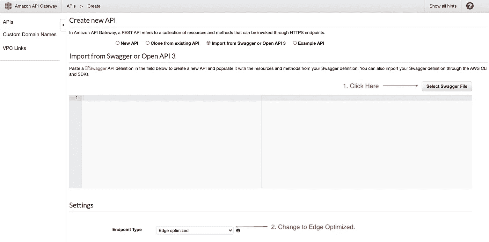

步骤 2:选择带有 API 定义的 Swagger 文件

完成这些步骤后，我们就完成了 API 基本设置。我们还需要完成几个步骤，如部署 API 和使用调用 URL，启用 CORS(跨源资源共享)和其他一些事情，以使系统有效地工作。所以让我们开始吧。

## CORS(跨产地资源共享):

**跨来源资源共享** (CORS)是一种基于 HTTP 报头的机制，允许服务器指示除其自身以外的任何其他来源(域、方案或端口)，浏览器应该允许从这些来源加载资源。它的基本目标是允许代表您发出的请求，同时阻止一些恶意 JavaScript 发出的请求。这里有几个可以提出请求的例子。

*   不同的域(例如位于 example.com**的站点**调用 api.com**的站点**
*   不同的子域(例如位于 example.com**的站点**调用 api.example.com**的站点**
*   不同的港口(例如 example.com**的站点**呼叫 example.com:3001**)**
*   不同的协议(例如位于 https://example.com**的站点**呼叫 http://example.com**)**

这种机制可以防止攻击者在各种网站上植入脚本(例如在通过谷歌广告显示的广告中),向 www.yourbank.com T21 发出 Ajax 调用，以防你使用自己的凭证登录进行交易。因此，CORS 是维护安全的重要组成部分，它只提供对网络上所需实体的访问。[点击这里](/@baphemot/understanding-cors-18ad6b478e2b#:~:text=An%20common%20example%20of%20%E2%80%9Cnon,make%20will%20not%20be%20sent.)！通过另一篇伟大的媒体文章来了解 CORS。

在我们的例子中，我们需要为我们的 API 启用 CORS，以允许用户访问我们的 S3 桶，并允许通过 AWS lambda 函数实现我们的业务逻辑。在启用 CORS 之前，我们希望 API 的 POST 方法由 AWS lambda 函数来完成。为了做到这一点，我们选择 Lambda 函数作为集成类型。然后，我们可以在下面屏幕截图的 Lambda function 字段中选择 require AWS Lambda function。然后，我们单击“保存”,进入 CORS 设置。

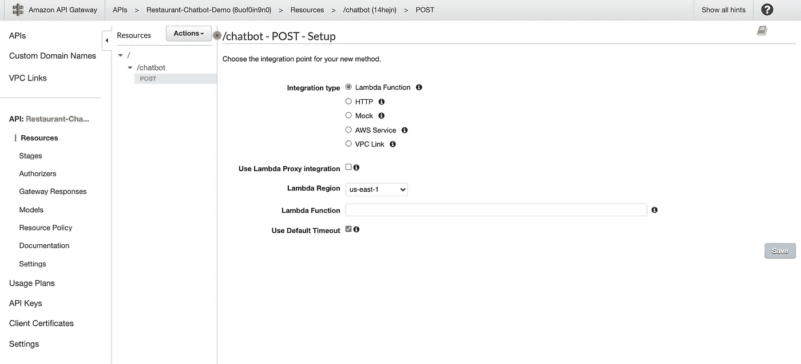

步骤 API 的 Lambda 集成

为了启用 CORS，我们遵循以下步骤。

1.  选择发布方法，然后单击上图中可见的操作下拉菜单
2.  单击启用 CORS
3.  选择 POST 和 OPTIONS 方法，同时确保选中默认 4XX 和 5XX
4.  对于选项方法，我们可能会得到一些错误，如下所示。

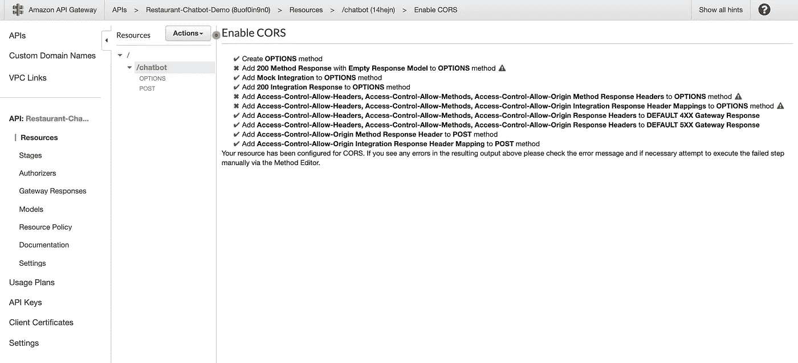

步骤 4:启用 CORS 并收到响应

为了解决这个问题，我们需要点击聊天机器人下的选项。然后单击 method response 并添加 200 作为标题，如下所示。

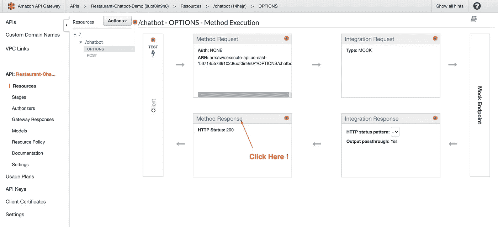

步骤 5.1:单击选项方法并添加方法响应

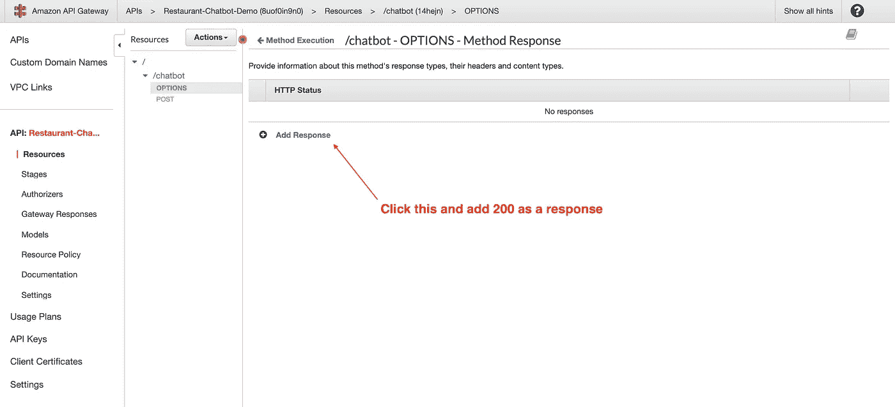

步骤 5.2:添加 CORS 所需的 HTTP 200 响应和报头

完成这些步骤后，我们就完成了 API 的配置，现在可以继续进行部署了。为了**部署 API** ,再次点击 actions 下拉菜单并选择 Deploy API。我们为名为 test/dev 的部署选择一个新的阶段，并部署 API 来**检索我们的调用 URL。**

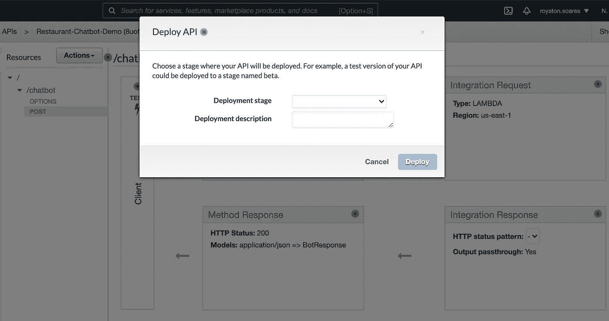

步骤 6:部署 API

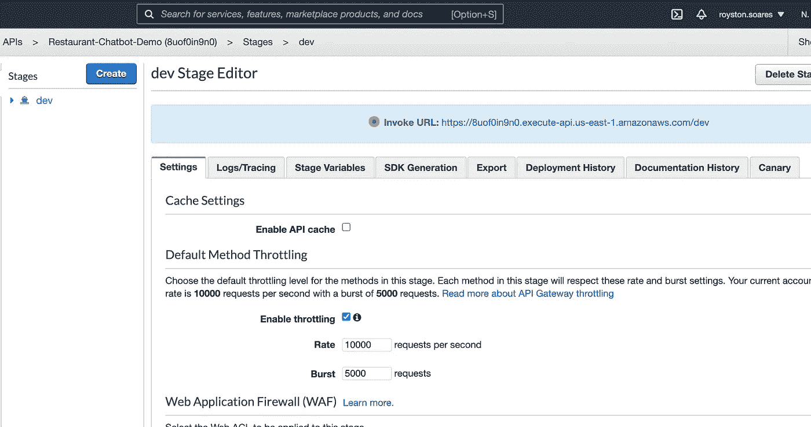

步骤 7:使用调用 URL 与前端集成。

一旦我们使用上面的步骤部署了 API，我们现在就有了调用 URL，我们可以使用它来集成我们的前端和 API。在我的例子中，这个 URL 被用作 javascript 文件的一部分，该文件将 POST 请求链接到我的 S3 桶中的前端 HTML。在我的 javascript 文件中使用了这个 URL 后，我将文件重新上传到我的**餐馆-聊天机器人-演示 S3 桶**中。至此，我们已经完成了涉及 API 网关集成的教程的第 2 部分。

# 3.亚马逊 Lex

今天的最后一个话题是亚马逊 Lex 的介绍。我们将在下一篇文章中深入探讨设置的细节，但是这一部分将试图让你更好地理解 Lex 能做什么或不能做什么。

Lex 是亚马逊的对话/聊天机器人服务，使我们能够轻松快速地为我们的应用程序构建对话界面。简而言之，它使我们能够构建一个语音或文本控制的聊天机器人，它可以作为任何应用程序的一部分或作为一个独立的服务本身进行部署。人们可以使用 Lex 来回答客户服务问题、订购比萨饼、询问订单和其他物流的细节以及许多其他用例。

lex 的基本构件

## A.意图:

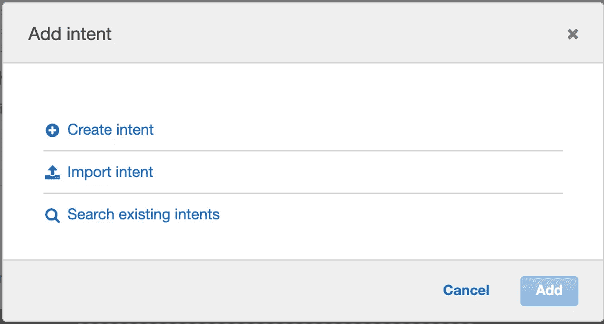

创建意图

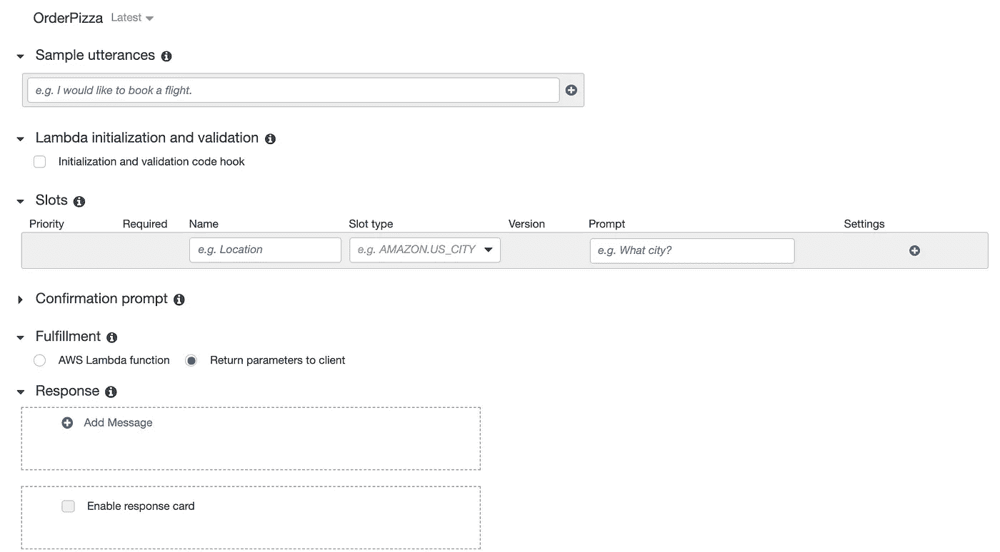

可以传递给意图的参数(示例话语、时段、履行)

意图表示用户想要执行的动作。您创建一个 bot 来支持一个或多个相关的意图。例如，您可以创建一个订购披萨和饮料的机器人。聊天机器人需要能够不同地处理每种情况。当这个人说他们想点一份比萨饼时，我们需要开始显示比萨饼菜单，包括酱料、配料等选项。当这个人想要点饮料时，我们的聊天机器人需要理解他的意图并做出相应的调整，显示菜单上各种各样的模仿品和鸡尾酒。因此，意图描述了用户/客户希望做什么。对于每个意向，您需要提供以下必需信息:

*   **意图名称**–意图的描述性名称。比如 ***OrderPizza*** 或者 ***OrderDrinks*** 。意向名称在您的帐户中必须是唯一的。
*   **示例话语** —用户可能如何传达意图。例如，用户可能会说“我可以点一份比萨饼吗？”或者“我想订个披萨”。类似的示例话语和句子有助于聊天机器人理解用户的意图。因此，当客户说“我想订一个比萨饼”时，Lex 需要理解我们现在需要从数据库中检索比萨饼菜单，并在前端显示它。因此，样本话语是一种告诉 Lex 为了执行与特定意图相关的代码/逻辑，应该注意哪些句子的方式。这有点像“Alexa”或“嘿谷歌”告诉我们的语音助手开始听我们希望他们为我们做什么。
*   **如何实现意图** —在这一部分中，我们需要指定在用户提供必要的信息后，您希望如何实现意图(例如，一旦客户选择了她/他想要的比萨饼，我们需要我们的应用程序将订单细节发送到比萨饼店，因此我们需要添加一个可以完成循环的实现功能)。建议创建一个 Lambda 函数来实现这个目的。

## B.插槽:

插槽可以比作函数中的参数。它们基本上是用户在与聊天机器人的交互中可能指定也可能不指定的变量。一个意向可能需要零个或多个槽，或者为了满足业务逻辑。

例如，为了创建一个比萨饼，您需要有一个底部/外壳，因此在 ***OrderPizza*** 意图中的一个槽将是**外壳**。添加插槽作为意图配置的一部分。在运行时，Amazon Lex 提示用户输入这些特定的槽值，并检索相应的条目。用户必须提供所有 ***所需槽位*** 的值，亚马逊 Lex 才能满足意图。

对于每个插槽，还必须提供插槽类型和提示，以便 Amazon Lex 发送给客户端，从用户那里获取数据。槽类型告诉聊天机器人预期的响应类型，应该是数字、字母数字、纯文本、特定的时间格式，如 DD-MM-YYYY 等。

使用我们上面的例子，**外壳**插槽将具有“字母数字”插槽类型，并且可以如下工作。提示会是*“你想要什么样的面包皮？”*并且提供的选项有*“全麦”、“普通薄”或“普通厚”*。用户可以回复一个包括额外单词的槽值，如“全麦请”或“让我们坚持常规瘦”，Amazon Lex 仍将理解预期的槽值。

因此，使用插槽和意图可以完成几乎任何所需的逻辑。Amazon Lex 还提供了内置的插槽类型。例如，`**AMAZON.NUMBER**`是一个内置的插槽类型，您可以使用它来表示订购的比萨饼的数量。同样`**AMAZON.CITY**`是美国的城市。有关 Lex 如何工作以及如何更好地使用它的更多信息，请点击[此链接！](https://docs.aws.amazon.com/lex/latest/dg/how-it-works.html)

下面附上几张我们用于聊天机器人的设置截图，以及每个意图的位置和话语。我们有一个用餐意图和一个问候意图，问候用于确定用户何时只是问候我们，用餐意图用于告诉聊天机器人何时应该开始从我们的客户那里获得所需的信息，以提出所需的餐厅建议。

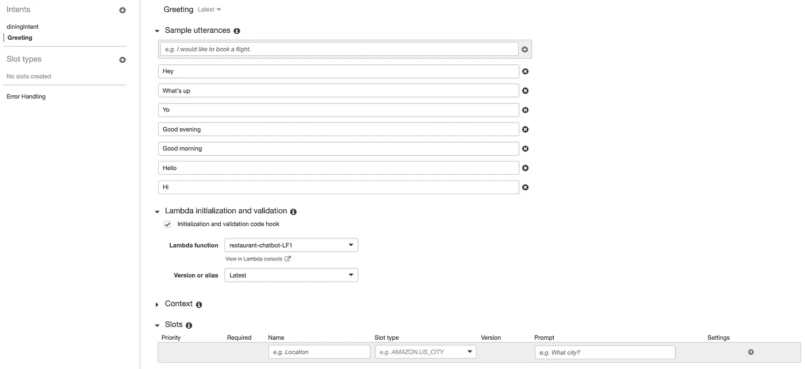

问候意图和相同的示例话语(可以看出，我们没有用于此意图的任何槽)

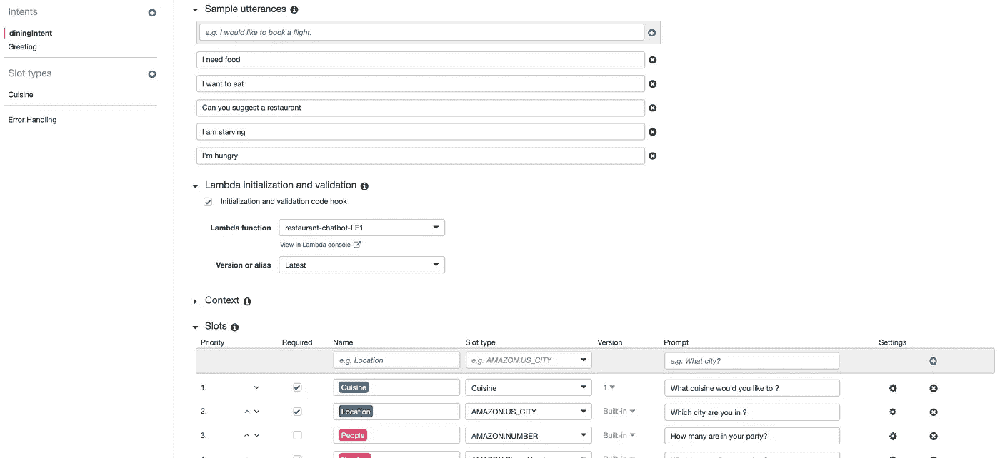

用餐意图以及实现意图所需的示例话语和时段

# 4.结论和对第二部分的补充

有了上面的截图，我们现在已经到了这个项目的第一部分的结尾。我们已经成功地构建了我们的前端，并将其连接到 API 网关。我们还了解了亚马逊 S3 桶、API 网关和亚马逊 Lex 的功能，以及它们在我们的餐厅 chatbot 中的使用。

下一次，我们将深入研究建立聊天机器人的一步一步的过程，以及一些我们可以用来实现目的的 lambda 函数的细节。我们还将学习 DynamoDB、ElasticSearch 和 YelpAPI，我们可以使用这些工具通过所需的参数从 yelp 的数据库中获取餐馆信息。最后，我们还将了解 AWS 简单排队服务(SQS)和 AWS 简单通知服务(SNS ),一旦我们获得了顾客的所有偏好，这将使我们能够将餐厅建议直接发送到顾客的手机上。

> 如果你已经读到这里，我希望你在阅读这篇文章的时候过得愉快。虽然它有点长，但我希望它相对简单，并帮助您迈出进入大数据、云计算和无服务器应用程序世界的第一步。如果你喜欢这篇文章，请关注我，关注未来的文章。我将在下周发布这篇文章的第二部分！一如既往，我会喜欢任何关于帖子的反馈，并将尽我所能尽快纳入要求的更改。
> 
> 如果你想关注我，你可以在 [**Linkedin**](https://www.linkedin.com/in/roystonsoares/) 上找到我。