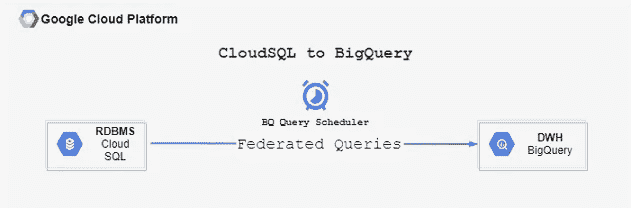
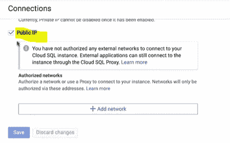
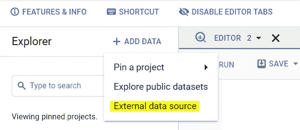
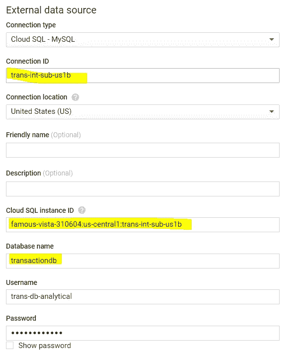
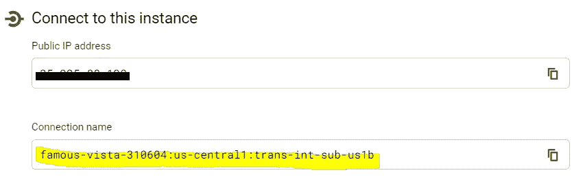
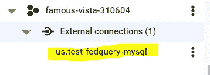

# CloudSQL 到 BigQuery —联邦查询

> 原文：<https://medium.com/analytics-vidhya/cloudsql-to-bigquery-federated-queries-e2b595179abc?source=collection_archive---------6----------------------->



无论您是开发 BI 仪表板还是分析数据以做出关键的业务决策，您都需要从各种数据集市、数据仓库或事务数据库中访问数据，以便根据需要执行聚合或导出统计数据以生成报告。

如果您使用 BigQuery 作为数据仓库，使用 CloudSQL 作为 RDBMS，那么您通常需要确定一种方法来访问数据以满足您的分析需求。

一种方法是通过编写来自 BigQuery 的**联邦查询**，其中 CloudSQL 被视为数据的**外部源**，并且您将查询包含在函数`EXTERNAL_QUERY.`中

下面是一个示例联邦查询的样子:

```
SELECT * FROM EXTERNAL_QUERY 
("test-fedquery-mysql", "SELECT customer_id, MIN(order date) AS first_order_date
 FROM orders
 GROUP BY customer_id;");
```

*   我在函数`EXTERNAL_QUERY`中包含了我的查询
*   `test-fedquery-mysql`是我们在 BigQuery 中创建的用于访问 CloudSQL 的**connection _ id(or)connection _ name**。

**在创建连接之前:**

1.  请确保启用了 BigQuery 连接 API。
2.  为您的 CloudSQL 实例配置**公共 IP 连接**。这使得 BigQuery 能够根据需要访问实例和查询数据。



**使用控制台从 BigQuery 创建连接:**

1.  导航到 BigQuery，单击“添加数据”并选择“外部数据源”



2.在适当的字段中输入正确的信息。



可以从 SQL 实例页面复制**云 SQL 实例 ID** 。寻找**连接名称。**



创建实例后，它会出现在固定项目中的“外部连接”下。



瞧啊。！现在可以从 BigQuery 对云 SQL 运行联邦查询。

使用 CLI 创建连接

```
bq mk \
 — connection \
 — connection_type=’CLOUD_SQL’ \
 — properties=’{“instanceId”:”famous-vista-310604:us-central1:trans-int-sub-us1b”,”database”:”transactiondb”,”type”:”MYSQL”}’ \
 — connection_credential=’{“username”:”trans-db-analytical”, “password”:”*******”}’ \
 — project_id=famous-vista-310604 \
 — location=US \
 test-fedquery-mysql
```

下面是一个列出数据库`transactiondb`中所有表格的例子

```
SELECT * FROM EXTERNAL_QUERY
(“test-fedquery-mysql”,”select * from information_schema.tables;”);
```

**记住:**

1.  联邦查询只能在同时支持云 SQL 和 BigQuery 的区域中执行。
2.  通过向特定用户授予权限，可以限制对连接的访问。
3.  BigQuery 通常预测编写查询时处理的数据量。这在查询 CloudSQL 时是不可用的。
4.  联合查询的计费方式与本地查询相同(按需定价或按使用量付费)。
5.  您可以像调度本地查询一样调度联邦查询。