# 商场顾客的聚类分析

> 原文：<https://medium.com/analytics-vidhya/clustering-analysis-of-mall-customer-bd785577f1b0?source=collection_archive---------0----------------------->


使用 [python](https://www.python.org/) ， [Numpy](https://numpy.org/) ，[熊猫](https://pandas.pydata.org/)， [Matplotlib](https://matplotlib.org/) ， [Seaborn](https://seaborn.pydata.org/) ， [scikit-learn](https://scikit-learn.org/stable/)

**聚类**是将群体或数据点分成若干组的任务，使得同一组中的数据点与同一组中的其他数据点更相似，而与其他组中的数据点不相似。它基本上是基于对象之间的相似性和不相似性的对象集合。

基本上是 [*无监督学习方法*](https://www.geeksforgeeks.org/supervised-unsupervised-learning/) 的一种类型。无监督学习方法是这样一种方法，其中我们从由没有标记响应的输入数据组成的数据集提取参考。一般来说，它是一个寻找有意义的结构、解释性的基本过程、生成性特征和一组实例中固有的分组的过程。

**例子**:我们以 Mall 这个真实世界的例子来理解聚类技术:当我们访问任何一个购物中心时，我们都可以观察到用法相似的东西被分组在一起。比如 t 恤分在一个区，裤子分在其他区，类似的还有蔬菜区，苹果，香蕉，芒果等。，被分成不同的部分，这样我们可以很容易地找到东西。聚类技术也以同样的方式工作。聚类的其他例子是根据主题对文档进行分组。

聚类技术可以广泛应用于各种任务中。这种技术的一些最常见的用途是:

*   市场细分
*   统计数据分析
*   社会网络分析
*   图象分割法
*   异常检测等。

# 数据集:

这个数据集基于购物中心的顾客。这个数据集中总共有 200 行和 5 列。通过使用这个数据集，创建了这个数据分析和机器学习项目。

这里我们使用 google COLAB 来运行这些代码并分析数据集，但是您也可以使用其他平台来运行代码。

现在让我们开始这个项目包含什么。

# 导入库:

```
import numpy as npimport pandas as pdimport matplotlib.pyplot as pltimport seaborn as sns
```

# 加载文件:

```
import iodf2 = pd.read_csv('Mall_Customers.csv')
```

# 显示数据:

```
df2.head()
```

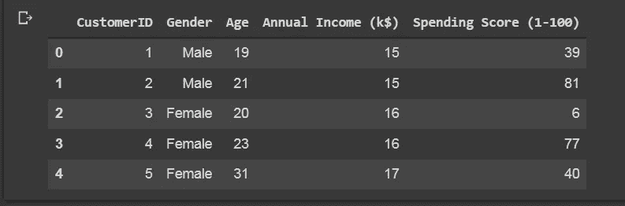

# 数据集的形状:

```
df2.shape
```


# 关于数据集中所有列的信息:

```
df2.info()
```

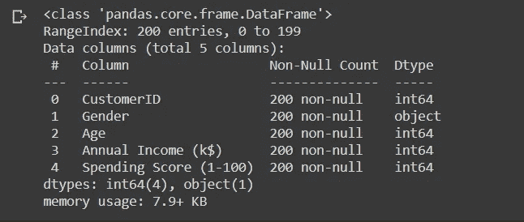

# 数据集的描述:

```
df2.describe()
```

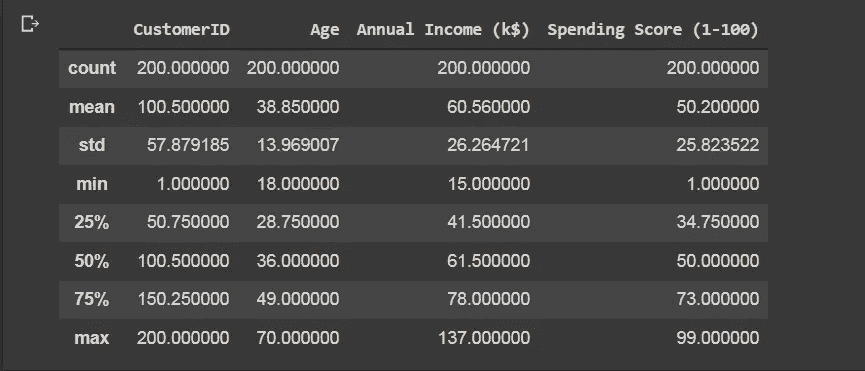

# 检查数据集中的空值:

```
df2.isnull().values.any()
```

# 男女比例:

```
labels = ['Female', 'Male']size = df2['Gender'].value_counts()colors = ['lightgreen', 'orange']explode = [0, 0.1]plt.rcParams['figure.figsize'] = (9, 9)plt.pie(size, colors = colors, explode = explode, labels = labels, shadow = True, autopct = '%.2f%%')plt.title('Gender', fontsize = 20)plt.axis('off')plt.legend()plt.show()
```

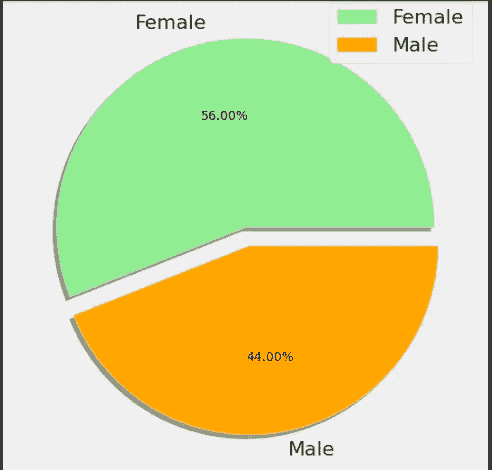

看上面的饼状图，它解释了商场中的性别分布

有趣的是，女性以 56%的份额领先，而男性的份额为 44%，这是一个巨大的差距，特别是当男性人口相对高于女性时。

# 年龄与年收入:

```
plt.figure(figsize=(25,10))# Passing X axis and Y axis along with subplot positionplt.title('Age vs Annual Income', fontsize = 20)plt.xticks(rotation=90)sns.barplot(x = df2['Age'] , y = df2['Annual Income (k$)'] , palette='icefire');
```

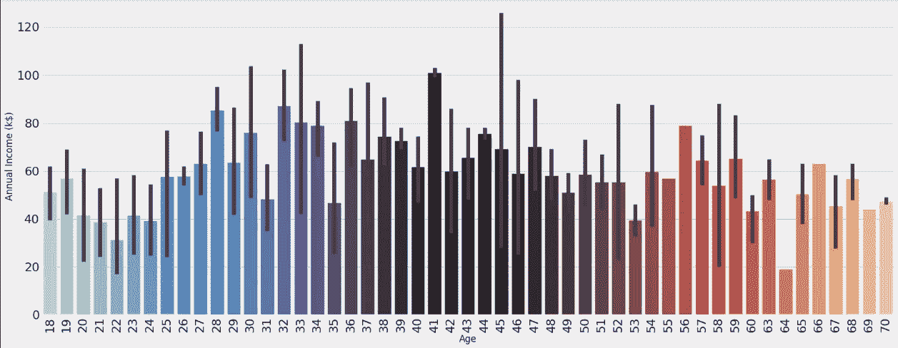

33 岁和 42 岁时年收入最大。

# 年龄分布:

```
plt.rcParams['figure.figsize'] = (25, 8)sns.countplot(df2['Age'], palette = 'hsv')plt.title('Distribution of Age', fontsize = 20)plt.show()
```

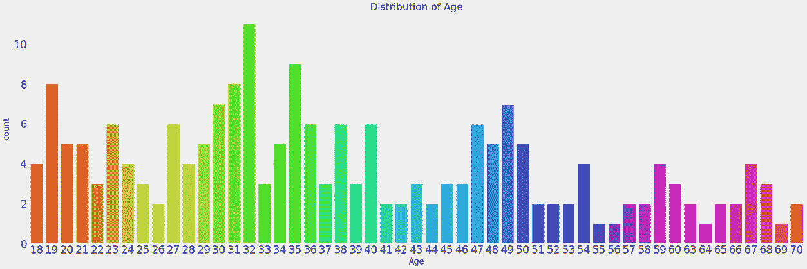

该图展示了一个更具互动性的图表，展示了商场中各个年龄组的分布情况，以便更清楚地了解商场中游客的年龄组。

从上图中可以看出，27 岁到 39 岁的人群出现的频率非常高，但是没有明确的模式，我们只能发现一些群体模式，比如年龄较大的人群出现的频率相对较低。有趣的事实是，商场里 18 岁和 67 岁的游客数量相等。55 岁、56 岁、69 岁和 64 岁的人很少去商场。32 岁的人是商场里最常光顾的人。

# 数据配对图:

```
sns.pairplot(df2)plt.rcParams['figure.figsize'] = (25, 8)plt.title('Pairplot for the Data', fontsize = 20)plt.show()
```

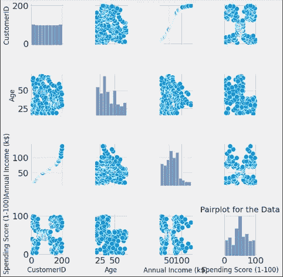

# 数据热图:

```
plt.rcParams['figure.figsize'] = (15, 8)sns.heatmap(df2.corr(), cmap = 'Wistia', annot = True)plt.title('Heatmap for the Data', fontsize = 20)plt.show()
```

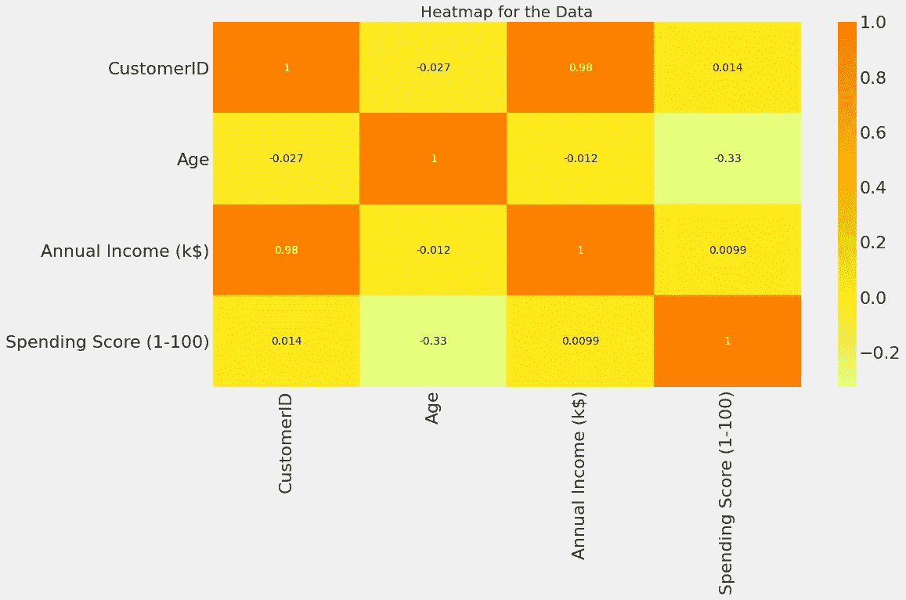

上图显示了商场客户细分数据集的不同属性之间的相关性，该热图用橙色反映了最相关的要素，用黄色反映了最不相关的要素。

我们可以清楚地看到，这些属性之间没有很好的相关性，这就是为什么我们将继续所有的功能。

# 年龄与支出得分:

```
ax = sns.barplot(y= "Spending Score (1-100)", x = "Age", data = df2, palette=("Blues_d"))sns.set(rc={'figure.figsize':(27.7,6.30)})sns.set_context("poster")
```

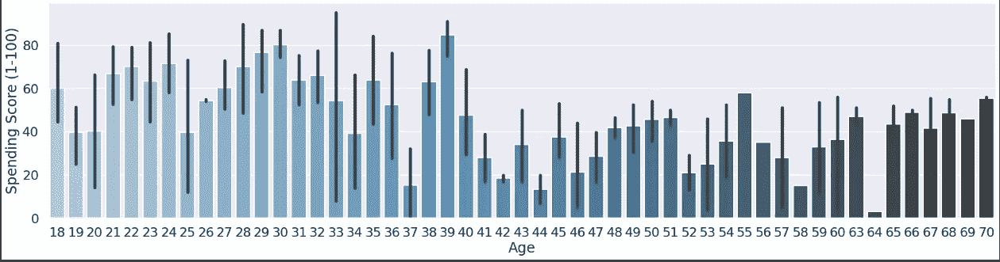

我们可以看到，年龄在 28 至 39 岁之间的人获得了最高的消费分数，其背后的原因是他们的年收入非常高。

# 支出分数分布:

```
plt.rcParams['figure.figsize'] = (35, 14)sns.countplot(df2['Spending Score (1-100)'], palette = 'magma')plt.title('Distribution of Spending Score', fontsize = 20)plt.show()
```

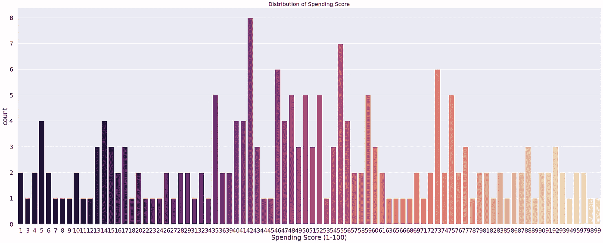

从购物中心的角度来看，这是最重要的图表，因为对逛购物中心的顾客的消费分数有一些直觉和想法是非常重要的。

总的来说，我们可以得出结论，大多数顾客的消费得分在 35-60 分之间。有趣的是，有些顾客的消费分数也是 I，消费分数也是 99，这表明该购物中心迎合了购物中心中具有不同需求和要求的各种顾客。

# 性别与支出得分:

```
plt.rcParams['figure.figsize'] = (18, 7)sns.boxenplot(df2['Gender'], df2['Spending Score (1-100)'], palette = 'Accent_r')plt.title('Gender vs Spending Score', fontsize = 20)plt.show()
```

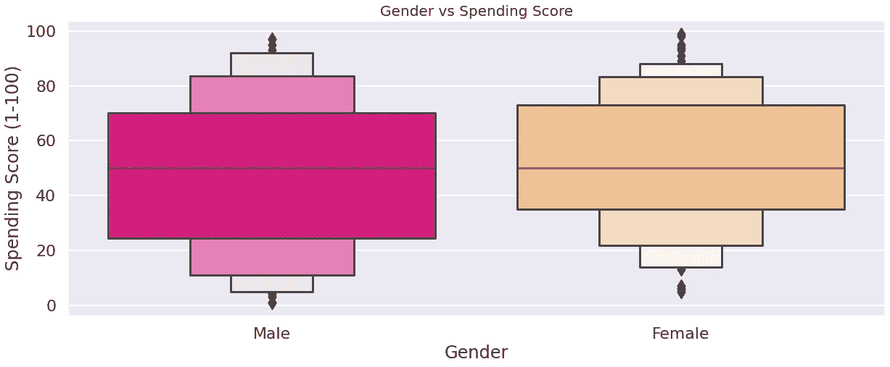

可以清楚地看到，大多数男性的花费分数在 25k 美元到 70k 美元之间，而女性的花费分数在 35k 美元到 75k 美元之间。这再次表明女性是购物的领导者。

# 性别与年收入:

```
plt.rcParams['figure.figsize'] = (18, 7)sns.violinplot(df2['Gender'], df2['Annual Income (k$)'], palette = 'gnuplot')plt.title('Gender vs Spending Score', fontsize = 20)plt.show()
```

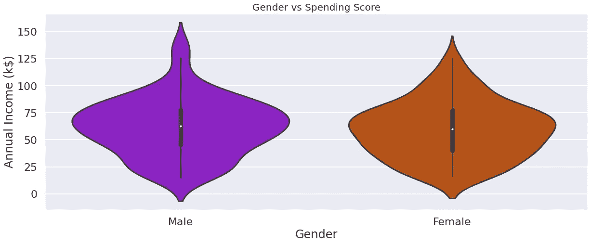

从上面的图表中，我们可以看到男性的工资比女性高。但是，当谈到低年收入时，男性和女性的数量是相等的。

# **支出分数分布:**

```
plt.rcParams['figure.figsize'] = (35, 14)sns.countplot(df2['Spending Score (1-100)'], palette = 'gist_rainbow')plt.title('Distribution of Spending Score', fontsize = 20)plt.show()
```

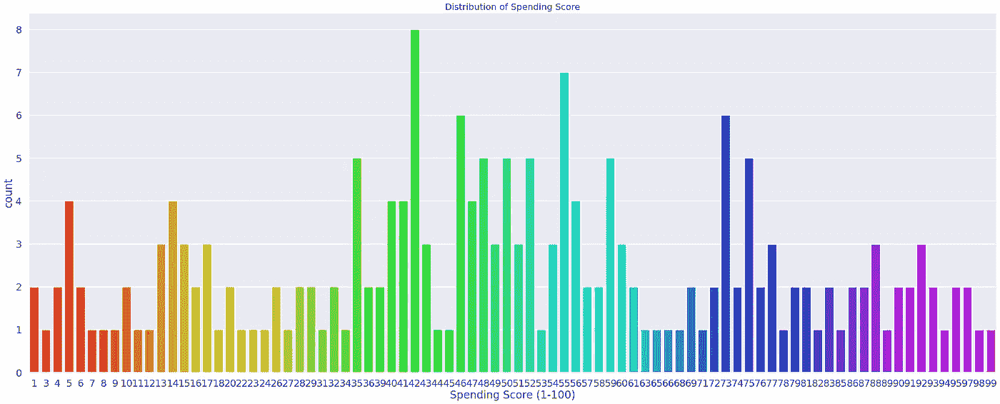

从上面的图表中，我们可以看到，一个人的总支出分数是 99，最多的人得到 42 作为总支出分数。

# 年收入与支出得分:

```
ax = sns.barplot(y= "Spending Score (1-100)", x = "Annual Income (k$)", data = df2, palette=("Blues_d"))sns.set(rc={'figure.figsize':(11.7,8.27)})sns.set_context("poster")
```

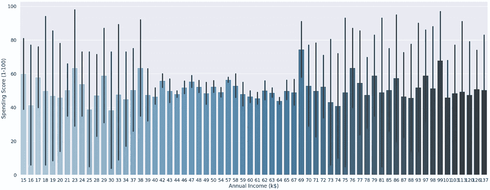

# 年收入与年龄和支出得分:

```
x = df2['Annual Income (k$)']y = df2['Age']z = df2['Spending Score (1-100)']sns.lineplot(x, y, color = 'blue', palette = 'Accent_r')sns.lineplot(x, z, color = 'pink', palette = 'Accent_r')plt.title('Annual Income vs Age and Spending Score', fontsize = 20)plt.show()
```

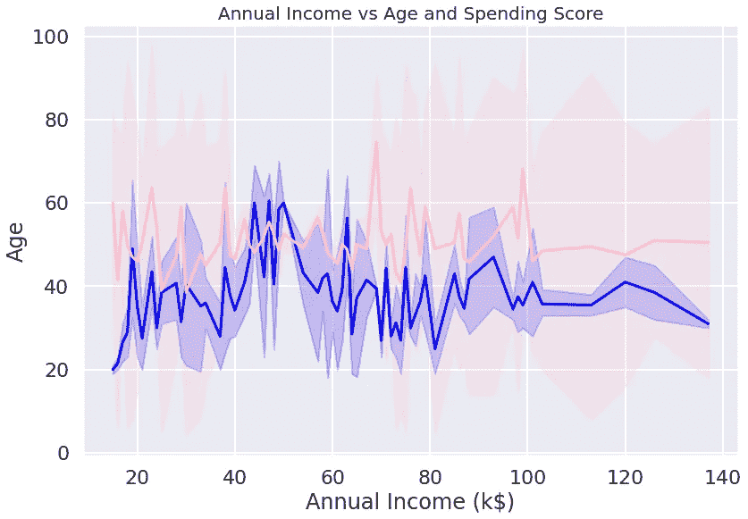

上面的年收入和年龄之间的图用蓝色线表示，年收入和支出分数之间的图用粉色表示。它显示了年龄和支出如何随着年收入而变化。

# k 表示聚类:

k 均值聚类是一种矢量量化方法，最初来自信号处理，旨在将 n 个观测值划分为 k 个聚类，其中每个观测值属于具有最近均值(聚类中心或聚类质心)的聚类，作为聚类的原型。这导致将数据空间划分成 Voronoi 单元。k-means 聚类最小化类内方差(平方欧几里得距离)，但不是常规欧几里得距离，这将是更困难的韦伯问题:平均值优化平方误差，而只有几何中值最小化欧几里得距离。例如，使用 k-中值和 k-中值可以找到更好的欧几里得解。

无监督的 k-means 算法与 k-nearest neighborhood 分类器有松散的关系，k-nearest neighborhood 分类器是一种流行的监督机器学习分类技术，由于名称的原因，它经常与 k-means 混淆。将 1-最近邻分类器应用于通过 k-means 获得的聚类中心，将新数据分类到现有聚类中。这被称为最近质心分类器或罗基奥算法。

```
x = df2.iloc[:, [3, 4]].values
```

这里我们选取了第 4 列和第 5 列进行聚类分析。

```
print(x.shape)
```

# 求最优聚类数的肘方法:

在聚类分析中，肘方法是一种启发式方法，用于确定数据集中的聚类数。该方法包括将解释的变化绘制为聚类数的函数，并选取曲线的弯头作为要使用的聚类数。同样的方法可以用于选择其他数据驱动模型中的参数数量，例如描述数据集的主成分数量。

这个方法可以追溯到罗伯特·l·桑代克 1953 年的推测。

```
from sklearn.cluster import KMeanswcss = []for i in range(1, 11):km = KMeans(n_clusters = i, init = 'k-means++', max_iter = 300, n_init = 10, random_state = 0)km.fit(x)wcss.append(km.inertia_)plt.plot(range(1, 11), wcss)plt.title('The Elbow Method', fontsize = 20)plt.xlabel('No. of Clusters')plt.ylabel('wcss')plt.show()
```

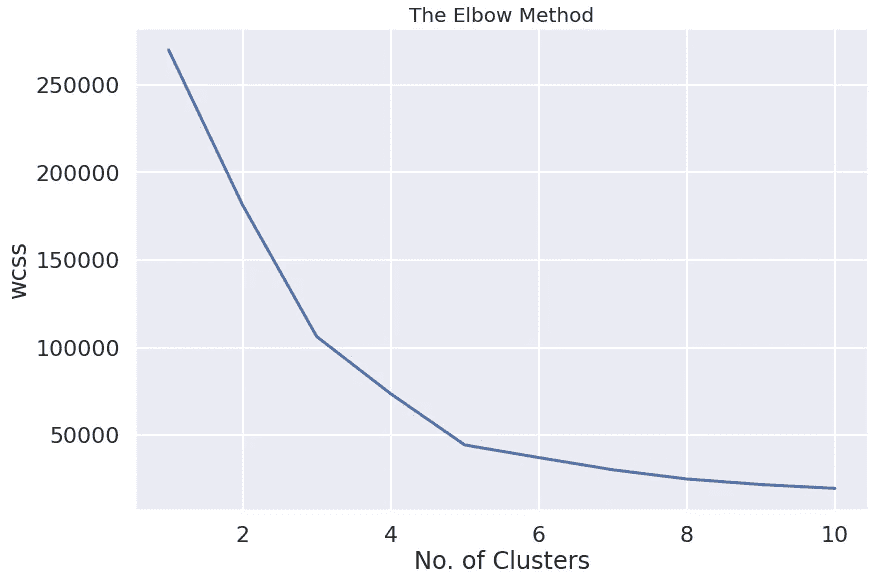

在上图中，斜率减小的点称为拐点。

# k 表示在训练集上的模型训练:

```
km = KMeans(n_clusters = 5, init = 'k-means++', max_iter = 300, n_init = 10, random_state = 0)y_means = km.fit_predict(x)
```

从上面的训练中，我们在数据集上总共获得了 5 个聚类。

# 可视化集群:

```
plt.scatter(x[y_means == 0, 0], x[y_means == 0, 1], s = 100, c = 'pink', label = 'miser')plt.scatter(x[y_means == 1, 0], x[y_means == 1, 1], s = 100, c = 'yellow', label = 'general')plt.scatter(x[y_means == 2, 0], x[y_means == 2, 1], s = 100, c = 'cyan', label = 'target')plt.scatter(x[y_means == 3, 0], x[y_means == 3, 1], s = 100, c = 'magenta', label = 'spendthrift')plt.scatter(x[y_means == 4, 0], x[y_means == 4, 1], s = 100, c = 'orange', label = 'careful')plt.scatter(km.cluster_centers_[:,0], km.cluster_centers_[:, 1], s = 50, c = 'black' , label = 'centeroid')plt.style.use('fivethirtyeight')plt.title('K Means Clustering', fontsize = 20)plt.xlabel('Annual Income')plt.ylabel('Spending Score')plt.legend()plt.grid()plt.show()
```

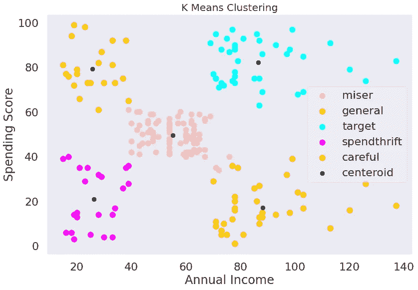

从上面的散点图中，我们可以看到年收入和总支出得分之间的不同聚类。在此散点图中共创建了 5 个聚类，黑点是这 5 个聚类的质心。

# 分层聚类

层次聚类，也称为层次聚类分析，是一种将相似对象分组到称为聚类的组中的算法。端点是一组群集，其中每个群集都不同于另一个群集，并且每个群集内的对象大体上彼此相似。在数据挖掘和统计中，层次聚类(也称为层次聚类分析或 HCA)是一种聚类分析方法，旨在构建聚类的层次结构。分层聚类的策略通常分为两种类型:

# 凝聚的:

这是一种“自下而上”的方法:每个观察从它自己的聚类开始，随着一个观察在层次结构中向上移动，聚类对被合并。

# 分裂的:

这是一种“自上而下”的方法:所有的观察都从一个集群开始，当一个集群向下移动时，就会递归地执行分割。

层次凝聚聚类(HAC)的标准算法具有 O(n)的时间复杂度，并且需要 O(n)的内存，这使得它对于甚至中等数据集来说都太慢。

```
import scipy.cluster.hierarchy as schdendrogram = sch.dendrogram(sch.linkage(x, method = 'ward'))plt.title('Dendrogam', fontsize = 20)plt.xlabel('Customers')plt.ylabel('Ecuclidean Distance')plt.show()
```

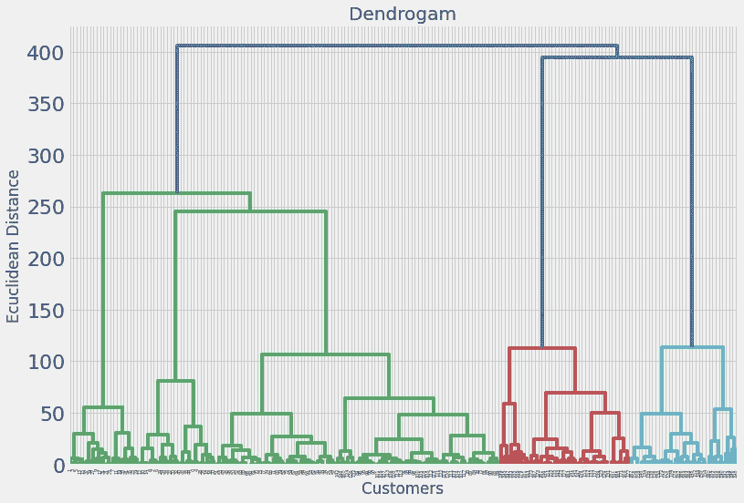

树状图是显示对象之间层次关系的图表。它通常是作为层次聚类的输出而创建的。树状图的主要用途是找出将对象分配到集群的最佳方式。上面的树状图显示了散点图中不同观察值的等级聚类。

# 训练集上的层次聚类模型训练；

```
from sklearn.cluster import AgglomerativeClusteringhc = AgglomerativeClustering(n_clusters = 5, affinity = 'euclidean', linkage = 'ward')y_hc = hc.fit_predict(x)
```

# 可视化集群:

```
plt.scatter(x[y_hc == 0, 0], x[y_hc == 0, 1], s = 100, c = 'pink', label = 'miser')plt.scatter(x[y_hc == 1, 0], x[y_hc == 1, 1], s = 100, c = 'yellow', label = 'general')plt.scatter(x[y_hc == 2, 0], x[y_hc == 2, 1], s = 100, c = 'cyan', label = 'target')plt.scatter(x[y_hc == 3, 0], x[y_hc == 3, 1], s = 100, c = 'magenta', label = 'spendthrift')plt.scatter(x[y_hc == 4, 0], x[y_hc == 4, 1], s = 100, c = 'orange', label = 'careful')plt.scatter(km.cluster_centers_[:,0], km.cluster_centers_[:, 1], s = 50, c = 'blue' , label = 'centeroid')plt.style.use('fivethirtyeight')plt.title('Hierarchial Clustering', fontsize = 20)plt.xlabel('Annual Income')plt.ylabel('Spending Score')plt.legend()plt.grid()plt.show()
```

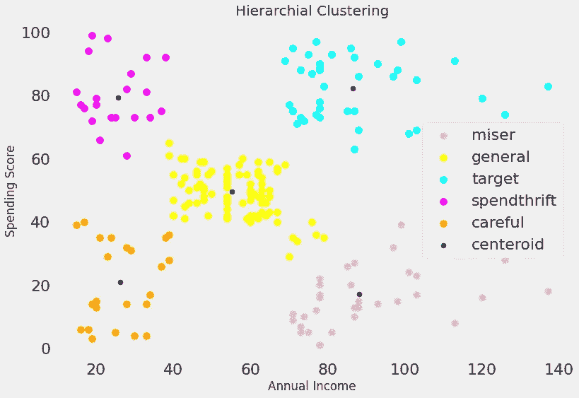

从上面的散点图中，我们可以看到年收入和总支出得分之间的不同聚类。在此散点图中共创建了 5 个聚类，蓝色点是这 5 个聚类的质心。

# 项目简介:

1.  这是一个对购物中心客户数据集进行聚类的项目。
2.  首先我实现了 K 均值聚类，然后我实现了层次聚类。
3.  我最终从散点图中得到 5 个集群。
4.  在等级聚类中，我绘制了一个树状图。

5.在每一次聚类中，我们都有一个等距离的质心。

