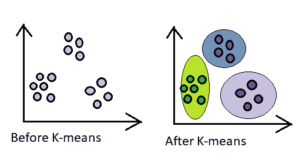

# 聚类及其在无监督学习中的方法

> 原文：<https://medium.com/analytics-vidhya/clustering-and-its-methods-in-unsupervised-learning-c1a59e14f867?source=collection_archive---------23----------------------->

埃文·丹尼斯在 [Unsplash](https://unsplash.com?utm_source=medium&utm_medium=referral) 上的照片

在不知道标签的情况下在数据集中检测模式的机器学习类型被称为无监督学习。通过分段从数据中提取信息，可以使用它对数据集执行更复杂的操作。无监督学习正在被使用的一些重要领域包括**异常检测、客户细分、社交媒体分析、遗传学、天文数据分析、推荐系统、特征选择。**

聚类、神经网络和异常检测是一些流行的无监督机器学习算法。在本文中，我们主要关注集群、其目标、类型和方法。

**聚类…**

根据 word 的定义，它根据一些潜在的隐藏模式和相似性对数据进行聚类。因此，将具有共同结构的对象分组到同一个簇中或者将具有不同特征的对象分组到不同的簇中称为聚类。然后，这种聚类可以进一步用于业务预测分析。

照片来自发表的论文[“大图数据聚类的有限随机行走算法”](https://link.springer.com/article/10.1186/s40537-016-0060-5/figures/1)

在该图中，“A”表示基于颜色特征的数据点的聚类,“B”表示未聚类的数据点。

让我们更深入地了解一下聚类的类型和方法！

# **聚类类型**

## 单形和多形聚类

可以根据各种标准进行聚类。使用特征逐个聚类的对象称为 ***单一聚类。*** 这样的星团有一些共同的性质。例子包括成群的冷血和温血哺乳动物等。相反，当所有的特征同时被使用并且聚类的对象没有相似的属性时，则称之为 ***多面体聚类。*** 比如基于距离的聚类。

## 重叠聚类

作者图片

一种群集类型，其中对象可以属于一个或多个组。如果它们属于且仅属于一个簇，则称之为 ***硬簇*** 。而在 ***软聚类*** 中，对象基于关联强度与多个聚类链接。

## 平面聚类与分层聚类

在平面聚类中，我们有聚类集或聚类组，而在层次聚类中，我们有不同级别的聚类组。

# 聚类方法

根据应用的特征，在机器学习问题中有许多广泛使用的聚类方法。下面列出了一些:

1.  k 均值
2.  高斯混合模型
3.  凝聚聚类
4.  分裂聚类
5.  K-D 树

让我们详细研究一下最流行和最广泛使用的聚类方法。

# **K-均值聚类(Lloyd/ Forgy 法)**

k 均值聚类是一种 ***平坦、坚硬、多面聚类*** 技术。这种方法可以用于以无监督的方式发现类别，例如手写数字的聚类图像。 ***降维*** 也是 K 均值聚类最大的用例之一。它旨在将最相似(*彼此最接近*)的数据点分组到同一组中。聚类的目标是最小化聚类内的距离(*聚类内距离*)。每个聚类由一个质心表示。与任何其他聚类的质心相比，同一聚类的数据点与其质心的距离最短。该算法分为以下步骤:

1.  选择 K 个数据点作为质心，这样你将有 K 个聚类开始。

2.用每个聚类的质心计算每个数据点的距离。

3.将数据点分配给与其质心距离最短的聚类。

4.重新计算每个聚类的质心。

5.重复从 2 开始的步骤，直到质心停止变化。

完成这些步骤后，我们将得到与此类似的集群形状:

作者图片

为了清楚起见，请看一下[可视化](http://shabal.in/visuals/kmeans/1.html)解释算法。

k-均值聚类并不保证总能找到最佳聚类。由于质心的初始位置在聚类形成中非常重要，所以存在附近的点不在同一个聚类中的可能性。因此，K-means 有机会出现局部极小值。另一种叫做[凝聚聚类](#2ff1)的聚类类型解决了这个问题。

作者图片

在该图中,‘A’表示好的聚类，而‘B’表示由于质心的初始错误定位而导致的坏的聚类。

**如何为 K 找到好的值？**

这里出现的一个很基本的问题是，我们应该如何选择 K 的值？这对算法性能和评估有非常深刻的影响。选择 K 值的适当算法方式是 ***肘法。*** 使用这种方法，我们尝试 K 的多个值，对每个值运行 K-Means，并计算总距离。

> 聚合距离是所有集群内距离的总和。换句话说，它表示所有分类的总方差。

将在总距离最小的地方选择 k 值。下图将显示 k = 3 的最佳值。k=3 后，方差有小的变化。随着 k 值的增加，也有可能过度拟合。所以我们更喜欢肘形开始形成或图形开始变平时的 k 值。

图自肘法[教程](https://code-ai.mk/kmeans-elbow-method-tutorial/)

# 分层聚类

1.  **集聚集群**

也称为 ***AGNES(凝聚嵌套)*** 是一种常见的聚类类型，其中对象根据相似性分组在一起。首先，每个对象被认为是一个单独的集群。然后最接近的一对聚类合并在一起，直到所有对象合并成一个大的聚类。这种自底向上的方法总共需要 ***n 个步骤*** 并产生一个 ***树状图(聚类树)*** 。

作者图片

**2。分裂聚类**

在分裂聚类中，有一个由所有对象组成的大聚类。对于所有这些点，我们运行 K-means 算法。对于每个结果聚类，我们再次运行 K-means 聚类，并一直这样做，直到我们得到最大数量的可能聚类。这种自上而下的方法是 ***快速和*** 。

图片来自研究论文[“信用评分问题中聚类的新方法”](https://www.researchgate.net/publication/283349410_A_New_Method_For_Clustering_In_Credit_Scoring_Problems/figures?lo=1&utm_source=google&utm_medium=organic)

从现在开始，我们研究了处理数字数据的聚类技术。如果我们必须对具有分类(文本)特征的数据进行分类会怎样？我们如何找到类别之间的距离度量？解决这种问题的一种简单技术是 K 模式聚类。

# 分类数据—K-模式聚类

1.  首先，随机选择任何实例作为我们的质心。在下面给出的例子中，x1，x2，..，x10 是给定的实例。选择 x3、x6 和 x9 作为我们的初始质心/群集。

作者图片

2.将每个实例与每个集群进行比较(逐个功能)。匹配的计数+1，不匹配的计数为 0，然后将分数相加。

3.将每个实例分配到其最近的群集(分数最低的群集将被视为最近的群集)。

作者图片

4.对于重新计算质心，找到该聚类的指定实例，然后采用其特征值的模式。例如，为了重新计算 c1，找到分配给集群 1 的实例，即 x3，x5，x8，x10。采用特征值模式计算新的质心特征。当没有模式存在时，为该特性随机选择任意值，就像在特性 2 中我们随机选择 b 一样。

作者图片

5.重复同样的过程，直到收敛。

# 距离测量技术

为了找出聚类之间的距离，使用了多种方法。一些重要的例子如下:

*   **单链路**

图片摘自[文章](https://www.saedsayad.com/clustering_hierarchical.htm)

*是星团中* ***两个最近点*** *之间的距离。*

*   **完成链接**

图片摘自[文章](https://www.saedsayad.com/clustering_hierarchical.htm)

*它是* ***星团中两个最远点*** *之间的距离。*

*   **平均链接**

图片摘自[文章](https://www.saedsayad.com/clustering_hierarchical.htm)

*是由* ***平均所有两两距离*** *计算出的距离。*

*   **质心法**

作者图片

*是两个星团的* ***质心之间的距离。***

*   **沃德氏法**

两个集群**联合**成一个集群，每个点与**质心**的**总距离**代表我们想要的距离。

# 结论

到目前为止，我们已经看到了集群，它的一些类型和方法。方法的选择取决于问题的性质和类型。还有许多其他的聚类方法，但是我们在本文中已经讨论了流行的方法。感谢阅读！:)