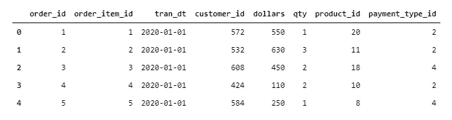
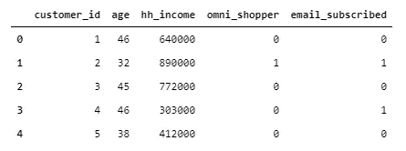
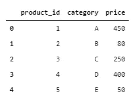
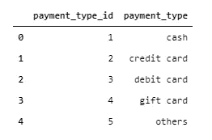
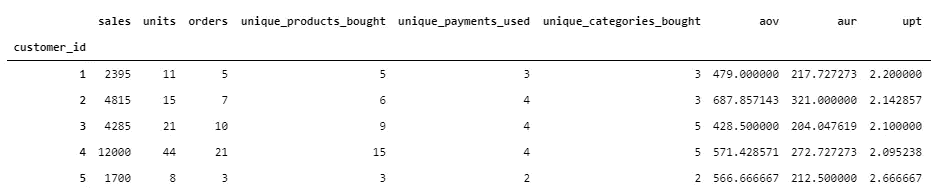
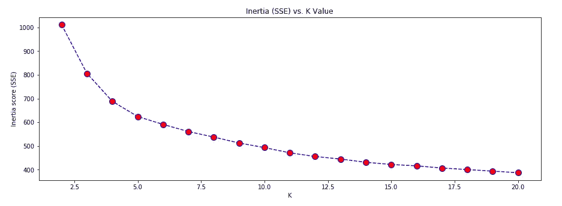
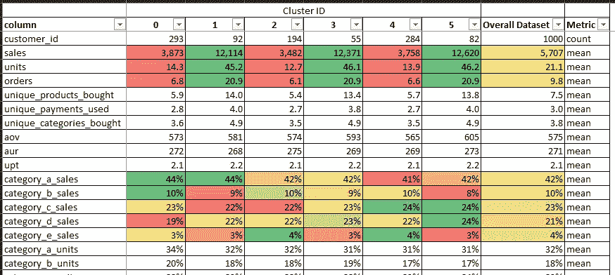

# 使用 k-Means 对客户进行聚类和分析

> 原文：<https://medium.com/analytics-vidhya/clustering-and-profiling-customers-using-k-means-9afa4277427?source=collection_archive---------0----------------------->

Anthony Intraversato 在 [Unsplash](https://unsplash.com?utm_source=medium&utm_medium=referral) 上拍摄的照片

下面的文章介绍了使用客户销售数据进行聚类分析的流程。

它包括以下步骤:

*   将输入销售数据转换为可用于聚类的要素数据集
*   执行聚类练习
*   分析集群，以及
*   建立常规评分流程，根据新数据分配聚类标签。

我还用这个过程制作了一个 Jupyter 笔记本，并把它贴在了 GitHub 上。下面的文章中提到了这个笔记本。

# 什么是集群？

**聚类分析**或**聚类**的任务是对一组对象进行分组，使同一组中的对象彼此之间比其他组中的对象更加相似。这些组被称为**群集**，并且可以以多种方式确定对象的**相似性**度量。

这是一种**无监督的**学习方法，它试图在没有**任何标签**的帮助下确定数据**中的底层结构。**

它也可以被认为是一个探索性的 T21 过程，帮助我们发现数据中隐藏的感兴趣的模式或结构。

聚类广泛用于行业应用，如客户细分。客户细分有各种业务应用，因此对于数据科学家/分析师来说是一项非常重要的技能。

照片由[杰里米·零](https://unsplash.com/@jeremy0?utm_source=medium&utm_medium=referral)在 [Unsplash](https://unsplash.com?utm_source=medium&utm_medium=referral) 上拍摄

有各种可用的算法来执行聚类，这些算法可以分为以下几组:

*   基于分区，例如 k-means
*   等级体系的
*   基于密度的，例如 DBScan，光学
*   基于网格，例如波簇
*   基于模型，例如 SOM

您可以在 [Scikit-learn](https://scikit-learn.org/stable/modules/clustering.html#clustering) 和 [Spark ML Lib](https://spark.apache.org/docs/2.4.4/api/python/pyspark.ml.html#module-pyspark.ml.clustering) 中找到上述部分或全部算法的各种实现。

我们将使用来自 *scikit-learn 0.24.2* 在 *Python 3.7.9* 上的 k-Means 实现进行下面的演练。

> 在我的 git repo [这里](https://github.com/patilvijay23/MLinPython/tree/main/pyspark)也可以找到使用 PySpark 的 **kMeans 的演练。**

我们以一家在其网站上销售时尚商品的电子商务企业为例。

为了简单起见，我们只看销售数据，尽管在实际的电子商务业务中，你也会从他们的网站和应用程序平台获得大量的点击流数据。点击流数据对于了解你的网站和应用的性能，以及确定是什么驱使你的客户访问你的平台并购买非常有用。

# 销售数据

我们的销售数据在*订单* x *项目*级别捕获*日期*、*客户 id* 、*产品*、*数量*、*美元金额*、& *付款类型*。

*   *order_item_id* 是指每个订单中的每个独特产品
*   对于客户信息( *customer_id* )、产品信息( *product_id* )和付款投标信息( *payment_type_id* )，我们都有相应的维度表

下面是每个表中的示例行。

**交易表**:

df_sales.head()

**客户信息**:

df_cutsomer.head()

**产品信息**:

df_product.head()

**付款信息**:

df_payment.head()

请注意，使用的数据是合成的，是在 excel 中创建的。这些文件被保存为 csv 格式，以熊猫数据帧的形式导入 python。

# 聚类练习

为了对客户的交易数据进行聚类，我们需要以聚类练习所需的正确格式获取数据。

## 特征数据集

我们将需要一个数据集，该数据集将随着时间的推移将客户活动汇总到一个 *customer_id* 级别的数据集，即**我们需要使用 1 行数据来描述每个客户，这些数据涵盖了我们对客户**的所有了解。

所需的输出表应为每个客户一行，相关信息作为特征列。您可以在这里创建许多可能的功能，有些简单如 1 年的*销售额*，有些复杂或衍生如*特定产品类别的客户季度销售额变化*。

流程的这一步将包括与业务涉众的对话，以确定哪些功能对业务至关重要。

以下是输出数据的示例:

df_features.head()

**功能列表**

我们拥有的综合数据是 2020 日历年的，我们将采用整个时间段。在您的情况下，您可能需要添加相关的过滤器，并将销售数据集与其他一些数据集连接起来，以获得所需的数据，然后可以对这些数据进行聚合以获得以下功能。

总体水平:

1.  销售
2.  量
3.  订单数量
4.  平均值。订单价值
5.  每笔交易的单位
6.  平均值。单位收入
7.  购买不同产品的数量
8.  购买的不同产品类别的数量
9.  使用的不同付款类型的数量

类别级别:

1.  类别级销售额占总销售额的百分比
2.  类别级别单位的拆分占总单位的百分比

投标类型级别:

1.  投标类型级别销售额占总销售额的百分比

客户信息:

1.  Omni 购物者标志
2.  电子邮件订阅标志

其他人口统计数据将仅用于分析。

下面是从销售数据集中生成所需功能的一些代码片段。完整的代码流可以在 [GitHub 这里](https://github.com/patilvijay23/MLinPython/blob/main/3_Clustering_kmeans.ipynb)找到。

## k 均值聚类

准备好要素数据集后，我们将按照以下步骤从该数据中获取聚类。

1.  无效处理
2.  特征缩放
3.  使用不同的 k 运行 k 均值的多次迭代
4.  用肘图确定 k 的最佳值
5.  获取 k 个集群

**无效治疗**

我们需要对所有的特征应用适当的空值处理，因为 k-means 算法不能处理特征中的空值。

各种不同的特征可能需要不同的零处理，这可以从特征为空时的含义来确定。例如，在我们的要素数据集中，类别和支付百分比分割要素中存在空值。这里的空值仅仅意味着客户没有购买该特定的类别或者没有使用该特定的支付方式。因此，我们将用 0 填充它们。

**特征缩放**

我们所有的特征都存在于不同的尺度上。例如，销售功能可以从几百美元到几千美元，而单位将从几十美元到几百美元。百分比分割特征将位于[0，1]内。

为了确保在距离计算中没有一个要素会覆盖所有其他要素，我们需要在相同的比例下获取所有要素。

我们将直接获取百分比特征而不进行缩放，因为它们已经位于[0，1]中，但是我们将使用 *MinMaxScaler()* 将其他特征缩放到[0，1]。

我们还将 scaler 对象保存为 pickle 转储，以便在以后对新数据进行评分时使用。

**k 均值迭代**

k-means 算法需要用户输入要生成多少个聚类，由 k 参数表示。除非对特定数量的集群有特定的业务需求，否则很难确定集群的数量。

肘形图是根据数据确定最佳聚类数的一种方法。为此，我们遍历数据并为从 2 开始的不同数量的 k 生成聚类。k-means 算法给出了每个数据点距离其所分配聚类的质心的平方距离的总和，称为*惯性得分*。然后，我们绘制每次迭代的惯性分数与 k 值的关系图。生成的图形一般有一个*弯头*形状，因此得名*弯头图*。

> 肘点代表 k 值，超过该值，通过增加 k 值实现的惯性减小可以忽略不计，因此在该点停止是最佳的。

我们将遍历我们的特征数据集，并在[2，20]中获得 k 的惯性分数。

**弯头图**:

肘图

我们在这里没有非常明显的肘点，并且**通常明显的肘很少出现在实际数据中**。从上图可以看出，k 的最佳值可以在 4-6 左右，因为惯性持续急剧下降，至少直到 k=4。

我们可以使用[剪影分数](https://scikit-learn.org/stable/modules/generated/sklearn.metrics.silhouette_score.html)，这是另一个聚类质量度量，在 4–6 中选择最佳 k。我们也可以在这里获取业务输入，以确定 k 的实际值是多少。

一旦我们确定了 k 的值，我们就生成最终的聚类对象，并保存它用于评分过程。我们还将获得所有记录的分类标签并保存它。

最终聚类迭代

# 压型

剖析是聚类练习中最重要的部分，因为它帮助我们理解客户行为方面的聚类实际上是什么，并以业务可用的方式定义它们。

## 集群级数据摘要

为了帮助进行集群分析，我们将使用 pandas *describe()* 方法。您还可以使用其他方法来帮助总结所有集群的所有特性，并确定每个集群的配置文件。可视化工具(如 Tableau)也可以用于此目的，方法是加载带标签的聚类输出。

*describe()* 方法可直接用于获取数据集所有特征的总体级别摘要。然后，它可以与 *groupby()* 一起使用，以获得每个聚类的所有特征的摘要。

将这两者结合在一起，我们可以了解每个特性在集群中是如何变化的，以及它在总体级别上是如何表现的。这将有助于我们得出集群之间以及集群与普通客户之间有何不同的结论。

请注意，*平均值* / *中位数*是集中趋势的良好衡量标准，有助于轻松比较多个组，但它们并不是完整的情况。 *describe()* 方法给出了所有特性的所有主要分布点，我们可以调整上面的代码，不仅可以比较*平均值* / *中值*，还可以比较特性在集群中的整体分布。通过绘制按聚类划分的每个特征的直方图，也可以更好地分析这些特征。

现在我们已经有了包含所有集群的所有特性的数据框架，我们可以将其导出到 Excel 并进行分析。下面是使用色标测量特征可变性的 Excel 分析的快照。

使用 Excel 中的色标来分析聚类之间的可变性

聚类 1/3/5 都是高销售额，聚类 0/2/4 都是低销售额。尽管通常认为大量客户只会购买一两个类别的产品，但在各个类别中看到的产品份额并没有太大变化。

上面使用的数据除了电子邮件订阅和 omni 购物者标志以及 1/3/5 和 0/2/4 之间的高低分割之外，没有任何强有力的区分标志。

在真实数据中，您可以拥有诸如*高价值购物者*、*低频率购物者*之类的集群，或者显示出对单一产品类别的亲和力的集群:*B 类购物者*等。

注意:如果概要文件不令人满意，您也可以返回并更改集群的数量。

# 得分

现在我们已经完成了这个练习，并且已经描述和了解了客户的样子，我们可能想要了解我们的新客户的样子，或者现有客户在继续与我们一起购物的过程中会发生怎样的变化。

为此，我们将设置一个评分流程，该流程将获取最新的交易数据，并根据上述分析为客户分配聚类 id。

我将评分部分分为两步:**特征生成**和**聚类分配**。已经生成了两个 python 脚本，[上传到 git 这里](https://github.com/patilvijay23/MLinPython/tree/main/scripts)可以作为参考。

总体而言，该流程应:

1.  获取最新交易数据
2.  生成我们在本练习前面生成的聚类功能
3.  使用保存的模型对象缩放要素数据集，然后为其分配聚类标签，以及
4.  将集群标签保存回数据库，以用于报告和监控目的。

评分代码是 python 脚本，而不是 Jupyter 笔记本，因为使用脚本来设置生产流程(如对交易数据评分以分配聚类)会更容易、更好。

**随着时间的推移，客户群的行为可能会发生变化，新的客户活动子群体可能会出现**。这可能是由于产品供应的变化、经营方式的变化(如应用程序或网站的重新设计)、业务目标受众的变化，或者是由于市场格局的总体变化。此时，我们可能需要重新进行聚类分析，以了解新的客户子群体及其概况。

感谢您阅读这篇文章。如果您有任何问题或任何意见，请通过评论联系我。

你可以在[我的 git repo 这里](https://github.com/patilvijay23/MLinPython)找到更多 python 相关的参考资料。