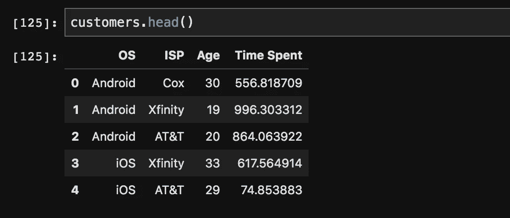
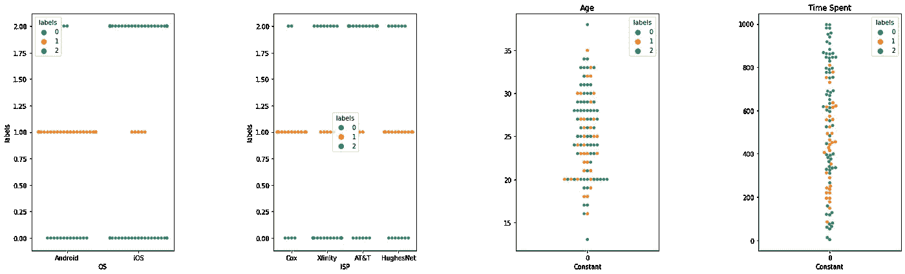
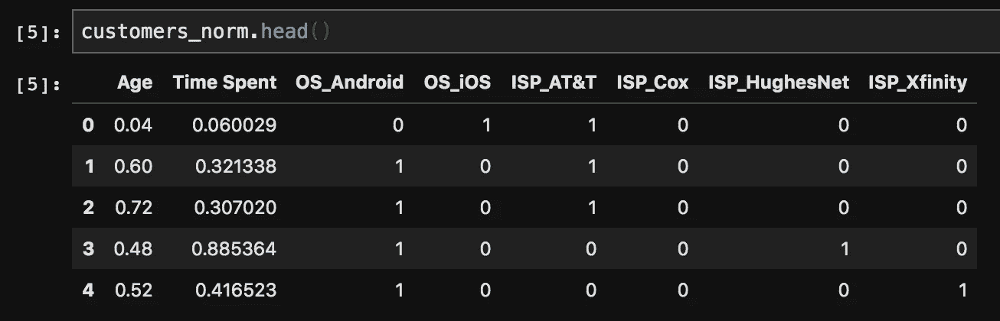
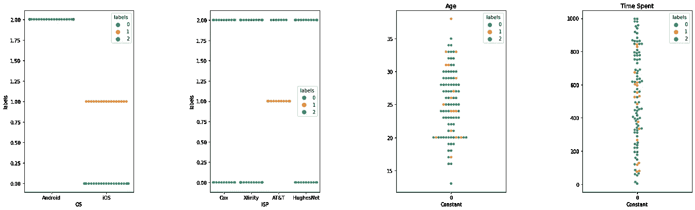

# Python 中混合数据类型的聚类

> 原文：<https://medium.com/analytics-vidhya/clustering-on-mixed-data-types-in-python-7c22b3898086?source=collection_archive---------0----------------------->


作者图片

在我第一次数据科学实习期间，我被分配了一个看似简单的任务，在数据集中寻找聚类。鉴于我对 K-Means、DBSCAN 和 GMM 等聚类算法的基本了解，我认为我可以轻松完成这项任务。然而，当我更仔细地研究数据集时，我意识到这些数据混合了**分类**和**连续**数据，而且我所知道的许多常见聚类方法并不容易工作。

> ***分类数据*** *由多个离散的类别组成，这些类别之间通常没有任何明确的顺序或关系。这些数据可能看起来像是*“Android”*或*“iOS”。
> 
> ***连续数据*** *由可以取任意值的实数组成。该数据可能看起来像* "3.14159" *或* "43" *。*

许多数据集混合了分类数据和连续数据。然而，如何对混合数据类型的数据集进行聚类并不简单。那么，我们如何对既有分类特征又有连续特征的数据进行聚类呢？让我们看看使用 Python 处理这个问题的两种简单方法。

# 资料组

在本文中，我将对我创建的一个小型数据集进行聚类，该数据集混合了分类特征和连续特征。我的假数据代表可能用于了解电子商务网站/应用程序客户的客户数据。我们的假数据集将有 4 个特征:

*   **OS** —我们假冒客户的操作系统(*分类*)
*   **ISP** —我们假冒客户的互联网服务提供商(*分类*)
*   **年龄** —客户年龄(*连续*)
*   **花费时间** —我们的假冒用户在我们的网站上花费的时间(*连续*)

这是用来生成我们的假数据的代码。

```
*#create dataset*
**import** **numpy** **as** **np** 
**import** **pandas** **as** **pd**

operating_systems = ["Android","iOS"]
isp_names = ["Cox","HughesNet","Xfinity","AT&T"]

data = []
**for** i **in** range(100):
    row = []
    row.append(np.random.choice(operating_systems)) #OS
    row.append(np.random.choice(isp_names)) #ISP
    row.append(np.random.poisson(lam=25)) #Age 
    row.append(np.random.uniform(low=0.5, high=1000)) #Time Spent
    data.append(row)

customers = pd.DataFrame(data, columns = ['OS', 'ISP','Age','Time Spent'])
```

这是我们的假数据集的样子。现在让我们动手做一些集群工作吧！



# 方法 1: K 原型

我们将尝试的第一种聚类方法叫做 K 原型。该算法本质上是 K 均值算法和 K 模式算法的结合。

为了刷新我们的记忆， **K-means** 使用欧几里德距离对数据进行聚类。同时， **K-modes** 基于数据点之间匹配类别的数量对分类数据进行聚类。这两者的混合:K-prototype 算法，正是我们需要的来聚集我们的假客户！

首先，让我们标准化数据中的连续特征，以确保一个特征不会被解释为比另一个更重要。

```
from sklearn import preprocessingcustomers_norm = customers.copy()
scaler = preprocessing.MinMaxScaler()
customers_norm[['Age','Time Spent']] = scaler.fit_transform(customers_norm[['Age','Time Spent']])
```

现在，让我们使用 K-prototypes 算法对我们的数据进行聚类。我的算法实现很简单，用 3 个集群和 Cao 初始化。在训练模型时，我们指定数据中的哪些列是分类的(列 0 和 1)。关于实现和微调这个算法的更多信息可以在这里找到:[https://github.com/nicodv/kmodes](https://github.com/nicodv/kmodes)。

```
from kmodes.kprototypes import KPrototypeskproto = KPrototypes(n_clusters=3, init='Cao')clusters = kproto.fit_predict(customers_norm, categorical=[0, 1])#join data with labels 
labels = pd.DataFrame(clusters)
labeledCustomers = pd.concat((customers,labels),axis=1)
labeledCustomers = labeledCustomers.rename({0:'labels'},axis=1)
```

最后，让我们制作一些群集图来看看我们的群集表现如何。



成功了！看起来我们有三个相当不同的集群。我们的第一个集群似乎代表了在网站上花费大量时间的用户。我们的第二个集群主要是 Android 用户，他们花费的时间中等/低。最后，我们的第三个集群主要是 iOS 用户，他们也有中度/低度的时间消耗。

# 方法 2:具有一个热编码的 K-Means

使用 K-原型算法的替代方法是使用 K-means 算法和一个热编码分类变量。**一个热编码**包括为数据集中的每个分类值创建一个新列。然后根据该分类值是否在数据中来分配 1 或 0。让我们使用 pandas 的“get_dummies”函数对数据集中的分类值进行热编码。

```
customers_norm = pd.get_dummies(customers_norm, columns=["OS","ISP"])
```

现在，我们的数据看起来像这样。酷！是时候进行更多的聚类了。



让我们使用 K-means 的一个基本实现对这些数据进行聚类，并制作更多的群集图来看看这种方法是如何工作的。

```
from sklearn.cluster import KMeanskmeans = KMeans(3)
clusters = kmeans.fit_predict(customers_norm)
labels = pd.DataFrame(clusters)
labeledCustomers = pd.concat((customers,labels),axis=1)
labeledCustomers = labeledCustomers.rename({0:'labels'},axis=1)
```



好吧！有趣的是，我们可以看到这些集群与之前展示的 K-prototypes 集群有多么不同。乍一看，似乎我们数据中的分类特征对我们的聚类贡献更大，而我们的连续特征根本没有贡献多少。第一个集群包含不使用 AT&T 的 iOS 用户。我们的第二个集群包含使用 AT&T 的 iOS 用户。最后，我们的第三个集群包含所有 Android 用户。同时，年龄和花费的时间在所有集群中有很大的分布。

# 结论

在这篇文章中，我们研究了 Python 中混合分类/连续数据聚类的两种不同方法。首先，我们实现了 **K-prototypes** 算法，这是一种专门设计的算法，使用 K-means/K-modes 的组合对混合数据进行聚类。作为替代，我们尝试使用带有一个热编码的 K-means 算法。

使用我们的假数据集，这两种方法确定的聚类有显著差异。k 原型似乎均衡地考虑了分类和连续特征。与此同时，K-means 似乎更重视分类特征，这可能是不可取的。

这些方法如何处理您的混合数据集？大家讨论一下！

Github repo 与所有代码/视觉效果在这里:[https://github.com/ryankemmer/ClusteringMixedData](https://github.com/ryankemmer/ClusteringMixedData)

# 参考

[1] de Vos，Nelis J. kmodes 分类聚类库。2015–2021 年，【https://github.com/nicodv/kmodes 

[2]黄，z .:混合数值与分类值的大数据集聚类，第一届亚太知识发现与数据挖掘会议论文集，新加坡，第 21–34 页，1997 .