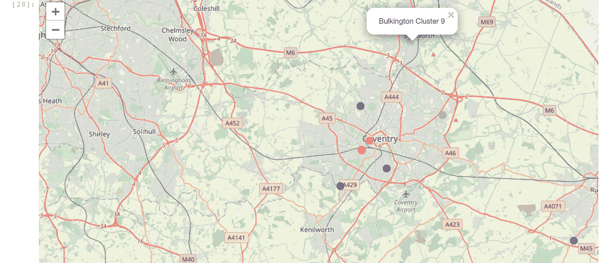

# 集群问题:使用 Foursquare API 解决员工调动问题

> 原文：<https://medium.com/analytics-vidhya/clustering-problem-solving-employee-relocation-problem-using-foursquare-api-85bdd51dcb49?source=collection_archive---------16----------------------->

来源: [Unsplash](https://unsplash.com/photos/1RT4txDDAbM?utm_source=unsplash&utm_medium=referral&utm_content=creditShareLink)

公司最好的资源是给公司带来创造力、生产力和最终盈利能力的人——员工。一个组织要成长，需要培养员工，拥有一个伟大的产品，一个令人惊叹的营销团队，以及一个扩张计划。扩张过程中面临的一个挑战是对能够培育新扩张点(分支机构)的熟练员工的需求。组织可以选择:

1.  雇用新员工，培训新员工，并将他们部署到新的地点；或者
2.  调动现有有经验的员工。

第二种选择对公司来说肯定是更便宜和更有效的选择，因为与已经熟悉公司结构和运营的现有有能力的员工一起工作可以最大限度地减少新员工适应和处理公司运营所需的成本和管理时间方面的支出。然而，本组织需要采取战略，确保重新安置的工作人员在新的地点感到愉快。这确保了员工流动对公司来说是一项不那么令人生畏的任务，也消除了员工的高压力情况。

# 问题定义

在这个实验中，我们将帮助一家公司**“WXYZ 公司”**解决其员工调动问题:

> WXYZ 公司在过去的 5 年里一直在美国纽约的布鲁克林经营。今年，董事会决定在英格兰考文垂开设一个办事处，并希望选择一些现有员工在新的分支机构中担任一些管理职务。
> 
> 这个数据科学项目旨在比较纽约布鲁克林(当前公司所在地)和考文垂(新分支)的社区，并创建相似社区的集群。

**该项目将帮助公司:**

1.  确定哪些员工可以更顺利地过渡到新的分支机构(通过确定他们当前的居住地址是否与新位置的集群相匹配)。
2.  为同意搬迁的员工确定推荐的地点。

# 数据源

**布鲁克林街区数据**是从 **JSON 文件**中检索的，可在[这里](https://cf-courses-data.s3.us.cloud-object-storage.appdomain.cloud/IBMDeveloperSkillsNetwork-DS0701EN-SkillsNetwork/labs/newyork_data.json)访问。这个数据集包含了很多关于纽约的信息；但是，该项目仅提取了以下内容:

*   自治的市镇
*   附近
*   纬度
*   经度

**考文垂街区数据**从 [**维基百科页面**](https://en.wikipedia.org/wiki/CV_postcode_area) 中被废弃，该页面包含邮政编码和各自街区信息的列表。该数据没有纬度和经度信息，因此使用地理编码器 python 库来提取坐标:

*   邮递区号
*   自治的市镇
*   附近
*   纬度
*   经度

上面给出的数据集不足以帮助我们生成好的聚类。合乎逻辑地决定了这些地方(*健身房、餐厅等。人们参观的地方通常与他们觉得舒适的环境类型有关。*

这就是为什么我们决定在这个项目中使用**热门地点**(将数据放在 Foursquare API 中)。这些信息是使用 Foursquare API 从布鲁克林、纽约和考文垂的社区中提取的。我探索了每个街区最常见的场地类别。在数据清理和转换之后，我能够生成如下所示的数据结构。

## 什么是 Foursquare API？

Foursquare Places API 提供了基于位置的体验，提供了关于地点、用户、照片和签到的各种信息。该 API 支持对地点的实时访问、将用户分配到特定位置的快速定位以及地理标记。欲了解更多信息，请访问此[链接](https://developer.foursquare.com/)。

# 探索性数据分析

在我们训练模型之前，让我们尝试将数据的分布可视化。下图显示了布鲁克林和考文垂的顶级场馆。

从这个水平条形图中，很明显**印度餐馆**和**酒类商店**是考文垂最常见的场所，这可能意味着印度人可能在考文垂相当舒适，从布鲁克林搬到考文垂可能没有问题。

布鲁克林的这张图显示出**比萨饼店**和**中国餐馆**是布鲁克林社区中最常见的场所。这可能意味着重新安置中国或意大利员工可能不是最好的主意。

# 聚类和结果评估

**为什么要聚类？**

聚类是一种涉及数据点分组的机器学习技术。同一组中的数据点应该具有相似的属性，而不同组中的数据点应该具有非常不同的属性。

正如在简介中所讨论的，这个项目的目的是找到考文垂与布鲁克林有相似之处的社区，以便员工在公司的新分支机构搬迁到考文垂时能够平稳过渡，并且集群(在这种情况下为 k-means)能够处理这种结构的问题。

# 可视化结果

让我们看看使用 K-means 聚类的 2 个布鲁克林街区和 2 个考文垂街区的查询结果:

仅仅通过比较列中的值，您就能够理解为什么这些邻域属于相同的聚类。

现在，让我们来看看地理图上可视化的集群，以便有一个更好的想法。

## 纽约布鲁克林地图上的集群

## 英格兰考文垂地图上的集群

WXYZ 公司可以研究这个模型中的建议，并决定他们更喜欢的邻居。在研究了相似的邻域之后，现在可以从这个聚类模型中起草一个推荐列表。

两幅图中的颜色代码显示，聚簇**9-绿色**(紧随其后的是聚簇**12-橙色**)在布鲁克林是一种非常常见的街区类型，在考文垂地图上出现得很少。这表明，搬迁到考文垂的员工将在这些集群上实现最平稳的过渡。

# 结论

在这项研究中，我使用 Foursquare API 提取了布鲁克林和考文垂附近的数据以及他们最受欢迎的地方。我对数据进行了转换，并对数据进行了聚类，以找到布鲁克林和考文垂之间的相似街区。所有这些都是为了帮助该公司为其员工确定具有最平稳过渡效果的住宅区。在任何公司，国际搬迁都是职业生涯中有吸引力的一面，对公司整体来说都有好处，这个项目有助于公司简化搬迁过程。

有关该项目的更多详细信息:

[GITHUB 链接到笔记本](https://github.com/nnitiwe-dev/Coursera_Capstone/blob/main/notebooks/DS_cy_ny_capstoneProject.ipynb)