# 卷积神经网络

> 原文：<https://medium.com/analytics-vidhya/cnn-32fbc1706a89?source=collection_archive---------9----------------------->

# 概观

在这篇文章中，我想分享我对卷积神经网络的基础知识。理解任何概念的基础会使学习这些概念变得容易。所以，让我们开始以更好的方式理解 CNN 或 Convnets。

# 目录:

1.  介绍
2.  CNN 如何从图像中学习？
3.  过滤器和过滤深度
4.  因素
5.  填料
6.  维度
7.  联营
8.  CNN 基本架构
9.  激活功能
10.  使用反向传播训练 CNN
11.  现有架构

# **1。简介:**

卷积神经网络(CNN 或 Convnet)是专门为视觉任务构建的一类神经网络。图像识别和分类、物体识别等领域的视觉任务。

ConvNets 是当今大多数机器学习实践者的重要工具。然而，理解 ConvNets 并第一次学习使用它们有时会是一种令人生畏的经历。

卷积神经网络(CNN)在生物学上受到人脑视觉皮层的启发，它由一个或多个卷积层组成，然后是一个或多个完全连接的层

# **2。CNN 是如何运作的？**

让我们对卷积神经网络(CNN)如何工作有一个更好的直觉。我们将研究人类如何对图像进行分类，然后看看 CNN 如何使用类似的方法。

图像是值得注意的，但像素。像素包含构成图像的 RGB 颜色值。我用[像素浏览器](https://csfieldguide.org.nz/en/interactives/pixel-viewer/)查看下图的像素范围。

猫的原始图像

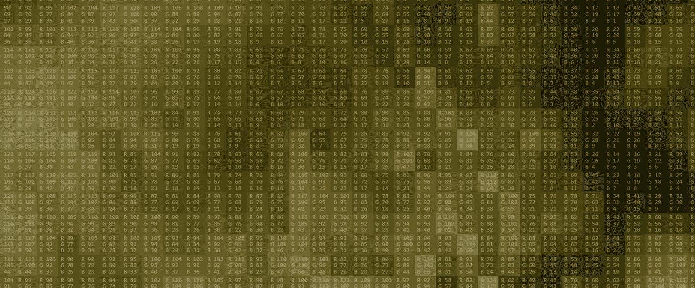

上面猫图像的像素 RGB 值

假设我们想将下面的一只猫的图像归类到该猫的一个特定品种:

作为人类，我们如何做到这一点？

我们这样做是为了识别猫的某些部位，比如鼻子、眼睛和嘴巴。我们本质上是将图像分解成更小的片段，识别更小的片段，然后将这些片段组合起来，以获得猫的整体概念。

在这种情况下，我们可以将图像分解为以下内容的组合:

*   一个鼻子

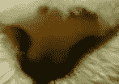

*   眼睛

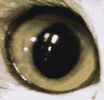

*   口

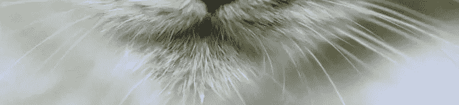

**更进一步**

我们如何确定鼻子到底是什么？

鼻子可以看做一个椭圆形，里面有两个黑洞。因此，对鼻子进行分类的一种方法是将其分成更小的部分，并寻找黑洞(鼻孔)和定义椭圆的曲线，如下所示:

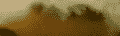

我们可以用来确定鼻子的曲线

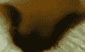

一个鼻孔，我们可以用它来给狗的鼻子分类

从广义上讲，这是一个 CNN 学会做的事情。它学习识别基本的线条和曲线，然后是形状和斑点，然后是图像中日益复杂的对象。最后，CNN 通过组合更大、更复杂的对象来对图像进行分类。

在我们的例子中，层次结构中的级别是:

*   简单的形状，如椭圆形和黑色圆形
*   复杂物体(简单形状的组合)，如眼睛、鼻子和嘴
*   猫是复杂物体的组合。

通过深度学习，我们实际上并没有对 CNN 进行编程来识别这些特定的特征。更确切地说，CNN 通过前向传播和反向传播自己学习识别这样的物体！

很神奇吧..CNN 可以学习如何对图像进行分类，即使我们从来没有用特定特征的信息对 CNN 进行编程。

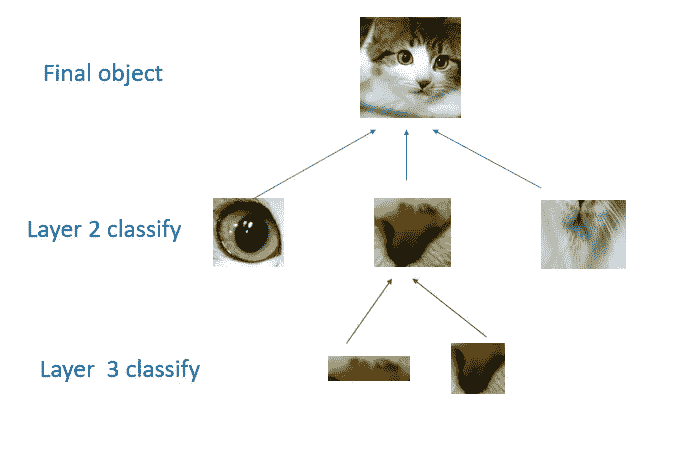

CNN 如何一层一层分割图像的层次结构

CNN 可能有几层，每层可能捕获对象层次结构中的不同级别。第一层是层次中的最低层，CNN 通常将图像的小部分分类为简单的形状，如水平线和垂直线以及简单的颜色块。

随后的层往往是层次中更高的层次，通常对更复杂的概念进行分类，如形状(线条的组合)，最终是完整的对象，如猫。

CNN **再一次靠自己**了解了所有这些。我们甚至不需要告诉 CNN 去寻找线条或曲线或鼻子或嘴。CNN 只是从训练集中学习，发现猫的哪些特征值得寻找。

# 3.过滤

对 CNN 来说，第一步是把图像分成更小的片段。我们通过选择定义过滤器的宽度和高度来做到这一点。

**滤波器/内核:**滤波器或内核是预先选择的 m*n 矩阵，它扫描输入的图像矩阵，并通过矩阵乘法产生一些结果，这些结果给出关于各种图像特征的想法。过滤器查看图像的小块或小块。这些补丁与过滤器的大小相同。

图片来源:[中](https://towardsdatascience.com/cnn-part-i-9ec412a14cb1)

在上面的 gif 中，绿色矩阵是 5X5 的图像，黄色矩阵是 3X3 的核/过滤器。通过计算核，在图像矩阵上，我们得到卷积的特征矩阵。过滤器/内核只是水平或垂直滑动，聚焦在图像的不同部分。

**步幅:**过滤器滑动的量称为**‘步幅’**。通过减少每层观察的总面片数，增加步幅可以减小模型的大小。

让我们看一个例子。在这张猫的放大图中，我们首先从红色的补丁开始。我们的过滤器的宽度和高度决定了这个正方形的大小。

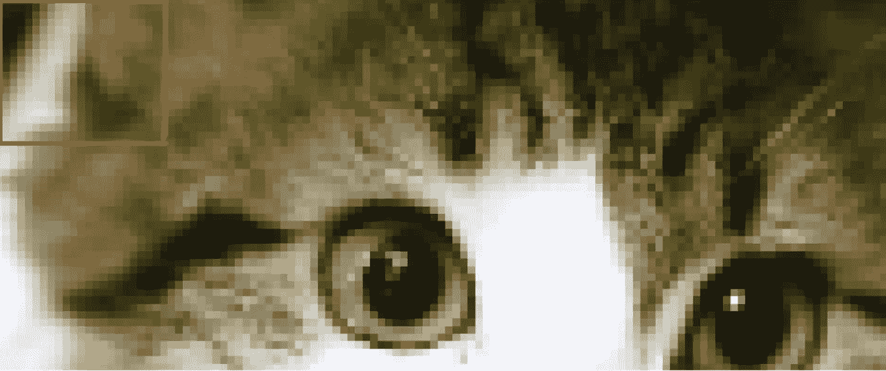

然后，我们将方块向右移动给定的步幅(在本例中为 2 ),以获得另一个面片。

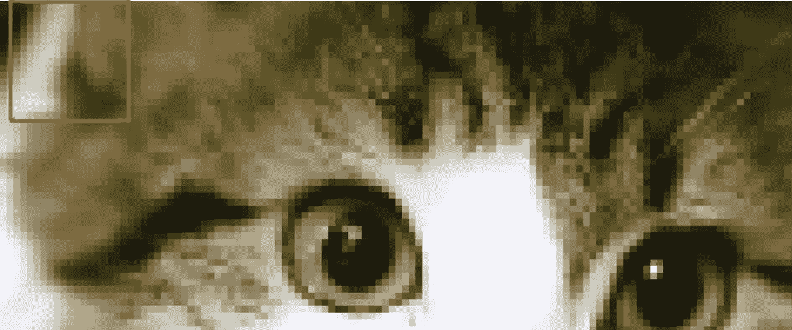

我们将正方形向右移动两个像素，创建另一个小块。

这里重要的是，我们将相邻的像素分组，并把它们作为一个整体。

在正常的非卷积神经网络中，我们会忽略这种邻接关系。在正常的网络中，我们会将输入图像中的每个像素连接到下一层的神经元。在这样做的时候，我们没有利用图像中的像素由于某种原因靠近在一起并且具有特殊意义的事实。

通过利用这种局部结构，我们的 CNN 学会了对图像中的局部模式进行分类，如形状和物体。

**点记:**在 CNN 的，没有定义滤镜。在训练过程中学习每个滤波器的值。

**为什么过滤器/内核是可学习的，内核是如何学习的？**

在 1988 年之前的卷积神经网络的初始方法中，使用硬编码滤波器意味着滤波器不是可学习的滤波器。使用硬编码过滤器的问题在于，这些过滤器无法帮助 full 提取不同类型数据的要素地图。

出于这个原因，一个可学习的内核开始使用。过滤器/内核在反向传播期间学习并改变它们的值，因此，它们的工作方式类似于多层感知器中的权重。

## 过滤深度

通常会有一个以上的过滤器。不同的滤镜拾取不同质量的补丁。例如，一个过滤器可能寻找特定的颜色，而另一个过滤器可能寻找一种特定形状的对象。卷积层中的滤波器数量被称为**滤波器深度**。

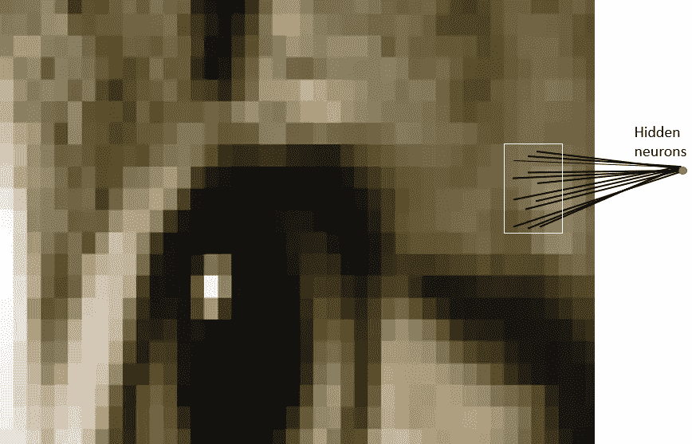

贴片连接到下一层的神经元

每个贴片连接多少个神经元？

这取决于我们的过滤深度。如果我们有“n”个深度，我们将每个像素块连接到下一层的“n”个神经元。这给了我们下一层中“n”数的高度。实际上，“n”是我们调整的超参数，大多数 CNN 倾向于选择相同的起始值。

**但为什么要将单个贴片连接到下一层的多个神经元呢？一个神经元还不够好吗？**

多个神经元可能是有用的，因为一个补丁可以有多个我们想要捕捉的有趣特征。

例如，一个补丁可能包括一些有趣的不同功能，如下图所示:

猫的这一部分包含许多有趣的特征，包括眼睛、鼻子、胡须等

给定的小块有多个神经元确保了我们的 CNN 可以学习捕捉 CNN 学习到的任何重要特征。

请记住，CNN 的“编程”并不是为了寻找某些特征。相反，它**自己学习**注意哪些特征。

# 4.参数共享

当我们试图对一张猫的图片进行分类时，我们并不关心猫在图片中的位置。如果在左上或者右下，在我们眼里还是猫。我们希望我们的 CNN 也拥有这种被称为翻译不变性的能力。如何才能实现这一点？

正如我们前面看到的，图像中给定块的分类是由对应于该块的权重和偏差决定的。

如果我们想让一只在左上方的猫和一只在右下方的猫以同样的方式被分类，我们需要对应于这些补丁的权重和偏差是相同的，这样它们就以同样的方式被分类。

这正是我们在 CNN 所做的。我们为给定输出层学习的权重和偏差在给定输入层的所有面片中共享。请注意，随着我们增加滤波器的深度，我们需要学习的权重和偏差数量仍会增加，因为权重不会在输出通道之间共享。

分享我们的参数还有一个额外的好处。如果我们不在所有片上重复使用相同的权重，我们将不得不为每个单独的片和隐藏层神经元对学习新的参数。这不能很好地缩放，尤其是对于高保真图像。因此，共享参数有助于我们保持平移不变性，并为我们提供一个更小、更可伸缩的模型。

# **5。填充**

填充是在输入图像上添加额外图层的过程。

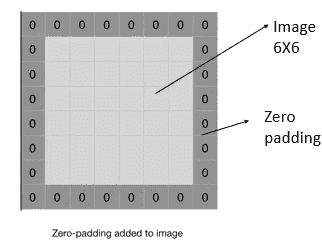

图片来源: [GeeksforGeeks](https://www.geeksforgeeks.org/cnn-introduction-to-padding/)

填充类型:

1.  **有效填充:**这里我们不会对输入图像应用任何填充，这意味着原始输入图像的大小将保持不变，以供进一步处理。
2.  **相同的填充:**这里，我们添加填充层，使得输出图像与输入图像具有相同的尺寸。

# 6.维度

从我们目前所了解到的，如何计算我们 CNN 中每一层的神经元数量？

假设我们的输入层的体积为 **V** ，我们的过滤器的体积(高度*宽度*深度)为 **F** ，我们的步幅为 **S** ，填充为 **P**

下面的公式给我们下一层的体积: **(V-F+2P)/S+1**

了解每个附加层的维度有助于我们了解模型有多大，以及我们围绕过滤器大小和步长的决策如何影响我们网络的规模

# 7.联营

池化图层独立操作每个要素地图。池化通过降低要素地图的高度和宽度来降低要素地图的分辨率，但保留分类所需的地图要素。这叫做**。**

*联营的类型:*

1.  ***最大池**:当在跨度=2、过滤器尺寸为 2X2 的 4X4 特征图上进行最大池时，它会将特征图缩小到尺寸为 2X2，并通过拾取过滤器在特征图上滑动时形成的度量中的最大数字来计算 2X2 特征图的值。*

*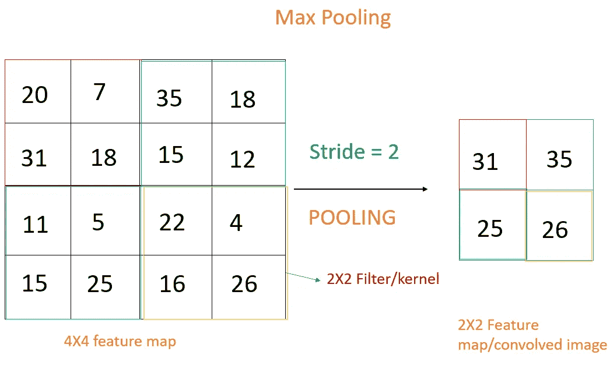*

*2.平均池化:当平均池化在步幅=2 且过滤器大小为 2X2 的 4X4 特征图上进行时，它将特征图缩小到大小为 2X2，并且通过拾取过滤器在特征图上滑动时形成的度量的平均数来计算 2X2 特征图的值。*

*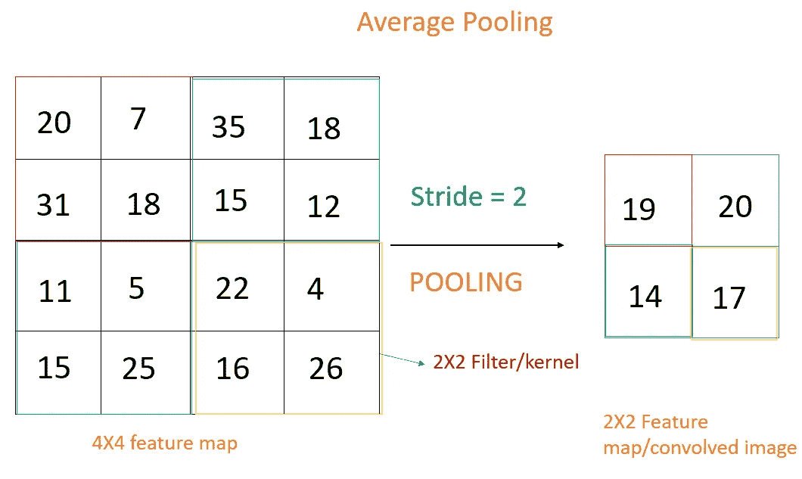*

*3.全局池:它将特征图中的每个通道减少到单个值，它可以是全局最大池或全局平均池。*

# *9.神经网络中的卷积层*

*上面我们学习了卷积层的重要部分，现在让我们建立一个卷积层结构*

*让我们通过创建一个简单的模型来理解 CNN 的架构:*

*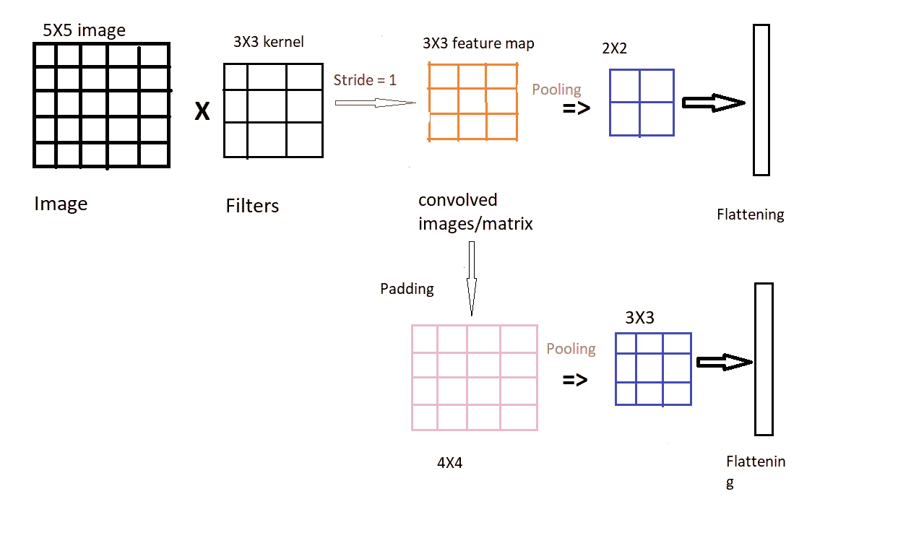*

*无填充和有填充的单卷积层结构。*

*在这里，假设当应用大小为 3×3 的核并且步幅为 1 时，图像大小为 5×5。可学习的核提取特征并输出 3×3 卷积矩阵或特征图。步幅=1 的 2×2 池应用于卷积矩阵的顶部，并且度量值被展平为称为展平层的单个向量。*

*在上面的结构中，我在卷积图像或特征地图上应用填充，知道特征地图的大小是 4X4，填充后应用合并，步幅=1，并使用展平层展平值*

***为什么需要汇集、填充？***

*当我们取 stride =1 时，在特征提取中会有重叠，这导致更多的数据是相关的，因此，通过应用汇集，我们可以在不丢失重要特征的情况下减少数据的大小。在我们的示例中，我们通过应用 stride = 1 的汇集，将 3×3 卷积矩阵减少为 2×2 数据*

*在我们的例子中，我们通过应用 3X3 内核/滤波器将 5X5 图像分解为 3X3 卷积矩阵。在某些情况下，我们不想这样做，因为这样做可能会丢失图像边缘的特征，或者我们必须保持相同的大小度量来进行矩阵乘法，因此，我们使用一种填充。在上述示例中，卷积特征被填充，大小为 4X4。当我们在 4X4 卷积特征之上应用池化时，它会给出一个 3X3 的数据矩阵。这意味着我们保持与先前矩阵相同的大小。*

***注:***

*只能在要素地图/卷积图像上进行池化，但也可以在输入图像和要素地图上进行填充。*

*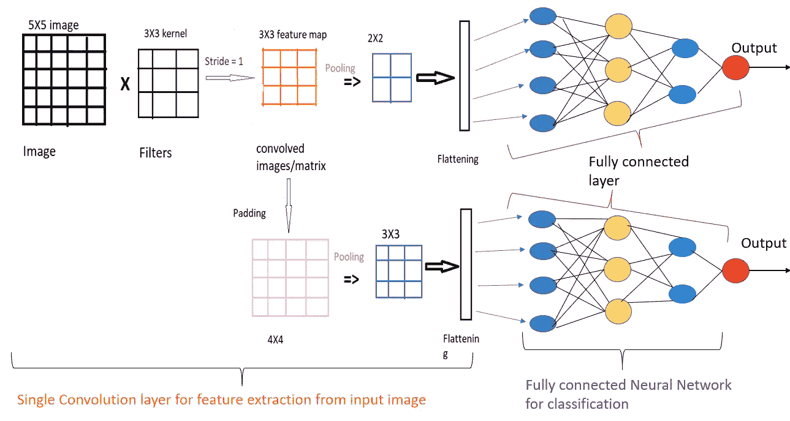*

*卷积神经网络的结构*

*CNN 层试图使用内核、填充和池来学习从图像中提取什么。在 CNN 层之后，我们添加一个完全或前向连接的层，它学习 CNN 层根据权重提取的模式之间的关系，并给出输出。*

*图像只不过是一个 RGB 值的矩阵(就彩色图像而言)，当我们在图像上应用内核/过滤器时，内核开始提取图像的边缘或特征。如果我们应用多个滤波器，我们得到多个卷积图像/矩阵或在那些卷积矩阵之上的特征图。*

*我们可以应用更多的卷积层、最大池化、批量归一化来提取特征图，最后，我们展平这些特征图，并添加完全连接的神经元，以获得图像的最终输出或分类。*

*我试着在上面介绍了单个卷积层的基本术语和架构。*

# *10.使用反向传播训练 CNN*

*   *我们用随机值初始化 CNN 层中的所有滤波器和全连接网络中的参数/权重*
*   *该网络将训练图像作为输入，经历正向传播步骤(卷积、ReLU 和汇集操作以及全连接层中的正向传播)，并找到每一类的输出概率。*
*   *在 CNN 架构中，我们使用卷积层和最大池，因此，我们必须确保卷积层和最大池都需要是可区分的，才能进行反向传播。*
*   *卷积层包含卷积算子和激活函数，卷积算子和激活函数都是可微的，最大池也是可微的。*
*   *得到产量后，我们可以计算实际产量(y)和预测 output(y^之间的损失。通过得到损失函数，我们可以得到微分损失函数。*
*   *由于权重是为第一个训练示例随机分配的，因此输出概率也是随机的。*
*   *计算输出图层的总误差。*
*   *使用反向传播来计算网络中所有权重的误差的*梯度*，并使用*梯度下降*来更新所有滤波器值/权重和参数值，以最小化输出误差。*

*权重按照它们对总误差的贡献成比例地进行调整。*

*像过滤器数量、过滤器尺寸、网络结构等参数。在步骤 1 之前已经全部固定，并且在训练过程中不会改变——只有过滤器矩阵和连接权重的值得到更新。*

*   *对训练集中的所有图像重复反向传播，直到错误率变得最优。*

*当一个新的(看不见的)图像被输入到 ConvNet 中时，网络将经历正向传播步骤，并输出每一类的概率(对于一个新的图像，使用已经被优化以正确分类所有先前训练示例的权重来计算输出概率)。如果我们的训练集足够大，网络将(有希望)很好地归纳新图像，并将它们分类到正确的类别中。*

*我用简单的英语单词用反向传播解释了训练。如果你有兴趣详细了解训练的数学原理，请点击[链接](https://www.jefkine.com/general/2016/09/05/backpropagation-in-convolutional-neural-networks/)。*

# *11.CNN 架构*

*卷积神经网络自 20 世纪 90 年代初就已经存在。*

*   ***莱内特(上世纪 90 年代)***
*   ***AlexNet (2012)***
*   ***ZF 网(2013)***
*   ***谷歌网(2014)***
*   ***VGGNet (2014)***
*   ***雷斯内特(2015)***
*   ***dense net(2016 年 8 月)***

## ***完成这篇文章的人的额外参考资料:-***

*如果你是初学者，想直观地了解 CNN，请访问这个网站 [CNN 解说](https://poloclub.github.io/cnn-explainer/)*

*一旦你熟悉了 CNN 的基本架构，你就可以去参观 [TensorSpace 游乐场](https://tensorspace.org/html/playground/lenet.html)。*

*感谢您阅读这篇文章…*

# *参考:*

1.  *[https://github . com/nehal 96/Deep-Learning-ND-Exercises/blob/master/convolutionary % 20 neural % 20 networks/convolutionary-neural-networks-notes . MD](https://github.com/nehal96/Deep-Learning-ND-Exercises/blob/master/Convolutional%20Neural%20Networks/convolutional-neural-networks-notes.md)*

* [## CNN |填充介绍- GeeksforGeeks

### CNN |简单卷积层填充问题简介填充输入图像填充只是一个过程…

www.geeksforgeeks.org](https://www.geeksforgeeks.org/cnn-introduction-to-padding/) 

3.[https://ujjwalkarn . me/2016/08/11/直观-解释-convnets/](https://ujjwalkarn.me/2016/08/11/intuitive-explanation-convnets/)

4.[https://www.tensorflow.org/tutorials/images/cnn](https://www.tensorflow.org/tutorials/images/cnn)

5.[https://developer breach . com/convolution-neural-network-deep-learning/](https://developersbreach.com/convolution-neural-network-deep-learning/)

5.[CNN 中的反向传播](https://www.jefkine.com/general/2016/09/05/backpropagation-in-convolutional-neural-networks/)

6. [CNN 解说](https://poloclub.github.io/cnn-explainer/)*