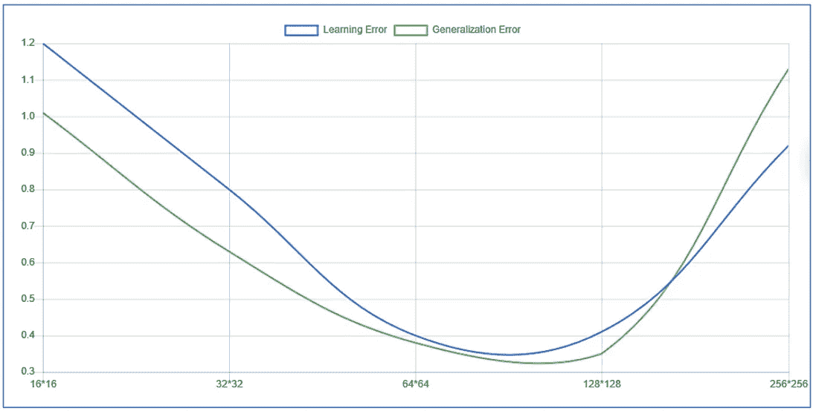

# 基于 CNN 的恶意软件检测(python 和 TensorFlow)

> 原文：<https://medium.com/analytics-vidhya/cnn-based-malware-detection-python-and-tensorflow-717f8de84ee?source=collection_archive---------4----------------------->

卷积神经网络(CNN)专门处理图像等多维数据。CNN 模型通常用于处理二维矩阵(图像)或音频频谱图。它们也经常用于三维数据(视频和体积图像)。CNN 的体系结构由三种类型的层组成:卷积层、汇集层和分类层。

卷积网络(CNN)训练中最重要的运算是卷积[Goodfellow et al .，2016]。后者将滤波器应用于由矩阵表示的图像。应用滤镜会生成一组传递到池层的小图像。这个序列可以在整个网络中重复几次，直到它到达平坦层，在那里携带抽象特征的向量将传递到密集层。过滤器可以通过三种方式初始化:

*   **手动:**例如，为了识别脸部，我们使用眼睛过滤器、嘴巴过滤器……这些过滤器很容易手动初始化，因为脸部的形状是已知的。
*   **随机:**当我们面对难以描述的抽象图像或物体时，我们会被迫使用随机初始化的滤镜。
*   **预训练:**过滤器的预训练是在图像的一部分上完成的，例如，如果我们想要得到一个眼睛的过滤器，我们就建立一个在只包含眼睛的图像上学习的网络。

# EXE 文件到图像

已经有许多作品使用 CNN 模型来分析一个 EXE 文件并检测恶意软件。我们在之前的一篇文章([https://medium . com/analytics-vid hya/malware-detection-with-deep-learning-state-of-art-177 c 81 aa 83 ea](/analytics-vidhya/malware-detection-with-deep-learning-state-of-the-art-177c81aa83ea))中强调了这些作品以及其他作品。

在这篇文章中，我们将探索一个可执行文件的原始字节，以创建一个可执行文件的形象。可执行文件的字节流将被放置在一个数组中，然后将其转换为图像，如[Le et al .，2018]中所示。例如，字节序列:E4 C0 56 A3 D2 78 56 A3 FF，可以用下面的矩阵表示:

字节序列的灰度图像

先前的矩阵将被转换成灰度图像，其中矩阵的每个方框将是图像中的一个像素(灰度等级在 0 和 255 之间)

良性文件的图像 128*128

恶意软件图像 128*128

让我们做一些编码和实现这第一部分。

这就是如何将一个 EXE 文件转换成一组大小为 h*w 的图像

# 创建 CNN

现在我们来设计一个卷积神经网络来分析图像并预测文件的恶意性。当谈到 CNN 的设计时，有很多参数可以考虑:图像大小、内核大小、内核数量、层数…

## 层数

我们做了一个小实验，改变包括层数在内的所有参数，并预测每个层数的平均值。下面的图给出了由从 1 到 5 的特定层数的每个神经网络实现的最小学习误差。

学习误差和泛化误差随隐含层数的变化

## 过滤器数量

我们做了与上一次类似的体验，结果显示在下图中。我们注意到，我们没有改变过滤器的尺寸，我们采用了通常使用的尺寸(5*5)和(3*3)，尽管这不是一个规则。

每个数量的滤波器的学习误差和泛化误差的变化

## 图像尺寸

图像的大小是另一个参数，虽然在实践中什么效果最好并不明显，但我们已经排除了一些选择。选择大的尺寸会使学习变得困难，因为 CNN 的输入层会很大，因此我们需要更多的隐藏层，这将导致内存短缺或长时间的计算。此外，选择大尺寸会导致小 EXE 的问题，甚至不能填充一个图像。另一方面，选择小尺寸将覆盖大多数 EXE 文件，但它会破坏 EXE 文件内的一些地方，因为我们将把一个 EXE 文件分解成多个单独的图像。总之，我们尝试了不同的维度，给你。

按图像大小的误差(懒人标题对吗？)

## CNN 的体系结构

从前面的部分我们结合最佳参数来设计我们的 CNN: 2 个隐藏层，16 个过滤器和 64*64 的图像。

网络的架构将会是这样的。请注意，卷积层可以由多个 conv2d 层组成，后跟池层，也可能会被删除。在本例中，我们将多个 conv2d 层分为两个卷积层。展平图层用于将输出转换为一个长矢量，然后通过分类图层进行处理。

## 说够了，让我们做一些编码。

首先，我们做一些整形，我们把图像转换成灰度，并导入必要的模块。

之后，我们实施架构:

cnn 的代码

# 最后

如果您有一组来自两种类型(良性和恶意)的可执行文件，您可以尝试适应这个模型。你只需要准备一个恶意软件的图片列表和一个良性的图片列表，然后你就可以在这里建立模型了。

## 更新

你可以在这个[GitHub repo](https://github.com/islem-esi/DeepMalwareDetector):【https://github.com/islem-esi/DeepMalwareDetector 上找到训练好的模型和 WebUI