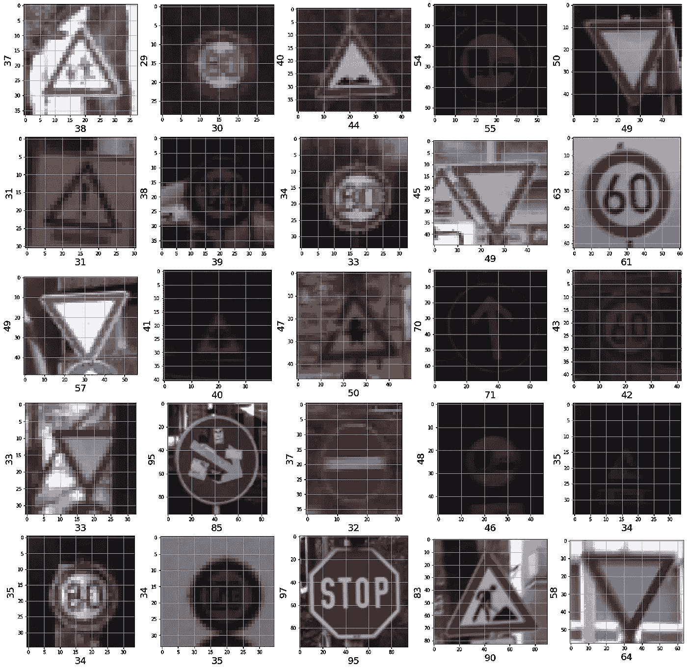
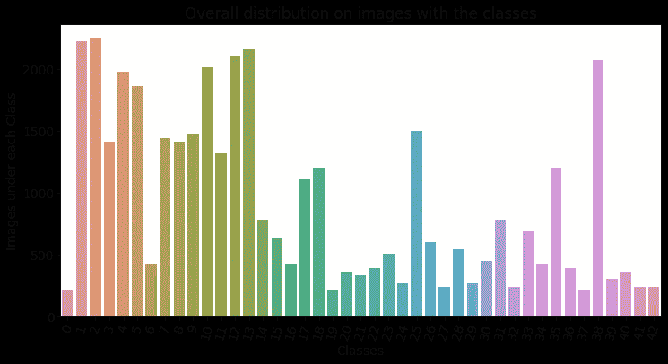
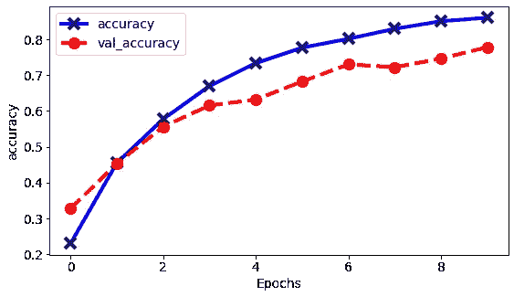
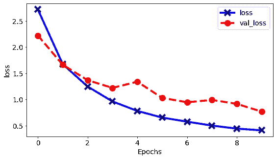
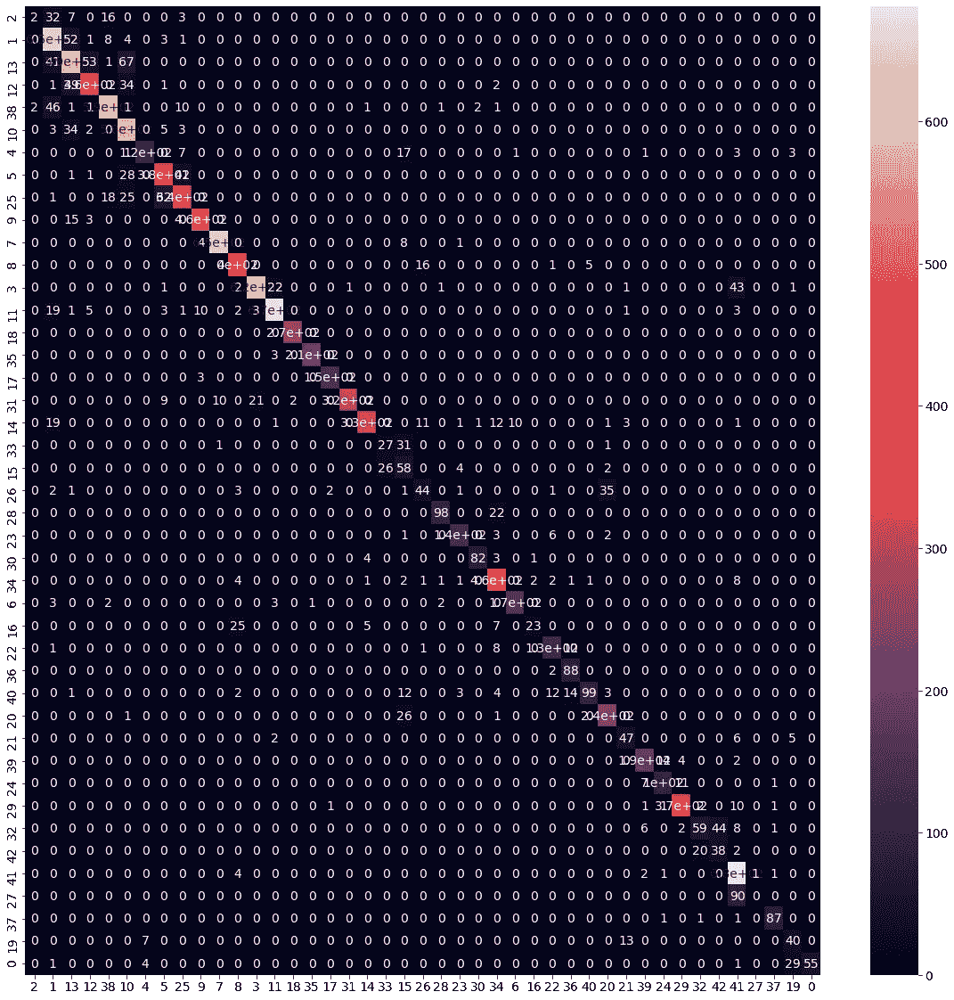
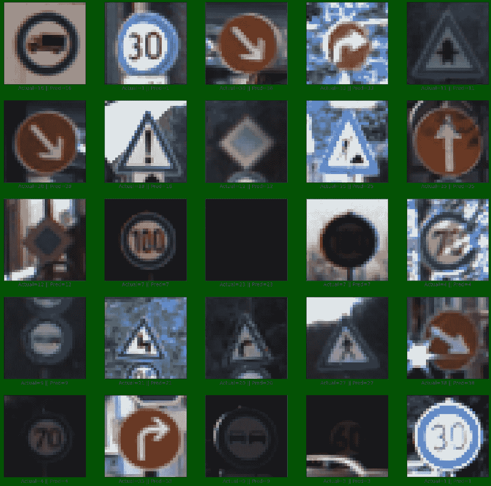

# 使用 TensorFlow 面向初学者的深度学习

> 原文：<https://medium.com/analytics-vidhya/cnn-german-traffic-signal-recognition-benchmarking-using-tensorflow-accuracy-80-d069b7996082?source=collection_archive---------0----------------------->

## 在 GTSRB 数据集上构建 CNN 模型(acc > 80%)

Brodie Vissers 在 burst 上拍摄的照片

**深度学习**也被称为**深度神经学习**或**深度神经网络**。机器学习的这一分支随着技术的进步而进化和发展。
tensor flow 就是这样一个实现深度学习的平台。让我们简单讨论一下张量流。

1.  **什么是 Tensorflow？** TensorFlow 是机器学习的端到端开源平台。它有一个全面、灵活的工具、库和社区资源的生态系统，让研究人员推动 ML 的最新发展，让开发人员轻松构建和部署 ML 驱动的应用程序。
2.  **什么是 CNN 模型？**
    **卷积神经网络(ConvNet/CNN)** 是一种深度学习算法，它可以接受输入图像，为图像中的各个方面/对象分配重要性(可学习的权重和偏差)，并能够区分它们。与其他分类算法相比，ConvNet/CNN 中所需的预处理要低得多。因此，CNN 是处理图像的最优选算法

# 关于数据集

德国交通标志识别**数据集** ( **GTSRB** )是一个图像分类**数据集**。这些图像是交通标志的照片。这些图像被分为 43 类。训练集包含 39209 个标记图像，测试集包含 12630 个图像。测试集的标签没有发布。

# 目录

1.  [简介](#01aa)
2.  [数据预处理](#9664)
    2.1 [加载所需库](#7439)
    2.2 [获取数据](#8fc4)
3.  [探索 GTRSB 数据集](#13b8)
    3.1 [训练和测试数据集包含多少幅图像？](#c800)
    3.2 [数据集包含多少个输出类？](#66b2)
    3.3 [来自数据集的图像张量的形状是什么？](#9707)
    3.4 [让我们打印一个样本图像连同它的类？](#9e24)
    3.5 [确定训练集中属于类别的图像数量？](#1410)
4.  [设置 CNN 模型](#482e)
    4.1 [设置 imagedata generators](#fcab)
    4.2[配置张量流生成器](#74da)
    4.3 [构建 CNN 模型](#d4fd)
5.  [训练模型](#bdf4)
    5.1 [模型训练及结果分析](#1e96)
    5.2 [对测试数据运行模型](#cc90)
    5.3 [准确率评分](#50c9)
    5.4 [混淆矩阵](#b75c)
    5.5 [分类报告](#8857)
6.  [在测试图像数据集上测试模型](#8c33)
7.  [总结](#51ef)
8.  [未来工作](#6dd7)
9.  [参考文献](#aa71)

# №1:简介

德国交通标志基准是在 2011 年国际神经网络联合会议(IJCNN)上举行的多类别、单图像分类挑战赛。以下是数据集的详细信息

1.  单幅图像多类分类问题
2.  40 多节课
3.  总共超过 50，000 张图片
4.  大型逼真的数据库

# №2:数据预处理

## 加载所需的库

我一次性加载了所有的 TensorFlow 和可视化库。

## 检索数据

我使用库`opendatasets`从 [Kaggle](https://www.kaggle.com/meowmeowmeowmeowmeow/gtsrb-german-traffic-sign) 下载数据。

我用熊猫数据框阅读了所有下载的文件。

我现在从每个数据帧中访问样本记录。

# №3:探索 GTRSB 数据集

## 问:训练和测试数据集包含多少幅图像？

## 问:数据集包含多少个输出类？

## 问:数据集中图像的形状是什么？

很明显，数据集中的所有图像都具有不同的大小。

## 问:让我们打印一个样本图像和它的类。

## 问:确定属于训练集中每个类别的图像数量？

观察到少数类别似乎具有高数量的图像(如类别 2，3..等等。)其中只有很少的类别具有非常低的图像数量(如 19、24…等)

# №4:设置 CNN 模型

## 设置图像数据生成器

在 TensorFlow 中，数据扩充是使用 ImageDataGenerator 类完成的。它非常容易理解和使用。整个数据集在每个历元中循环，数据集中的图像根据所选的选项和值进行变换。

# 配置张量流生成器

使用训练生成器的想法是在训练过程中即时获得成批的输入和相应的输出，例如读入 32 个图像，获得相应的 32 个标签向量，然后将该集合馈送到 gpu 进行训练步骤。

来自目录的流期望每个类中的图像在一个独立的目录中。这是我们从一开始就有的。

## 构建 CNN 模型

我使用 keras 包装器将各层链接在一起。

# №5:训练模型

## 模型训练和结果分析

达到了 85%的准确度。即使在训练模型几个时期后，精度不会提高，但我们可能会结束模型的过度拟合。让我们看看我们的模型在测试数据集上的表现。

注意——我们的模型从未见过测试图像，因此看到预测会很有趣。

## 根据测试数据运行模型

由于测试图像没有被分类到各自的类中，我们将把包含所有测试图像的文件夹名作为“test”传递到“classes”参数中

现在，我编写一个代码块，将预测映射到相应的图像

## 准确度分数

我根据实际标签计算预测类的准确性。为此，我利用了 sklearn 库

这太棒了，我们现在已经在测试集上达到了 87%的准确率。

## 混淆矩阵

混淆矩阵是一个表格，通常用于**描述分类模型**(或“分类器”)对一组真实值已知的测试数据的性能。

## 分类报告

**分类得分**是算法正在使用(或用户已经设置)的任何**得分**或度量，用于计算**分类**的性能。根据经验，F1 的加权平均值应该用于比较分类器模型，而不是全局精度。当前模型展示的得分是 87%🆒

# №6:使用单个图像进行测试

让我们随机检查预测值和实际值以及图像。

# №7:摘要

下面是我们遵循的一步一步过程的简要总结

1.  我们简要了解了 TensorFlow，以及为什么 CNN 架构是图像数据集的首选。
2.  我们从 Kaggle 下载了数据集，并使用 Pandas 访问它。
3.  我们研究了 GTRSB 数据集，了解了每个类拥有的全部图像、训练集中的全部图像、显示的样本图像等。
4.  我们设置了 CNN 模型，并学习了如何使用 ImageDataGenerators，配置测试和训练生成器，以及使用 **Tensorflow** 和 **Keras** 构建深度神经网络的连接层。
5.  我们对 CNN 模型进行了训练，达到了约 85% 的**准确率。我们还分析了在训练时间间隔数时的准确度和值准确度的变化。我们记下了我们的结论。**
6.  我们通过在几个测试样本上运行来随机检查模型性能

# №8:未来的工作

1.  尝试神经网络中不同层的组合，以进一步提高准确性。
2.  尝试在 PyTorch 上构建神经网络，看看是否可以达到类似的精度。
3.  尝试实现不同 CNN 架构，如
    -LeNet-5
    -Alex net
    -Google LeNet
    -VGGNet
    -ResNet

# №9:引用

1.  完整的笔记本可以在这里访问[https://github . com/hargurjeet/deep learning/blob/main/gt rsb % 20-% 20 CNN % 20(tensor flow)。ipynb](https://github.com/hargurjeet/DeepLearning/blob/main/GTRSB%20-%20CNN%20(TensorFlow).ipynb)
2.  [https://www.tensorflow.org/tutorials/keras/classification](https://www.tensorflow.org/tutorials/keras/classification)
3.  [https://www . ka ggle . com/meowmeowmeowmeowmeow/gt SRB-german-traffic-sign](https://www.kaggle.com/meowmeowmeowmeowmeow/gtsrb-german-traffic-sign)
4.  [https://www . coursera . org/professional-certificates/tensor flow-in-practice](https://www.coursera.org/professional-certificates/tensorflow-in-practice)

我真的希望你们能从这篇文章中学到一些东西。请随意给一个👏如果你喜欢你所学的。这让我保持动力。