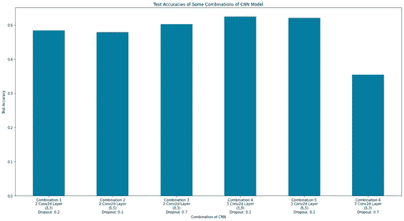
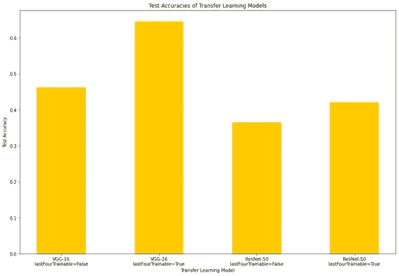
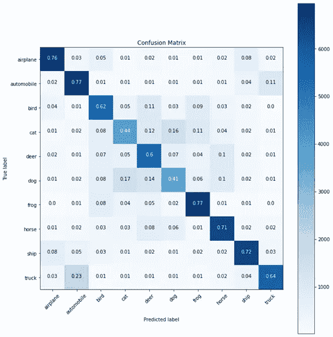
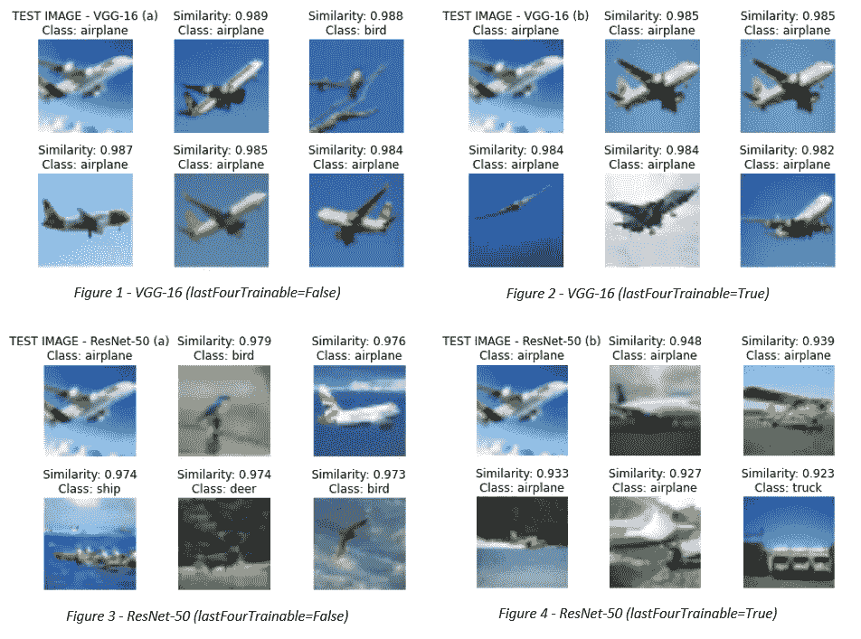

# CNN，用 VGG-16 和 ResNet-50 进行迁移学习，用 Keras 进行图像检索的特征提取

> 原文：<https://medium.com/analytics-vidhya/cnn-transfer-learning-with-vgg-16-and-resnet-50-feature-extraction-for-image-retrieval-with-keras-53320c580853?source=collection_archive---------1----------------------->

在本文中，我们将首先讨论如何实现一个简单的卷积神经网络模型。然后我们要用 VGG-16 和 ResNet-50 实现迁移学习模型。最后，我们将从这些用于图像检索的迁移学习模型中提取特征。我们将使用 [*CINIC-10*](https://www.kaggle.com/mengcius/cinic10) *数据集训练模型，并使用 Keras 库实现和训练每个模型。*

# 导入必要的库并**使用 ImageDataGenerator** 获取数据集

首先，我们应该导入必要的库，并用如下代码所示的 ImageDataGenerator 获取数据集。在使用 ImageDataGenerator 时，我们应该给出训练、验证和测试数据集目录作为参数。我们在每个数据集中有 90000 幅图像，在 CINIC-10 数据集中有 10 个类。所以我们选择*分类*作为 class_mode *。*对于训练模型，我们的批次大小为 64，时期数为 10。所有图像的输入形状是(224，224，3)，我们用 *rescale=1 来归一化所有图像。/255 作为 ImageDataGenerator 的*参数。

使用 ImageDataGenerator 获取数据集

# **用 Keras 实现 CNN 模型**

我们可以简单地用下面的函数实现一个卷积神经网络模型。该函数有一些参数:

*   **层数:**模型中 Conv2d 的层数
*   **过滤器数量:**Conv2d 层数
*   **filter _ size:**Conv2d 图层的滤镜大小
*   **初始化器:**内核 _ 层的初始化器
*   **激活 _ 功能:**层的激活功能
*   **脱层:**脱层
*   **opt:** 层的优化器

实现一个简单的 CNN 模型

使用上述函数创建 CNN 模型，在训练模型之后，对于一些超参数组合，有*测试准确度*结果。我们可以在下面的柱状图中看到 10 个时期的结果。

不同 CNN 模型的测试精度

通过上面的柱状图，我们可以对超参数进行一些概括

*   我们可以说，如果我们选择(3，3)滤波器大小而不是(5，5)滤波器大小，我们可以获得更好的结果。因为如果我们使用(3，3)滤波器大小，我们需要做更多的卷积计算。
*   我们还可以看到，辍学效应可以根据其价值变化。因此，我们应该尝试我们的模型的压差值，并选择最好的一个。
*   我们可以说，如果我们的模型中有 3 个卷积层，我们可以获得比有 2 个卷积层的模型更好的结果。

# **用 VGG-16 和 ResNet-50 转移学习**

对于 VGG-16 和 ResNet-50 的迁移学习，我们可以使用以下函数。在这个函数中，我们将创建没有最后分类层的模型，并添加我们的具有 1024 个神经元的全连接层。

这个函数中有一个参数是*lastfourtrainiable*。如果函数的这个参数为*假*；那么只有最后一层完全连接的模型是可训练的。但是如果这个参数*为真*；然后有参数的最后四层模型将是可训练的。

用 VGG-16 和 ResNet-50 迁移学习

利用上述函数建立 VGG-16 和雷斯网-50 的迁移学习模型，对这些模型的 4 个组合有*测试精度*结果。我们可以在下面的柱状图中看到 10 个时期的结果。

不同迁移学习模型的测试准确性

我们可以看到，与其他迁移学习模型相比，使用*lastfourtrainiable = True*的 VGG-16 迁移学习模型给我们带来了最好的结果。我们也可以说，如果我们增加可训练层的数量，我们可以在所有模型中获得更好的结果。

我们也可以在下面看到我们的最佳迁移学习模型的混淆矩阵。

VGG-16 迁移学习模型的混淆矩阵(最后四层是可训练的)

# **使用迁移学习模型进行特征提取的图像检索**

深度学习模型中的特征提取可用于图像检索。我们将从我们在上一节中训练的 VGG-16 和 ResNet-50 迁移学习模型中提取特征。因此，我们现在有 4 个模型权重，我们将使用它们进行特征提取。

为了提取特征，我们将在模型的分类层之前使用输出。例如 VGG-16 型；

*   我们将首先从保存的文件中获取模型的权重。
*   然后得到该模型分类层前的输出权重。
*   模型准备就绪后，我们将获取训练和验证数据集的特征向量作为数据帧，并将其保存为 pickle 文件。
*   现在，我们为图像检索做好了准备。在本节中，我们将给出一个图像，并将其特征向量与所有特征向量进行比较。然后，我们将得到这个图像的前 5 个相似的图像。

我们可以在下面的中看到特征提取的代码。

基于特征提取的图像检索

在上面的代码中有一些函数:

**getFeatureVector(model，img_path):** 该函数将使用给定的模型找到给定 img_path 的特征向量，并返回该特征向量。

**getCosineSimilarity(model，img_path):** 该函数将找到给定的 A 和 B 特征向量之间的余弦相似度。

**getFeatureDataFrame(model):**该函数首先用 Pandas 库创建一个数据帧，该数据帧有“文件”和“特征”两列。然后，我们将找到训练和验证数据集的所有特征向量，并将这些特征向量作为数据帧返回。

**getSimilarImages(img_file，features_df，model，model_name):** 该函数将获取给定图像的特征向量，并将该特征向量与 DataFrame 中的所有特征向量进行比较，并绘制前 5 幅相似图像。

现在，是时候看看使用特征提取进行图像检索的结果了！

图像检索结果为给定的飞机图像与 4 个不同的模型

从上表可以看出，VGG-16 模型比 ResNet-50 模型更适合图像检索。此外，我们可以说，如果我们在每个模型中增加可训练层，我们可以获得更好的结果。

# **总结**

在本文中，我们首先学习了如何实现一个简单的 CNN 模型，以及超参数如何改变 CNN 模型的精度。

第二部分，我们得到了 VGG-16 迁移学习模型和 ResNet 模型的测试精度结果。根据这些结果，我们可以说 VGG-16 模型可以胜过雷斯网-50 模型。

最后，我们看到，VGG-16 模型可以优于 ResNet-50 模型的图像检索。

你可以在 [GitHub](https://github.com/frhtas/cnn-imageretrieval) 库中看到所有代码。