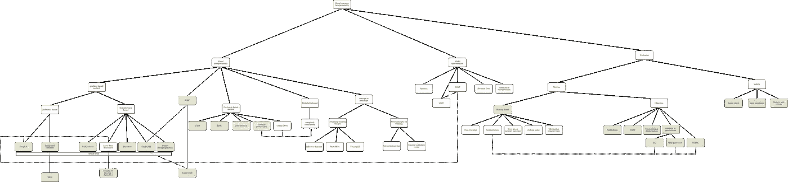
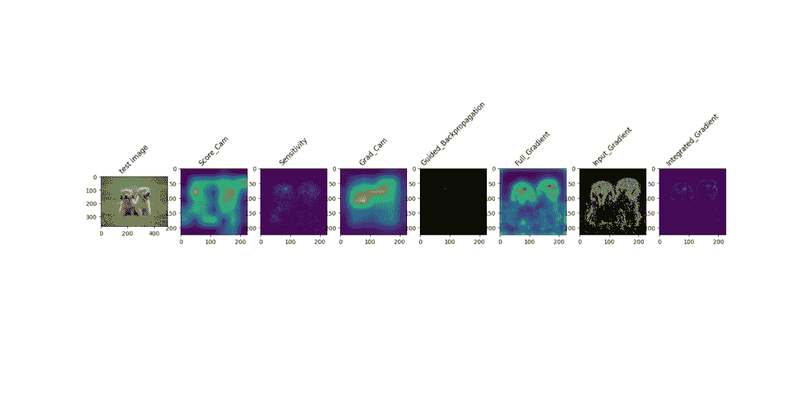

# CNN 的可解释论文评论

> 原文：<https://medium.com/analytics-vidhya/cnns-explainability-papers-review-5ed380577c64?source=collection_archive---------4----------------------->

可解释的 IA 字段

# 1 导言

近年来，深度神经网络的使用显著增加。这可能是由于 cpu 和 gpu 计算能力的提高，使得 DNNs 在大多数领域，特别是在图像分类领域取得了最先进的结果。不幸的是，DNNs 的不透明性使得它们难以解释，因此它们在军事或医学等关键领域没有被广泛采用。在过去的几年里，很多研究都集中在试图理解 DNNs 是如何工作的，以及如何使它们不那么模糊，以增加用户的信任。这个被称为 XAI(可解释的人工智能)的新领域涵盖了广泛的不同技术。有了这个参考书目，我们的目标是涵盖现有的解释复杂模型的不同策略。我们在这里的目标是快速浏览现有内容，重点是 CNN。首先，我们描述了用一个更简单的模型(通常是线性模型)局部逼近一个复杂模型的所有技术。然后，我们描述了解释模型行为的所有技术，要么通过显著图将测试项目与数据库元素进行比较。最后，我们将展示使用了哪些方法来验证或比较这些显著性图。

# 2 用更简单的模型近似

现存的最简单的模型是线性模型。基于这一假设，Ribeiro，Singh 和 Guestrin (2016:37)提出了 LIME，这是一个模型不可知的框架，通过线性模型在局部逼近您的模型。此线性模型的输入是您的要素，权重可视为每个要素对复杂模型输出的贡献。LIME 也处理图像，输入是超像素(像素组)。

2017 年，Lundberg 和 Lee (2017:21)提出了一个统一的理论，将 LIME 与另外两种可解释性技术(分层相关性和 DeepLift)联系起来。Lundberg 和 Lee 基于由 Lloyd Shapley 在 1951 年首先引入的博弈理论，证明了在一定条件下，每个特征问题的贡献分布存在最优解，该最优解可以根据模型精确或近似地计算。

2018 年，Ribeiro，Singh 和 Guestrin 推出了一个名为 Anchors (2018:27)的 LIME 改进版本，该版本通过使用局部区域而不是线性分隔符来克服其前任的一些限制。

即使这三个框架是最广为人知的，该领域仍有研究，如 Frosst 和 Hinton(2017:11)的工作，他们训练决策树来模拟深度神经网络决策，并能够使其性能优于经典决策树，但不如 DNN，同时更具可解释性。

# 3 视觉可解释性

在本节中，我们将讨论直接使用模型或信息技术输入的方法，以区分图像的哪一部分对预测贡献最大。我们现在将特别关注使用 CNN 的图像分类。以下所有方法都是事后的，这意味着它们可以应用于经过训练的神经网络，而无需修改或重新训练。在继续之前，定义什么是显著图是很重要的。显著图是输入图像的每个像素的重要性的视觉属性。它通常采用热图或掩膜的形式，突出显示输入图像中与模型最相关的区域，以便进行预测。

# 3.1 基于反向传播

给定输入图像 I 和类别 c 的分数 Sc，获得显著性图的最简单方法是对 Sc w.r.t I 求导，这是 Symonyan 等人首先描述的(2013:33)。这种方法的一个缺点是获得的显著图是有噪声的，并且突出了正面和负面的贡献。为了改善结果，引入了另外两种方法，由斯普林根伯格(2014:34)引导的反向传播和由泽勒和弗格斯(2013:39)引导的去卷积，它们修改校正的线性单位梯度(ReLu)以消除负贡献。

在 2015 年，周等人(2015:40)用最后一个完全连接层的参数加权的最后一个卷积层学习的特征的线性组合解释了 CNN 的输出。调整大小后，CAM 允许查看哪些高级特征对输出的影响最大。一年后，Selvaraju 等人(2016:31)提出了该方法的更一般化版本(Grad-CAM)。Grad-CAM 对分数 Sc w.r.t 特征图进行求导，因此 CNN 不再需要以 conv2D-完全连接的层结束。

最近，梁等人(2020:20)修改了训练损失，并在最后一个卷积层后添加了一个门矩阵，以迫使模型为每一类学习单独的滤波器。这似乎提高了凸轮定位的能力，当应用后。然而，所有这些方法都没有考虑偏差项，因此[35]引入了 FullGrad 可视化，即输入乘以梯度加上每层偏差的导数。

尽管如此，基于梯度的方法面临饱和效应(由 Shrikumar 等人(2017:32)解释)，即使输入被修改，这也可能导致零梯度。因此，Grad-CAM 和 CAM 已被王等人改进(2020:38)。它不再使用渐变并生成更清晰的贴图。为此，它计算最后一个卷积层的线性组合，该卷积层由当输入图像被特征映射掩盖时获得的分数加权。

Shrikumar 等人(2017:32)介绍了 DeepLift，它通过改变反向传播规则来解决饱和和不连续梯度问题，实际上，它将它们对“与参考的差异”的贡献分配到每个层，因此需要应用参考(图像)。

以不同的方式，综合梯度解决了相同的问题(Sundararajan 等人(2017:42))，通过沿图像和参考之间的插值创建的路径对图像计算梯度的平均值。基准电压源的选择对于基于基准电压源的方法的成功至关重要。最常用的参考是模糊、高斯和均匀参考，但也可以设想其他参考，以便更具体地执行任务。

Kapishnikov 等人(2019:16)表明，也可以一起使用几个参考文献来改进结果。他们还引入了 XRAI，这是一种在应用集成梯度之前对输入图像进行过度分割的算法，目的是产生更少噪声和更有意义的显著区域。

类似地，由 Bach 等人(2015:4)开发的 DeepLift 逐层相关性传播或 LRP 定义了新的反向传播规则，该规则是希望属性特征相关性的方法应该遵守的有效规则，例如全局守恒属性(所有相关性的总和应该等于输出)。这些规则试图根据神经元的激活程度和它们之间的联系强度，按比例将相关性从一个神经元分配到另一个神经元。已经定义了几个 LRP 规则来服务于不同的目的(ε-规则想要仅传播最强的相关性，而例如γ-规则想要仅传播正相关性……)，Montavon 等人(2019:24)提出了所有存在的规则的概述。

Montavon 等人(2019:23)表明，LRP 可以被视为每个神经元处的局部深度泰勒分解。它还定义了一种有效的方法来实现 LRP/泰勒分解方法，方法是将梯度乘以输入图像与根图像之间的差值，根图像是通过掩蔽(使用尽可能最小的掩膜)输入图像来最小化模型的输出得分而获得的。

有趣的是，Kindermans (2018:18)表明，即使在线性情况下，如果输入有干扰物(噪声),那么仅分析权重不会给出关于输入的“方向”的任何信息，因此除了所有源自 LRP 的方法之外，所有先前的方法都是无效的。因此，在反向传递过程中，将模型的权重乘以信息梯度的方向所获得的模式属性方法应该产生更有效的属性图。

最后，Srinivas 和 Fleuret (2019:35) (SmoothGrad)表明，通过将随机噪声添加到我们想要解释的图像时获得的显著图进行平均，或者通过在训练期间将随机噪声添加到图像，可以获得更清晰的显著图。

产生的解释的一些例子

# 3.2 输入遮挡

找到图像显著区域的另一种方法是扰动输入并分析输出的变化。这是以下方法的主要思想。

Fong 和 Vedaldi (2017:9)通过试图找到使输出分数低于某个阈值的最小扰动区域来做到这一点。作者表明，该方法比 Grad-Cam 和其他基于梯度的方法产生更小和更精确的显著区域。

Fong、Patrick 和 Vedaldi 通过将遮挡遮罩约束为来自平滑遮罩的预定空间，并将大小约束为输入图像大小的一部分，改进了先前定义的优化问题。这些简化也加快了过程，这很重要，因为这些方法的缺点之一是执行时间(对于我们想要解释的每个预测，都需要解决一个优化问题)。

为了加速该过程，提出了另外两种算法:

*   Vitali Petsiuk、Das 和 Saenko (2018:25)建议将输入图像与随机掩码相乘几次，并对预测得分乘以掩码进行加权求和，以获得热图。
*   Dabkowski 和 Gal (2017:8)并行使用 U 形网在单次向前传递中产生掩模。

然而，所有基于掩模的方法增加了无信息像素，因此修改了数据分布。

Zintgraf 等人(2017:41)引入了一种更严格的方法，将遮挡问题理论化为输出相对于输入要素的概率边缘化。它改进了 Robnik-Sikonja 和 Kononenko (2008:28)提出的理论，通过在感兴趣特征的邻域中对特征进行采样来改进条件概率的近似性。

然后，Chang 等人(2018:6)对该方法进行了改进，该方法使用预训练的 GAN 进行内涂，以便用数据分布后的点填充掩蔽区域。

# 3.3 基于概念

为了产生更易理解的结果，一些技术集中于突出用户先前已经引入的概念。

Bau 等人(2017:5)使用一个非常庞大和密集分割的概念数据集来可视化和量化模型每个单元所学习的概念。为了做到这一点，他们计算了他们的数据集的图像的每个部分的每个单元的激活。

在 2018 年，Kim(2018:17)引入了一个称为概念激活向量测试(TCAV)的框架，允许用户通过利用衍生方向的洞察力来检查概念是否被模型使用。

要做到这一点，用户只需要给出一些积极和消极的概念的例子。这两种方法都具有全局优势。

人们还表明，可以通过显示训练数据集的哪些图像导致了这样的预测来解释预测。例如，Pruthi 等人(2020:26)在训练步骤中保存损失函数的变化，以便在进行预测时将它们与损失进行比较。

类似地，Koh 和 Liang (2017:19)使用 hessian 矩阵分析了损耗变化中某一点的影响。这两种方法在内存或计算能力上似乎都很昂贵。

在 Chen 等人(2018:7)中，引入了一种新的卷积层。这一层应该添加到经典 CNN 的末尾，以便不仅能够产生更精确的显著图，而且能够从最能解释预测的训练数据库中提取图像块。

# 4 测量和有效性检查

利用所有这些方法来寻找输入中的显著区域，有必要具有某种度量，以便有效地验证该方法或评估它们。

Adebayo 等人引入了健全性检查(2018:1 ),每个显著图方法都应该遵守该检查以便有效。他们连续随机化层的权重，以查看显著性图是否真的依赖于模型的参数。他们还在训练过程中随机分配标签，并对模型行为进行类似的分析。他们的结论是，大多数众所周知的基于梯度的方法不能通过检查。

因为训练和测试分布应该是相似的，Hooker、Erhan、Kindermans 和 Brain (2020:13)提出了一种方法，其中在重新训练模型之前，从所有图像中移除由显著图方法定义为重要的特征。然后我们才分析了模型预测得分的演变。与 Adebayo 等人的文章相同，大多数基于梯度的方法显示出较差的结果。

Kindermans (2017:15)提交了一个新的公理，称为输入不变性，应该通过显著图方法进行验证。他们测试了几种方法，通过在输入中添加一个常数移位来比较两个等效(就行为而言)模型(它们的实现不同)，并注意到大多数方法的显著性图的差异。

使用了几个目标指标，例如:

*   AUC(曲线下面积)及其所有导数经常用于评估移除顶部特征(方法定义的相关特征)时模型精度的下降。
*   AUPR(精确召回下的区域)，以便评估不同技术返回的显著区域的定位(Arun (2020:3)，Ismail (2020:14))。
*   SSIM(结构相似性)，以便基于视觉感知而不是 Arun (2020:3)提出的像素方式来评估两个显著图之间的变化。
*   忠实度，这是一个度量标准，它采用了单点引起的输出变化与通过归因方法获得的相关性之间的皮尔逊相关性(Alvarez-Melis 和 Jaakkola(2018:2))。
*   稳健性，一种评估 Lipschitz 常数近似值评估方法的局部稳定性的指标(Alvarez-Melis 和 Jaakkola(2018:2))。
*   信息传递率的提高(Philipp Schmidt 和 Felix Biessmann (2019 :30))。

最后，Tomsett 等人(2020:36)研究了这些现有指标的有效性。它表明，在使用这些指标时保持谨慎是很重要的，因为它们似乎依赖于独立于模型的因素，如实验方案。

由于解释技术的主要目标是提高用户的信任度，因此许多实验都将显著图的评估基于与人类的比较，如 Mohseni (2018:22)。他们首先为每幅图像分割几个人的地面实况显著区域(为了更高的粒度)，然后将其与由可解释性方法输出的显著图进行比较。他们还概述了人类显著图评估中不同类型的偏差。还使用了其他类型的实验，如指向游戏等。

# 5 极限和反射

总之，即使这些方法很有前途，它们仍然有 Rudin (2018:29)强调的局限性，作者指出，可解释的模型应该优于 DNNs。

最后，Ghorbani、Abid 和 Zou (2018:12)表明，显著图对对抗性攻击也很敏感。

# 参考

[1]朱利叶斯·阿德巴约、贾斯汀·吉尔默、迈克尔·穆勒、伊恩·古德菲勒、莫里茨哈特和贝内金。显著图的健全性检查。S. Bengio、H. Wallach、H. Larochelle、K. Grauman、N. Cesa-Bianchi 和 R. Garnett 编辑,《神经信息处理系统进展》,第 31 卷。柯伦联合公司，2018。

[2]大卫·阿尔瓦雷斯-梅利斯和托米·s·亚科拉。论互可译性方法的稳健性. arXiv e-prints，第 arXiv 页:1806.08049，2018 年 6 月。

[3] Nishanth Arun、Nathan Gaw、Praveer Singh、、Mehak Aggarwal、Bryan Chen、Katharina Hoebel、Sharut Gupta、Jay Patel、Mishka Gidwani、Julius Adebayo、Matthew D. Li 和 Jayashree Kalpathy-Cramer。评估用于医学成像中异常定位的显著图的(不)可信度。

[4]巴赫、亚历山大·宾德、格雷瓜尔·蒙塔冯、f·克劳琛、k·m·̈uller,and·w·萨梅克通过逐层相关传播对非线性分类器决策的逐像素解释。PLoS ONE，2015 年第 10 期。

[5]戴维·鲍尔、·周、阿迪蒂亚·科斯拉、奥德·奥利瓦和安东尼奥·托拉尔巴。网络剖析:深度视觉表征的可解释性量化。计算机视觉与模式识别，2017。

[6]春-常昊、埃利奥特·克里奇尔、安娜·戈登堡和戴维·杜文瑙德。通过反事实生成解释图像分类器. arXiv e-prints，第 arXiv 页:1807.08024，2018 年 7 月。

[7]范超·陈、奥斯卡·李、阿丽娜·巴尼特、乔纳森·苏和辛西娅·鲁丁。这个看起来是这样的:可解释图像识别的深度学习，062018。

8 Piotr Dabkowski 和 Yarin Gal。黑盒分类器的实时图像显著性。在 I. Guyon、U. V. Luxburg、S. Bengio、H. Wallach、R. Fergus、S. Vishwanathan 和 R. Garnett 编辑的《神经信息处理系统的进展》第 30 卷中。柯伦联合公司，2017 年。

[9] R. C. Fong 和 A. Vedaldi。通过有意义的扰动对黑盒的可解释的解释。2017 年 IEEE 计算机视觉国际会议(ICCV)，第 3449–3457 页，2017。

10 Ruth Fong，Mandela Patrick 和 Andrea Vedaldi。通过极值扰动和平滑掩模理解深层网络。IEEE/CVF 计算机视觉国际会议(ICCV)正在进行中，2019 年 10 月。

11 尼古拉斯·弗罗斯特和杰弗里·辛顿。将神经网络提取为 aSoft 决策树. arXiv e-prints，第 arXiv 页:1711.09784，2017 年 11 月。

[12] Amirata Ghorbani、Abubakar Abid 和 James Zou。解读 neu-ral 网络脆弱，2018。

[13] Sara Hooker，Dumitru Erhan，Pieter-Jan Kindermans 和 Kim Brain。深度神经网络中可解释性方法的基准。01 2020.

[14] Aya Abdelsalam Ismail、Mohamed K. Gunady、H ector corra da Bravo 和 andSoheil Feizi。时间序列预测中深度学习可解释性的基准测试。澳大利亚统计局更正，2010.13924，2020。

[15]彼得·扬·金德曼斯、萨拉·胡克、朱利叶斯·阿德巴约、马克西米连·阿尔伯、克里斯托夫·施·̈utt、斯文·̈ahne、杜米特鲁·埃汉和贝内·金。显著方法的(不)可靠性。2017.

[16]安德烈·卡皮什尼科夫、托尔加·博卢克巴西、费尔南达·维希加斯和迈克尔特里。XRAI:通过区域实现更好的属性。arXiv 电子印刷，pagearXiv:1906.02825，2019 年 6 月。

[17] Been Kim、Martin Wattenberg、Justin Gilmer、Carrie Cai、James Wexler、Fernanda Viegas 和 Rory sayres。超越特征属性的可解释性:用概念激活向量进行定量测试(TCAV)。InJennifer Dy 和 Andreas Krause，编辑，第 35 届国际机器学习会议论文集，机器学习研究论文集第 80 卷，第 2668-2677 页，斯德哥尔摩̈assan，斯德哥尔摩瑞典，2018 年 7 月 10-15 日。PMLR。

[18]彼得-扬·金德曼斯、克里斯托夫·施·̈utt、马克西米连·阿尔伯、克劳斯-罗伯特 alber、杜米特鲁·埃汉、贝内·金和斯文·̈ahne.学习如何解释神经网络:模式网络和模式分布。2018 年国际学习表征会议。

[19]庞维高和佩西梁。通过影响函数理解黑盒预测。2017 年 8 月 6 日至 11 日，澳大利亚悉尼国际会议中心，编辑 Doina Precup 和 Yee Whye Teh，第 34 届机器学习国际会议论文集，机器学习研究论文集第 70 卷，第 1885-1894 页。PMLR。

[20]梁浩宇，欧阳志浩，，曾玉元，何子豪，，，舒.面向特定类别滤波器的可解释卷积神经网络训练，2020。

[21]斯科特·M·伦德伯格和李苏英。解释模型预测的统一方法。在 I. Guyon、U. V. Luxburg、S. Bengio、H. Wallach、R. Fergus、S. Vishwanathan 和 R. Garnett 编辑的《神经信息处理系统的进展》第 30 卷中。柯伦联合公司，2017 年。

[22]西纳·莫塞尼、杰里米·布洛克和埃里克·拉冈。以人为基础的机器学习本地解释评估基准. arXive-prints，第 arXiv 页:1801.05075，2018 年 1 月。

[23]埃戈里·蒙塔冯、塞巴斯蒂安·巴赫、亚历山大·宾德、沃伊切赫·萨梅克和克劳斯-罗伯特·̈uller.用深度泰勒分解解释非线性分类决策。arXiv 电子版，第 arXiv 页:1512.02479，2015 年 12 月。

[24]格雷瓜尔·蒙塔冯、亚历山大·宾德、塞巴斯蒂安·拉普什金、沃伊切赫萨梅克和克劳斯-罗伯特·̈uller.分层相关性传播:概述，第 193-209 页。施普林格国际出版公司，Cham，2019。

[25] Vitali Petsiuk、Abir Das 和 Kate Saenko。RISE:随机输入示例解释黑盒模型。arXiv 电子打印，pagearXiv:1806.07421，2018 年 6 月。

[26] Garima Pruthi、Frederick Liu、Satyen Kale 和 Mukund Sundararajan。通过追踪梯度下降估计训练数据影响。InNeurIPS，2020。

27 马尔科·图利奥·里贝罗、萨梅尔·辛格和卡洛斯·盖斯特林。锚:高精度模型不可知的解释。Sheila A. McIlraith 和 Kilian Q.Weinberger 编辑，第三十二届 AAAI 人工智能会议(AAAI-18)、第三十届人工智能创新应用(IAAI-18)和第八届 AAAI 人工智能教育进步研讨会(EAAI-18)，美国路易斯安那州新奥尔良，2018 年 2 月 2 日至 7 日，第 1527-1535 页。AAAI 出版社，2018。

[28]m . rob Nik-Sikonja 和 I. Kononenko。解释单个实例的分类。IEEE 知识与数据工程汇刊，20(5):589–600，2008。

29 辛西娅·鲁丁。停止解释高风险决策的黑盒机器学习模型，而是使用可解释的模型。

30 菲利普·施密特和费利克斯·比斯曼。量化机器学习系统中的可解释性和信任。arXiv 电子印刷品，第 arXiv 页:1901.08558，2019 年 1 月。

[31] Ramprasaath R. Selvaraju、Michael Cogswell、Abhishek Das、RamakrishnaVedantam、Devi Parikh 和 Dhruv Batra。Grad-CAM:通过基于梯度的定位从深度网络进行可视化解释。arXiv e-prints，arXiv 页:1610.02391，2016 年 10 月。

[32]两代情·什里库马尔、佩顿·格林塞德和安舒尔·昆达耶。通过传播激活差异学习重要特征. arXiv e-prints，第 arXiv 页:1704.02685，2017 年 4 月。

[33]卡伦·西蒙扬、安德里亚·维达尔迪和安德鲁·齐塞曼。深入内部卷积网络:可视化图像分类模型和语义图。arXiv 电子版，arXiv:1312.6034 页，2013 年 12 月。

[34] Jost Tobias Springenberg，Alexey Dosovitskiy，Thomas Brox 和 MartinRiedmiller。力求简单:全卷积网络，arXiv-prints，第 arXiv 页:1412.6806，2014 年 12 月。

[35] Suraj Srinivas 和 F. Fleuret。神经网络可视化的全梯度表示。InNeurIPS，2019。

[36]理查德·托姆塞特、丹·哈伯内、苏普利约·查克拉博蒂、普拉德维·古拉姆和阿伦·普里斯。显著性度量的健全性检查。AAAI 人工智能会议论文集，34:6021–6029，04 2020。

37 马尔科·图利奥·里贝罗、萨梅尔·辛格和卡洛斯·盖斯特林。“我为什么要相信你？”:解释任何分类器的预测. arXiv e-prints，第 arXiv 页:1602.04938，2016 年 2 月。

[38] H. Wang，Z. Wang，M. Du，F. Yang，Z. Zhang，S. Ding，P. Mardziel 和 x .胡。分数 cam:卷积神经网络的分数加权视觉解释。2020 年 IEEE/CVF 计算机视觉和模式识别研讨会(CVPRW)，第 111-119 页，2020 年。

39 马修·泽勒和罗布·弗格斯。可视化和理解会议网络。arXiv 电子版，第 arXiv 页:1311.2901，2013 年 11 月。

[40]雷勃·周、阿迪蒂亚·科斯拉、阿加塔·拉皮德里扎、奥德·奥利瓦和安东尼奥·托雷亚尔巴。学习区别性定位的深度特征. arXive-prints，第 arXiv 页:1512.04150，2015 年 12 月。

[41]路易莎·辛格拉夫、塔科·科恩、塔米姆·阿德尔和马克斯·韦林。VI-利用深度神经网络决策:预测差异分析. arXiv e-prints，第 arXiv 页:1702.04595，2017 年 2 月。