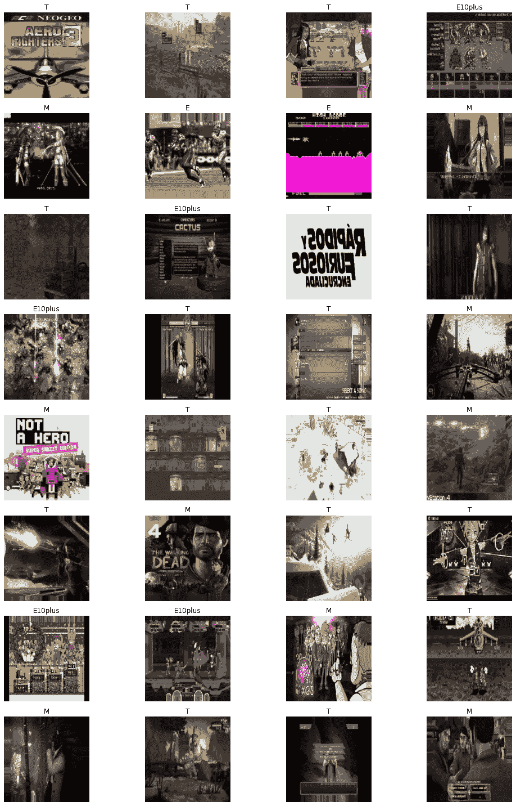
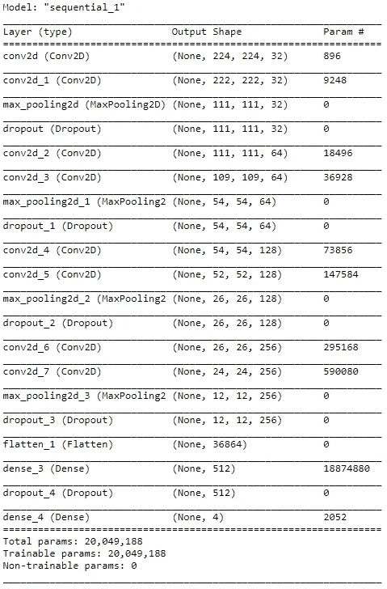
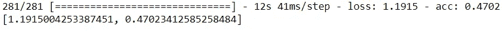
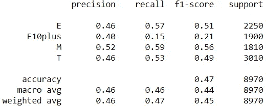

# 图像分类的细胞神经网络。2

> 原文：<https://medium.com/analytics-vidhya/cnns-for-image-classification-pt-2-cb44b5f19708?source=collection_archive---------6----------------------->

卷积神经网络是使用机器学习自动进行图像分类的伟大工具。在这个项目中，我使用 CNN 试图根据游戏图像来确定一个视频游戏的 ESRB 等级。为了开始训练模型，我需要大量的图像。这个过程在[第一部分](https://carlbcook.medium.com/cnns-for-image-classification-pt-1-fea2ed56a720)中有详细描述，所以如果你想快速浏览一下这个过程，就去读一读吧。

一旦图像被保存并分成训练集、验证集和测试集，就该为建模准备数据了。为此，我使用了 Keras 的 ImageDataGenerator。

如您所见，训练数据的生成器对随机图像进行了一些细微的修改，以帮助提高泛化能力。默认的批量大小是 32，这对我很有效，但是如果您遇到内存不足的问题，您可以降低批量大小，使您的机器更易于管理培训。这将增加每个纪元中的步数，但是因为每个步包含的例子较少，所以不会对你的训练时间有很大的影响。

可以使用 matplotlib 来窥视一批训练数据。

来自训练集的一批图像

看着这一批图像，我很难找到可靠的一目了然的方法来确定游戏的评级。下一步是组建一个 CNN，看看它能否找到对我来说不太明显的模式。

有几个预先训练好的 CNN 架构可供使用，但如果你想从头开始组装一个，并不太难。我建立的模型如下所示。

因为这是一个 4 级分类，模型的最后一个密集层有 4 个节点和“softmax”激活。我将学习率调了回来，因为我发现模型通常只预测一个具有默认学习率的班级。`model.summary()`方法显示了模型的架构。

模型架构

现在，我已经定义了我的卷积神经网络并对其进行了编译，是时候传入图像数据来训练它了。使用返回历史对象的`model.fit()`方法训练模型。`History.history`属性详述了模型在每个训练时期的进展，每个时期是训练数据的一次完整传递。

一旦模型完成了训练(这可能需要相当长的时间)，您可以使用`model.evaluate()`方法来查看模型在您的测试数据上表现如何。只需传入测试数据生成器，模型就会运行所有的测试图像，并向您显示您选择的指标。

该模型在训练集上达到了 47%的总体准确率。虽然这肯定不是一个令人印象深刻的数字，但这比随机猜测要好。然而，对于这个问题，我真正关注的是 M 级游戏的召回率。如果目标是标记成熟的内容，我想要一个能有效发现 M 级游戏的模型。

sklearn 分类报告

使用来自 sklearn 的分类报告，我可以看到这个模型在 M 级游戏上达到了 59%的召回率。这意味着该模型能够正确标记大多数 M 级游戏。它并不完美，肯定需要一些实验和调整，但是我们必须把它留到以后。

在“用于图像分类的 CNN”的下一次迭代中，我们将尝试不同的方法来解决这个问题，看看我们是否可以提高召回率。