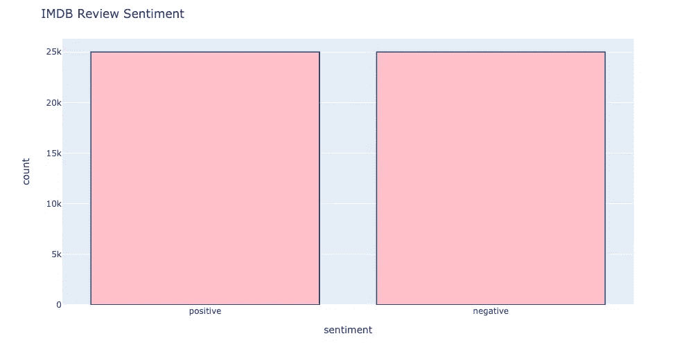

# 代码日记:情感分析(朴素贝叶斯)

> 原文：<https://medium.com/analytics-vidhya/code-diaries-sentiment-analysis-naive-bayes-827cda7c0808?source=collection_archive---------9----------------------->

当搜索我下一个最喜欢的素食餐馆时，谷歌评论是我上车前首先查看的地方。我的韩剧选择也是如此。在五颗星中，你认为这位用户对《迫降在你身上的 k 剧[](https://en.wikipedia.org/wiki/Crash_Landing_on_You)*的评价是多少？*

> *“毫无疑问，这是我见过的最好的 kdrama 之一。这是独一无二的，这部剧非常贴近我的心。”*
> 
> *-极光星云，谷歌评论*

**

*CLOY = **C** 皮疹 **L** 安定 **O** n **Y** ou*

*安娜索菲亚·罗伯的耻辱...这是五颗星，我完全同意；)*

**

> *好了，关于 CLOY，让我们继续另一个有趣的缩写:NLP！！！*

*作为我探索学习 NLP 的一部分，我编写了一个[项目](https://github.com/jadessechan/Sentiment-Analysis)，它使用朴素贝叶斯分类器来执行情感分析。与上面的 CLOY 评论类似，我根据来自 [imdb 数据集](https://www.kaggle.com/lakshmi25npathi/imdb-dataset-of-50k-movie-reviews)的电影评论训练了我的分类器。这是情绪分析最常见的例子之一，但其他用例包括预测选举结果和市场趋势。在为我的项目做准备时，我了解到情绪被归入**舍雷尔的情感状态类型学:***

***情绪**(如愤怒、悲伤、喜悦)*

*心情(例如，阴郁、愉快、沮丧)*

***人际姿态**(如友好、调情、疏远)*

***态度**(例如，喜欢、爱、恨)*

*个性特征(例如傲慢、鲁莽、自信)*

*对于 k-drama 评论，我们分析了用户的*态度*，因为它反映了对一个对象和/或人的倾向。同样，我的程序分析电影评论的态度来预测积极或消极的极性。*

*人类的语言充满了细微差别，这使得情感分析——以及一般的 NLP 充满了挑战。我在[上一篇关于崩溃开花的文章](https://medium.com/p/e3aa4d5325a2/edit)中提到了这一点。这些细微差别包括——但不限于——**微妙**和**受挫的期望**。例如，imdb 数据集中的一些电影评论是:*

```
*"The 33 percent of the nations nitwits that still support W. Bush would do well to see this movie, which shows the aftermath of the French Revolution and the terror of 1794 as strikingly similar to the post 9/11 socio-political landscape."*
```

*这篇评论节选是微妙的，因为没有多少关键词表明积极或消极的强烈两极分化。像这样的评论需要关于法国大革命和 911 的背景政治和历史知识。你不仅要训练你的情感极性分类器，还要训练公众情感。最终，imdb 数据集将该审查列为负面。*

```
*"This show was an **amazing**, **fresh** & **innovative** idea in the 70's when it first aired. The first 7 or 8 years were **brilliant**, but things dropped off after that. By 1990, the show was **not really funny** anymore and it [has] continued its **decline** further to the complete **waste of time** it is today."*
```

*乍一看，这篇评论似乎是积极的，因为它包括了一些积极的联想词:“惊人的”、“新鲜的”等。然而，当你进一步阅读时，真实的情感就会显露出来。这篇评论利用了电影制作的背景；90 年代。*

*幸运的是，imdb 数据集预先确定了每个评论的极性。我选择我的程序基于庞和李的**基线方法。**我将代码分为 4 个步骤，包括标记化、特征提取和分类。*

*但是，基线算法假设数据集中的类频率相等。大多数真实世界的场景并不适合这种场景，但我仍然决定遵循基线方法，因为我的项目的目的是获得情绪分析的入门实践。当处理不平衡的类频率时，会出现许多额外的计算，例如对训练数据进行重新采样、成本敏感学习以及获得 F 分数以准确训练分类器。*

*因此，为了检查我选择的数据集是否平衡，我执行了**探索性数据分析**，以获得每个数据集的摘要。*

****

*这里我们可以看到 imdb 数据集有相等的类频率！耶！我倾向于分析[财经新闻数据集](https://www.kaggle.com/ankurzing/sentiment-analysis-for-financial-news)，但是我会把它留到下一天；)在处理数据集之前，我会继续做 EDA，以确保我知道我在处理什么！*

*在朴素贝叶斯、最大熵和 SVM 分类器中，我选择了朴素贝叶斯，因为它适用于大型数据集(imdb 有 50，000 条评论)，并且像我这样的 NLP 新手很容易理解。*

***朴素贝叶斯**是一个线性分类器，它扩展了贝叶斯定理，假设所有数据点都是独立的。*

*线性分类器做出如下线性决策边界:*

**

*学分:[http://web . Stanford . edu/class/cs 224n/readings/cs 224n-2019-notes 02-word vecs 2 . pdf](http://web.stanford.edu/class/cs224n/readings/cs224n-2019-notes02-wordvecs2.pdf)*

*该模型的一个限制是，它可能会对一些数据点进行错误分类(注意红色空间中的绿点)，这与非线性决策边界不同:*

**

*学分:[http://web . Stanford . edu/class/cs 224n/readings/cs 224n-2019-notes 02-word vecs 2 . pdf](http://web.stanford.edu/class/cs224n/readings/cs224n-2019-notes02-wordvecs2.pdf)*

*下面是贝叶斯定理:*

**

*信用:[https://www . kdnugges . com/2020/06/naive-Bayes-algorithm-everything . html](https://www.kdnuggets.com/2020/06/naive-bayes-algorithm-everything.html)*

*最后，这是朴素贝叶斯算法:*

**

*鸣谢:[http://spark-public . S3 . Amazon AWS . com/NLP/slides/perspective . pdf](http://spark-public.s3.amazonaws.com/nlp/slides/sentiment.pdf)*

# *现在谈谈技术问题:*

```
*[https://github.com/jadessechan/Sentiment-Analysis](https://github.com/jadessechan/Sentiment-Analysis)*
```

*imdb 数据集是我第一次使用 csv 文件。我使用*熊猫库*将 csv 文件中的内容读取到数据帧中。因此，我也学会了如何访问数据帧中的元素。我之前的文本预测项目使用的是 txt 文件，所以我通过迭代来访问单词。这次我使用熊猫文档来了解*

```
*.loc(), .at(), .iloc(), .iat()*
```

*访问特定的元素。最终，我找到了**。at()** 最有用，因为我想访问单个元素，而不是用**访问行/列中的一系列元素。loc()***

**

*if 语句检查“情绪”列中每一行(索引)的元素是正数还是负数*

*最后但同样重要的是，我实现了带 add-1 平滑的朴素贝叶斯算法，以解决在训练集中看不到的单词。首先，我计算了测试数据中每一类(正或负)出现一个“令牌”的概率。然后我用这个概率除以班上的总单词数，并用班级人数平滑分母。Add-1 平滑确保了我不会得到一个没有出现在我的训练集中的单词的“零”值。*

**

*最终，程序会根据哪个类别的概率更大来预测一种情绪。这是我的朴素贝叶斯算法的最终结果和百分误差:*

**

*预测和实际是保存每个测试评审的分类决定(前者)和实际分类(后者)的列表*

**

*就是这样！未来的改进将是使用交叉验证进行培训。然而，使用 [pandas 的 **df.sample()**](https://pandas.pydata.org/docs/reference/api/pandas.DataFrame.sample.html) 非常方便，因为它每次运行都会选择一个随机的数据块。现在，我要休息一下，看下一部我最喜欢的韩剧《文森佐》😍*

*非常感谢你一直读到最后！编码快乐！*