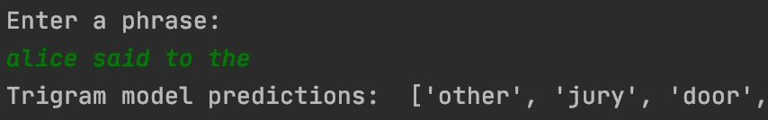
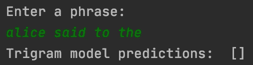
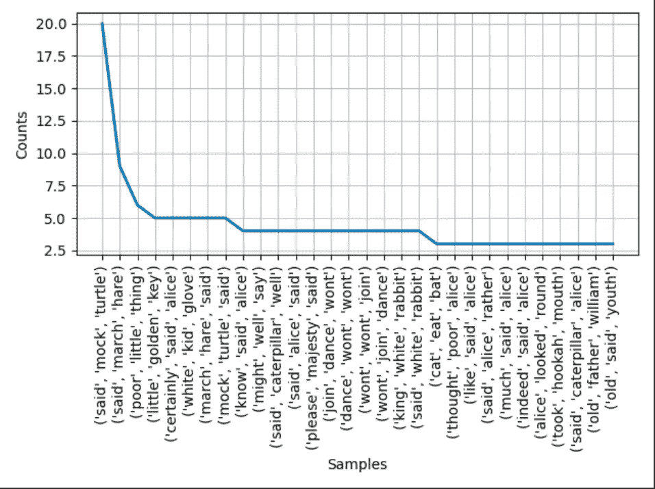
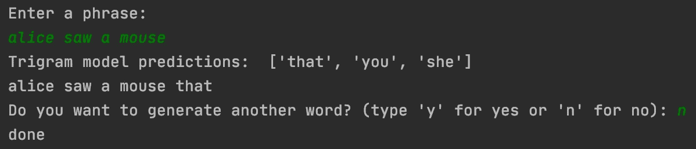

# 代码日记:文本预测(n-grams)

> 原文：<https://medium.com/analytics-vidhya/code-diaries-text-prediction-n-grams-e3aa4d5325a2?source=collection_archive---------2----------------------->

自然语言处理，也称为 NLP，是计算机科学的一个子领域，它允许计算机理解人类语言。当你发短信时，你会使用键盘上方的建议词吗？那要感谢 NLP！


[https://www.iphonefaq.org/archives/973893](https://www.iphonefaq.org/archives/973893)

NLP 无处不在:信息提取、情感分析、机器翻译(例如 Google translate)、垃圾邮件检测、自动填充和聊天机器人等等。

> 本文将简要介绍 NLP，并描述我使用 n-gram 语言模型构建文本预测程序的过程。

人类语言是不断进化的，有许多细微差别/歧义。

"那个女人用伞打了一个男人。"可以有两种解释:


感谢我的艺术技巧

上面的句子被称为**崩溃开花**，一个语义模糊的句子。使 NLP 变得困难的其他因素包括但不限于非标准英语，例如 Twitter 上的推文以及随着社交媒体发展起来的“unfriend”和“unfollow”等新词。

NLP 的基础是一个**语言模型**，它计算一个句子或单词序列的概率。

比如“猫在睡觉”这句话比“猫很友好”(至少在我看来)更容易出现。开个玩笑，再来一个:“猫在睡觉”或者“猫在跳舞”。我想我们大多数人都会同意这一点；)

这些句子的概率可以表示为:

> P("猫在*睡觉"* ) > P("猫在*跳舞*")

其中，基于我们的常识，句子“猫在睡觉”的概率 P 大于句子“猫在跳舞”。

这个相同的例子可以应用于制作一个 **n-gram 语言模型**，该模型预测来自训练语料库的 N 个标记(单词)序列的概率。

我用三元语法语言模型训练了我的文本预测程序。

```
[https://github.com/jadessechan/Text-Prediction.git](https://github.com/jadessechan/Text-Prediction.git)
```

我使用了**马尔可夫假设**，其中每个单词的出现基于前两个单词的出现(对于三元模型)。

Python 的 **re 库**是一个很好的工具，用于在训练语言模型之前对语料库进行正则表达式解析。

我如何使用 re 和 unicode 库预处理我的语料库

对文本进行预处理对于删除不必要的字符至关重要，比如数字、标点符号和大写字母。根据您的 NLP 任务，您可能需要删除停用词(例如，冠词“a”、“the”等)。NLTK 库有一个您可以使用的列表。但是，我没有删除我的语料库中的停用词，因为这将使文本预测输出更加连贯。



**左**:未删除停用词。**右:**停用词删除

现在文本可以进行标记化了！ **NLTK 库**提供了大量的函数来帮助各种 NLP 过程。在我的例子中，我使用 *ngrams()* 将我的文本分割成三元模型

```
trigrams = list(nltk.ngrams(text, 3, pad_left=True, pad_right=True, left_pad_symbol='<s>', right_pad_symbol='</s>'))
```

> pad_left 和 pad_right 标记一个句子的开始和结束。
> 
> **< s >** 我热爱计算机科学！**</s>**
> 
> 三元模型是一个句子的三个单词或记号的序列。
> 
> “~~我爱”，“计算机科学~~”

填充句子有助于表明某个单词出现在句子开头或结尾的可能性有多大。

当处理大型数据集时，比如《爱丽丝梦游仙境》语料库，我进行了**探索性数据分析，**这样我就可以总结出我的文本的主要特征。

关于语料库的 n 元语法信息

在这里，我使用 NLTK 的 *FreqDist()* 来获得我的三元模型的频率分布，并将它们可视化在一个线图上。然后我打印了前 5 个三元模型。



然而，虽然 NLTK 库非常有用，但是文档理解起来有点困难。我经常发现自己花更多的时间试图理解 NLTK，而不是编码。这发生在我使用 NLTK 的语言模型接口来寻找**最大似然估计**的时候，这实质上是寻找给定模型的概率分布。我最终做了一个条件频率分布，因为我理解 NLTK 用于实现它们的底层概念和数据结构。

计算前面有两个单词(w1 和 w2)的单词(w3)的概率

默认字典是 *ConditionaFreqDist()* 的底层数据结构，并计算共现和键值对的频率。它存储三元模型中前两个单词(w1，w2)之后的一个单词(w3)的计数。如果 w3 的计数不存在，则使用默认值。默认字典类似于 Java 中带有 GetOrDefault()的映射。

为了让我的文本预测程序模拟真实世界的场景，我根据一个**加权随机概率**将预测附加到用户的输入中，其中每个预测的单词根据其频率进行加权，并根据其相对权重随机选择。

就是这样！用户可以决定继续向初始短语添加单词或终止程序。



文本预测只是 NLP 如何应用于现实场景的一个小例子。其他用例包括情感分析、垃圾邮件检测和聊天机器人！现在，许多 NLP 任务是用机器学习技术实现的，但是使用统计方法/模型是理解基础计算的完美基础。概率、语言学和计算机科学的世界走到了一起，形成了这个不断发展、引人入胜的自然语言处理主题！