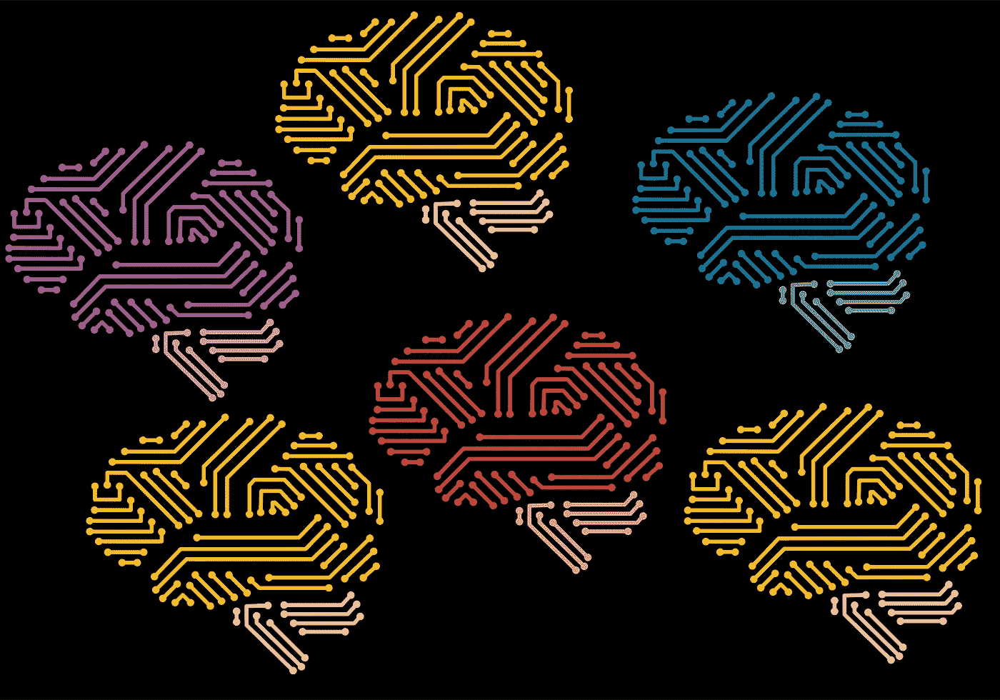
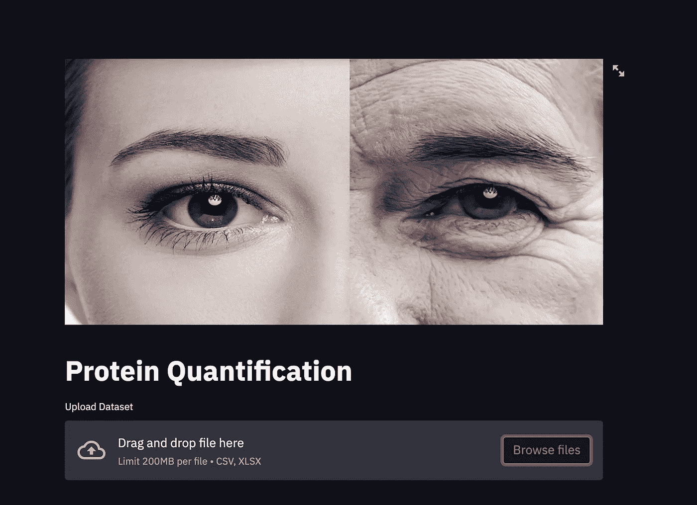
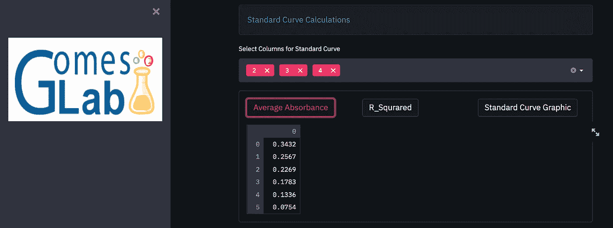
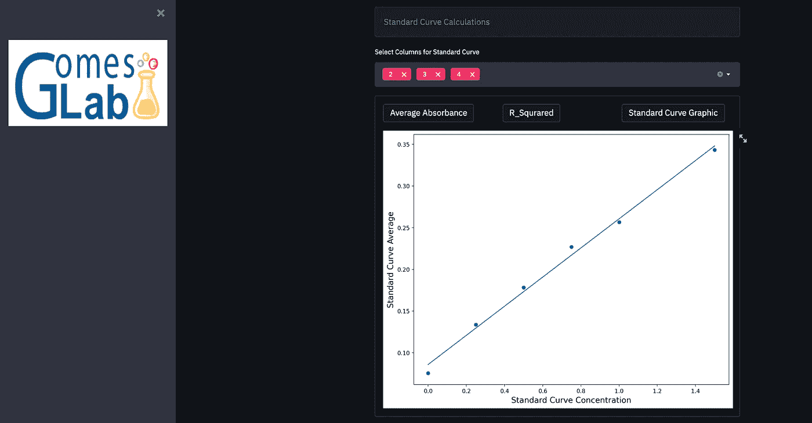
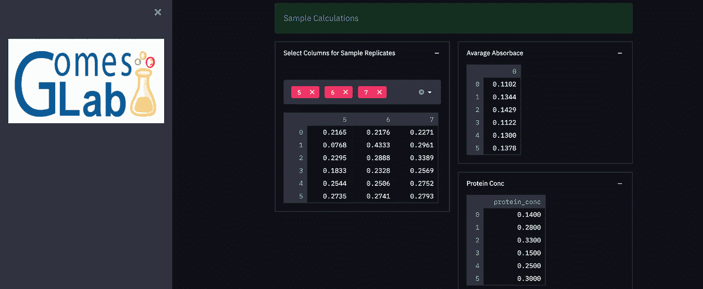
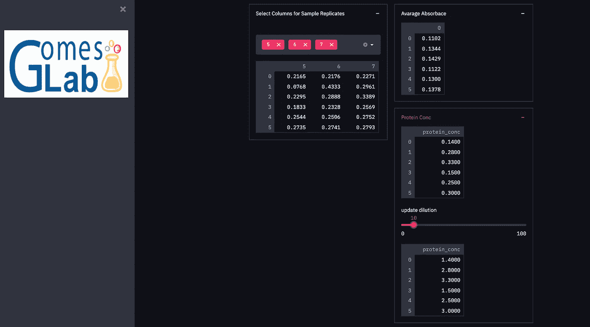

# 代码与实验室相遇:自动化蛋白质定量分析的界面

> 原文：<https://medium.com/analytics-vidhya/code-meets-the-lab-an-interface-for-automated-protein-quantification-analysis-d22f061b3e3?source=collection_archive---------8----------------------->

我的第一篇博文是关于我用 python 构建的一个工具，该工具将在生物医学研究中实现。当我在莫菲特癌症中心开始我目前的工作时，我惊讶地发现日常工作的许多方面都是手工完成的，对于最基本的任务来说，没有自动化的工具。优点是显而易见的:节省时间和精力，使研究人员可以专注于他们的实际研究和科学问题。在我的日常生活中，我总是想到如何利用我的技能来改进我和我周围的人需要做的事情，所以我用我在实验室学到的第一项生物技术投入到工作中，并编写了一个自动进行蛋白质定量数据分析的小程序([此处](/analytics-vidhya/harnessing-data-science-to-streamline-biomedical-research-c8164a6ab769))。有了这个，任何科学家都可以克隆我的 git 库，并自己计算蛋白质定量。但后来我意识到，实验室科学家在日常活动中并不真正使用 python 或代码，许多人根本不了解 python。所以我决定为它建立一个应用程序，这样人们只需要上传他们的数据，然后点击一个按钮就可以得到结果。

为了构建这个应用程序，我使用了 Streamlit。Streamlit 是一个允许构建数据仪表板 web 应用程序的库。除了 Streamlit，还有其他一些数据仪表板工具和框架，包括 Dash、Voila 和 Shiny。其中，Streamlit 和 Dash 最受欢迎。两者都是基于 python，运行在 Tornado 和 Flask web 框架上的开源软件。Dash 也兼容其他语言，比如 R 和 Julia。Dash 专注于企业市场，适应性更强。另一方面，Streamlit 面向快速原型开发，注重简单性。Streamlit 不需要任何 web 开发知识，易于安装和运行，是让非技术团队也能接触到数据科学的完美工具。

所以，让我们试试我的蛋白质定量应用程序，看看它是如何工作的！

当进入应用程序时，这是您将看到的界面

你需要做的就是上传你的文件(CSV 或 XLSX 就好)

上传文件后，您可以使用界面在下拉菜单中选择标准曲线的数据点。一旦你这样做，应用程序会给你平均吸光度，r 的平方，和标准曲线的图形。让我们看看我的标准曲线是什么样的。

看起来我的标准曲线还不错:)

现在让我们对样本进行量化！

与标准曲线一样，只需从下拉菜单中选择样品的数据点，瞧，平均吸光度和蛋白质定量就完成了！

哦，最后一件事，如果样品在定量前被稀释，我还添加了一个功能，通过使用的稀释系数来调整定量。

就是这样！相当简单，不到 5 分钟；)

进入我的 [Github](https://github.com/dendar/protein_quantification_streamlit) 获取代码和这个[链接](https://share.streamlit.io/dendar/protein_quantification_streamlit/pQ_app.py)直接访问应用。