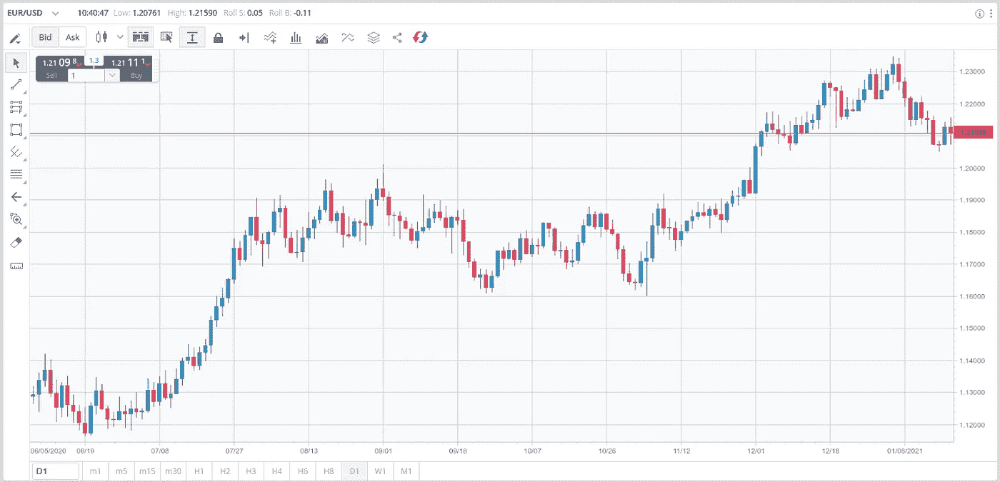

# 用 Python 为 FXCM Broker 编写交易机器人

> 原文：<https://medium.com/analytics-vidhya/coding-a-trading-bot-in-python-for-fxcm-broker-51e185e16f52?source=collection_archive---------4----------------------->

在之前的博客中，我们编写了一个 [*机器人与币安进行*](https://ipergiove.medium.com/a-trading-bot-in-python-code-for-binance-futures-c006fdc9db12) 交易。然而在币安，你只能交易加密货币，所以今天我们将使用 FXCM 经纪人来测试我们如何交易加密货币、股票、外汇和商品。

# 战略

出于演示的目的，我只考虑布林线策略。
波段用于确定…