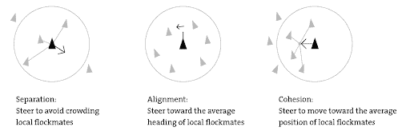
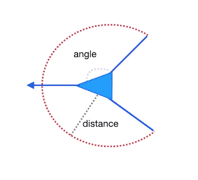

# Boid 模拟器:编码挑战#1

> 原文：<https://medium.com/analytics-vidhya/coding-challenge-1-boid-simulator-f3cf37d939f4?source=collection_archive---------15----------------------->

这是探索初学者和专家面临的各种编码挑战的系列文章的第一部分。这些文章将深入探讨各种项目的概念，同时保持一切简单明了，易于理解。我将不包括任何真正的代码，以便让您可以用您喜欢的任何语言或框架来创建这个项目。

# 什么是 boid？

boid 这个词来自克雷格·雷诺兹开发的一个模拟鸟类群集行为的程序。这种行为也非常类似于鱼类和其他群居动物的行为。虽然在最初的观察中，鸟类的行为似乎非常复杂，但 Craig Reynolds 提出了三种基本行为，当它们一起实施时，模拟了这种非常复杂的行为。这被称为紧急行为。直到今天，这些基本规则仍然被用来在电子游戏中产生成群的鸟和鱼。

这三种行为如下:

*   **隔离**:引导以避免拥挤当地的羊群同伴
*   **对准**:朝着当地羊群同伴的平均航向
*   凝聚力:引导向当地群体成员的重心移动

除此之外，每个 boid 通常都有一个圆锥/扇形视野。这可以防止 boids 对它不应该看到的其他 boids 做出反应。显然，真实的动物看不到自己身后，所以模拟这种行为也是有意义的。在代码中，这往往被实现为 boid 的设定角度之间的大量光线投射。在光线投射不可用的情况下，也可以通过数学计算当前 boid 和另一个 boid 之间的直线，并检查距离和角度是否在各自的限制范围内，来手动完成。强烈建议使用类来表示每个 boid，否则会使这个过程变得更加困难。该类应该保存一个 x，y 和旋转变量以及每个规则的函数。或者，该类可以保存一个向量变量来保存所有三个值。

# Boid 分离

这对于 boid 的行为是至关重要的，因为它确保它们不会相互碰撞。这是最基本的行为，对让每个 boid 看起来有智能大有帮助。在代码中，这可以通过光线投射来完成，如果另一个 boid 被击中，则转向与该光线相反的方向。同样，如果光线投射不可用，你可以使用一些矢量数学计算出附近任何物体的方向，然后转向相反的方向。你必须记住，每个机器人必须避开它视野范围内的所有其他机器人，并且平均转向方向。我不建议直接将角度设置为任何特定值。相反，轻推旋转看起来更平滑、更真实。

# Boid 对齐

这是创造群居鸟类的一般行为的规则，它们和群居的鸟一样朝同一个方向移动。这是非常简单的实现，只需要找到视觉锥内的 boids 和查询他们当前的旋转。附近所有其他 boid 的平均旋转可以用于通知每个 boid 的旋转。同样，建议轻推旋转，而不是将其设置为平均值，以防止方向突然改变。

# Boid 内聚力

这是最后一条规则，它创造了 boids 中最漂亮的行为之一。内聚性是在 boids/birds 中产生漩涡图案的原因，在飞行过程中它们看起来像是在互相绕圈。这也很容易实现，并且需要找到附近所有 boids 的平均位置(不是旋转)。平均这些位置给出了每组 boid 的中心靠近每个 boid。现在，将旋转推向那个中心点是实现内聚力所需要的。

# 结论

一旦这些规则被实现，你应该有一个像样的 boid 模拟。您可能需要调整每个规则的一些旋转强度来优化行为。从这里开始，您可以进行各种修改来添加功能:

*   (简单)如果您的原始实现是 2D，尝试将其转换为 3D
*   (中等)增加一个强大的风力来影响羊群
*   (中等)添加栖息行为，以便鸟儿在继续前进之前在屏幕底部停留一段时间。
*   (硬)创造一个捕食者，机器人必须避免造成群体分散