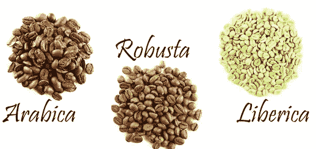

# 咖啡和 Scikit 颂歌-学习

> 原文：<https://medium.com/analytics-vidhya/coffee-data-and-scikit-learn-e15577dd0c48?source=collection_archive---------22----------------------->

随着多元线性回归和虚拟变量陷阱的出现。

[来源](https://www.shutterstock.com/image-photo/different-coffee-beans-isolated-on-white-311976080)

L [伊比利亚、罗布斯塔和阿拉比卡。](https://districtroasters.com/blogs/news/types-of-coffee-beans)你可能在商店或咖啡馆遇到的三种咖啡豆。阿拉比卡咖啡豆是最受欢迎的，更甜，咖啡因含量低。罗布斯塔咖啡豆是第二受欢迎的，味道更浓，咖啡因含量更高。Liberica 豆有一种木质的味道，但非常罕见…