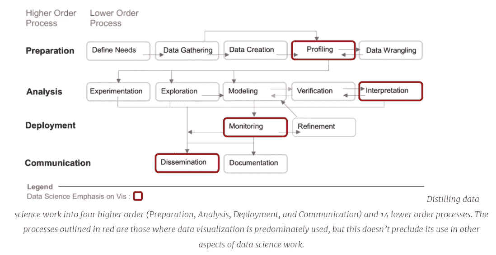

# 思考十年的数据科学和可视化工具的未来…..

> 原文：<https://medium.com/analytics-vidhya/cogitating-on-a-decade-of-data-science-and-the-future-of-visualization-tools-7bc33efeee35?source=collection_archive---------3----------------------->

收集和组织数据，然后进行分析，并产生见解。

数据=事实的集合。
分析=组织和检查数据。
洞察力=在数据中发现模式。

D 数据科学在过去的十年里飞速发展，改变了我们做生意的方式，并让下一代年轻人为未来的工作做好准备。但这种快速增长伴随着对数据科学工作的理解仍在发展，这导致了我们如何使用数据科学从大量数据中获得可操作的见解的许多模糊性。由于数据的增长塑造了我自己的职业生涯，我想深入研究以下问题:**什么是数据科学**、**什么是数据科学工作**以及**谁是数据科学家**。

# 什么是数据科学？

事实证明，数据科学对不同的人来说是不同的东西。对一些人来说，数据科学并不新鲜，只是已经存在很久的统计技术的实际应用。对其他人来说，这种观点过于狭隘，因为数据科学不仅需要统计方法的知识，还需要计算技术来使这些方法的应用切实可行。例如，数据科学家理解线性回归是不够的，他们还需要知道如何将它大规模应用于大量数据，这不是传统统计教育的一部分。尽管如此，即使那些认为数据科学不仅仅是应用统计学的人也可能会犹豫是否说它是新事物。收集和分析数据，甚至是大量数据的实践，长期以来一直是科学研究的一部分，例如在生物学或物理学中；许多人认为数据科学只是经验科学已经发生的事情的延伸。

但这里还有第三种观点，即数据科学确实是一种新的东西，不同于统计学，也不同于科学家在研究原子和基因时使用的方法。将统计和计算机科学与必要的主题专业知识结合在一起，带来了新的挑战，这些挑战只能由数据科学来解决，并由数据科学家来应对。此外，数据科学家开展的工作不同于其他类型的数据分析，因为它需要更广泛的多学科技能。我们的研究以及其他人的研究从这个角度出发，认为数据科学确实是一种全新的、与众不同的东西，我们由此创建了一个工作定义，作为我们工作的基础:

***“数据科学是一个多学科领域，旨在通过结构化应用主要的统计和计算技术，从现实世界的数据中学习新的见解。”***

这一定义非常重要，因为它有助于我们了解数据科学工作者面临的挑战和未满足的需求，这些挑战主要源于处理真实数据(而非模拟数据)的挑战，以及将统计和计算方法大规模应用于这些数据所带来的挑战。

# 什么是数据科学工作？

重要的是，数据科学的工作定义缩小了研究范围。我们没有考虑人们可能希望进行的所有可能的数据分析类型，而是密切关注数据科学家进行的分析类型。这种区别很重要，因为比如说，实验物理学家分析数据所采取的具体步骤与数据科学家可能采取的分析步骤是不同的，尽管它们有共同点。这引出了一个重要的问题:数据科学工作到底是什么？

有几个行业标准用于分解数据科学工作。第一个是 KDD(或数据发现中的知识)方法，随着时间的推移，被其他人修改和扩展。根据这些推导以及采访数据科学家的研究，我们创建了一个框架，该框架包含 4 个高阶流程(准备、分析、部署和沟通)和 14 个低阶流程。使用红色笔划轮廓，我们还突出显示了数据可视化已经在数据科学工作中发挥重要作用的特定领域。在我们的研究文章中，我们提供了这些过程的详细定义和示例。

# 谁是数据科学工作者？

这些年来，我听到了很多关于数据科学家的不同说法。我喜欢的一种说法是，数据科学家是“比统计学家更擅长软件工程，比软件工程师更擅长统计学”的人。我最近听说的一个半开玩笑的说法是，数据科学家是“西海岸的统计学家”。

然而，当我们深入研究关于数据科学家的现有研究时，我们没有想到会发现一些一致且重要的东西，即“数据科学家”的多样性以及他们的角色在特定数据科学流程中的变化。举例来说，你可能已经注意到数据工程师的崛起，作为一个独特但仍然相邻的数据科学角色。随着数据科学工作变得越来越复杂，数据科学家变得不那么一般化，而是更加专业化，通常从事数据科学工作的特定方面。哈里斯等人早在 2012 年进行的采访就已经发现了这一趋势，而且随着时间的推移，这一趋势还在加速。他们敏锐地观察到，数据科学角色的这种多样性导致了“数据科学家和那些寻求他们帮助的人之间的误解”。

我们在 Harris 工作成果的基础上，检查了 12 项研究，共计数千名被认定为数据科学家的个人。从我们对这些研究的荟萃分析中，我们能够确定 9 种不同的数据角色。这些人有不同的技能和背景，我们沿着统计学、计算机科学和领域专业知识的轴来说明。我们还将以人为中心的设计纳入了我们对数据科学技能的描述，因为考虑数据产品(如面部识别应用程序)的影响越来越重要。我们想强调的是，这些角色并不是绝对的类别，它们的界限是不固定的，担任这些角色的个人的技术能力也是不固定的。相反，这些角色类别旨在充当路标，以帮助研究人员和其他人更细致地了解他们正在与谁交谈以及他们的背景可能是什么。

# 这如何改变我们构建可视化和数据分析工具的方式？

当然，最重要的考虑是我们对数据科学的定义以及我们对数据科学工作和工作者的框架如何帮助我们构建更好的数据可视化工具。首先，它有助于使数据科学工作和工作者的多样性显而易见，并以证据为基础。我们已经使用这个框架创建了更清晰的标准来分解 Tableau 在数据科学方面的客户体验。我们可以更精确地指出他们试图做什么，并可以就这些过程提出更多的探索性问题。我们知道“数据科学家”这一角色本身包含了大量的多样性，因此我们可以通过将与我们交谈的个人分为九个数据科学角色，来更好地确定谁在执行这项工作。这种分类更容易理解我们的可视化系统需要支持的任务以及支持的级别。例如，技术分析师和 ML/AI 工程师，这是我们描述的两个数据科学角色，他们都可以从事建模的共同任务，但有截然不同的需求；如果我们忽略这些差异，我们就有可能为两种角色构建错误的工具。

[万花筒](https://unsplash.com/@kaleidico?utm_source=medium&utm_medium=referral)在 [Unsplash](https://unsplash.com?utm_source=medium&utm_medium=referral) 上拍摄的照片

但也许对我来说最重要的是，这个框架还帮助我思考当前视觉分析工具的生态系统中缺少什么。我得出的一个相关结论是，现有工具对可视化机器学习模型的关注有限，缺乏支持数据科学工作其他关键方面的工具，如数据准备、部署或通信。这种工具的缺乏不仅增加了数据科学工作的开销，也使数据科学家更难让他们的工作影响组织的决策和实践，无论他们担任什么角色。这项关于数据科学工作和工作者的研究帮助我面对这些挑战，并确定了构建更好的工具来帮助人们查看和理解他们的数据的机会。