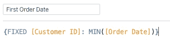
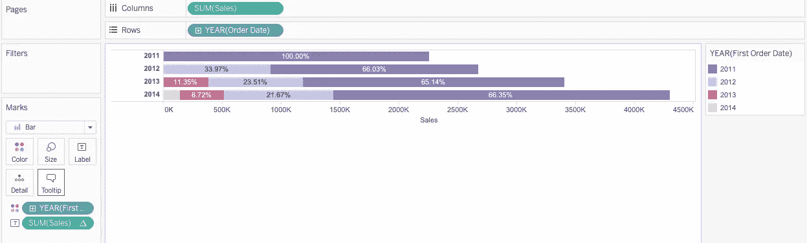

# Tableau 队列分析

> 原文：<https://medium.com/analytics-vidhya/cohort-analysis-with-tableau-a55fc825568a?source=collection_archive---------17----------------------->

## 增加收入，减少客户流失

克里斯·劳顿在 [Unsplash](https://unsplash.com?utm_source=medium&utm_medium=referral) 上的照片

在这篇文章中，我想记录我对队列分析的学习。群组分析是一种根据不同特征对客户进行分组的方法。

划分客户主要有两种方式

1.  购买群体:根据第一次购买日(加入日)划分的客户群。
2.  行为群组:根据行为划分的客户群。例如频率或支付方式。

在了解不同群体的行为后，企业就更容易制定定制策略。

下面，我想分享一下如何用 Tableau 做队列分析。数据源是 Tableau 超市数据集，包含客户订单信息，如订单日期、客户姓名、地区等。

## 获得队列分析

1.  根据第一个订单日期划分客户。

使用 Tableau 级别的细节表达式来固定客户 ID 级别，并获取他们的第一个订单日期。

2.将订单年份放在 x 轴上，销售额放在 y 轴上，客户的第一个订单日期用颜色表示。

根据图表，在 2011 年首次下订单的客户在接下来的每一年平均贡献了 65%的销售额。商店可以专注于忠诚度计划，以进一步提高顾客参与度。

我希望你喜欢读这篇文章:)