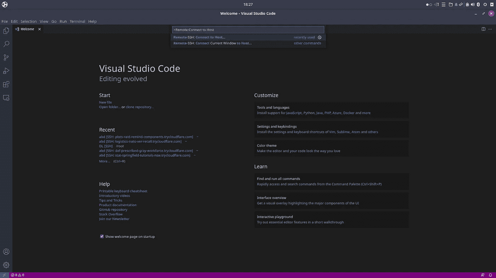
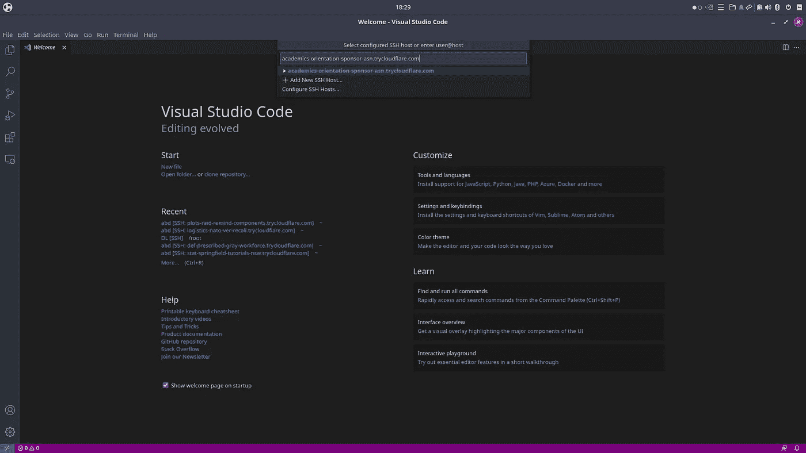

# Colab + Vs Code + GitHub + Jupyter(非常适合深度学习)

> 原文：<https://medium.com/analytics-vidhya/colab-vs-code-github-jupyter-perfect-for-deep-learning-2b257ae94d01?source=collection_archive---------0----------------------->

## 使用 Vs 代码设置 Google Colab 远程机器|将您的本地存储库放到 Colab 上|使用端口转发从 Colab 内运行 Jupyter Notebook

## **读完这篇文章，你将能够做到以下几点(**我已经展示了 Linux 中的教程，其他 OS 用户也可以采用**)。**

1.  你将不必仅仅依靠谷歌 Colab 托管的 jupyter 笔记本来访问他们的 GPU、互联网速度和其他资源。您可以直接从 Vs 代码编辑器中访问这些资源(它的优势在于能够导航包含多个文件夹和相互依赖的代码文件的存储库)。这就像在本地机器上使用 Vs 代码导航功能、GUI 等来访问 Colab 的计算一样。
2.  将您的本地文件推送到 GitHub，然后克隆到 Colab 机器上。在 Colab 上开发和使用您的文件。在一天结束时，通过将更新的回购推回 GitHub 来保存您的工作。
3.  从 Colab 内部运行 Jupyter notebook，它将托管在您本地机器的浏览器上。

## **用 Google Colab 连接 Vs 代码**

1.  从 [**这里**](https://developers.cloudflare.com/cloudflare-one/connections/connect-apps/install-and-setup/installation) 下载一个 **Cloudflare** 二进制文件。从下载的 zip 文件中解压缩，并将二进制文件保存在您选择的任何合适的目录中。在我的例子中，二进制文件的位置是

```
**“/home/<username>/Downloads/cloudflared”**
```


Cloudflare 二进制文件

1.  打开 Vs 代码，下载 **Remote-SSH 扩展**。


Vs 代码中的远程 SSH 扩展

3.在 Vs 代码内部使用 **(Ctrl + Shift + P)** 并键入**远程配置文件**。


远程配置文件搜索

现在选择文件名为

```
**‘/home/<username>/.ssh/config’** 
```

并将下面的命令粘贴到文件中。

```
**Host *.trycloudflare.com
 HostName %h
 User root
 Port 22
 ProxyCommand <PUT_THE_CLOUDFLARE_FILE_PATH_HERE> access ssh --hostname %h**
```

4.您已经完成了设置 Vs 代码来访问 Colab 机器。现在去 Google Colab，打开一个新的笔记本。要访问 GPU **，将运行时类型更改为 GPU** ，并在笔记本中运行以下命令。

```
**!pip install colab_ssh --upgrade****from colab_ssh import launch_ssh_cloudflared, init_git_cloudflared****launch_ssh_cloudflared(password="mypassword")**
```

这将使您进入以下屏幕。


带有 Cloudflare 链接的 Google Colab(复制到 Vs 代码中)

5.复制 **Vs 代码远程 SSH** 下的链接。打开 Vs 代码，键入 **(Ctrl + Shift + P)。**搜索**遥控器:连接主机**并按回车键。出现提示时粘贴复制的链接，如下所示，然后按回车键。



搜索远程:连接到主机



粘贴 Cloudflare URL

6.提供您在 colab 中设置的密码。好了，您将能够从 Vs 代码终端访问机器。键入 **nvidia-smi** 检查 GPU 配置。


从 Vs 代码终端访问 Colab GPU

我们完成了 Colab 与 Vs 代码的链接；) .

## 关于工作流的一些见解

现在，您可以从 Vs 代码终端访问 Colab GPU，这为您提供了与在本地机器上使用 Vs 代码时相同的灵活性。例如，如果你想访问包含你的 DL 项目的本地存储库中的文件，并使用 Colab GPU 运行它们，你所需要做的就是[在 GitHub](https://docs.github.com/en/github/creating-cloning-and-archiving-repositories/creating-a-repository-on-github/creating-a-new-repository) 中创建一个私有存储库并[推送到它](https://stackoverflow.com/questions/18842120/git-pushing-to-a-private-repo/18842197)。然后[可以从 Vs 代码终端克隆 colab 机器中的私有回购](https://github.community/t/clone-private-repo/1371)。

这使您可以在 colab 中访问您的文件，并且您可以使用 Vs 代码通过它的 GUI 无缝地在它们之间导航。完成一天的工作后，将您的更改推回 GitHub。


所有可以从 Vs 代码访问的项目文件和文件夹

> **提示**
> 
> 问题 1:有时由于互联网不稳定，我们会与 Colab 断开连接，当我们再次运行笔记本电脑时，Colab 会给我们一台不同的机器。
> 
> 解决方案:为了确保我们即使在断开连接后也能在同一台机器上着陆，只需在 colab 中运行一个类似于**的无限循环，同时 True : pass** 。因为即使在我们断开连接后，colab 也不是不活动的，所以我们将重新连接到同一台机器上。按照步骤 4 & 5 获得一个新的链接，将 Vs Code Editor 连接回同一台 colab 机器。
> 
> 问题 2:有时 Vs 代码会与远程 colab 机器断开连接，并且无法再使用 cloudflare 生成的链接与之通信。
> 
> 解决方案:按照步骤 4 和 5 获得一个新链接，以连接回 colab。

## 在 Colab 上安装 miniconda |设置终端以识别 conda |从 Colab 内访问 jupyter 笔记本

1.要在 colab 上安装 miniconda 并激活终端，使其能够识别 conda，请运行以下命令:

```
**wget** [**https://repo.anaconda.com/miniconda/Miniconda3-latest-Linux-x86_64.sh**](https://repo.anaconda.com/miniconda/Miniconda3-latest-Linux-x86_64.sh)**sh Miniconda3-latest-Linux-x86_64.sh -b****export PATH="/root/miniconda3/bin:${PATH}"****conda init**
```

重启终端，conda 将为您的 colab 机器启用。

2.使用以下命令创建并激活一个环境，以便开始您的项目。

```
**conda create -y -n envname python=3.7****conda activate envname**
```

3.在安装任何东西之前，确保使用这里提到的[命令](https://anaconda.org/conda-forge/google-colab)安装 **google-colab** 包。google-colab 包是运行 jupyter notebook 所必需的，并且还安装了一个兼容的ipykernel 版本。

4.要在 Jupyter 笔记本中激活 conda 环境，请运行以下命令。

```
**python -m ipykernel install --user --name=envname**
```

5.现在最后运行下面提到的命令来激活 jupyter 笔记本。

```
**jupyter notebook --ip 127.0.0.1 --port 8888**
```

该命令在 IP= 127.0.0.1 上托管笔记本，这是必要的，因为 jupyter 笔记本通常托管的默认 IP(127 . 0 . 0 . 0)已经用于托管 Google Colab 笔记本。Vs 代码在后端自动进行端口转发，将 colab 机器的端口映射到我们的本地机器。

现在你应该可以从 colab 中访问你的 jupyter 笔记本了；) .

这就是本教程的全部内容。希望它能派上用场，让深度学习变得更加有趣和轻松。请给我的第一个媒体博客点个赞，并对❤.的任何疑问发表评论