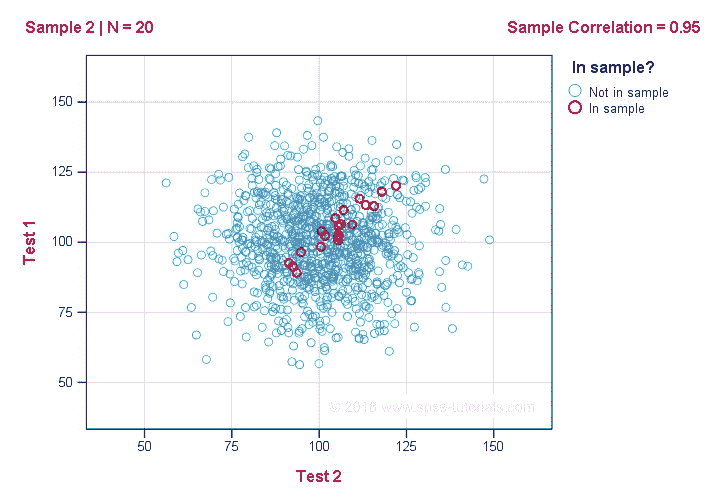
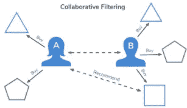
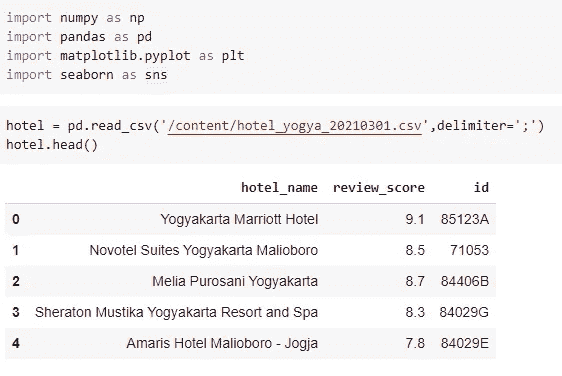
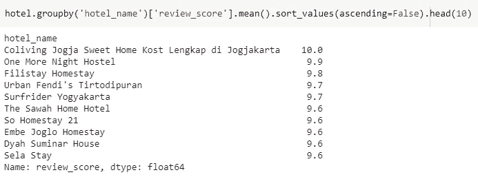
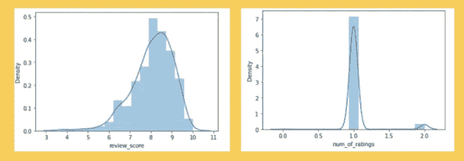
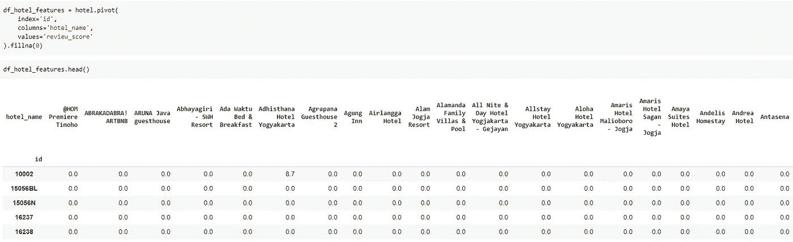
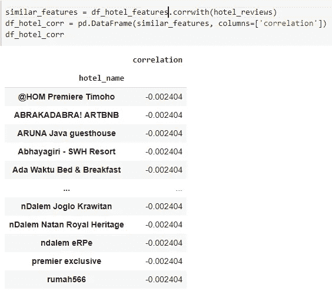
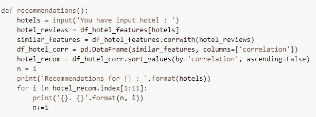
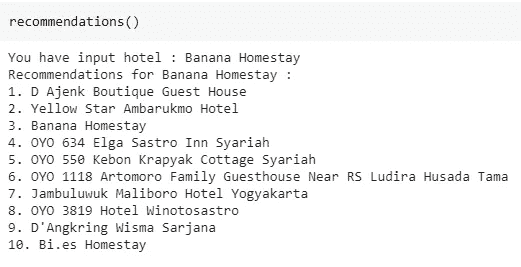

# 协作过滤(简单练习)—两两相关

> 原文：<https://medium.com/analytics-vidhya/collaborative-filtering-simple-practice-pairwise-correlations-c87576a7c65?source=collection_archive---------13----------------------->

相关

***“我们正在离开信息时代，进入推荐时代”。——克里斯·安德森。***

推荐系统被用于各种领域，通常公认的例子采取视频和音乐服务的播放列表生成器、在线商店的产品推荐器、或者社交媒体平台的内容推荐器和开放网络内容推荐器的形式。这些系统可以使用单一输入(如音乐)或跨平台的多个输入(如新闻、书籍和搜索查询)来运行。也有针对特定主题的流行推荐系统，如餐馆和网上约会。推荐系统也被开发来探索研究文章和专家、合作者和金融服务。

现在，我们将尝试一种方法来建立这个系统。

**我们会用什么方法？**

答案是两两相关。我们走吧。

**协同过滤**

协同过滤(CF)是推荐系统使用的一种技术。协同过滤有两种含义，狭义的和更广义的。在更新的、更狭义的意义上，协同过滤是一种通过从许多用户(协作)收集偏好或品味信息来对用户的兴趣进行自动预测(过滤)的方法。

协同过滤

**协同过滤推荐系统是如何工作的？**

说明协同过滤如何预测用户对 4 件事物的评价:一张图片、一本书、一段视频和一个视频游戏。基于用户的历史数据，每个项目的好恶，系统试图预测用户将如何评价他们尚未评价的新项目。预测本身是基于其他用户过去的评级，这些用户的评级以及因此假定的偏好与活跃用户相似。在这种情况下，系统做出了活动用户不会喜欢该视频的预测/推荐。

**数据集**

我们用于基于内容的过滤的数据是我们自己从 booking.com 制作的数据集，因为提供的信息是完整的。

[www.booking.com](http://www.booking.com)

所获取的数据由 657 个酒店数据组成，包括名称、评论、价格等。

**导入库&加载数据**

是的，首先导入我们需要的所有库，然后加载数据。

库并加载数据

**参见评审评分**

审查分数

我们使用酒店名称分组来获得得分最高的前 10 家酒店的平均得分。

**评审分数分布**

我们将看到分数分布和分数分布的数量。

分数分布和评级数量分布

**将点评分数转化为酒店特色**

我们将数据框转换为宽格式，id 作为行，酒店名称作为列。然后我们会用 0 填充缺失的观察值。

Pivot 酒店-特色

**计算两两相关。**

在数据帧的行或列与系列或数据帧的行或列之间计算成对相关。在计算相关性之前，数据帧首先沿两个轴对齐。

**两两相关**

**提出建议**

最后可以做一些酒店推荐。

**建议**

**运行脚本建议**

运行脚本

**结论**

在这里，正如你所看到的，两两相关给出的推荐看起来不错。通常被预测为推荐的酒店是具有最高相关性的酒店。也就是说，这种方法受到高相关性的严重影响。

参考

[逐步构建推荐系统原型第 1 部分:KNN 基于项目的协同过滤|作者 Kevin Liao |走向数据科学](https://towardsdatascience.com/prototyping-a-recommender-system-step-by-step-part-1-knn-item-based-collaborative-filtering-637969614ea)

[推荐系统—维基百科](https://en.wikipedia.org/wiki/Recommender_system#:~:text=A%20recommender%20system%2C%20or%20a%20recommendation%20system%20%28sometimes,%22preference%22%20a%20user%20would%20give%20to%20an%20item.)

[两两相关(smu.edu.sg)](https://ink.library.smu.edu.sg/cgi/viewcontent.cgi?article=6171&context=lkcsb_research)

[协同过滤—维基百科](https://en.wikipedia.org/wiki/Collaborative_filtering)

[机器学习推荐系统的简单介绍|作者 George Seif |走向数据科学](https://towardsdatascience.com/an-easy-introduction-to-machine-learning-recommender-systems-efc8f7ece829?source=post_page-----efc8f7ece829----------------------)