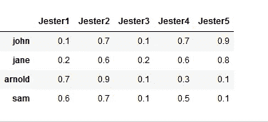
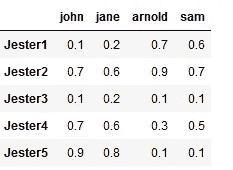
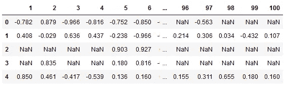
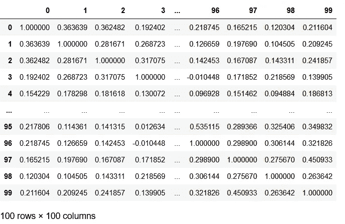
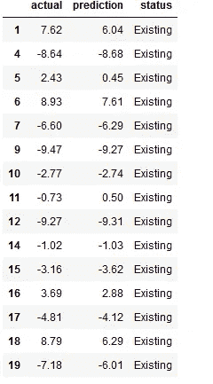
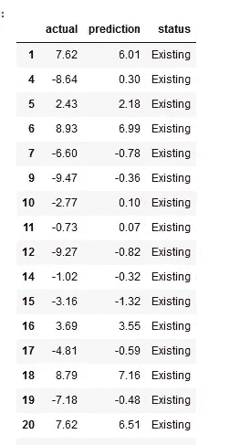
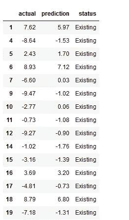

# 神经网络协同过滤

> 原文：<https://medium.com/analytics-vidhya/collaborative-filtering-with-neural-networks-e9691683701f?source=collection_archive---------19----------------------->

```
How to model Recommendation(Collaborative Filtering) as a Neural Network?
```

在这篇文章中，我将尝试用神经网络来建模一个推荐系统(协同过滤)。我将使用 Jester 数据集。由于 Jester 是一个主观的东西，所以我们试图对个人的喜欢进行建模。所以我们的意图是找到有相似爱好的人。

代码在 github。([链接](https://github.com/mcelikkaya/medium_articles/blob/main/collaborative_filtering_jester_by_mlp.ipynb)

让我们先简化问题。想想我有 5 个 jester 和 4 个人，我有 jester 的用户评级。你可以看到有些人对同样的项目给出了相似的评价。这使得 jester 的用户向量。所以喜欢相似的人会有相似的向量。(它们在欧几里得空间中会彼此靠近)



现在转置矩阵。现在我们有了用户喜欢的 jester 向量。我们可以在我们的神经网络中使用这些向量作为特征，并训练一个网络。你可以认为这些是潜在的特征。也许 Jester1 是一个政治笑话，所以中年人喜欢它，但年轻人不喜欢。这些是我们代表潜在关系的数据。我们使用神经网络来模拟由于高维而无法理解的潜在关系。



**我们怎样才能塑造一个小丑？**

事实上，这些都是我们不知道的 Jester 的潜在特征。Jester 可以是政治性的，也可以是关于婚姻、日常生活的…所以我们必须找到一种方法来矢量化 Jester。

Jester 数据集有 100 列和近 25K 个用户。每一列都代表该 jester 的用户评级。可能缺少值。对于我假设的缺失值，我可以用每个用户的平均值来代替它们。(在生产质量系统中，我们必须检查用户或 jester 遗漏的值……)。下面我列出了数据文件的格式。

1.  评级是范围从-10.00 到+10.00 的真实值(值“99”对应于“空值”=“未评级”)。
2.  每个用户一行
3.  第一列给出了该用户评价的笑话数量。接下来的 100 列给出了笑话 01-100 的评分。

下面我删除了第一列，使其成为[user x jester]表。如果您想使用数据，可以查看原始页面。([链接](https://goldberg.berkeley.edu/jester-data/))我只使用这个链接的第一个文件。我将范围[-10，10]到范围[-1，1]的数据归一化



**Jester 数据集，行用户，列 Jester**

现在我有 25K(人)x 100 jester 数据集。现在我们需要为我们的 jesters 和用户生成向量作为特性。所以把这个数据集当做 jesters 代表用户喜好。所以用户喜欢成为 jester 的一个特征向量。还要转置数据。这一次 jesters 成为用户的特征向量。

如果我想创建一个用户向量，它的维度将是 100。(用户对 jester 的喜欢)我现在想为 jester 创建一个嵌入。自然 jester 向量是 25k。但是这个维度这么高。这样我就能造出一个更好的。我得到杰斯特的余弦，得到一个 100x100 的矩阵怎么样？这个矩阵显示了小丑之间的相似性。所以我也可以用它作为向量。



**Jester x Jester 相似度表，可以用这个作为 Jester 的特征向量。**

我将按照[user，jester]对准备我的输入，并按照评级输出。
杰斯特嵌入+用户嵌入- >评级

现在我可以建立我的模型了。我将连接 jester 和用户向量，使其成为输入，并给出评级作为输出。这个模型很简单，我可以尝试更深层次的架构。

根据上面的模型，我们尝试了一个像 MLP 一样的简单建筑。网络得到 200 维(jester+user)的输入，输出 1 个数值(rating)。网络以**val _ mean _ absolute _ error**0.1226 结束。由于我们的评级在-1 和 1 之间标准化，这意味着%5 的误差。

现在，我的模型能够预测给定用户**和给定小丑的评分。现在，我将使用我的模型对所有 user-jester 对进行预测。我将添加一列来显示原始集合(np.na)中是否缺少这个值。因此，如果不存在(“新”)，这意味着完全预测。如果它是存在的，这意味着，我们的网络会猜测这个评级与什么是实际的评级。
在这里我还计算了实际值和网络预测值之间的差异。假设实际值为 3.01，而我们预测值为 4.09，两者之间的差异接近 1。但是我们的价值观在-10 到 10 之间，所以我们的差距是 20。这就产生了 1/20 - > %5 的误差。所以我也可以给出每个用户的预测误差率。**



**用户预测与实际评分**

在第二个架构中，我将使用 **PCA、TSNE、Isomap** ( **Isomap** 是一种非线性降维方法)进行降维，并创建一个带有正则化漏失的网络。在以前的架构中，我取 jesters 的余弦，并将其用作 Jest 向量。现在我将使用 25K 的向量来代替余弦。但这是如此之高，所以我会做一个降维，使其为 50。所以我的新输入形状将是 100(用户)+50(jester)

我尝试了多种降维方法。如果你想玩这个代码，找到“取消对 PCA 的注释，尝试使用 PCA”这一行，并把它改为 PCA。(或者随便加什么方法。)您可以尝试其他方法，我们正在尝试将维数从 25k 降低到任何有意义的值。

PCA 和 Isomap 面积的结果如下。它们的表现并不比余弦函数好。我认为余弦是一个显示潜在关系的实向量，这是降维，所以它损失了一些能量。



**PCA 预测**



**Isomap 预测**

现在让我们尝试一个 k 倍交叉验证。我们将把数据分成子集，为每个子集训练一个模型，并对其进行评估。因此，我们将对我们的生产验证有更好的了解。k 倍绝对误差为 0.2。我们的目标值介于-1 和 1 之间。所以每次预测都有 10%的误差。

在这篇文章中，我们将介绍一种利用神经网络进行协同过滤的方法。这种方法可能比传统方法有更大的方差误差，但也是建模深层潜在关系的更好的候选方法。我认为在我们的问题上值得一试。