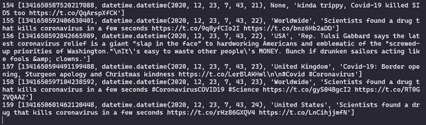

# 用 Python 收集推文

> 原文：<https://medium.com/analytics-vidhya/collecting-tweets-with-python-7804f6c73d39?source=collection_archive---------10----------------------->

使用 Tweepy Python 模块 Grep、处理和存储 Twitter 数据


布雷特·乔丹在 [Unsplash](https://unsplash.com/s/photos/twitter?utm_source=unsplash&utm_medium=referral&utm_content=creditCopyText) 上的照片

Twitter 是一个全球广泛使用的分享思想、观点和经验的渠道。使该网站成为媒体和文本内容的重要来源，这些内容是用于分析和获取见解的有用数据。

此外，Twitter 还有一个功能，可以搜索关于某个主题的推文，跟踪与一些词相关的数据，然后获取关于趋势话题、人物、标签或任何其他主题的信息。

在本文中，描述了一种使用编程语言 **Python** 通过库 **Tweepy** 来使用这个特性的方法。

# 跟踪

为了通过代码访问 **Twitter** 数据，需要向 [Twitter 开发者](https://developer.twitter.com/en/apply-for-access)申请获得自己的 API 密钥。这个过程需要一点时间，但是必须继续。

要开始编码，请创建一个 Python 脚本文件，并使用您的键设置下面的变量。

```
CONSUMER_KEY = 'XXXXXXX'
CONSUMER_SECRET = 'XXXXXXX'
ACCESS_TOKEN = 'XXXXXXX'
ACCESS_TOKEN_SECRET = 'XXXXXXX'
```

## 十二岁

用 Python 访问 Twitter API 有很多可能的方法。本文将使用 [**Tweepy**](https://www.tweepy.org/) 库。用 **pip** 安装这个 Python 模块。运行:

```
$ pip install tweepy
```

然后，导入 Tweepy 模块并将您的密钥应用于身份验证，创建一个允许访问的 Twitter API 对象。

```
import tweepyauth = tweepy.OAuthHandler(CONSUMER_KEY, CONSUMER_SECRET)
auth.set_access_token(ACCESS_TOKEN, ACCESS_TOKEN_SECRET)
api = tweepy.API(auth)
```

# 流动

使用 Tweepy 模块，可以访问和定制推文流功能，这对于获取大量推文数据非常有用，因为它返回实时发布的推文。

## 设置跟踪行为

为了能够定义每当发布一条推文时程序将做什么，需要创建一个从 Tweepy 扩展 **StreamListener** 的类，并覆盖 **on_status** 方法以添加所需的行为。下面是一个打印 tweet 文本的例子。

```
class TweetListener(tweepy.StreamListener):
  def on_status(self, tweet):
    print(tweet.text)
```

Tweepy 提供了一个名为 **Stream** 的类，它需要验证和一个要实例化的监听器。因此，创建一个 Stream 对象，它从前面定义的 **api** 变量接收 **auth** 属性，并使用上述 **TweetListener** 类的一个实例。

```
listener = TweetListener()
stream = tweepy.Stream(auth = api.auth, listener=listener)
```

## 开始流

Tweepy 提供了几种流处理。要开始流式传输 tweets，您可以通过 stream 对象的 **filter** 方法使用可用的过滤过程。有了它，就有可能跟踪包含一系列单词的推文，或者关注来自多个用户的推文，甚至选择将被考虑的语言。

例如，下面的代码开始打印用英语写的包含与新冠肺炎有关的单词的推文(“冠状病毒”、“COVID”、“covid19”、“新冠肺炎”)。请注意，这只是一个示例，您可以随意更改过滤器参数。

```
# filter parameters
words = ['coronavirus', 'covid', 'covid19', 'covid-19']
languages = ['en']# streaming...
stream.filter(track=words, languages=languages)
```



到目前为止，脚本只是打印 tweets。一旦开始，它不会结束，直到被手动停止(按 CTRL + C 或杀死系统进程)，它不会记录任何信息。因此，为了进一步的分析，有必要对数据进行标记和存储。

## 自动取消

存档录音特性的一种方法是更新 **TweetListener** 类，设置一个由 **on_status** 方法填充的列表属性。由于流式传输过程是无限的，因此还需要设置一个阈值，一旦达到该阈值，就会通过在 **on_status** 上返回 **False** 来自动取消该流。

```
# set default threshold value 
DEFAULT_THRESHOLD = 10# older listener with changes
class TweetListener(tweepy.StreamListener) :
  def __init__(self, threshold = DEFAULT_THRESHOLD) :
    super().__init__()
    self.threshold = threshold
    self.tweets = [] def on_status(self, tweet):
    if len(self.tweets) < self.threshold :
      print(tweet)
      self.tweets.append(tweet)
    else:
      return False
```

## 标签和字段

一条 tweet 携带大量数据，例如内容文本、媒体、收藏计数、所有者等等。要了解更多细节，请查看 Twitter 开发人员文档中关于 Tweet 对象的页面[。每个申请案例都需要不同的信息，选择你感兴趣的领域，去掉剩下的。](https://developer.twitter.com/en/docs/twitter-api/v1/data-dictionary/object-model/tweet)

值得一提的是，如果 tweet 文本超过 140 个字符，**文本**属性将被截断。在这种情况下，tweet 对象将具有 **extended_tweet** 属性。因此，要访问全文，请使用**extended _ tweet[' full _ text ']**。

```
# older listener with changes
class TweetListener(tweepy.StreamListener) :
  def __init__(self, threshold = DEFAULT_THRESHOLD) :
    super().__init__()
    self.threshold = threshold
    self.tweets = [] def on_status(self, tweet):
    if len(self.tweets) < self.threshold :
      text = (
        tweet.extended_tweet['full_text']
        if hasattr(tweet, 'extended_tweet')
        else tweet.text
      )
      desired_fields = [tweet.id, text]
      print(desired_fields)
      self.tweets.append(desired_fields)
    else:
      return False
```

# 保管

到目前为止，所有跟踪的 tweets 都存储在内部 TweetListener 对象的 **tweets** 属性中。我们可以使用**熊猫**创建一个数据帧，并将其保存在 CSV 文件中:

```
import pandas as pdcolumns = ['id', 'text']
output_file = 'tweets.csv'tweets = pd.DataFrame(listener.tweets, columns=columns])
tweets.to_csv(output_file, index = False)
```

# 后续步骤

尝试应用您存储的文本数据来分析并从中获取信息。例如，研究在推文中向用户提及某个关键主题、常见标签、信息的情感等等。如前所述，Twitter 是一个很好的数据来源。你可以在一段时间内掌握大量的信息。