# Python 中数据类型集合

> 原文：<https://medium.com/analytics-vidhya/collection-data-types-in-python-3a3f9c0b554?source=collection_archive---------0----------------------->

沙哈达特·拉赫曼在 [Unsplash](https://unsplash.com?utm_source=medium&utm_medium=referral) 上拍摄的照片

Python 有 4 种内置的数据结构，可以用来保存对象的集合，它们是列表、元组、集合和字典。它们可以分别区分为可变、不可变、集合类型和映射。

**列表**

列表是有序的可变序列，在创建后可以通过添加、删除或更改对象来更改。可以在变量名后使用方括号“[]”来声明列表。

**元组**

元组是有序的不可变序列，它在单个变量中存储多个项目，这意味着它在创建后不能更改。元组可以由一对括号和逗号分隔的对象创建，跟在变量名后面。

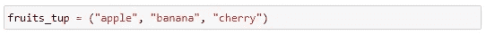

单个对象元组被称为单元组。可以通过在对象后使用尾随逗号来创建它，否则 python 会将其识别为字符串。

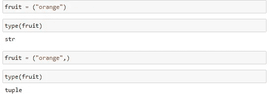

逗号是元组的组成部分，因为括号是可选的。

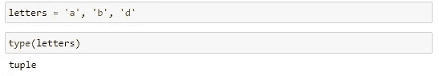

**设定**

集合是唯一对象的无序不可变集合，不支持重复对象，因此它们不能被索引。诸如交集、并集、差集和对称差集之类的数学运算可以在集合数据类型上执行。可以通过在变量名后使用花括号或使用 set()构造函数来创建集合。

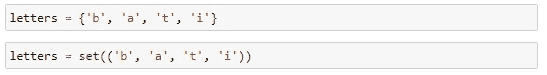

## 列表、元组和集合之间的相似性

1.  它们支持任何数据类型

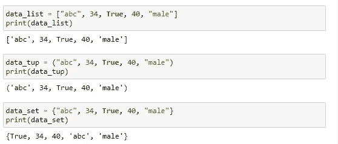

2.列表和元组允许重复元素

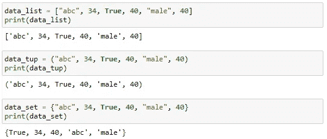

3.列表和集合是可变的，即创建后可以进行更改

4.列表和元组是有序序列

## 列表、元组和集合之间的差异

1.  虽然列表和集合是可变的，但是元组是不可变的，也就是说，在创建元组之后不能进行任何更改，因为 python 将返回一个属性错误，指示该方法或操作在该对象上是不可能的。

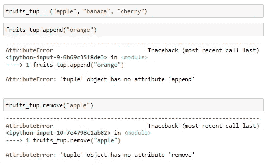

2.集合是无序的，每次使用时会以不同的顺序出现，并且不能通过索引或键来引用。

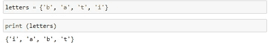

3.List 和 tuples 接受重复项，而 set 只接受其中一个重复对象。

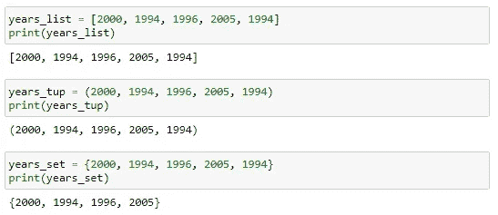

## 词典

字典是一组无序的键/值对。每个惟一键在字典中都有一个与之相关联的值
，字典可以有任意数量的
对。与键关联的值可以是任何对象。像集合一样，字典是无序的。

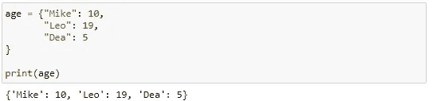

字典项中的值可以是任何数据类型。

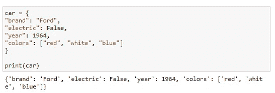

字典是可变的，这允许在字典创建后添加或删除条目。但是，不允许重复，因为一个字典不能有多个具有相同关键字的条目，因为这些值将被覆盖，而最新的值将被返回。

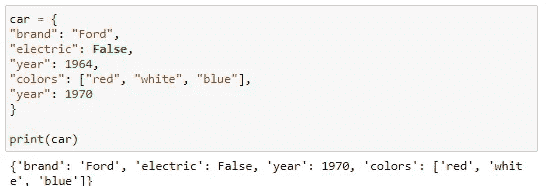