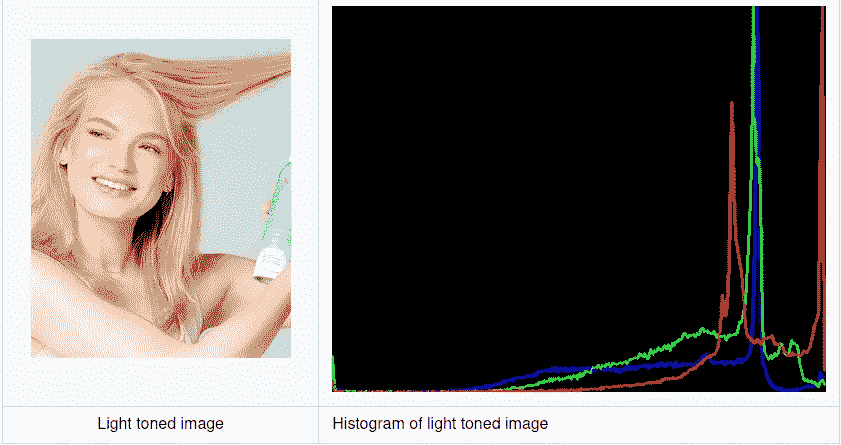
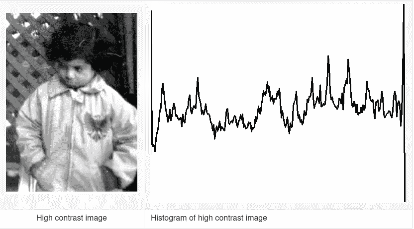

# OpenCV 中的颜色通道和直方图

> 原文：<https://medium.com/analytics-vidhya/color-channels-and-histograms-in-opencv-23d2338e4035?source=collection_archive---------9----------------------->

# **颜色通道**

数字图像由像素组成，这些像素是原色的组合。颜色通道存储一种这样的颜色的颜色信息。不同种类的数字图像有不同的颜色通道。


特定颜色通道的亮度决定了图片中该颜色的强度。在蓝色通道中，蓝色部分比其他通道亮得多。红色通道中的红色花朵相对较亮，绿色通道中图片的绿色部分也是如此。

类似地，在 YUV 图像中，Y 通道关联感知强度，而 U 和 V 关联颜色信息。对于 CYMK 图像，通道用于青色、黄色、品红色和黑色。每个颜色通道有 100 个强度级别。

# 直方图

直方图通常是数据分布的图形表示。图像直方图给出了数字图像中颜色强度计数的图形表示。它还可以计算其他特征，如方向和梯度以及强度。它没有给出像素位置的指示。x 轴表示变量值的范围。这个范围可以被分成一系列被称为箱的间隔。y 轴显示有多少值落在该间隔或区间内。

绘制直方图时，X 轴是像素强度，Y 轴是频率。和其他直方图一样，我们可以决定使用多少个面元。

可以为灰度图像和彩色图像计算直方图。在第一种情况下，我们只有一个通道，因此只有一个直方图。在第二种情况下，我们有 3 个通道，因此有 3 个直方图。

计算图像的直方图非常有用，因为它给出了关于图像的一些属性的直觉，例如色调范围、对比度和亮度。

# 为 RGB 图像创建直方图

为了创建直方图，我们加载我们需要创建直方图的源图像并将它们分成三个通道；分别为蓝色(B)、绿色(G)和红色(R)。

```
string path = ; 
Mat img= imread(path); 
vector <Mat> bgr_planes; 
split(img,bgr_planes);
```

我们必须初始化直方图的大小，它是 256，因为 RGB 有 256 个强度级别。它的范围也是从 0 到 255。直方图的范围应初始化为:

这样做是因为我们的 CalcHist 函数只接受直方图范围的双指针。直方图的大小、高度、宽度都是整数。calcHist 的输出存储在三个通道的 Mat 类变量中。

```
int Size=256,height=512,width=400; 
Mat blueH,greenH,redH;
```

我们希望我们的箱柜有相同的大小，并清除直方图，如果有任何建立在这之前。

```
bool uniform = true, accumulate = false;
```

calcHist 函数总共有 10 个参数。这些是为每个通道单独计算的。(B、G 和 R)

```
calcHist(&bgr_planes[0],1,0,Mat(),blueH,1,&histSize,&histRange,uniform,accumulate); calcHist(&bgr_planes[1],1,0,Mat(),greenH,1,&histSize,&histRange,uniform,accumulate); calcHist(&bgr_planes[2],1,0,Mat(),redH,1,&histSize,&histRange,uniform,accumulate);
```

这些论点是

*   **& bgr_planes** :源图像
*   **1:** 我们使用的图片数量
*   **0:** 要测量的维数。只测量强度，所以它是 0。
*   **()**:用于屏蔽，即决定分析图像的哪一部分。空遮罩意味着我们正在检查整个图像。
*   **blueH** :这是存储函数输出的地方。
*   **1:** 输出直方图的维数。这是 2D，所以我们写一个。
*   **histSize:** 确定用于测量 inensity 的箱数。
*   **历史范围:**要测量的数值范围
*   **累加和统一:**箱尺寸保持统一，直方图被清除。

然后，我们创建一个图像来显示直方图，并制作一个合适的面元大小:

```
int bin = cvRound((double)width/Size);
Mat Image(height,width, CV_8UC3,Scalar(0,0,0));
```

其中，CV_8UC3 是具有 3 个通道的 8 位无符号整数矩阵。重要的是归一化直方图，使值落在特定范围内。

```
normalize(blueH, blueH, 0, histImage.rows, NORM_MINMAX, -1, Mat() ); normalize(greenH, greenH, 0, histImage.rows, NORM_MINMAX,-1,Mat() );
normalize(redH, redH, 0, histImage.rows, NORM_MINMAX, -1, Mat() );
```

我们现在为各个颜色通道绘制直方图:

```
for( int i = 1; i < histSize; i++ )                          
 {                              
 line( Image,Point( bin*(i), height - cvRound(blueH.at<float>(i))),                                     Point( bin*(i+1), height - cvRound(blueH.at<float>(i+1))),                                     Scalar( 255, 0, 0), 2, 8, 0  );         

line( Image, Point( bin*(i),height - cvRound(greenH.at<float>(i))),                                     Point( bin*(i+1), height - cvRound(greenH.at<float>(i+1)) ),                                     Scalar( 0, 255, 0), 2, 8, 0  );      

line( Image, Point( bin*(i), height - cvRound(redH.at<float>(i))),                                     Point( bin*(i+1), height - cvRound(redH.at<float>(i+1)) ),                                     Scalar( 0, 0, 255), 2, 8, 0  );                          
 }
```

直方图以这种方式绘制:


浅色和深色图像样本的直方图如下所示:


从暗色调图像的图中，我们可以推断出通道具有非常低的像素强度，对应于图像中存在的深蓝色和黑色的量。这里的直方图向左倾斜，指的是原点附近的低强度。如果大部分像素位于图像的左侧，很有可能是您的图像曝光不足，并且太暗，缺少阴影区域的细节。



从浅色调图像的图中，我们可以推断出通道具有非常高的像素强度，对应于图像中存在的浅肤色和黄色色素的量。这里的直方图向右倾斜，指的是高强度。如果大部分像素位于右侧，则照片很可能曝光过度，并且在图像的明亮部分很少或没有细节。

# 灰度图像的直方图

为了确定灰度图像的直方图，我们需要对上面的代码做一些修改。没有必要将图像分割成通道，但是需要将源图像转换成灰度。

```
cvtColor(src,grey,COLOR_BGR2GRAY);
```

在尝试制作灰度图像时，我们还应确保绘制直方图的图像初始化如下:

```
Mat Image(height,width, CV_8UC1,Scalar(0,0,0));
```

其中，CV_8UC1 是一个带 1 个通道的 8 位无符号整数矩阵。

样本灰度图像及其各自的直方图如下所示:


具有低对比度的图像通常在直方图上具有尖锐的峰值，而具有更高对比度的图像将具有更圆的峰值。从上图我们可以看出像素强度是如何影响图像对比度的。对于低对比度图像，我们可以看到大部分直方图集中在图表的一侧，即，对于低对比度图像，没有很多明显的强度。



类似地，对于高对比度图像，很明显整个直方图是分散的，这意味着高对比度图像在其图像像素中具有更多不同数量的强度。

**参考文献:**

[](https://docs.opencv.org/4.5.1/d8/dbc/tutorial_histogram_calculation.html) [## OpenCV:直方图计算

### 上一教程:直方图均衡化下一教程:直方图比较在本教程中，您将学习如何:使用…

docs.opencv.org](https://docs.opencv.org/4.5.1/d8/dbc/tutorial_histogram_calculation.html) [](/@rndayala/image-histograms-in-opencv-40ee5969a3b7) [## OpenCV 中的图像直方图

### 使用 OpenCV 了解图像直方图

medium.com](/@rndayala/image-histograms-in-opencv-40ee5969a3b7) [](/@feraguilari/histograms-in-data-science-fdb30af97e21) [## 数据科学中的直方图

### 直方图类似于垂直条形图。然而，直方图描述了一组离散的或不连续的潜在频率

medium.com](/@feraguilari/histograms-in-data-science-fdb30af97e21)