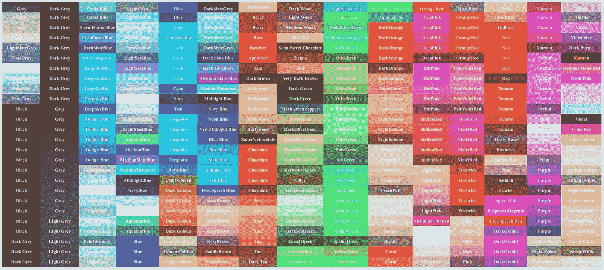
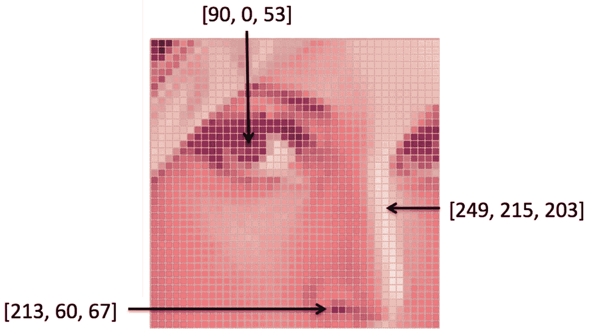
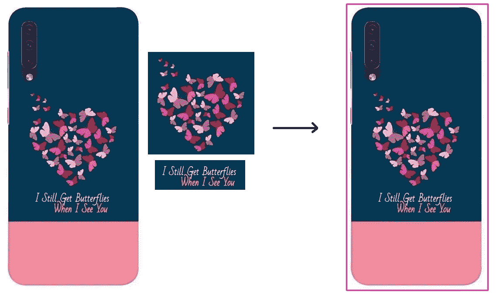
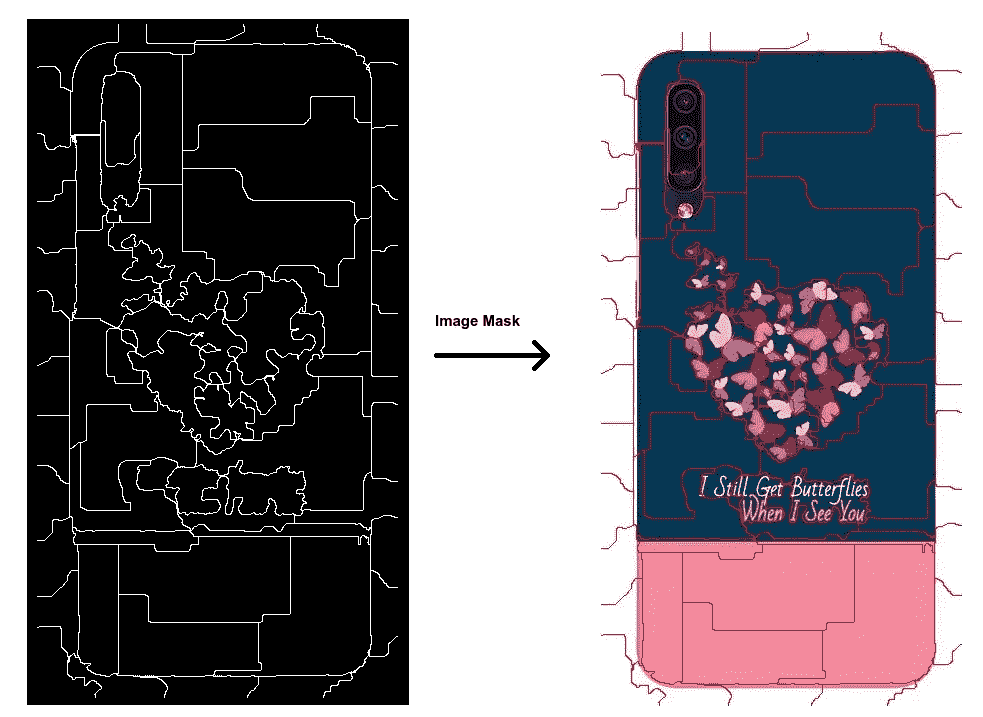
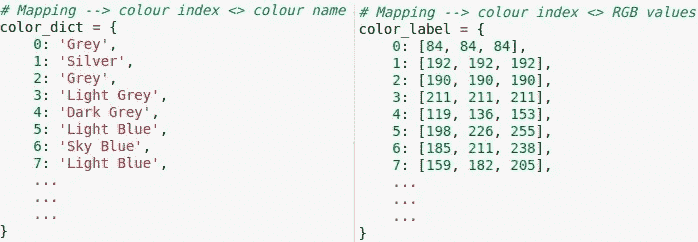
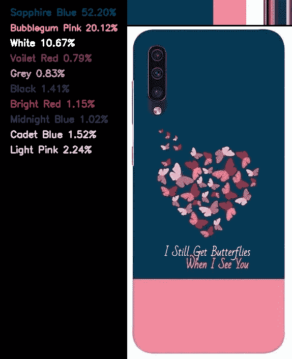

# 使用聚类/超像素的颜色检测

> 原文：<https://medium.com/analytics-vidhya/color-detection-using-clustering-superpixel-ddf04521425a?source=collection_archive---------9----------------------->



> 据科学家兼摄影师罗杰·克拉克博士称，人眼的分辨率为 576 百万像素(T2)。当你把它与 iPhone 7 的 1200 万像素的 T4 相机相比时，这是一个巨大的数字。

^这使得人眼对光高度敏感，使我们能够观察到视觉上的微小细节。此外，人类可以容易地检测颜色，因为他们从小就学习各种光强度与其相应颜色名称的映射。

有趣的是，科学家们已经确定，在实验室中，我们可以看到大约 1000 种暗光，以及大约 100 种红绿和黄蓝。所以那大约是**一千万种颜色**就在那里**。**虽然人类对光线强度的微小差异很敏感，可以轻松地将其映射到黑色、白色、红色、绿色、黄色、蓝色、粉色、灰色、棕色、橙色和紫色等基本颜色，但在映射复杂色调时，如 Burlywood、橄榄褐色、玫瑰色、玫瑰红、米色，甚至连标准人眼都难以分辨。

*在这种情况下，计算机可以有效地检测甚至非常复杂的颜色深浅，从而有效地解决许多现实世界的挑战，如丰富电子商务目录，*医疗诊断、化妆品、涂料、纺织品和印刷材料的过程控制等。



图片 1:来源:[斯坦福人工智能实验室](https://ai.stanford.edu/~syyeung/cvweb/tutorial1.html)

注意:图像是按列和行排列的正方形像素(图片元素)的阵列。

特别是，图像被存储为三维 NumPy 数组(颜色格式为 BGR/ RGB/ CMYK)。阵列的矩形形状对应于图像的形状。

为了理解使用 OpenCV 和 Python 的基于聚类的解决方案，让我们以印刷在手机外壳上的图像的颜色检测为例。对于任何电子商务平台，自动检测颜色的能力都是必不可少的，因为目录很大，无法手动注释。它还支持基于颜色的过滤器等功能，使产品搜索更加高效。

## 第一步:获取产品图片的边框



图 2:从原始图像中提取的手机外壳的边界。

```
# Load required libraries and image
import cv2
import numpy as np
from sklearn.cluster import KMeans
from skimage.segmentation import slickernel = cv2.getStructuringElement(cv2.MORPH_ELLIPSE, (5,5))image_path = "sample_image.jpg" # path of the imageimg = cv2.imread(image_path)
h, w, e = img.shape# GrayScale image
grayscale_img = cv2.imread(file, 0)
```

可能会出现图像包含多个产品，或者给定产品图像未正确对齐的情况。因此，我们可以启发式地提取图像中的感兴趣区域。下面的代码片段提取了产品区域，并假设焦点中的产品将覆盖至少 50%的图像。

```
cropped_product = img.copy()# Erosion and contour detection
border = cv2.dilate(grayscale_img, None, iterations=1)
border = border - cv2.erode(border, None)
contours, hierarchy = cv2.findContours(border,cv2.RETR_EXTERNAL,cv2.CHAIN_APPROX_SIMPLE)for c in contours:
    rect = cv2.boundingRect(c)
    area = cv2.contourArea(c)

    # Consider countors covering at least 50% of the whole image
    if area > 0.5 * h * w:
         cropped_product = cropped_product[   
             rect[1]:rect[1]+rect[3],
             rect[0]:rect[0]+rect[2]
         ]
         # Run code to identify colors
```

## 步骤 2:执行聚类以将相似的像素隔离在一起

为了对像素强度进行聚类，我们使用了 Kmeans 聚类，其中可以根据图像集中可能出现的最大可能颜色来定义最佳聚类数。

```
cropped_product = cropped_product.reshape((cropped_product.shape[0] * cropped_product.shape[1], 3))# cluster the pixel intensities
clt = KMeans(n_clusters = 15)
clt.fit(cropped_product)
```

我们还可以使用种子(通过能量驱动采样提取的超像素)或 SLIC(简单线性迭代聚类)等超像素算法来对图像平面中具有共同特征(如颜色或接近度)的像素进行分组。根据使用情况和性能，我们可能会决定使用 Kmeans 聚类或超像素来分离图像中的颜色。

```
seeds = cv2.ximgproc.createSuperpixelSEEDS(w, h, e, 100, 4, 2, 5)
seeds.iterate(cv2.cvtColor(img, cv2.COLOR_BGR2HSV), 10)# retrieve the segmentation result
labels = seeds.getLabels()
mask = seeds.getLabelContourMask(False)
```



图 4:从 OpenCV::createSuperpixelSEEDS 生成的图像遮罩；播种分离的像素

## 步骤 3:建立像素值和颜色名称的映射

就像人类学习不同光强度与其相应颜色名称的映射一样，我们必须创建一个 RGB 像素值与其颜色名称的映射，如下图所示。该映射用于根据最接近聚类质心的像素的 RGB 值指定颜色名称。一个颜色名称最多可以映射 1670 万种 RGB 值组合，但根据所需的颜色精度和颜色名称的可用性，我们只能映射几百种。



图 RGB 值和颜色名称的映射。

## 步骤 4:根据可用的映射为集群指定颜色名称

一旦我们对图像进行了聚类，下一个逻辑步骤就是识别与该聚类最接近的相应颜色名称。为此，我们确定最接近聚类质心的映射中可用的 RGB 值。

```
# grab the number of different clusters and create a histogram
# based on the number of pixels assigned to each cluster
numLabels = np.arange(0, len(np.unique(clt.labels_)) + 1)
(hist, _) = np.histogram(clt.labels_, bins = numLabels)# normalize the histogram
hist = hist.astype("float")
hist /= hist.sum()# representing the number of pixels labeled to each color
centroids = clt.cluster_centers_
color_values = centroids.astype("uint8").tolist()colours = {}
for colour_val, hist_val in zip(color_values, hist): b1,g1,r1 = colour_val
    min_dis = 9999999
    for k in range(0,645): r2,g2,b2 = color_label[k]
        dist = (b1-b2)*(b1-b2) + (g1-g2)*(g1-g2) + (r1-r2)*(r1-r2) if dist < min_dis:
            min_dis = dist
            index = k if color_dict[index] not in colours:   
        colours[color_dict[index]] = round(hist_val * 100, 4)
```

**颜色检测输出:**



图 5:图示 1)检测到的颜色直方图 2)颜色名称和百分比。

```
*Output dictionary; 
colours = {
  'Sapphire Blur': 52.20,
  'Bubblegum Pink': 20.12,
  'White': 10.67,
  'Voilet Red': 0.79,
  'Grey': 0.83,
  'Black': 1.41,
  'Cadet Blue': 1.52,
  'Midnight Blue': 1.02,
  'Bright Red': 1.15,
  'Light Pink': 2.24
}*
```