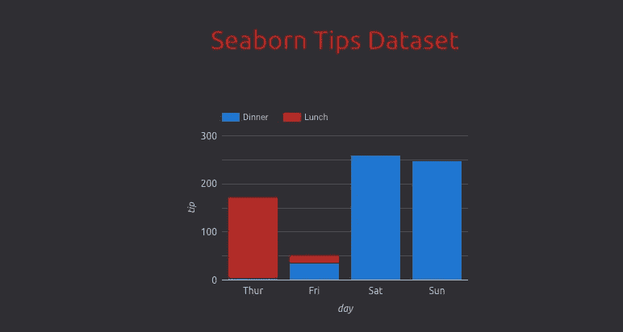
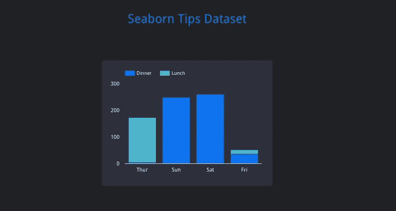
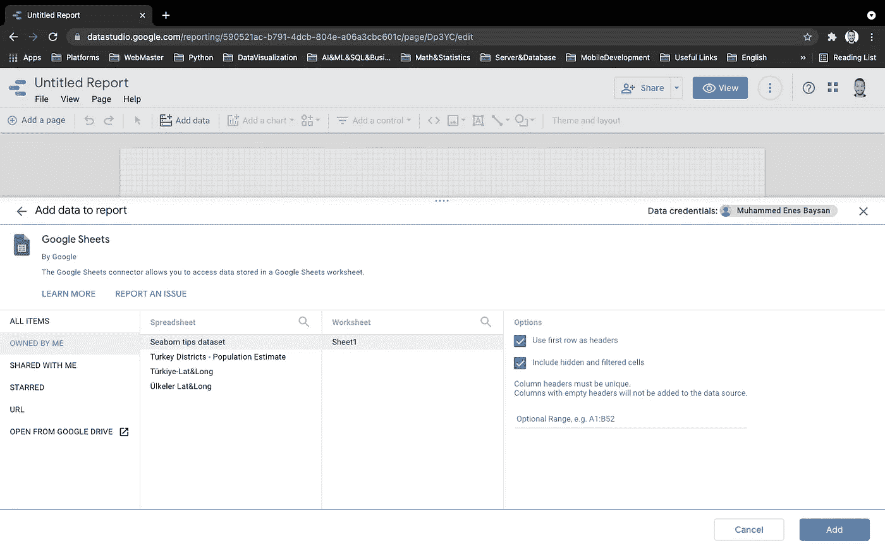
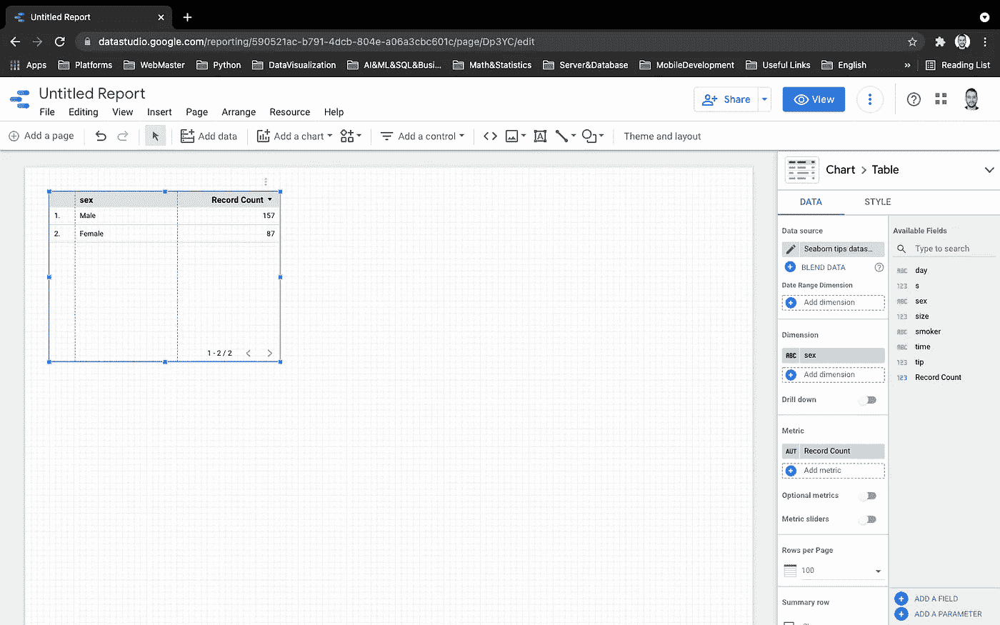
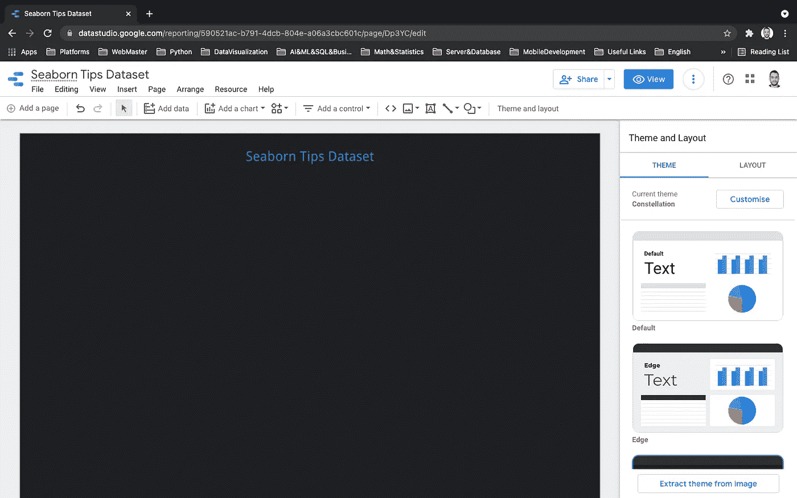
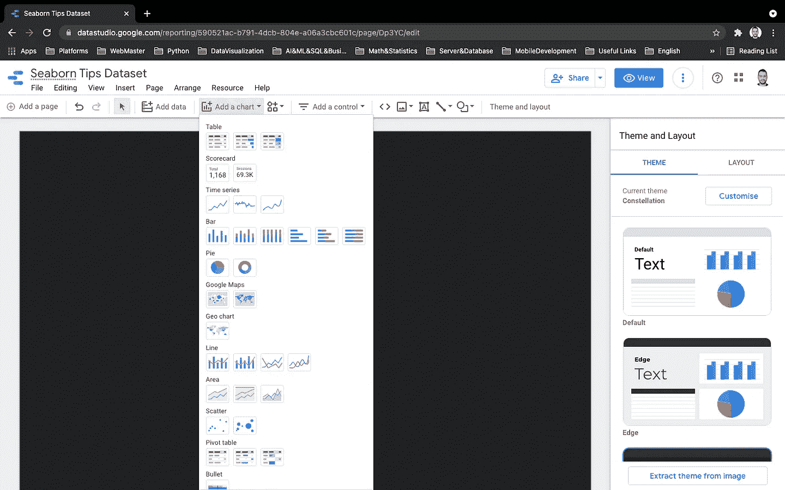
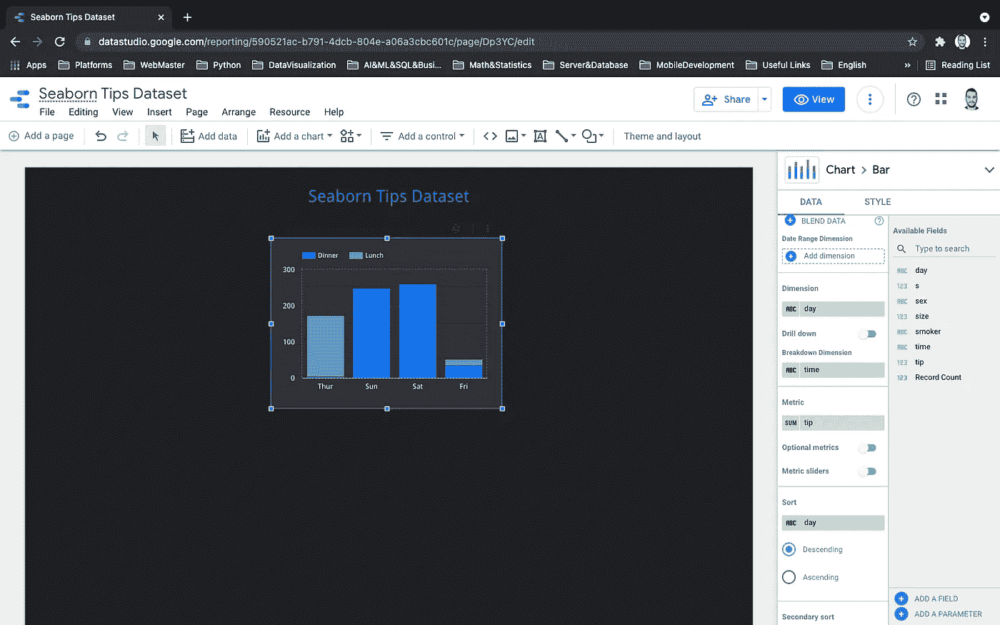
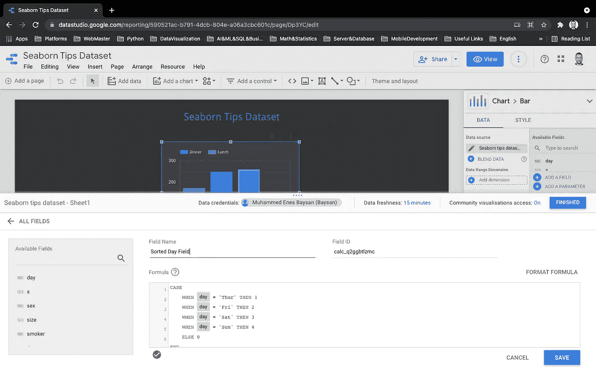
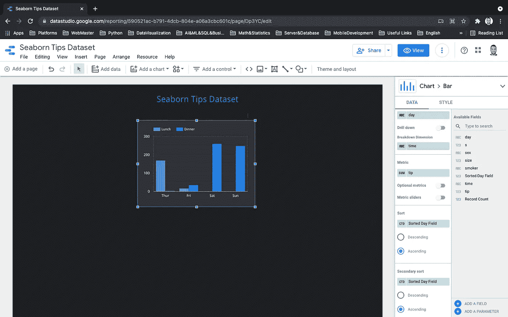

# Google Data Studio 中带有自定义字段的列排序

> 原文：<https://medium.com/analytics-vidhya/column-sorting-with-custom-field-in-google-data-studio-c3234bacb1a9?source=collection_archive---------0----------------------->

大家好。在这个故事中，我将解释如何在 Data Studio 中对分类数据进行排序。比如逐日排序。



我将使用 Python 的 seaborn 包中的 tips 数据集。您可以从[这里](https://docs.google.com/spreadsheets/d/1JecQoiuBy9iXXd8mg6Bztqk2LKIfEqmcG-meicEg1tY/edit?usp=sharing)或[这里](https://github.com/mwaskom/seaborn-data/blob/master/tips.csv)访问数据集。

在这个故事中，问题是把日子按正确的顺序放在 x 轴上。如果您尝试创建一个条形图并使用日列对日进行排序，那么您会发现问题，日列的值将被随机化。



如果你不知道 Google Data Studio 是什么，我可以告诉你它简直就是 Google 的免费数据可视化工具。你可以从[这里](https://support.google.com/datastudio/answer/6283323?hl=en)获得更多信息。

# 让我们从谷歌数据工作室开始

我将前往 [Data Studio](https://datastudio.google.com/) 并点击“创建空白报告”按钮。之后，我选择谷歌电子表格作为数据源。我正在将小费数据集上传到我的电子表格中。



当您启动报告时，Data Studio 会添加一个与您的数据相关的简单表格，如下所示。



我要对报告做些小改动。我将删除表格，更改报告样式并添加标题。



## 创建图表

现在，我将通过单击“Add a chart”下拉菜单来添加一个条形图。我会选择堆积柱形图。



创建图表后，我将设置维度和指标。你可以在右边栏看到我设置的指标和维度。



这里我想强调一点。正如我们从上面的图片中看到的，我为排序设置了日列。但是我们现在在这个图表上看到的并不是正确的排序。在这种情况下，我们应该使用“自定义字段”。我们将使用谷歌应用程序脚本创建一个自定义字段。实际上，在这个故事中，我不会深究 Google Apps 脚本，我只会介绍 Apps 脚本中的“Case”结构。如果你愿意，你可以从[这里](https://developers.google.com/apps-script)获得更多关于应用程序脚本的信息。

## 创建自定义字段

我将单击右侧边栏中的“添加字段”按钮。我将把这个代码块，给这个字段命名为“排序日列”并保存。现在，我们为应用程序脚本创建了一个公式。

```
CASE  
  WHEN day = 'Thur' THEN 1  
  WHEN day = 'Fri' THEN 2  
  WHEN day = 'Sat' THEN 3  
  WHEN day = 'Sun' THEN 4  
  ELSE 0 
END
```



在本例中，我们在 case 块中创建了条件语句。如果日期变量是“星期四”,公式将返回 1，如果是“Fri ”,将返回 2，依此类推。我们将它设置为排序字段。图表将使用此字段对变量进行排序。是的，我们已经按照我们想要的分类了。



我希望你喜欢它，它是有帮助的。

亲切的问候。