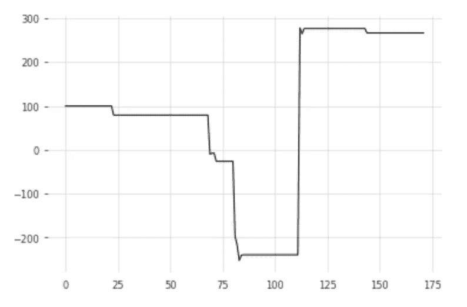
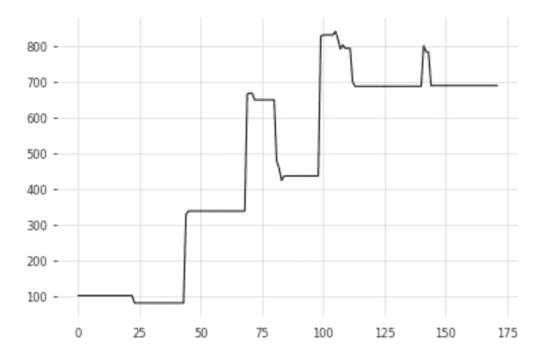

# 结合机器学习和 RSI 交易策略

> 原文：<https://medium.com/analytics-vidhya/combine-machine-learning-with-rsi-trading-strategy-ab4d5a8e5810?source=collection_archive---------0----------------------->

RSI 是交易策略中最常见的指标之一。我的想法是使用机器学习来预测 RSI 指标的未来值，并利用预测来改善交易信号。

# 时间序列预测

RSI 可以看作是一种沿着交易日的时间序列，我们可以用历史值来预测未来值。对于时间序列预测，有许多发展良好的算法和软件包。其中一个是达特。在 Dart 中，有多个[预测模型](https://unit8co.github.io/darts/generated_api/darts.models.forecasting.html)，这里我的代码中选择了 N-BEATS。

```
from darts import TimeSeries
import numpy as np
from darts.models import NBEATSModelmy_data = rsi(data,14,3,4)
series = TimeSeries.from_values(np.float32(my_data[:,4]))
train, val = series[:100], series[100:]model = NBEATSModel(input_chunk_length=14, output_chunk_length=5)
model.fit(train)
pred = model.predict(n=len(val),series=train)
```

# 简单的 RSI 交易策略

RSI 是一种动量指标，范围从 0 到 100。当指标值低时，它表明资产超卖，当指标值高时，它表明超买。

在交易中使用 RSI 最简单的方法是在 14 周期 RSI < 30 and to sell when the 14-period RSI > 70 时买入。这意味着我们预计 RSI 将在达到低阈值时上升。

在这样的预期下，我们可以用时间序列预测来确认未来的 RSI 将会上升。使用经过训练的时间序列模型，可以从过去 14 天的 RSI 预测未来 5 天的 RSI。

```
hist_series = TimeSeries.from_values(np.float32(hist))
pred = model.predict(n=5,series=hist_series)
```

因此**TS 预测 RSI 交易策略**将是:

> **买入信号:**如果 14 期 RSI < 30，且 5 日预测 RSI 的均值>当前 RSI。
> 
> **卖出信号:** if If 14 期 RSI > 70，以及 5 日预测 RSI 的均值<当前 RSI。

由于我们有来自时间序列预测的确认信号，我们在购买信号中使用了一个不太严格的阈值，并通过时间序列预测进行了过滤。我们期待它能抓住更多的贸易机会。

TS 预测 RSI 交易策略的最终版本将是:

> **买入信号**:如果 14 期 RSI < 40，以及 5 日预测 RSI 的均值>当前 RSI。
> 
> **卖出信号** : if If 14 期 RSI > 70，以及 5 日预测 RSI 的均值<当前 RSI。

# 回溯测试

我试图对 100 多只纳斯达克股票进行回溯测试，比较简单 RSI 交易策略和我的 TS 预测 RSI 交易策略的结果。在 100 只股票中的 67 只中，TS 预测 RSI 交易策略表现出较好的结果。完整结果可以从 git-repo 下载。

下面是一个例子——AMZN。

## 简单的 RSI 交易策略

```
-----------Performance----------- AMZN
Hit ratio       =  38.46 %
Net profit      =  $ 166.6
Expectancy      =  $ 12.81 per trade
Profit factor   =  1.44
Total Return    =  166.6 %

Average Gain    =  $ 108.94 per trade
Average Loss    =  $ -47.26 per trade
Largest Gain    =  $ 517.32
Largest Loss    =  $ -170.31

Realized RR     =  2.31
Minimum         = $ -252.09
Maximum         = $ 278.07
Trades          = 13
```



## TS 预测 RSI 交易策略

```
-----------Performance----------- AMZN
Hit ratio       =  45.83 %
Net profit      =  $ 588.35
Expectancy      =  $ 24.51 per trade
Profit factor   =  2.09
Total Return    =  588.35 %

Average Gain    =  $ 102.77 per trade
Average Loss    =  $ -41.7 per trade
Largest Gain    =  $ 390.95
Largest Loss    =  $ -170.31

Realized RR     =  2.46
Minimum         = $ 79.38
Maximum         = $ 840.54
Trades          = 24
```



了解更多详情。请检查我的 [git-repo](https://github.com/iwasnothing/ts-prediction-rsi) 。感谢 Sofien Kaabar，我使用他的 [git-repo](https://github.com/sofienkaabar?tab=repositories) 中的代码进行 RSI 计算和回溯测试性能评估。