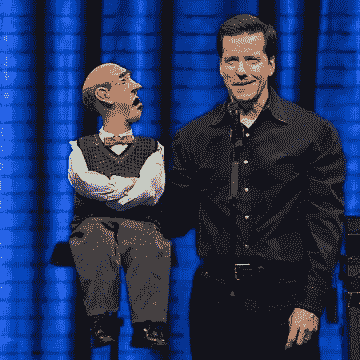
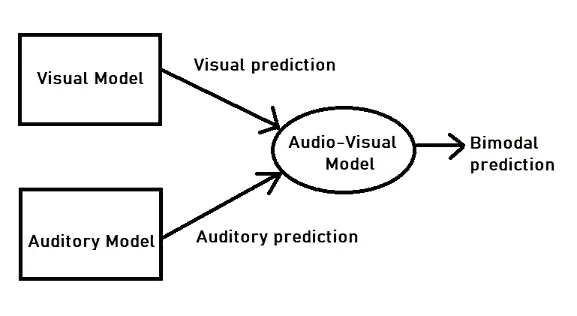
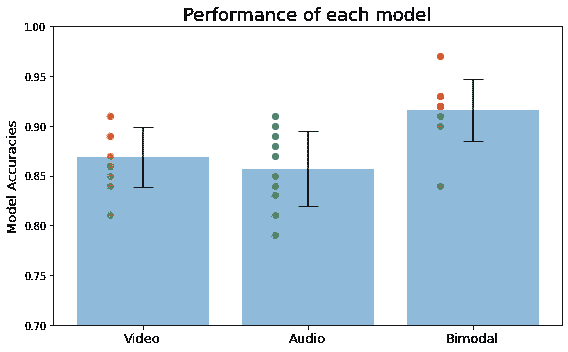

# 将认知心理学原理与深度学习相结合——第一部分

> 原文：<https://medium.com/analytics-vidhya/combining-principals-from-cognitive-psychology-with-deep-learning-part-1-e3e4ef174403?source=collection_archive---------0----------------------->

我们经常听说深度神经网络受到大脑的启发，它们正在“模仿大脑功能”。虽然神经网络确实受到大脑的启发，但“模仿大脑功能”远非事实。以机器视觉为例。最先进的计算机视觉模型主要依赖于大量可用的标记数据。然而，人类的视觉系统要比这复杂得多。我们的视觉系统更一般化，具有更丰富的对象表示。作为一名自学深度学习&认知科学爱好者，我高度相信这两个领域相辅相成，找到进一步结合它们的方法以推进深度学习非常重要。

以此为动力，我把硕士期间学到的一个认知心理学概念，应用到一个深度学习问题上。我使用了来自多感官整合计算模型的原理，并将它们与深度学习相结合，从包含名人话语的视频数据集( [VoxCeleb](https://www.robots.ox.ac.uk/~vgg/data/voxceleb/) 数据集)中对性别进行分类。在这篇文章中，我将向你介绍多感觉整合，多感觉整合的心理物理学研究告诉我们什么，以及我如何将多感觉整合的一个原则应用到我的深度学习模型中。*如果你想先看看代码，可以访问我的 GitHub* [*资源库*](https://github.com/kaneelgit/msi_voxceleb) *。*

# **什么是多感官整合？**

我们的大脑将来自外部世界各种来源的多种感官信号结合起来，形成一部三维的、全景的、完全沉浸式的电影。例如，当你与朋友交谈时，大脑从视觉和听觉中获取信息。通过使用这两种感觉，大脑不仅能听到她在说什么，还能看到她的面部表情。这有助于大脑更好地理解她所说的话。

**图 1:** 大脑结合了视觉和听觉线索

所以对大脑或任何预测系统来说，使用多种信息源来做出决策是有利的。在最坏的情况下，如果其中一个信息源不可靠，系统可以在更可靠的信息源上权衡其决定。

认知心理学的实验研究进一步完善了这些原则。文献中一项突出的研究是由 *Alias 和 Burr 进行的视听研究。*这项研究揭示了三个关键观点。

*   大脑最佳地结合了听觉和视觉数据——首先，他们表明听觉和视觉信息的结合产生了比单独使用视觉和听觉信息更好的结果。换句话说，使用多种感官会导致更准确的预测。
*   当听觉信息不确定时，视觉信息起主导作用——他们还提出，给定不确定的听觉信息，大脑会更依赖视觉信息。一个著名的例子是古老的腹语艺术(图 2)。腹语让一个人的声音听起来像是来自别处(通常是来自木偶)。由于木偶的嘴在动，大脑倾向于认为声音来自木偶。
*   当视觉信息不确定时，听觉信息起作用——这项研究的一个重要发现是，在视觉信息不确定的情况下，大脑更依赖听觉信息。这表明了相反的腹语效果。

**图 2:** 腹语是一种让自己的声音从别处传来的艺术。

从数学上来说，我们可以通过每个单独来源的预测的精确度来衡量综合结果。*(精度是对信息源可靠性的衡量)*

**方程式 1:** 视觉(v)，听觉(a)

根据等式 1，每个源的预测由其精度加权。回到腹语的例子，因为声音似乎来自不同的位置，所以听觉信息的精确度较低。因此，基于等式 1，最终预测更多地由视觉信息加权。因此，大脑被骗以为声音来自木偶。

这是我阅读的第一批期刊文章之一，也是我最喜欢的论文之一。如果你想看的话，我在参考文献中引用了杂志上的文章。我非常鼓励你去读它，因为它是一部经典之作！*如果你也喜欢检查认知模型的代码，你可以到这个* [*Jupyter 笔记本。*](https://github.com/kaneelgit/Simulations-from-papers/blob/main/The%20ventriloquist%20effect.ipynb)

# **在深度学习中使用这些原则**

正如我之前提到的，在这个项目中，我使用了“ [VoxCeleb](https://www.robots.ox.ac.uk/~vgg/data/voxceleb/) ”视频数据集来对说话者的性别进行分类。在这个项目的第一部分，我测试了多感官整合的第一个概念，即结合多种来源的信息会产生最佳结果。为此，我首先创建了两个模型，一个是视觉模型，一个是听觉模型，来预测说话者的性别。然后，我将这两个模型的性能与一个组合模型进行了比较。

**视觉模型—** 我用于分类任务的第一个模型是一个纯视觉模型。我从视频中提取帧，创建了 2D 卷积神经网络(CNN)，并训练该模型来预测视频中说话者的性别。CNN 由三个卷积层组成，每个卷积层后面都有批处理规范化和最大池。卷积层的输出随后被展平，并通过一个下降层发送，然后是三个密集层。你可以在这里查看 T2 的笔记本。

*我还创建了一个 3D CNN 模型(空间和时间的),但最终没有使用。你可以在这个* [*colab 笔记本里查看这个型号。*](https://colab.research.google.com/github/kaneelgit/msi_voxceleb/blob/main/video_classification_3d.ipynb)

**听觉模型—** 对于纯音频模型，我首先从视频文件中提取 3 秒钟的音频，然后创建 Mel 频谱图。*(Mel 频谱图是时间与频率的关系图，其中频率被转换为 Mel 标度。据研究，人类更善于察觉低频的差异，而不是高频。因此，在处理人类音频样本时，最好将频率转换为 mel 标度)*

纯音频模型的模型架构类似于纯视频模型。我使用了一个 2D CNN 模型，该模型有三个卷积层，每个卷积层后面都有批处理范数和最大池。卷积层的输出随后被展平，并通过两个下降层和三个密集层发送。你可以在这里查看 colab 笔记本[。](https://colab.research.google.com/github/kaneelgit/msi_voxceleb/blob/main/Audio_classification.ipynb)

**视听模型—** 对于视听模型，我使用经过训练的视觉和听觉模型来生成单峰预测，然后使用等式 1 来计算双峰预测。我假设每个模型的精度为 1 (100%精确)，因此该场景中的视听模型基本上是平均仅视觉和仅听觉模型的两个输出，然后预测最终结果。您可以在图 3 中看到视听模型的图表。

**图 3:** 视听模型架构

# **结果**

音频和视觉模型都被训练 50 个时期，批次大小为 8，并且当训练损失连续五个时期下降时停止。两个模型都使用 Adam 优化器进行训练，并且模型权重被分别保存。如上所述，使用精度为 1 的音频和视觉模型的保存的权重来创建音频-视觉模型。

然后，我从“VoxCeleb”数据集中挑选了 10 个新的数据批次(每个包含 100 个视频)，并测试了三个模型。测试标准是每个批次的模型准确性。结果如下图 4 所示。*可以去这个* [*colab 笔记本*](https://colab.research.google.com/github/kaneelgit/msi_voxceleb/blob/main/Model_comparisons.ipynb#scrollTo=k2pzeIsy-c_H) *查看成绩。*

**图 4:** 三个模型的模型精度。通过寻找 10 个批次(每个批次包含 100 个视频)的准确度来测试模型。条形图代表平均值，误差条形图代表每个模型的标准偏差。分散的点是每批的单个精度。

结果表明，视频、音频和视听(双峰)模型的平均准确率分别为 87%、86%和 92%。遵循上述最优原则，与音频和视觉模型的平均预测精度相比，音频-视觉模型的平均预测精度更高。这表明使用多种信息源对人工系统也是有利的。

结果还表明，在两个单峰结果(视频和音频)中，视觉准确性高于音频准确性。这很有趣，因为对人类的心理物理学研究表明，与其他感官相比，我们的视觉系统更准确。其原因可能是我们通过视觉感知周围环境的大部分信息。虽然没有实质性的证据表明这在人工系统中是正确的，但我认为指出这一点是一个有趣的事实！

# **未来工作**

这里，我们假设音频和视频源都非常精确。如果其中一个来源被破坏了呢？在这种情况下，我们可以对损坏的源使用较低的精度，对更可靠的源使用较高的精度。例如，如果背景中存在使音频源不可靠的下雨噪声，那么模型可以更多地依赖于视觉信息来进行预测。在未来，我计划将噪声注入单峰网络(例如将雨声或白噪声混合到音轨)，并让神经网络预测视频*的结果和精度(当你注入更多噪声时，源变得越不精确)。*然后，我们可以创建一个视听模型，根据每个源的精度来组合结果。根据多感官整合原则，组合网络仍应比单峰网络表现更好。

# **结论**

在这里，我谈到了我如何使用来自多感官整合的原则，并将它们与深度学习相结合。我使用开源视频数据集，结合视觉和听觉信息，对视频中说话者的性别进行分类。我比较了单峰网络和组合网络，看看后者是否能产生最佳结果。同意来自多感官整合文献的原则，组合模型实际上产生了最佳结果。文献中还有进一步的证据表明，多模态数据可能对人工智能非常有影响，并且可能对解决自动驾驶、医疗保健和其他各个领域的现实世界问题非常有用。

这结束了我的第一篇关于在深度学习中使用认知心理学概念的博客文章。在未来，我希望研究更多关于认知心理学的概念，并将它们与深度学习相结合。你可以在媒体上跟随我的旅程。非常感谢您的阅读！

# **参考文献**

[1]阿莱，大卫和大卫伯尔。"腹语效果来自接近最佳的双峰整合."当代生物学 14，第 3 期(2004 年 2 月):257–62

[2] Lorijn Zaadnoordijk，Tarek R. Besold 和 Rhodri Cusack，“无监督机器学习的下一件大事:婴儿学习的五个教训”，*ArXiv:2009.08497【Cs】*，2020 年 9 月 17 日，[http://arxiv.org/abs/2009.08497](http://arxiv.org/abs/2009.08497)。

[3] Jiquan Ngiam 等人，“多模态深度学习”，未注明，8。