# 数据框的公共列代码

> 原文：<https://medium.com/analytics-vidhya/common-column-codes-for-dataframe-12778fa265a3?source=collection_archive---------10----------------------->

## 更快地完成工作。这里是一些常见的列修复！

我一直在努力搜索和寻找在 Python-Pandas 数据框架的列上执行的基本代码实用程序。

我很惊讶地发现，如果我搜索一个特定的函数，通常要花 2 到 3 次尝试才能得到我想要的结果。

我敢肯定，就像我一样，任何其他初学者都会感到同样的沮丧，并花费这么多徒劳的时间来寻找丢失的部分。

虽然构建逻辑是绝对需要的，但是有一个可以运行的引用也不是那么糟糕。

**这里是一些常见的列和行代码:**

特雷弗·诺亚的日剂量:)

**我正在使用来自 Kaggle 的'** [**星巴克菜单营养**](https://www.kaggle.com/starbucks/starbucks-menu) **'数据集，**

**你可以找到，这里:**

 [## 星巴克菜单的营养事实

### 星巴克菜单项目的营养信息，包括食物和饮料

www.kaggle.com](https://www.kaggle.com/starbucks/starbucks-menu) 

所以让我们开始吧！➡

**设置最大显示选项**

如您所见，所有的行都没有完整显示。

让我们来看看如何实现这一点。

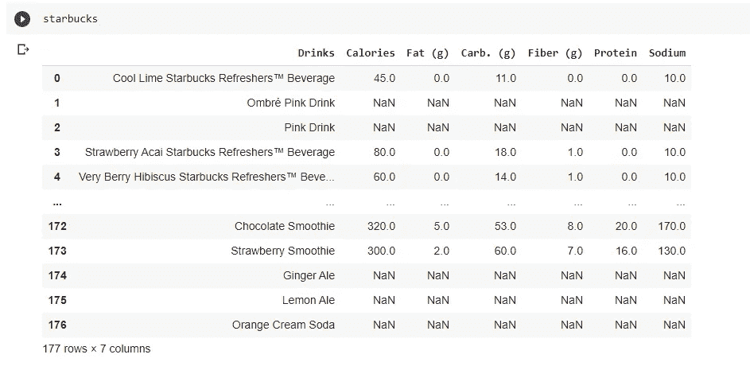

如何查看数据集

**只是两行** [**的代号**](https://pandas.pydata.org/pandas-docs/stable/user_guide/options.html) **:**

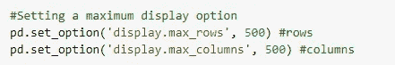

代码可视化

**输出:**

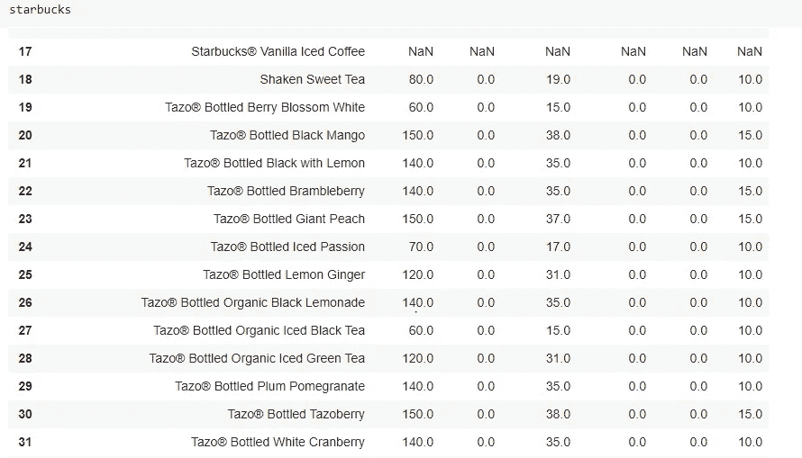

我们得到一个滚动条，显示整个数据集

**如何删除一列(或一行)**

让我们从数据集中删除第 1 行和第 2 行。我们将在这里使用行索引并从实际数据帧中删除，而不是返回一个新的数据帧。

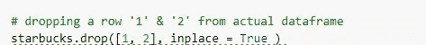

代码可视化

结果输出:

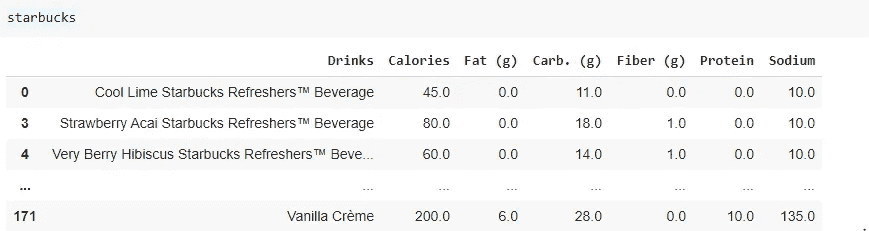

如您所见，行索引 1 和 2 不再在我们的数据帧中

类似地，对于列，如果我想从我的数据框中删除钠，那么:

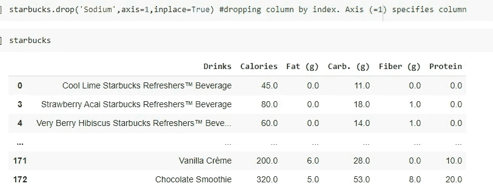

代码和输出

**如何在不填充虚拟值的情况下重新索引列**

正如您可能观察到的，当我们删除第 1 行和第 2 行时，这些行的索引被弄乱了，而这些列是正常的。

为了实现正确的索引，我们需要重置它:

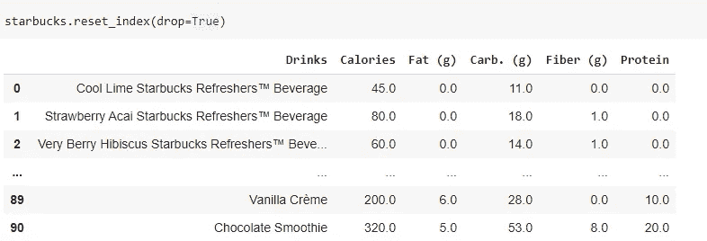

就这样，我们重置了它

**如何覆盖数据帧中特定单元格的值**

如果我们知道列名和行索引，那么覆盖一个单元格值的操作如下:

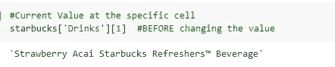

变化前

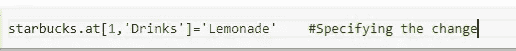

代码

输出:

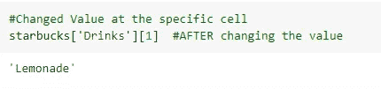

输出

**如何从数据帧中删除重复项，同时保留它们的第一次出现**

我们可以看到下面的第 3 行和第 4 行是重复的，那么如果我只想要它的第一次出现并删除更多的重复，该怎么办呢？

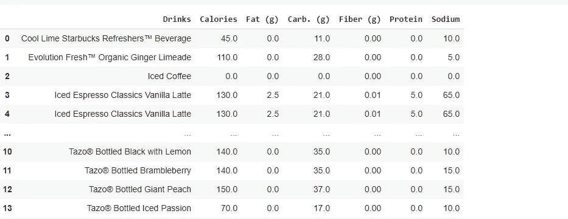

参见第 3 行和第 4 行

这是怎么回事:

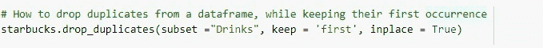

代码片段

输出:

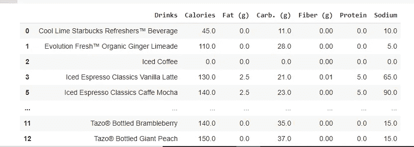

正如您所注意到的，第 4 行已经被删除，取而代之的是第一次出现的第 3 行。

**如何在现有数据帧的特定位置/索引处插入列**

假设我想插入另一列，比如说在列的第二个位置插入“**客户评论**，那么我们是这样做的。

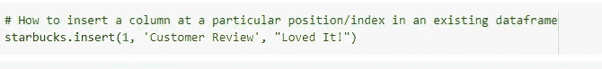

代码片段

输出:

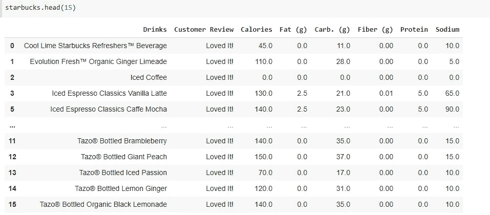

耶，我们爱星巴克！❤

**如何在数据帧中找到一个值与另一个值匹配的索引**

假设我想找到 **"Fat (g)"值为 0 的行，**我们该怎么做…？

目前我们知道，我们的数据帧看起来像这样:

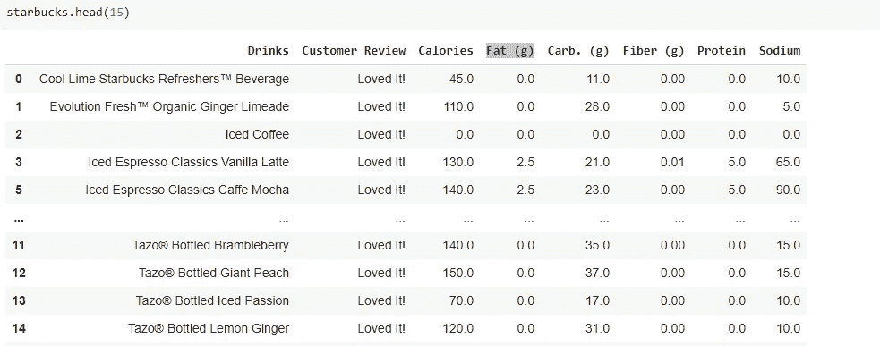

大多数饮料都不含脂肪

让我们看看如何找到:

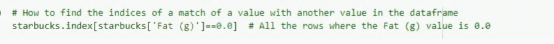

代码片段

输出:

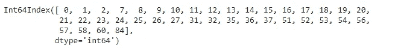

所以，这就是这篇博客的全部内容，希望我减轻了你的搜索工作，为你节省了一些甜蜜的时间。

***为了更容易地找到你喜欢的库，查看 Python 文档:***

1.  [***https://docs.python.org/3/***](https://docs.python.org/3/)
2.  [***https://pandas.pydata.org/docs/***](https://pandas.pydata.org/docs/)
3.  [***https://pypi.org/***](https://pypi.org/)

诸如此类，满足你的所有需求。

快乐学习！😊