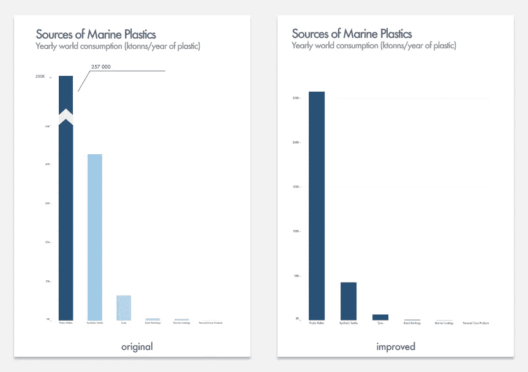
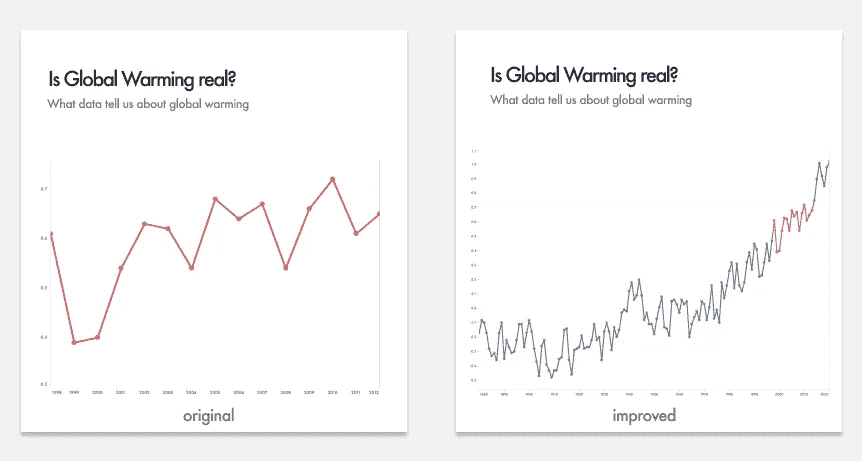
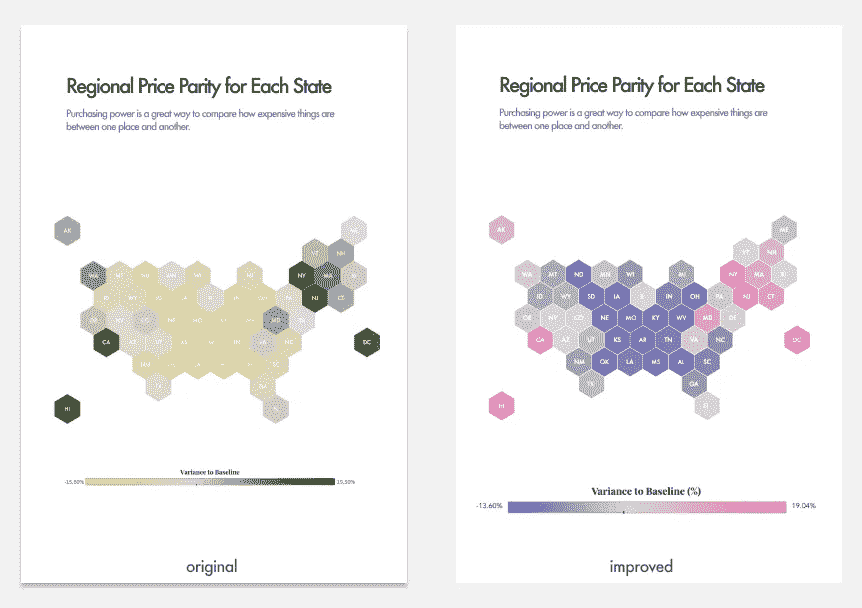
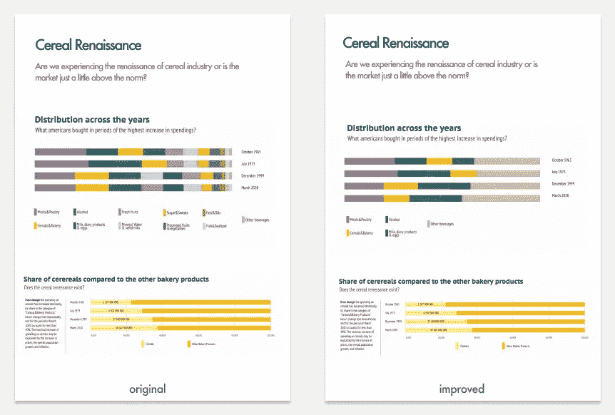

# 常见的数据可视化错误

> 原文：<https://medium.com/analytics-vidhya/common-data-visualization-mistakes-2b823f1eb23e?source=collection_archive---------8----------------------->

## ***初学者如何避免错误，不要被别人的错误所迷惑***

作为一名信息设计师，我努力认真对待数据可视化，通常会花很多时间寻找最佳方式来准确地可视化数字，并以最佳方式支持故事。然而，有时我会出错，但是我学得越多，我分析和比较我的视觉化图像越多，我就越能发现实际上很容易避免的常见陷阱。
所以在这篇文章中，我想谈谈最常见的(可能是最危险的)数据可视化错误。

我把我的错误分为两类——功能性的和交流性的。

**功能性错误**是最糟糕的，因为它们促进了数据的误导性表示，使得很难甚至不可能获得公正的见解。

沟通错误没有那么危险，但是它们会导致额外的复杂情况，使可视化变得混乱。换句话说，观众需要更多的时间来理解项目的主旨。

让我们仔细看看每一种类型

**功能错误**

**省略基线或截断标度**

给定的可视化说明了污染世界海洋的海洋塑料的分布。重点是展示不同塑料来源之间的差异。可能设计者认为，如果塑料颗粒超过其他来源如此之多，以至于我们甚至无法检查其他组(如海洋涂料或个人护理产品)的数量，那么截断横条以保存 Y 轴上的绝对值也没有什么坏处。
但是这个图表破坏了棒线之间的真实比例，在视觉上夸大了其中一些棒线的数量。

使用轴时要非常小心——截断或省略基线——因为精确的数据表示可能会被破坏

**用樱桃秤操纵数据**

这是 1998 年至 2012 年期间气温变化的可视化图，显示气候并没有变暖，这与普遍的看法相反。但如果你缩小范围，你会发现这种说法与现实相去甚远。
有时人们会下意识地看到他们期望看到的东西，但有时人们会操纵数据来证明有吸引力或有益的观点。摘樱桃是否认科学或作为宣传工具的常见做法。就像这张图表一样，通过故意挑选适当的时期，可以创造一个人为的“暂停”，即使有持续变暖的趋势。知道你不仅可以在你的项目中避免这些错误，而且不会被别人愚弄。

**通信错误**

令人困惑的颜色选择

图标、字体和配色方案都带有影响他们感知的内涵。
这是每个州的地区平价的可视化，其中绿色的范围表示与全美中值的差异。深绿色代表价格较高，浅绿色代表价格较低。

这篇文章的主旨是展示远程工作时更便宜的住处。在这种情况下，高价格是一个警告信号，虽然绿色通常被视为宁静、健康或自然的颜色，但所选的调色板使这张图表令人困惑。
这里我要说的是，在其他情况下，例如根据信息，高价格是一种优势时，这种配色方案可能有效，但在目前的情况下无效。

在我的数据可视化中，我试图避免使用红色作为唯一的警告色，并选择了以下配色方案:它看起来很新鲜，但仍然传达了相同的想法。

**太多…颜色，细节…太多了**

这是我为“周一改头换面”挑战之一所做的关于谷物复兴的作品。起初，我喜欢它，我喜欢颜色的多样性，它们的组合方式，以及整体设计。然而，现在我看到有太多的细节偏离了文章中陈述的主要问题。然而，从技术上来说，这张图表没有错，但对我来说，它现在看起来还没有完成，可以改进。

这是中间阶段的一个很好的例子，它使我们能够检查其他产品的份额和位置，将它们聚集到一个名为“其他产品”的新类别中，并将观众的注意力吸引到具有最大市场份额的一组产品上，这或多或少与谷类产品相当。

**看错了观众**

有大量的方法来可视化数据，各种各样的工具，交互性和复杂性的水平，你可以使用你的电脑，甚至用手绘制你的 viz。而且每一种方法都有存在的权利，只要你知道哪一种适合选择的受众和选择的目标。

要创建一个令人惊叹的 viz，你不仅要探索你拥有的数据，还要探索隐含的受众。儿童地图集和成人地图集之间存在巨大差异，面向公众和专家的信息图表也是如此。例如，尽管人们普遍认为 0 是一个起点，但对于某些系统和专业领域来说，这并不完全正确。

充分了解你的信息是什么，谁是你的目标受众。

当然，这只是冰山一角，作为一个快速发展的领域，数据可视化为最佳实践留下了大量空间。但这是一个避免最常见错误的良好开端，认识到别人的错误不仅发展了你的数据技能，还发展了你的批判性思维和数据素养。