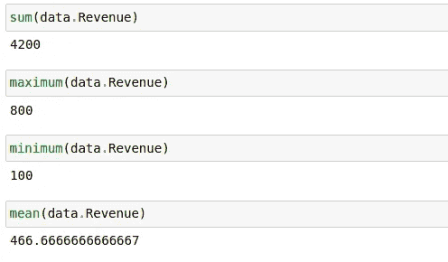
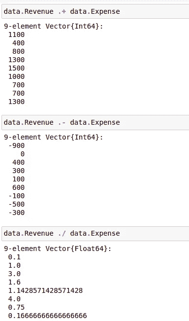

# Julia 中常见的 Excel 函数

> 原文：<https://medium.com/analytics-vidhya/common-excel-functions-in-julia-df51674a896e?source=collection_archive---------0----------------------->


去年我写了一篇关于如何用 Python 实现常见 excel 函数的文章。

现在我正在学习茱莉亚语言。这是一种为数据科学工作负载而设计的语言。它的语法和 python 一样简单，但是它的代码运行速度几乎和 c 一样快。

所以我写了这篇关于如何在 Julia 中实现表格数据的常见操作的文章。

1.  **朱丽亚的安装**

您可以从下面链接下载并执行适用于您操作系统安装程序来安装 Julia

【https://julialang.org/downloads/ 

2.**安装所需的库**

我们需要 XLSX，Dataframe 和统计库来处理表格数据。为了在 Julia 中安装库，我们使用库 Pkg 的 add 函数。

首先在 windows 命令提示符或 linux 的 bash 中运行以下命令，以获得 Julia 命令提示符

```
Julia
```

然后，我们通过在 Julia 的命令提示符下执行以下命令来安装这些库

```
using Pkg
Pkg.add("DataFrames")
Pkg.add("XLSX")
Pkg.add("Statistics")
```

我用 Jupyter 笔记本进行数据探索。要安装 jupyter notebook，在 Julia shell 中运行以下命令

```
Pkg.add("IJulia")
```

要打开 jupyter 笔记本，请在 Julia shell 中运行以下命令

```
using IJulia
notebook()
```

下一节中的命令在 Jupyter notebook 中执行。

3.**库的导入**

所需的库按如下方式导入

```
using XLSX
using DataFrames
using Statistics
```

4.**读取 Excel 文件**

您必须提供 excel 文件的文件名和工作表名，以使用 XLSX 库的 readtable 函数


如果您想读取 CSV 文件，您可以使用以下语法

```
using CSV
DataFrame(CSV.File(input))
```

5.**数据检查**

我们可以通过使用 Julia 的第一个和最后一个命令来可视化笔记本中的数据帧。“First”输出数据帧的前 n 行。Last 可用于输出数据帧的最后几行。


因为我提供了 5 作为参数，所以第一个命令输出数据帧的前五行。最后一个命令输出了数据帧的最后五行。

6.**通过索引访问数据**

我们可以通过向[]操作符提供行和列来访问数据帧的行和列。我们必须提供行和列。如果我们想选择所有的行或列，那么我们必须使用“:”操作符。


1:3 被转换成 1 到 3 的数组。因此，这选择了行 1 到行 3。在第一个例子中，我提供了一个列名，因此它返回该列的前 3 个元素。当我提供“:”操作符作为列选择器时，它返回 dataframe 的前 3 行的所有列。

我们可以使用数组和逻辑数组进行行或列索引。请注意“.”运算符用在'


7\. **Sum，Min，Max，Mean** 之前

Sum、minimum 和 maximum 是核心的 Julia 函数，可用于任何 Julia 数组或向量。均值函数由我们导入的统计软件包提供。



8.**元素式操作**

我们可以对数据帧的列执行算术运算符。标量数字被广播到数据帧的列的大小。我们用“.”算术运算符之前的运算符。在朱莉娅加了“.”在加减等算术运算符之前，向量化运算。


9.**列智操纵**

以类似的方式，我们可以在数据帧的两列之间进行算术运算



10.**琴弦操作**

对于串联，使用“*”运算符。在它之前添加一个点来矢量化操作。


Julia 的 Select 函数用于将特定函数应用于数据帧的一列。Byrow 用于在 dataframe 的列上应用函数元素方式。通过这种方式，我们可以获得字符串列的前 5 个字符。这类似于 excel 的左功能。


--> '用于创建一个匿名函数来获取字符串的前 5 个字符。

Julia 提供了常见的字符串操作函数，其细节如下

[https://docs.julialang.org/en/v1/base/strings/](https://docs.julialang.org/en/v1/base/strings/)

我们可以使用上面链接中给出的常用字符串操作函数在 Julia dataframe 中进行字符串操作。Startswith、endswith 和 occursin 是最有用的函数。


11 **和积**

Sum 函数可用于两列乘积的输出。它将等同于 Excel 中的 sumproduct 函数。


12 **排序**

Sort 函数可用于对数据帧的行进行排序。我们必须提供列名或列名列表，数据帧的行将在其中排序。


对于跨多个列的排序，我们提供了列的列表。


为了以相反的顺序排序，我们必须提供 rev= True 作为函数的关键字参数。

13 **独特的**

Unique 函数可用于获取数据帧中的唯一行。如果我们不提供列名作为参数，它将考虑所有列来决定一行是否唯一。如果我们想在 dataframe 的列子集上获得唯一的值，我们可以提供一个列名或列名列表。


14 **Countif**

COUNTIFS 函数在 excel 中用于对满足一个或多个条件的单元格区域进行计数。

count(df)仅返回数据帧或数组中的行数。但是我们也可以提供一个函数作为参数之一来计数。然后，它将返回函数返回 true 值的行数。


此函数计算数据帧中收入大于 100 的行数。每个 row 函数将数据帧转换为其所在行的可交互数据。然后，对其应用第一个参数中给出的匿名函数。

15 **枢轴**

在 Excel 中，数据透视表用于计算分组统计数据。Julia 没有数据透视表功能，但是使用 groupby，我们可以对数据进行分组统计。

首先使用 groupby 函数，我们得到数据中的组。然后，我们使用组合函数来应用聚合函数，以获得分组统计信息。


这里我们将 location 列传递给 groupy。它将根据位置值识别组。我们可以传递其他列或列名列表。

然后，我们对每个组的收入列应用 sum 函数。我们可以像在第二个例子中传递 mean 一样传递其他函数来获得组内平均值。

16 **过滤器**

有两种主要方法来过滤数据帧的行。我们可以使用过滤函数，它是 Julia 库的一部分。或者我们可以使用 subset 函数，它是 Julia dataframe 库的一部分。

我们向过滤函数传递两个参数。第一个参数是一个函数，它迭代数据帧的每一行。在下面提到的示例中，如果收入列大于零，则该函数返回 true。Filter functions 返回函数为其返回 true 值的行。


我们可以使用按位 and (&)或按位运算符(|)来组合多个列的条件。


子集也用于过滤数据帧的行。在子集函数中，我们必须为每一列分别指定函数。在下面给出的示例中，函数应用于 dataframe 的 Group 列。它返回组列值大于 3 的行。


如果我们想在多列中应用条件，那么我们可以分别为每一列提供函数。它返回组列值大于 3 且收入列值大于 200 的行。


17 **Vlookup**

excel 中的 VLookup 函数用于连接 Excel 中的两个表。它可以在 Julia 中使用 leftjoin 函数实现，如下所示。这里的组列是两个表之间的公共列。


18 **组合数据帧**

我们可以使用 vcat 函数将一个数据帧的行追加到另一个数据帧中。


对于水平列追加，我们使用 hcat 函数。如果列不是唯一的，我们必须传递 makeunique = true。


19 **如果否则**

如果函数在 excel 中用于根据条件在值中进行选择。Julia 的 Ifelse 函数可用于根据条件的结果返回值。如果收入大于 100，下面给出的函数返回 1，否则返回 2。


**20。保存文件**

如果要将输出保存为 CSV 文件，可以使用以下语法

```
CSV.write(output, df)
```

如果我们想将输出保存为 excel，我们可以使用以下语法

```
XLSX.writetable("df.xlsx", collect(DataFrames.eachcol(df)), DataFrames.names(df))
```

21.**总结**

我们可能有一个 excel 工作表，其中有许多公式。我们想在 Julia 中实现工作表的逻辑。在这种情况下，使用这些 python 函数，我们可以轻松地从 Excel 过渡到 Julia。