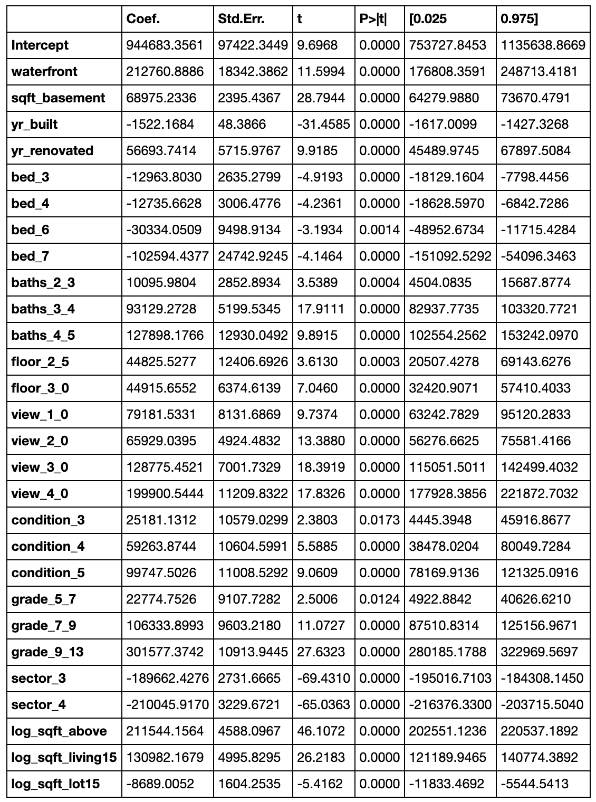
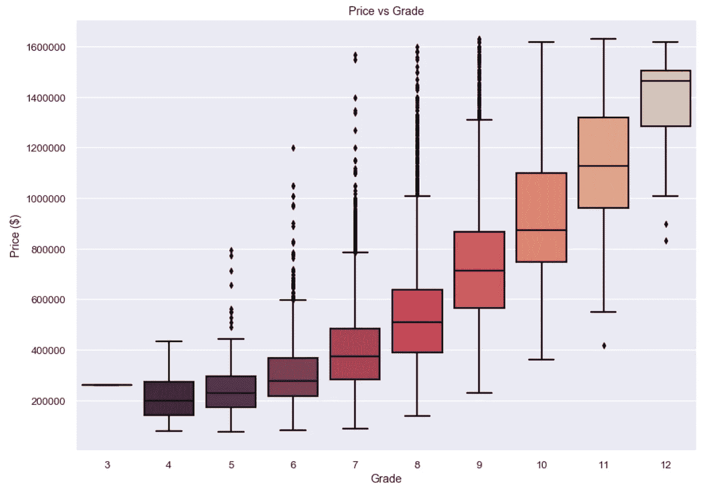
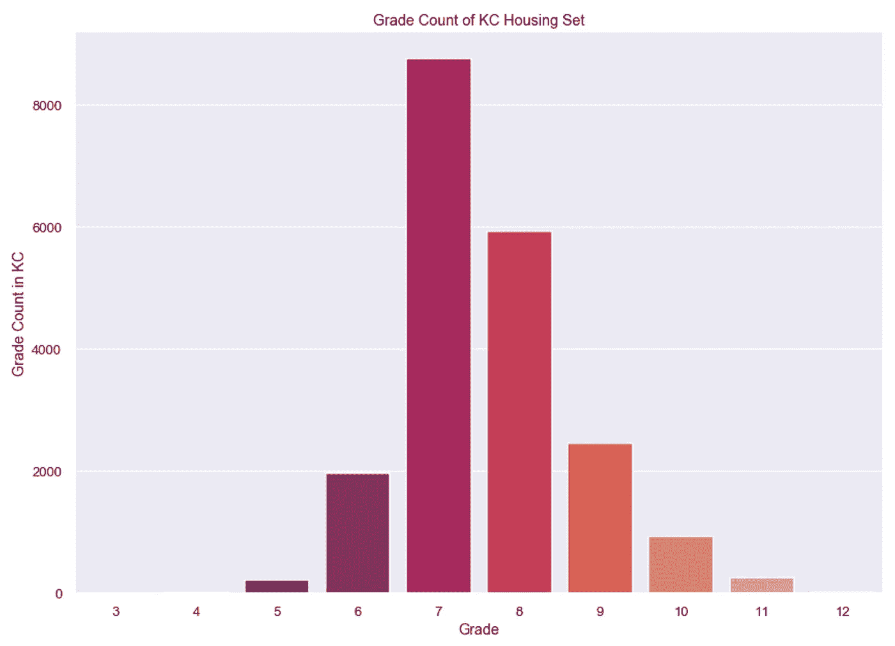
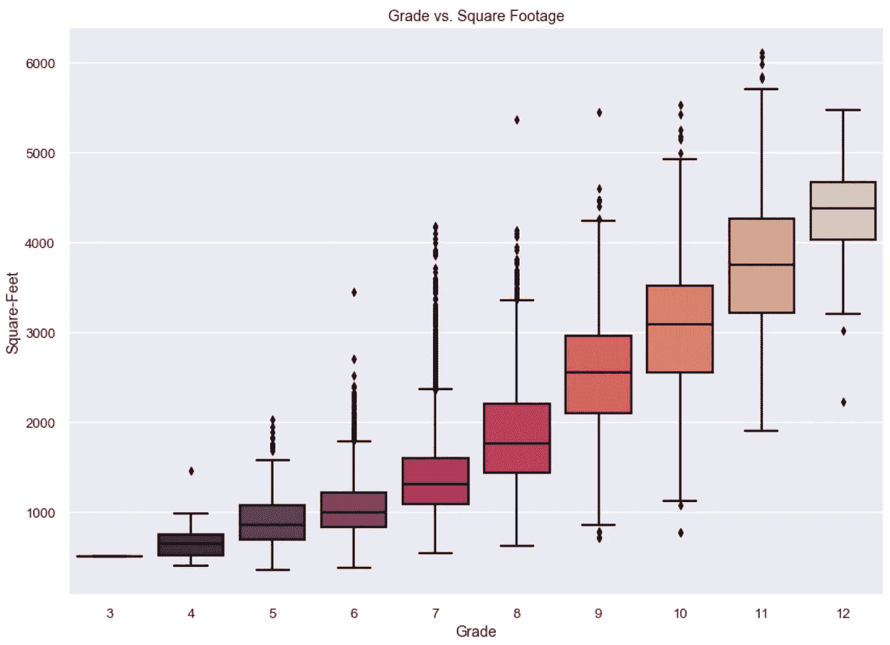

# 向非技术客户传达我的数据分析结果

> 原文：<https://medium.com/analytics-vidhya/communicating-your-data-analysis-results-for-non-technical-clients-bdb3b6d218d0?source=collection_archive---------8----------------------->

非技术翻译的一个例子


卢卡斯·布拉塞克在 [Unsplash](https://unsplash.com?utm_source=medium&utm_medium=referral) 上的照片

在这篇文章中，我将讨论我在 Flatiron 工作期间发现非常重要的数据科学的一个方面:向非技术观众传达你的发现。

数据无处不在，而且很多。有很多东西需要消化，它可能会变得非常技术性，特别是当你开始进行机器学习和深度学习时。结果是数据科学最重要的部分，知道如何弥合 RMSE 数和对公司的可操作性见解之间的差距对于在另一端倾听的人来说是非常棘手和困惑的。

用例总是取决于项目和您正在处理的数据类型。在许多情况下，为了发现隐藏在数据中的趋势或机会，在数据探索和分析中发挥创造性是值得的。然而重要的是，理解你工作中独特的商业案例需要研究和与你的公司或客户相处的时间。

我将简要介绍一下我自己的一个项目，我的目标是为一家翻房子的房地产投资公司寻找最佳商机。为了专注于洞察提取，我将跳过建模部分。

因此，我开发了一个多元线性回归机器学习模型，该模型考虑了华盛顿金县个人住宅的房地产变量。我实际上是在用这些变量来预测房价。在我将我的机器学习模型调到更高的调节器 r-squared 后，我编写了我的汇总统计表，它向我显示了我的模型中每个变量的系数值:

```
outcome = 'price'
predictors = '+'.join(x_cols)
f = outcome + '~' + predictors

model = smf.ols(formula=f, data=no_outliers_df).fit()
model.summary2()
```



我们很容易解释这些系数。系数的绝对值越大，该变量对目标的影响就越大，在本例中，目标就是“价格”。

如果您浏览这里的变量，您可以看到前三个最大的绝对系数值是“grade_9_13”、“waterfront”和“log_sqft_above”。这三个变量是价格最强有力的预测因素。

这些变量定义如下:

*等级*:根据金县评分系统，给予房屋单元的施工质量和材料质量的总体等级。

*:房产是否在水上。*

**sqft_above* :房屋地面以上的建筑面积。*

## ***思考商业案例***

*好了，我已经完成了我的模型，而且对我的情况来说有点准确。但是这些变量如何为我的非技术客户提供价值呢？在理想的情况下，我会事先与我的客户交谈，以获得一些业务领域的知识。由于这是一个学校项目，我在网上做了一些不常见的知识的研究。*

*这家房地产公司的目标是，通过房屋转手，找到被低估的、有翻新潜力的房屋，以卖出更高的价格。知道了价格的最佳预测/指标，我求助于 ***可视化。****

*让我们用第一个最强的价格预测指标“等级”来绘制价格曲线。我将使用我的原始清理数据的箱线图来说明住房系统中每个等级的价格分布。*

```
*sns.set_style("darkgrid")plt.figure(figsize=(14,10))
sns.set_context("talk", font_scale=0.8)
x = predictors_df.grade
y1 = predictors_df.price
ax = sns.boxplot(x=x, y=y1, palette="rocket", color="k")
ax.set_title('Price vs Grade')
ax.set_xlabel('Grade')
ax.set_ylabel('Price ($)')
plt.show()*
```

**

*你在这里看到了什么？显然，档次越高，房价一般也越高。但是我们能看到我们投资公司的机会吗？让我们看一个等级的计数图，看看每个等级有多少房子被购买:*

```
*plt.figure(figsize=(14,10))
x = predictors_df.grade
ax = sns.countplot(x=x, palette="rocket", color="k")
ax.set_title('Grade Count of KC Housing Set')
ax.set_xlabel('Grade')
ax.set_ylabel('Grade Count in KC')

plt.show()*
```

**

*现在有些东西在这里聚集起来。7 级和 8 级的房子比更高级的房子卖得多。尽管这些房子档次较高，但对大多数买家来说，可能还是太贵了。 ***有理由向我们的利益相关者建议，建筑质量等级为 7 或 8 级的房屋最常被购买。****

*让我们将等级和平方英尺以上放在一个方框图中，以获得更多信息。*

```
*plt.figure(figsize=(14,10))
x = predictors_df.grade
y1 = predictors_df.sqft_above
ax = sns.boxplot(x=x, y=y1, palette="rocket", color="k")
ax.set_title('Grade vs. Square Footage')
ax.set_xlabel('Grade')
ax.set_ylabel('Square-Feet')
plt.show()*
```

**

*现在，我们的利益相关者有了更多的机会。看看最常买的 7 级和 8 级的平方英尺。现在看看低等级的房子。有等级为 5 和 6 的住宅与等级为 7 和 8(甚至 9 和 10)的住宅共用相同的面积。增加房子的面积是很昂贵的。 ***这表明我们的利益相关者，即房地产公司，应该寻找面积最大的 5 级或 6 级住宅，并翻新以获得更高的 7 级或 8 级住宅。****

*我们已经缩小了非技术受众的具体建议范围。*

*我希望你能够明白，知道如何解释你的结果并创建有意义的可视化是向你的利益相关者传达建议的关键。将来，我很可能会添加到这个帖子或主题中，因为它总是受项目和商业案例的影响。*

*我希望你能够通过我这里的例子对沟通有所了解，如果你有任何问题或建议，请随时联系我！*

*-奥林*