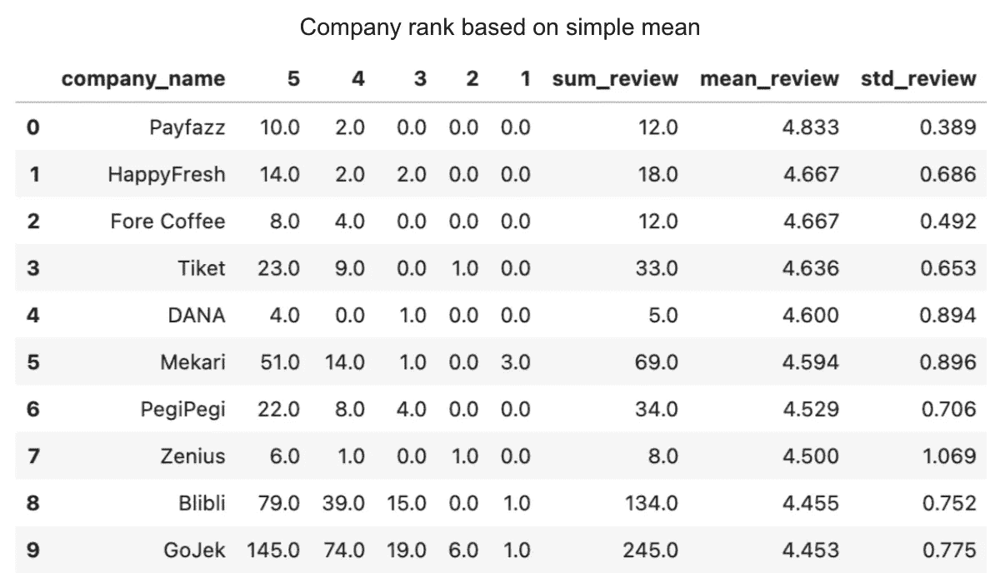

# 贝叶斯视角下的公司排名

> 原文：<https://medium.com/analytics-vidhya/company-ranking-in-bayesian-perspective-b5edef78b11b?source=collection_archive---------3----------------------->

# **背景**

最近偶然看到一篇文章: [Revou 幸福指数](https://journal.revou.co/happiness-index-perusahaan-teknologi/)。该报告评估了印度尼西亚的 38 家科技公司，并利用 Jobstreet 和 Glassdoor 上的公司评论对它们进行了排名。下面是他们的结果裁剪图像。你是否注意到有些公司的评论数量较少，但排名较高，而平均评论差异很小？例如:平均评论相差 0.05 的 Payfazz (23 条评论，平均 4.7)和 Happyfresh (62 条评论，平均 4.65)。


有更多的数据意味着我们有更多的证据证明某些事情是对的？在这种情况下，我们如何决定哪家公司应该排在第一位？这 0.05 的差距不是很小吗？另一方面，相比于 Payfazz，我们应该更重视对 Happyfresh 的信任度评价？(因为他们评论比较多)。这里我们面临一个困难的情况，我们应该在多大程度上相信我们拥有的数据？那么下一个可能的问题是，我们如何将不确定性纳入排名？

我创建这个分析来分享我们如何使用贝叶斯观点来解决这个问题。贝叶斯的意思是，我们将考虑在给定数据/证据的情况下，我们应该在多大程度上调整我们的信念，因此在排名计算中将考虑不确定性。

与 Revou 的报告相比，分析的范围略有不同。我们将只对 Jobstreet 的 38 家公司进行评估。因为 Glassdoor 只分享一个公司的平均评审，而不是在粒度级的评审。

# **问题陈述**

> 给定来自 JobStreet 的公司评论，我们应该如何更好地对这些公司进行排名？

# 数据

我们可以使用这个脚本从 JobStreet 获得 38 家公司的评论。该分析使用截至 2021 年 7 月 20 日的 JobStreet 数据。以下是基于**均值评估**的前 10 家公司。请注意，评论数量越少，标准差越高。它代表了我们对现有数据的不确定性。数据少了，信心就少了。稍后，我们将考虑排名的不确定性。



# **替代方法**

1.  按加权平均评审排名
2.  根据后验分布的统计数据进行排序(贝叶斯分析)

**1。加权平均评审**

它的灵感来自于 IMDb 之前对 250 部电影的排名。下面是公式。

```
weighted rank (WR) = (v ÷ (v+m)) × R + (m ÷ (v+m)) × C where:
  R = average review for the company = (mean_review)
  v = number of review for the company = (sum_review)
  m = minimum num of review required to be listed in the analysis
  C = the average review across the whole reportnote for this analysis
m = 5
C = 4.318
```

请注意，如果一部电影只有几条评论，那么**将更接近总体平均评论( **C** )。相反，如果一部电影的评论数远远高于 **m** ，那么 **WR** 将接近该电影的平均评论数。它强调了这样一个概念，即只要有大量的评论，就要相信一般的评论。以下是根据**加权平均评估**得出的前 10 名公司。**

****

**如果我们看两家公司:DANA 和 Mekari。他们的**均值评论**相差只有 0.006(左表)，但是他们的评论数相差很多。Mekari 有 69 条评论，而 DANA 只有 5 条评论。因此，如果我们根据加权平均评审对他们进行排名，Mekari 的排名将高于 DANA(右图)。**

****2。贝叶斯分析****

**在贝叶斯分析中，我们有一个关于参数的先验信念，我们将更新关于参数的给定数据的信念。在这个分析中，我们有一个参数:`company review`，其值在 1 到 5 之间。我们将假设参数具有高斯(正态)先验分布。因为正态-正态共轭先验，我们将得到正态后验分布。**

**我们将对所有公司使用相同的先验。它被认为是弱先验。先验(正态分布)的参数均值= 0，标准差= 1。对一家公司的评论中的观察将改变我们的先验，然后我们得到我们的后验。后验分布越紧密，意味着我们对自己的信念越有把握。相反，后验分布越宽，意味着我们对自己的信念越不确定。**

****

**使用贝叶斯分析的好处是我们有后验分布，而不是点估计。从后验分布中，我们可以得到关于参数的任何统计量。出于排序/排名的目的，我们可以使用`percentile 25 of the distribution`来代替平均值。下图显示了为什么后验分布的平均值不是排名的好指标。相反，p25 将告诉我们关于后验分布的不确定性。**

****

**以下是基于后验分布的**第 25 百分位的前 10 家公司。如上图所述，DANA 被放在了较低的位置，因为我们仍然不确定它的评论。我们再来看看 Blibli 和 GoJek，他们分别有相当一致的 4.455 和 4.453 的平均评论。但 Gojek 的评论数(245)高于 Blibli (134)。与 Blibli 相比，Gojek 也获得了 5 颗星的好评。这就是为什么 Gojek 在右表中的位置比 Blibli 高。****

****

# **结论**

**我们现在看到，使用贝叶斯观点对公司进行排名还有其他方法。如果你想在分析中加入“不确定性”,这些方法适合你。有了这些，你就不会盲目相信你所拥有的数据。相反，你会相应地用数据更新你先前的信念。**

**本文的所有源代码都在我的 [github/ajisamudra](https://github.com/ajisamudra/bayesian-company-ranking) 中。**

# **参考**

1.  **[概率编程&黑客的贝叶斯方法](http://camdavidsonpilon.github.io/Probabilistic-Programming-and-Bayesian-Methods-for-Hackers/)，卡梅隆·戴维森-皮隆。**
2.  **谷歌回答，[替代 IMDb 公式](http://answers.google.com/answers/threadview/id/507508.html)。**
3.  **[Revou](https://journal.revou.co/happiness-index-perusahaan-teknologi/)**
4.  **[JobStreet](https://www.jobstreet.co.id/)**