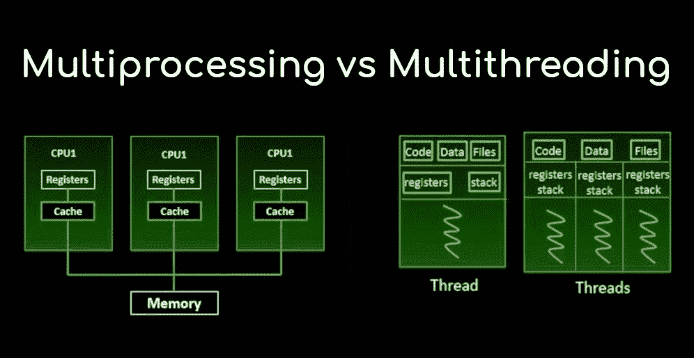
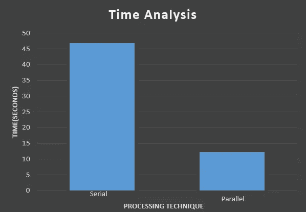

# python 中串行和并行处理的比较研究

> 原文：<https://medium.com/analytics-vidhya/comparative-study-of-serial-and-parallel-processing-in-python-398b2e2ab651?source=collection_archive---------4----------------------->


沙哈达特·拉赫曼在 [Unsplash](https://unsplash.com?utm_source=medium&utm_medium=referral) 上拍摄的照片

[](https://www.crn.com/news/components-peripherals/ampere-s-new-128-core-altra-cpu-targets-intel-amd-in-the-cloud) [## Ampere 的新 128 核 Altra CPU 瞄准了云中的英特尔和 AMD

### Ampere 是一家半导体初创公司，由前英特尔高管雷尼·詹姆斯(Renee James)创立并领导，该公司发布了一款新的 128 核…

www.crn.com](https://www.crn.com/news/components-peripherals/ampere-s-new-128-core-altra-cpu-targets-intel-amd-in-the-cloud) 

“Altra Max 拥有 128 个内核，内核数量是 AMD**64 核 EPYC** 罗马处理器的两倍，但线程数量相同，为 128 个，因为 Altra Max 不支持超线程。但即使没有超线程，该公司表示，它可以提供“理想的性能扩展”。"

稍微谷歌搜索了一下就给出了这个结果。从这个结果，我们可以公平地说，技术的增长一直是指数级的，尤其是在最近几天。如今作为一名开发人员，我们经常试图最大限度地利用我们的资源来处理大量的数据。在大数据中，世界空间复杂性不再是一个因素，但程序员仍然必须处理时间复杂性。因此，串行处理的概念正在变得过时。并行处理只不过是一台计算机同时使用多个 CPU**。在进入专业术语之前，让我们用通俗的术语来理解这个话题。**

**众所周知，每个人都有五个感觉器官，当一个人使用两个或两个以上的感觉器官时，这实际上是多重处理。例如，一个人边吃午饭边听歌。虽然有些人会称之为多任务，但在技术领域，多任务的定义与多处理截然不同。**

**就像现在电脑里的感觉器官一样，有多个核心可用。每当一个程序员编写一个代码，而这个代码被多个处理器并行执行时，这就叫做并行编程。**

**人们经常对多线程和多重处理感到困惑，这两种方法处理不同的概念，比如第一种处理并发性，而第二种处理并行编程。**

****

**多重处理和多线程**

**基本上，多线程创建了一个所有线程并行运行的假象。实际上，这些线程是以并发方式运行的。但是在多重处理的情况下，代码完全使用 CPU 内核，每个内核并行运行。这两种方法都被用于提高系统的性能，但是是在不同的情况下。当代码需要大量的计算时，就使用多重处理；如果代码需要大量的 I/O 操作或网络，那么多线程是低开销的最佳选择。**

**最近在处理遥感数据分析的超光谱图像。与 RGB 图像(3 个波段)不同，它有 100 多个波段或光谱。为了这个项目，我必须对图像进行频谱降噪。最初，线性方法与 for 循环一起使用。**

```
for i in range(padded_X.shape[0]):waveletX[i]=sp.spec_trans(threshold_val,wav_fam,thresh_type,padded_X[i])
```

**这里，每个频带被串行去噪，系统所用的时间为:**

```
**total time taken for serial processing: 46.92178964614868**
```

**在这里，我正在处理一个有 103 个波段的图像。由于一个小文件(162MB)占用了串行处理的这么多时间，所以我们可以想象，如果采用线性方法，一个大得多的文件(大于 1GB)会占用大量时间。因此，我转向了并行编程。在 python 中，有一个包叫做“多重处理”。使用这个软件包可以实现并行计算。**

```
p = mp.Pool(4)# first 3 arguments to spec_trans will be wav_fam, threshold_val and thresh_typeworker = partial(spec_trans, wav_fam, threshold_val, thresh_type)suitable_chunksize = compute_chunksize(4, padded_X.shape[0])transformedX = list(p.imap(worker, padded_X, chunksize=suitable_chunksize))
```

**这里，通过传递程序将使用的处理器号来创建一个对象。然后在 imap 函数(就像来自 itertools 的 [imap 函数)中传递一个块大小的函数。](https://docs.python.org/3/library/itertools.html)**

**当数据长度太大并且*不是*已经是一个列表时`imap`比`map`更有优势。对于`map`来说，要计算一个合适的块大小，它首先必须将 iterable 转换成一个列表，以获得它的长度，这可能是内存低效的。但是数据的长度(或近似长度)是已知的，那么 by to imap 将是一个更好的选择，它可以设置块大小，而不必将 iterable 转换为 list。**

```
def compute_chunksize(pool_size, iterable_size):chunksize, remainder = divmod(iterable_size, 4 * pool_size)if remainder:chunksize += 1return chunksize
```

**这里，每个波段并行降噪，系统所用的时间为:**

```
**total time is taken for parallel processing: 12.22811770439148**
```

**串行和并行处理的时间比较(相同操作的时间)**

**在这两种情况下，使用 python 的 pywt 包的小波变换都是在[帕维亚大学](http://www.ehu.eus/ccwintco/index.php?title=Hyperspectral_Remote_Sensing_Scenes)的同一个数据集上执行的。**

****串行和并行处理的比较是:****

****

**参考资料:**

1.  **[https://www . geeks forgeeks . org/parallel-processing-in-python/](https://www.geeksforgeeks.org/parallel-processing-in-python/)**
2.  **[https://timber . io/blog/multi processing-vs-multi threading-in-python-what-you-need-to-know/](https://timber.io/blog/multiprocessing-vs-multithreading-in-python-what-you-need-to-know/)**