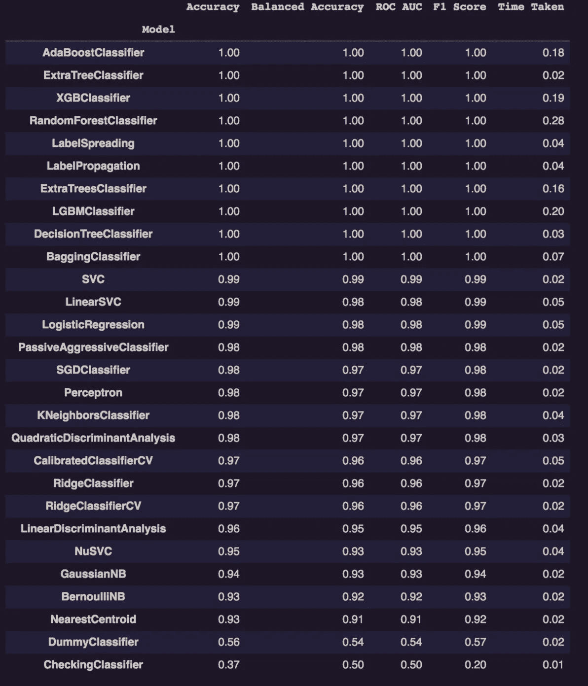
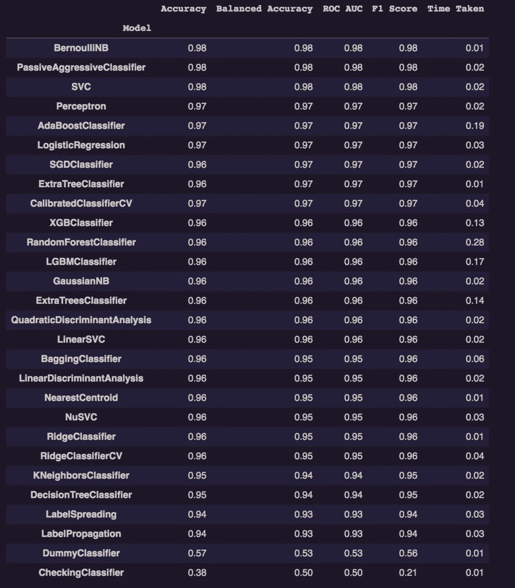
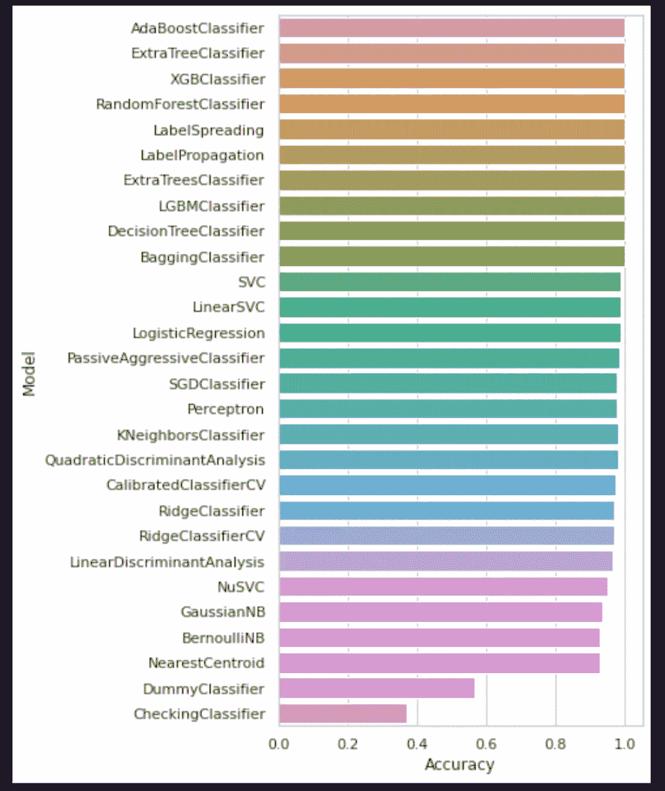
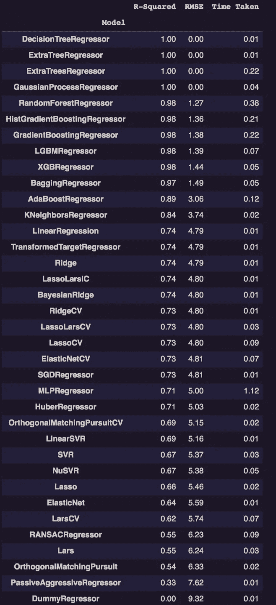
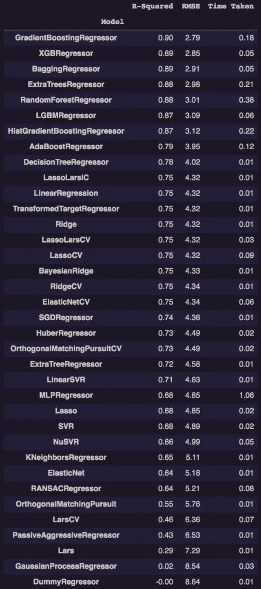
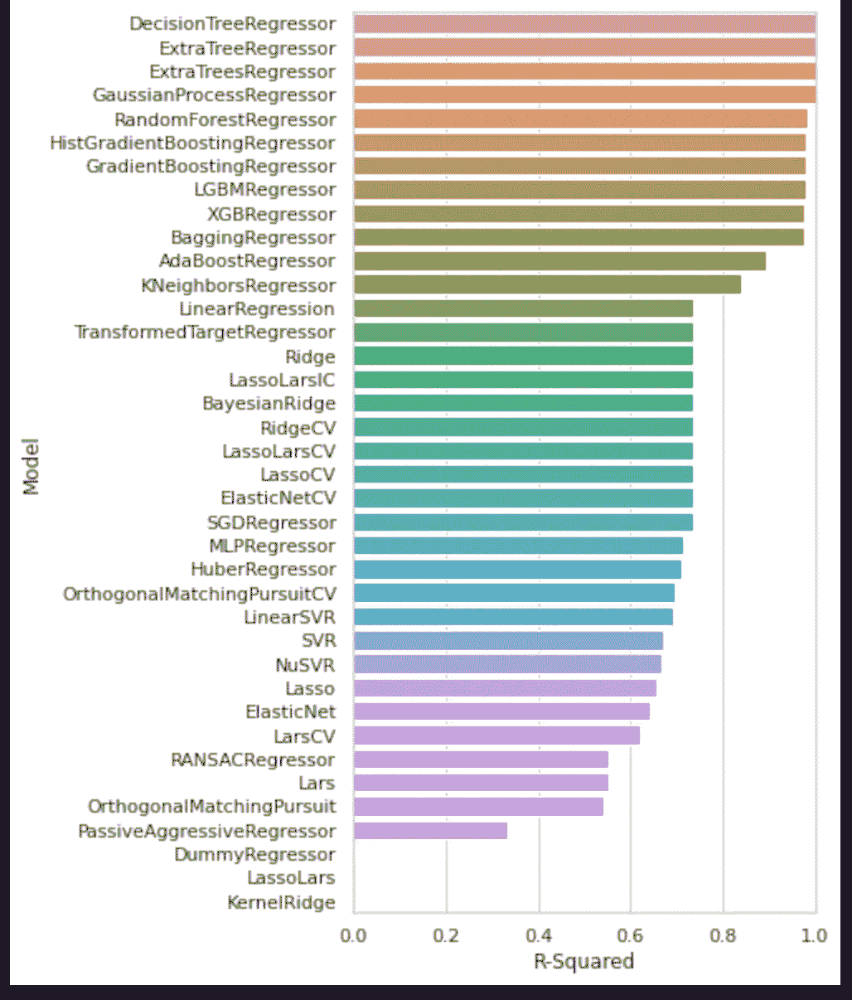

# 用几行代码比较 ML 模型

> 原文：<https://medium.com/analytics-vidhya/compare-ml-models-with-few-lines-of-code-a2cc6353c383?source=collection_archive---------9----------------------->

通过使用惰性预测库，我们可以毫不费力地比较性能最好的分类和回归算法。这个库是由“Shankar Rao Pandala”创作的，这里的[是文档的链接。](https://lazypredict.readthedocs.io/en/latest/readme.html)

我们将使用乳腺癌数据集来比较分类算法，使用波士顿住房数据集来比较回归算法，使用该库的每个任务只需几行代码。

# 分类任务:

**安装库:**

> ！安装 lazypredict

使用上面的命令安装 lazypredict 库

**导入必要的库和乳腺癌数据:**

> # Import libraries
> 从 lazypredict 导入 lazypredict
> 。从 sklearn.datasets 监督导入 LazyClassifier
> 从 sklearn.model_selection 导入 load_breast_cancer
> 导入 train_test_split
> 
> #加载数据集
> data = Load _ breast _ cancer()
> X = data . data
> y = data . target

**现在我们将数据分割成 80/20 的比例:**

> #数据分割
> X_train，X_test，y_train，y_test = train_test_split( X，y，test_size=.2，random_state =100)

**分配激光分类器:**

> #定义并构建 lazy classifier
> clf = lazy classifier(verbose = 0，ignore_warnings=True，custom _ metric = None)
> models _ train，predictions _ train = clf . fit(X_train，X _ train，y_train，y_train )
> models_test，predictions _ test = clf . fit(X _ train，X_test，y_train，y_test)

**列车数据性能:**

> #在训练集
> models_train 上打印模型性能

各种模型在训练数据上的表现

**测试数据性能:**

> #打印测试数据集
> models_test 上的模型性能

各种模型在测试数据上的表现

从上面的图像中，我们可以了解各种分类器算法(大约 28 个模型)是如何构建的，并且我们可以比较它们的准确性、ROC AUC 和 F1 分数以及它们构建所用的时间。

让我们使用 seaborn 和 matplot 库创建一个柱状图来比较这些模型。

> 将 matplotlib.pyplot 导入为 plt
> 将 seaborn 导入为 sns
> 
> plt.figure(figsize=(5，10))
> SNS . set _ theme(style = " white grid ")
> ax = SNS . bar plot(y = models _ train . index，x="Accuracy "，data=models_train)

比较不同模型的性能

从上面的柱状图中，我们可以决定哪种算法更适合我们的问题陈述，并进一步调整它以获得更好的性能。

# 回归任务:

> #加载波士顿住房数据集
> Boston = datasets . load _ Boston()
> X，y = shuffle(boston.data，boston.target，random_state=42)

**现在我们将数据分割成 80/20 的比例:**

> #数据分割
> X_train，X_test，y_train，y_test = train_test_split( X，y，test_size=.2，random_state =42)

**分配懒人进度:**

> #定义并构建 lazy classifier
> reg = lazy regressor(verbose = 0，ignore_warnings=False，custom _ metric = None)
> models _ train，predictions _ train = reg . fit(X_train，X _ train，y_train )
> models_test，predictions _ test = reg . fit(X _ train，X_test，y_train，y_test)

**列车数据性能:**

> #在训练数据集
> models_train 上打印模型性能

各种模型在训练数据上的表现

**测试数据性能:**

> #打印测试数据集
> models_test 上的模型性能

各种模型在测试数据上的表现

从上面的图像中，我们可以了解各种回归算法(大约 36 个模型)是如何构建的，我们可以比较它们的 R 平方、RMSE 值以及构建时间。

让我们使用 seaborn 和 matplot 库创建一个柱状图来比较这些模型。

> 将 matplotlib.pyplot 作为 plt 导入
> 将 seaborn 作为 sns 导入
> 
> models _ train[" R-Squared "]=[0 if I< 0 else i for i in models_train.iloc[:,0] ]
> 
> plt.figure(figsize=(5, 10))
> SNS . set _ theme(style = " white grid ")
> ax = SNS . bar plot(y = models _ train . index，x="R-Squared "，data = models _ train)
> ax . set(xlim =(0，1))

基于 R 平方度量的不同模型性能比较

这是一种只使用几行代码构建几个机器学习模型的简单方法。如果我们试图单独手动构建这些 ML 模型，那么从导入各自的库、单独构建它们并聚集它们的预测结果将花费大量时间。从上面的柱状图中，我们可以得出关于哪个算法执行得好的结论，并决定进一步调整它以获得更好的性能。

**注:**

LazyPredict 库允许我们使用默认参数构建模型。我们不能优化参数，但它将使用默认参数构建这些模型，这仍然很好，因为我们能够快速构建它们，一旦我们确定哪个模型是最好的，我们就可以集中精力对该 ML 算法进行超参数优化。

下面的文章为您提供了关于模型选择及其损失度量的挑战的进一步见解。

> [https://Neptune . ai/blog/how-to-compare-machine-learning-models-and-algorithms](https://neptune.ai/blog/how-to-compare-machine-learning-models-and-algorithms)

你们觉得怎么样？我很想知道你对此的想法。我希望我已经向您简要介绍了如何使用几行代码快速构建 ML 模型。给它一个💚，如果你喜欢这个帖子是为了额外的动力。我随时欢迎你的建议和疑问。