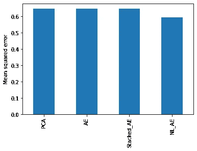
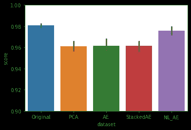

# PCA 与自动编码器在降维方面的比较

> 原文：<https://medium.com/analytics-vidhya/comparing-pca-with-deep-learning-for-reducing-dimensions-d291b965c454?source=collection_archive---------6----------------------->

我们经常需要在监督和非监督设置中降低特征空间的维度，然而，评估监督问题中的维度降低技术相对更容易，因为我们可以根据目标目标(最大化准确度、最小化验证损失、精确度、召回率等)来处理投影编码的性能。

由于其计算效率，PCA 经常被用作优选的降维技术。然而，简单的神经网络可以胜过基于 PCA 的编码。我玩过基于玩具神经网络的自动编码器，并将输出编码与使用 PCA 生成的编码进行了比较。

此分析的代码可在此处找到:[https://github . com/NaveenBansal-creater/projects/blob/master/DimensionalityReduction/dimensionality _ reduction . ipynb](https://github.com/NaveenBansal-creater/projects/blob/master/DimensionalityReduction/dimensionality_reduction.ipynb)

# 为实验搭建平台

**数据** : *使用 scikit 生成合成数据用于分类目的。共有 50 个要素的 10000 个样本，其中 20 个信息要素具有两个输出类。下面是每个特性的方差图。请注意，特征中存在的信息与特征中存在的方差相关。做这个练习是为了把这个 50 维的数据压缩到 5 维。*

每个特征的信息量

# **目标:**

> **重构误差:**比较压缩到 5 维空间时丢失信息的差异。
> 
> **准确性:**如果与目标相关，则比较编码的性能。
> 
> **解释:**比较输出特征之间的相关性

出于实验目的，选择了三种神经网络变体。

1.  **普通自动编码器(AE)**

从 50 维到 5 维执行线性变换，即在编码器或解码器层之后不使用激活。

没有激活的普通自动编码器

**2。堆叠式自动编码器(Stacked_AE)**

使用深度自动编码器，在编码器和解码器侧堆叠一个额外的层。隐藏层 1 的大小是 20，隐藏层 2 的大小是 5(将作为编码器输出)。这种架构将需要更多的时间来训练，因为与上面的普通网络相比，需要更多的参数。

**3。带非线性激活的堆叠式自动编码器(NL_AE)**

该网络的架构与上面的堆叠 AE 相同，除了在隐藏层 1 和隐藏层 2 之后应用了 relu 激活单元。注意，在该模型中，参数的数量与模型 2 相同，但是收敛时间可能因激活单元而不同。

# 培养

网络被训练以产生相同的输入，该输入馈入输入层。均方误差用作损失标准。相同的训练参数用于训练具有 SGD 优化器和恒定学习率 0.01 的每个网络。使用早期停止的耐心为 5，以避免网络过度适应，并立即停止训练。

# 结果

## 重建误差

重构误差给出了在数据压缩期间信息丢失的概念。*重建误差越大，信息损失越多*。这是原始数据和编码数据之间的均方误差。相同的输入通过经过训练的 PCA 来比较重建误差。

即使对于小网络，重构误差也几乎与 PCA 相同。如果我们使用更深的网络或微调一些更高的参数和激活，神经网络将很容易在重建相同数据时击败 PCA。

## 输出编码中的信息内容

信息内容与编码的单个组成部分中存在的方差(或 std)相关。在 PCA 的情况下，最大方差由第一个主分量解释，随后是下一个主分量，但是在自动编码器中没有这样的关系。在 PCA 中，方差/标准差将始终按排序顺序排列。下面是每个输出分量的标准偏差的比较。

输出特征的标准偏差比较

## 分类性能

根据来自每个模型的输出编码、PCA 和原始未压缩数据(50 维)来训练单独的随机森林模型。

性能比较

具有激活的自动编码器的分类性能比所有三个模型都好，事实上它几乎与原始数据集相当，表明最小的信息损失。

## 相关性检验

观察 PCA 和自动编码器中输出编码的不同分量之间的相关性是很有趣的。

特征关联热图

PCA 中的所有分量都是相互正交的，这意味着分量之间没有相关性。在第一个情节中也可以看到同样的情况。然而，在自动编码器的情况下没有这样的正交约束，这就是为什么在不同的组件之间有一些相关性。

# 裁决

1.  自动编码器的编码可以是相关的，因为它们被训练来无任何约束地重建数据，但是 PCA 的编码由于正交性约束而不具有任何相关性。
2.  PCA 训练起来快多了。
3.  一个普通的自动编码器和基于复杂数学的 PCA 一样好。

4.如果数据是非线性的，PCA 会非常失败，但是自动编码器在这种情况下也能很好地工作。