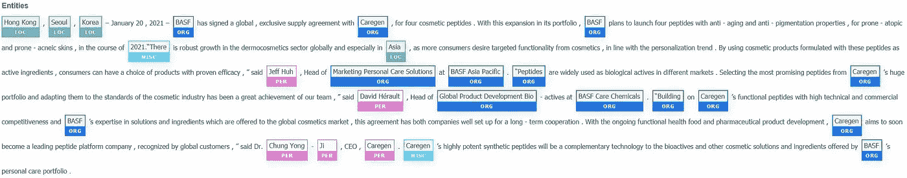

# 比较预训练命名实体识别框架(2021 版)

> 原文：<https://medium.com/analytics-vidhya/comparing-pretrained-named-entity-recognition-frameworks-2021-edition-a97d2aa5b33b?source=collection_archive---------11----------------------->

[https://www . BASF . com/SG/en/media/news-releases/Asia-Pacific/2021/01/BASF _ caregen _ supply _ agreement . html](https://www.basf.com/sg/en/media/news-releases/asia-pacific/2021/01/basf_caregen_supply_agreement.html)

无论你是在做机器学习 NLP 工程和/或研究，你可能会遇到命名实体重构(NER)的话题。你们中的一些人可能正在进行概念验证(PoCs ),这涉及到将那些开源的 NLP 框架集成到一个实际的模型推理平台中。