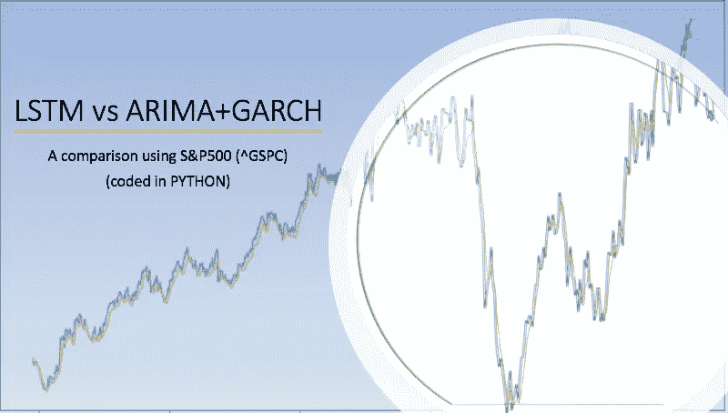

# 比较 LSTM 与 ARIMA+GARCH 在 S&P500 股票指数上的表现(附代码)

> 原文：<https://medium.com/analytics-vidhya/comparing-the-performance-of-lstm-vs-arima-garch-on-the-s-p500-stock-index-with-code-8c6c3bd899c4?source=collection_archive---------1----------------------->

## 深度学习在很多领域(医疗、视觉等)都表现出了不可思议的能力。)，但它如何与金融时间序列中众所周知的自回归模型进行比较，以及在线学习如何改善结果。

图片作者。