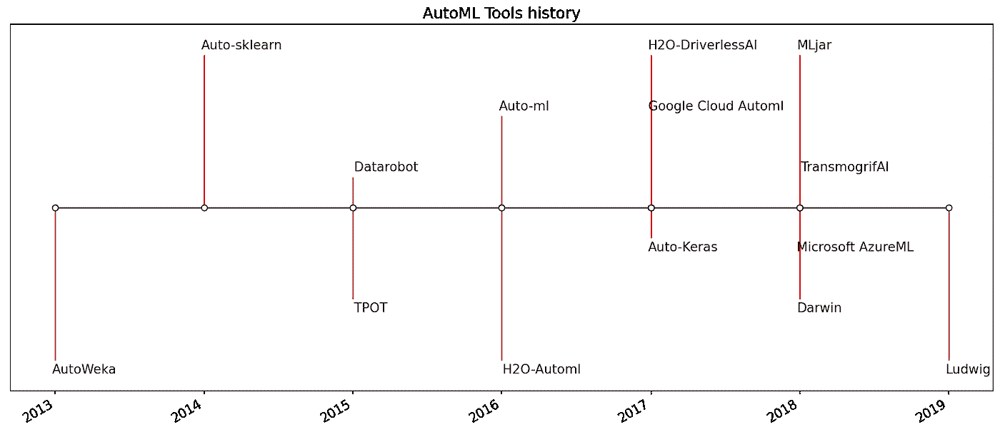
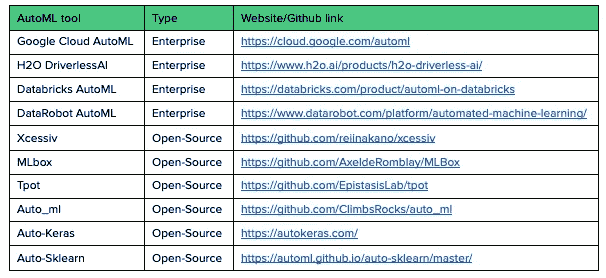
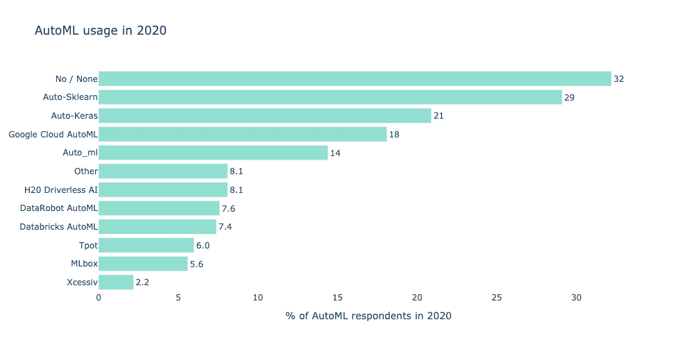
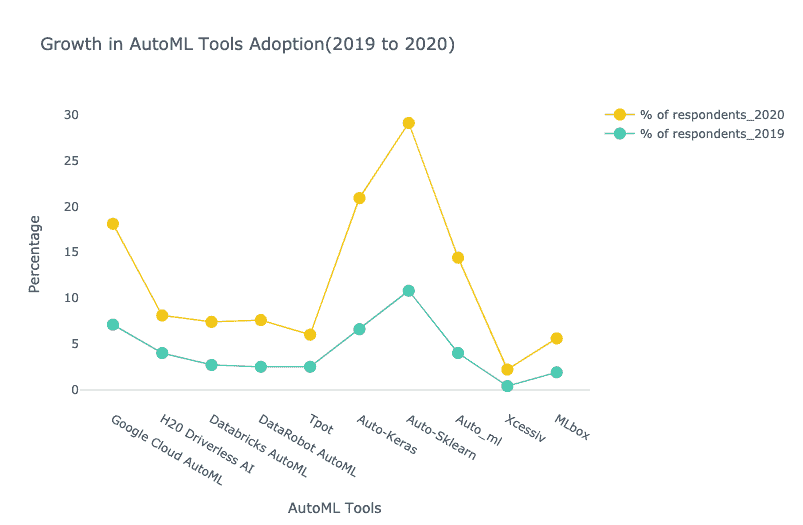
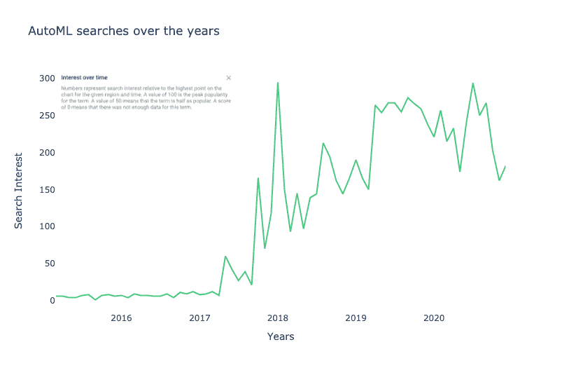

# AutoML 解决方案对比 2021

> 原文：<https://medium.com/analytics-vidhya/comparison-of-automl-solutions-2021-6625d494b695?source=collection_archive---------1----------------------->

## 了解 AutoML 解决方案的现状、采用情况、市场规模以及哪一种最适合您

*我推荐你去读一下* [*我的第一篇关于 AutoML 的文章*](/analytics-vidhya/can-automl-replace-data-scientists-cf1f939a82ba) *，我在那里介绍了这个主题，它的好处以及 AutoML 是否能取代数据科学家。*

# 背景

AutoML 解决方案已经存在很长时间了。像 [AutoWeka](https://www.cs.ubc.ca/labs/beta/Projects/autoweka/) [这样的早期 AutoML 解决方案起源于 2013 年的学术界](https://arxiv.org/pdf/1908.05557.pdf)，随后是 [Auto-sklearn](https://automl.github.io/auto-sklearn/master/) 和 [TPOT](http://automl.info/tpot/) 。这引发了机器学习的新浪潮，在接下来的几年里，包括 [Auto-ml](https://github.com/ClimbsRocks/auto_ml) 和 [Auto-Keras](https://autokeras.com/) 在内的许多其他 AutoML 解决方案进入了市场。与此同时，像 [H2O.ai](https://www.h2o.ai/) 和 [DataRobot](https://www.datarobot.com/) 这样的初创公司也推出了各自版本的自动化解决方案。最近，像亚马逊、谷歌和微软这样的公司也加入了这股潮流。

一些解决方案如 AutoWeka、Auto-Sklearn、TPOT、H2OAutoML 是完全开源的，而 DataRobot、亚马逊 Sagemaker、谷歌的 AutoML 和 DriverlessAI 是基于企业的。

# 自动采用

## AutoML 工具及其用法

这些是基于 [Kaggle 的 2020 年数据科学和机器学习状态](https://storage.googleapis.com/kaggle-media/surveys/Kaggle%20State%20of%20Machine%20Learning%20and%20Data%20Science%202020.pdf)调查结果的最知名和最常用的 AutoML 工具:

这里我们展示了调查对象对这些工具的采用情况:

我们还比较了[ka ggle 2019 年](https://www.docdroid.com/qzyxCr4/kaggle-state-of-data-science-and-machine-learning-2019-pdf)数据科学和机器学习状态调查的结果:

我们可以强调两点:

*   与 2019 年相比，2020 年更好地采用了 AutoML 工具。
*   开源 AutoML 工具的采用率高于企业 AutoML 工具。AutoSklearn 的采用率出现了最大增长。在企业领域，谷歌云的采用率增长了约 11%，H2O 无人驾驶人工智能增长了 4%。

## 社交媒体分析:推特和谷歌趋势

此外，我们分析了 Twitter 和 Google 的趋势，以便更清楚地了解对 AutoML 的普遍看法。

用于分析的数据可以从[谷歌趋势](https://trends.google.com/trends/explore?q=AutoML)获得。自 2017 年初以来，我们观察到一种增长趋势。

## 汽车市场规模

汽车市场[在 2019 年创造了](https://www.reportlinker.com/p05879068/Automated-Machine-Learning-AutoML-Market.html?utm_source=PRN)2.7 亿美元的收入，预计到 2030 年将达到 145.12 亿美元，在预测期(2020 年至 2030 年)内以 43.7%的 CAGR 增长。考虑到这一点，我们认为 autoML 还没有达到顶峰，对 AutoML 的兴趣将继续增长。

关于 AutoML 采用的其他资源:

*   [27 AutoML 统计:市场规模，采用&效益](https://research.aimultiple.com/automl-stats/)
*   [2021 年汽车技术/产品对比:深度指南](https://research.aimultiple.com/automl-comparison/)

# 我们能从 AutoML 工具中期待什么？

AutoML 解决方案可以针对机器学习过程的各个阶段。并非所有这些都涵盖相同的范围。这些是可以自动化的不同步骤:

*   [数据准备](https://en.wikipedia.org/wiki/Data_preparation)和摄取(来自原始数据和各种格式)
*   [型检测柱](https://en.wikipedia.org/wiki/Statistical_data_type)；例如布尔、离散数字、连续数字或文本
*   列意图检测；例如，目标/标签、[分层](https://en.wikipedia.org/wiki/Stratified_sampling)字段、数字特征、分类文本特征或自由文本特征
*   任务检测；如[二元分类](https://en.wikipedia.org/wiki/Binary_classification)、[回归](https://en.wikipedia.org/wiki/Regression_analysis)、[聚类](https://en.wikipedia.org/wiki/Cluster_analysis) …
*   [特征化](/@aliyaser78691/featurization-f63be523644#:~:text=Featurization%20is%20a%20way%20to,machine%20learning%20models%20work%20well.)
*   [特征工程](https://en.wikipedia.org/wiki/Feature_engineering)
*   [特征提取](https://en.wikipedia.org/wiki/Feature_extraction)
*   [功能选择](https://en.wikipedia.org/wiki/Feature_selection)
*   [元学习](https://en.wikipedia.org/wiki/Meta_learning_(computer_science))和[迁移学习](https://en.wikipedia.org/wiki/Transfer_learning)
*   检测和处理有偏差的数据和/或缺失值
*   不平衡数据的处理
*   [型号选择](https://en.wikipedia.org/wiki/Model_selection)
*   [超参数优化](https://en.wikipedia.org/wiki/Hyperparameter_optimization)的学习算法
*   时间、内存和复杂性约束下的流水线选择
*   评估指标和验证程序的选择
*   问题检查
*   [泄漏](https://en.wikipedia.org/wiki/Leakage_(machine_learning))检测
*   错误配置检测
*   监视
*   可解释性
*   对所得结果的分析
*   部署

# AutoML 用例

许多行业都有 AutoML 应用程序(医疗保健、金融服务、营销……)。[这里你可以借助 H20.ai](https://www.h2o.ai/solutions/#use-cases) 找到一些 AutoML 的用例。

# AutoML 解决方案的比较

## 开源与企业

用于 AutoML 的开源和企业解决方案非常不同:开源解决方案只能自动化算法选择和超参数调优，而企业解决方案可以做得更多(参见“我们可以从 AutoML 工具中期待什么”一节)。此外，使用开源解决方案获得的结果比企业解决方案差得多。

## H2O 无人驾驶人工智能

*   数据源不可知。它可以从任何数据源获取数据，包括 Hadoop、Snowflake、S3 对象存储、Google BigQuery 等。
*   自动可视化绘图、图形和图表有助于理解数据形状、异常值、缺失值等。在这种情况下，数据科学家可以快速发现数据中的偏差等问题。在某种程度上，自动可视化有助于启动 EDA 过程。
*   机器学习可解释性提供了关于生成了什么模型以及使用了哪些特征来构建模型的见解。无人驾驶人工智能模型做出的每一个预测都可以向商业用户解释，因此该系统即使对于受监管的行业也是可行的。
*   任何数据的 AutoML:不仅为表格数据，还为文本、图像、视频和时间序列数据创建世界级的模型。
*   自动文档为人们提供了对整个特征工程过程的深入解释。
*   整个过程通过图形用户界面完成，即使是数据科学家新手也能轻松地立即提高工作效率。
*   高度可定制:上传自己的模型，变压器和记分员作为一个自定义食谱。
*   能够利用自动化的优势，同时又不丧失影响优化的能力
*   [部署](https://www.h2o.ai/products/h2o-driverless-ai/model-deployment/) ( [文档](http://docs.h2o.ai/driverless-ai/latest-stable/docs/userguide/deployment.html?&_ga=2.226496664.449085028.1622037092-1966757472.1619783077#)):无人驾驶人工智能可以部署在任何地方，包括所有云(微软 Azure、AWS、谷歌云)和任何系统上的内部部署。每个完成的实验生成一个 MOJO(模型对象优化)。MOJO 评分管道可以从无人驾驶 AI GUI 中部署，也可以独立用于生产目的。从 GUI，可以直接访问部署到 AWS Lambda、SageMaker 或本地 REST 服务器；也有可能将模型作为普通的旧 Java 对象(POJO)下载。
*   生产项目的模型监控。
*   [文档](http://docs.h2o.ai/?_ga=2.256922510.449085028.1622037092-1966757472.1619783077#h2o)
*   [教程](https://h2oai.github.io/tutorials/)
*   成本:需要联系供应商
*   [14 天免费使用 H2O 人工智能混合云](https://www.h2o.ai/free/)。[无人驾驶 AI 21 天免费许可密钥](https://www.h2o.ai/try-driverless-ai/)。主要区别在于，第一个使用 H20 的云环境，而第二个允许您将许可证密钥带到任何其他云环境，比如 AWS。[安装无人驾驶 AI AWS Marketplace AMI](https://docs.h2o.ai/driverless-ai/latest-stable/docs/userguide/install/aws-marketplace-ami.html?_ga=2.5612400.2106307123.1627139140-1003053045.1624880203)

## 谷歌云汽车

*   Google AutoML 根据问题的类型由几个产品组成:AutoML 自然语言、AutoML 表格、AutoML 视频智能和 AutoML 视觉。最近，谷歌发布了 [Vertex AI](https://cloud.google.com/vertex-ai/docs/start/introduction-unified-platform) ，它将谷歌的所有 AutoML 产品和其余 AI 产品统一在一个统一的 API、客户端库和用户界面中。
*   非常依赖于其他谷歌产品。
*   易于与 Vertex AI 中的其他产品连接([训练定制模型](https://cloud.google.com/vertex-ai/docs/training/custom-training)、[可解释 AI](https://cloud.google.com/vertex-ai/docs/explainable-ai/overview)……)
*   比无人驾驶人工智能更难配置。
*   生成的模型的可见性很小，这使得很难在其上迭代。
*   [部署在一个端点](https://cloud.google.com/vertex-ai/docs/predictions/deploy-model-api)上，该端点可以使用 Google cloud、REST & CMD、Java、Node.js 和 Python 创建。该模型可以直接部署在 Google Cloud 上，也可以[下载到容器](/@juri.sarbach/how-to-deploy-your-automl-model-in-a-cost-effective-way-5efdd377d4d2)(边缘计算)中。
*   费用:[用什么付什么](https://cloud.google.com/vertex-ai/pricing)。不需要花钱买执照。
*   [文档](https://cloud.google.com/automl/docs)
*   [如何用顶点人工智能建立和部署模型](https://codelabs.developers.google.com/codelabs/vertex-ai-custom-models#0)

## h20–3

*   H20 的开源版本。
*   内存中的分布式快速可扩展机器学习和预测分析平台，允许您在大数据上构建机器学习模型，并在企业环境中轻松实现这些模型的生产。
*   它使得开发更加容易和快速，即使对于非专家来说也是如此。
*   支持最广泛使用的统计和机器学习算法，包括梯度增强机器、广义线性模型、深度学习等。
*   H2O-3 还拥有行业领先的 AutoML 功能，可以自动运行所有算法及其超参数，生成最佳模型排行榜。与其他开源 AutoML 解决方案相比，它是高度可配置的。
*   包含一个[模型可解释性接口](https://docs.h2o.ai/h2o/latest-stable/h2o-docs/explain.html)，其中几个可解释性方法和可视化是用一个函数生成的。
*   [生产化](https://docs.h2o.ai/h2o/latest-stable/h2o-docs/productionizing.html) : H2O-3 允许你将你构建的模型转换成一个[普通的旧 Java 对象](https://en.wikipedia.org/wiki/Plain_Old_Java_Object) (POJO)或者一个优化的模型对象(MOJO)。H2O 生成的 MOJO 和 POJO 模型旨在易于嵌入到任何 Java 环境中。生成的模型唯一的编译和运行时依赖是 h2o-genmodel.jar 文件，它是作为这些包的构建输出产生的。
*   [H2O 流](https://docs.h2o.ai/h2o/latest-stable/h2o-docs/flow.html)是 H20–3 中的一个附加用户界面，您可以选择使用。它是一个基于 web 的交互式环境，允许您将代码执行、文本、数学、情节和富媒体结合到一个文档中，类似于 iPython 笔记本。这个直观的界面允许你不用一行代码就能建立你的机器学习模型。这消除了熟悉 H20 SDK 的需要，并允许任何人构建 ML 模型。
*   [许多云环境(AWS、Azure……)都支持 H20](https://docs.h2o.ai/h2o/latest-stable/h2o-docs/cloud-integration.html)
*   [文档](https://docs.h2o.ai/h2o/latest-stable/h2o-docs/welcome.html)
*   [教程](https://github.com/h2oai/h2o-3/blob/master/h2o-docs/src/product/tutorials/dl/dl.md)

# 我的裁决

我相信**H20–3**是目前**最好的开源**平台来使机器学习民主化。其完整的范围和 [H2O 流](https://docs.h2o.ai/h2o/latest-stable/h2o-docs/flow.html)基于 web 的界面使其成为其他开源解决方案的首选。我能够在没有一行代码的情况下，从无到有，为客户流失建立一个机器学习项目。我推荐阅读这篇[使用 H2O 流程的 AutoML 逐步指南](https://www.analyticsvidhya.com/blog/2021/05/a-step-by-step-guide-to-automl-with-h2o-flow/)以获得完整的示例。

在企业解决方案中， **H20 无人驾驶 AI** 是最完整、可定制和不可知的工具。我轻松地生成了一个比 H20–3 更好的客户流失模型，同时保持了对建模的高度控制和理解。