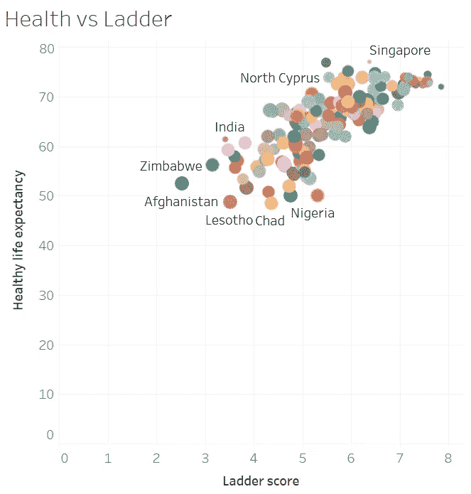
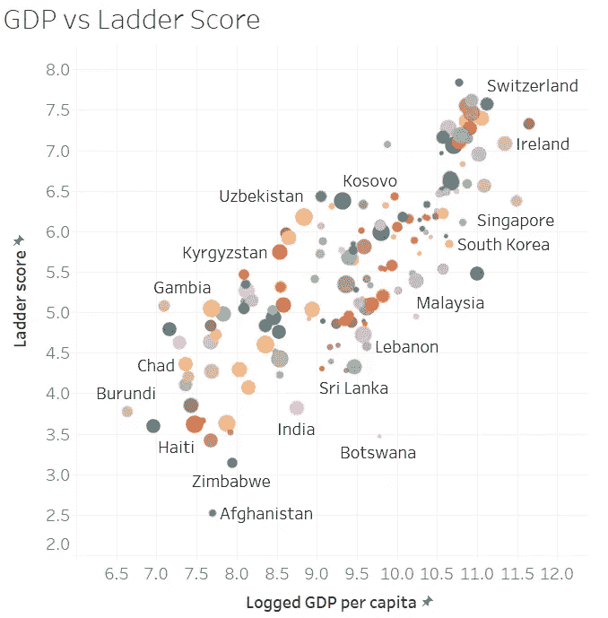
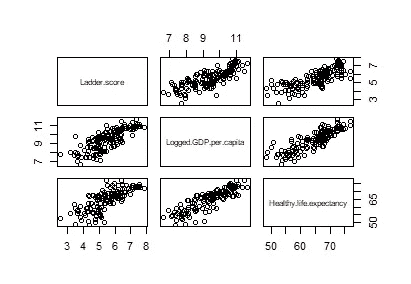
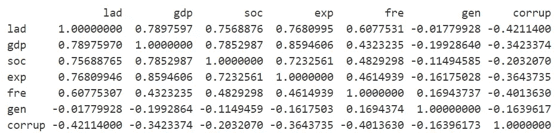
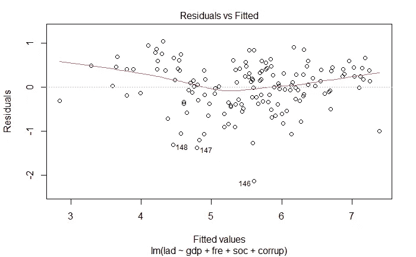
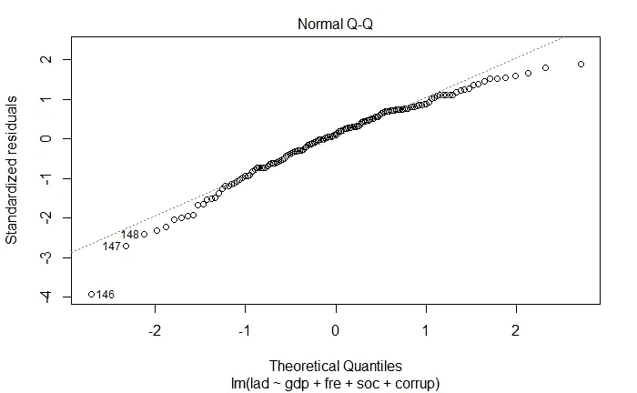
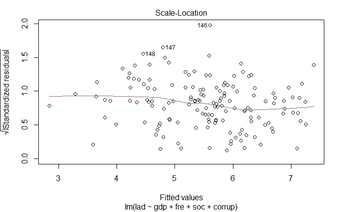
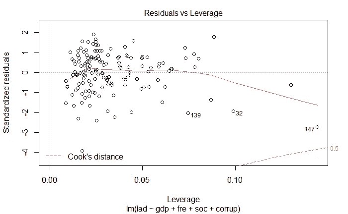

# 多线性回归和机器学习的比较 I: MLR

> 原文：<https://medium.com/analytics-vidhya/comparison-of-multilinear-regression-and-machine-learning-i-mlr-48335d162054?source=collection_archive---------30----------------------->

大家好，我最近在期末考试期间，当我复习一门关于线性回归的课程时，我发现如果我能写一篇关于 MLR 如何完成以及我们应该如何做一些诊断工作的博客会很有趣。更重要的是，与使用线性模型的机器学习相比，它的性能如何。我们开始吧！

# 对数据的一瞥

我使用的数据集是 2021 年世界幸福报告，你可以在这里找到原始数据集[https://www . ka ggle . com/ajaypalsinghlo/World-Happiness-Report-2021](https://www.kaggle.com/ajaypalsinghlo/world-happiness-report-2021)。在我们的数据中总共有六个参数经济生产、社会支持、预期寿命、自由、没有腐败和慷慨。它们一起被用于生成阶梯分数的预测，阶梯分数是幸福的指标。

让我们首先关注两个预测指标来了解这个数据集:人均 GDP 和预期寿命。



图 1 阶梯分数与健康预期寿命



图 2 阶梯得分与记录的人均 GDP

我们清楚地观察到阶梯分数、预期寿命和人均国内生产总值之间的强线性关系(但是人均国内生产总值和预期寿命之间也存在强线性关系。这将在本文的后面部分解释)。



图 3 阶梯得分、人均国内生产总值和健康预期寿命图

# 建立我们的模型

在研究了这些数据之后，我们可以假设存在一个线性模型，可以用来预测某个国家的人们的幸福程度(阶梯分数)。首先，让我们从 csv 文件中提取数据，并把它放入 R 数据帧。

```
address = "MyBlog/World Happiness Report 2021/world-happiness-report-2021.csv"
data <- read.csv(address)
col_names <- colnames(data)
lad <- data[[col_names[3]]] #Ladder score
gdp <- data[[col_names[7]]] #Logged GDP per capita
soc <- data[[col_names[8]]] #Social sopport
exp <- data[[col_names[9]]] #Life Expectancy
fre <- data[[col_names[10]]]#Freedom to make life choices
gen <- data[[col_names[11]]]#Generosity
corrup <- data[[col_names[12]]]#Corruption
df <- data.frame(lad,gdp,soc,exp,fre,gen,corrup)
```

因为我们已经知道预测因子之间的相关性可能很高，我们将继续逐步回归。你可以在博客[这里](https://quantifyinghealth.com/stepwise-selection/)找到更多关于它的信息。所以，我们先找出与阶梯评分相关度最高的预测因子。

```
cor(df) #print out the correlation matrix
```



图 4 相关矩阵

```
#First, let's do regression on Ladder~GDP since their correlation is the highest.model <- lm(lad~gdp,data = df)
history = list(summary(model)$adj.r.squared,summary(model)$fstatistic[[1]])
names(history) <- c("adj R", "F statistic")

#Next, we shall check the correlation between the remaining predictors with repsonse after removing the effect of GDP

res <- residuals(model)
for(pre in c('soc','exp','fre','gen','corrup')){
  temp <- lm(df[[pre]]~df$gdp)
  tempres <- residuals(temp)
  print(paste(pre,cor(res,tempres)))
}#We then get the following output: freedom of life choice has highest partial correlation[1] "soc 0.359923210155012"
[1] "exp 0.284878489476207"
[1] "fre 0.48148160290262"
[1] "gen 0.232218099226429"
[1] "corrup -0.261603523662922"#From the result we find freedom of life choice has the highest partial correlation, so let's add it to ouur model
model <- lm(lad~gdp+fre,data = df)
```

就指定我们的停止点而言，通常的做法是查看 F-stat 或调整后的 R 平方。为了记录 F-stat 和 Adj-R，我们将编写一个记录函数。

```
record <- function(history,adjr,f){
  history[[1]] = c(history[[1]],adjr)
  history[[2]] = c(history[[2]],f)
  return(history)
}#The way of using it is:
history <- record(history,summary(model)$adj.r.squared,summary(model)$fstatistic[[1]])
print(history) #The Adjusted R Squared increased, so we shall take freedom of life choice into our model and continue
```

当我们包括所有预测值时，历史的最终结果看起来像这样:

```
$`adj R`
[1] 0.6211607 0.7069917 0.7279170 0.7381867 0.7450204 0.7455308

$`F statistic`
[1] 243.66692 179.55253 132.98388 105.32206  87.48771  73.26714
```

检查结果后，我发现 F-统计量在不断减少，调整后的 R 平方实际上并没有增加太多。在 F 统计量和调整后的 R 平方之间取得平衡(实际上这不是最好的方法。如果想检查添加的预测值是否显著，可以做一组 Ftest)。例如，我们可以测试模型中腐败的贡献是否显著。

```
model <- lm(lad~gdp+fre+soc,data = df)
ess_r <- 1 - summary(model)$r.square
model <- lm(lad~gdp+fre+soc+corrup,data = df)
ess_ur <- 1 - summary(model)$r.square
(ess_r - ess_ur)/(ess_ur/(149-1-4))
qf(1-0.01,1,144)#Result
[1] 6.687642 #F-stat
[1] 6.814199 #F(1,144) 0.99 quantile, so corrup is not significant at 1% significance level.
```

我最终选择了第三种模型，它考虑了国内生产总值、生活选择自由和社会支持。这个最终模型可以解释 73%的总变化，这是相当不错的。

# 模型诊断

什么是多重共线性，我们为什么要关注它？这可能是一个相当复杂的问题，有许多详尽的文章解释了这一点，但我仍然想解释一下。为了进一步阅读，你可以看看 Jim [写的这篇博客 https://statisticsbyjim . com/regression/multi 共线性-in-regression-analysis/](https://statisticsbyjim.com/regression/multicollinearity-in-regression-analysis/) 。

在最后一部分，我们将进行模型诊断检查。我们关心几个问题。

1.  异方差
2.  残差正态性
3.  序列相关性(在这种情况下不合理)
4.  极端值

```
#We could simply use this two row of codes to do the diagnostic
par(mfrow=c(2,2))
plot(model)
```



图 5



图 6



图 7



图 8

从图 5 和图 7 中，我们可以看到没有明显的异方差。从图 6 可以看出，MLR 模型中残差的正态分布假设是合理的。关于图 8，我们可以观察到相当多的有影响的数据点(但不一定是异常值。关于如何处理异常值，我发现这篇[文章](https://www.theanalysisfactor.com/outliers-to-drop-or-not-to-drop/)非常有用)如果你想知道更多关于如何解读这些情节，你可以看看这个[博客](http://www.sthda.com/english/articles/39-regression-model-diagnostics/161-linear-regression-assumptions-and-diagnostics-in-r-essentials/)。

# 参考

1.  [http://www . sth da . com/English/articles/39-regression-model-diagnostics/161-linear-regression-assumptions-and-diagnostics-in-r-essentials/](http://www.sthda.com/english/articles/39-regression-model-diagnostics/161-linear-regression-assumptions-and-diagnostics-in-r-essentials/)
2.  [https://quantifyinghealth.com/stepwise-selection/](https://quantifyinghealth.com/stepwise-selection/)
3.  教材:应用回归分析