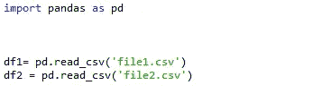
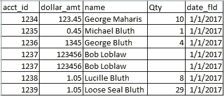
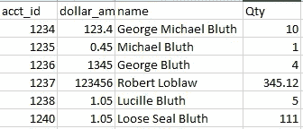
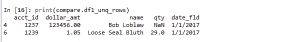
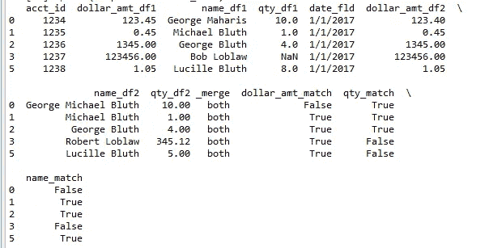
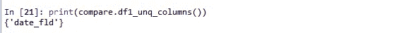

# 使用 Python 比较两个数据集

> 原文：<https://medium.com/analytics-vidhya/comparison-of-two-data-sets-using-python-a24a6d8beb13?source=collection_archive---------0----------------------->

对于任何一个从事分析工作的人来说，**比较两个数据集**将是一项日常活动。这是为了证明所做的更改不会影响文件中的其余数据，通常称为“回归测试”，还是为了了解两个文件/数据集之间的差异。

*   当数据太小时，excel 就来帮忙了。但是如果你的数据集很大呢？你必须经常进行比较？在这种情况下，您需要比 Excel 或 Excel 宏更强大的工具

市场上有很多文件比较工具，比如 beyond compare。等等

在本文中，我们将探索如何使用 **Python 库****“datacompy”**有效地比较两个大文件/数据集

****datacompy :** 是比较两个数据帧的包。最初是作为 SAS 的熊猫数据帧的`PROC COMPARE`的替代品，具有比`Pandas.DataFrame.equals(Pandas.DataFrame)`更多的功能**

**让我们看看如何利用这个图书馆。**

## **安装**数据组件****

```
pip install datacompy
```

## **详细信息:**

****datacompy** 接受两个数据帧作为输入，并给出一个人类可读的报告，其中包含统计数据，让我们知道两个数据帧之间的相似之处和不同之处。**

**它将尝试在一列连接列或索引上连接两个数据帧。**

**即使 dtypes 不匹配，按列比较也会尝试匹配值。因此，例如，如果在一个数据帧中有一个带有`decimal.Decimal`值的列，而在另一个数据帧中有一个带有`float64`数据类型的同名列，它会告诉您数据类型不同，但仍会尝试比较这些值。**

## ****例子:****

**假设您有 2 个 Csv 文件—**

**将文件载入两个数据框**

****

****df1****

****

**数据帧 1 -CSV1**

****df2****

****

**数据帧 2 -CSV2**

****导入数据比较&比较两个数据帧****

**导入数据组合**

**compare = datacompy。Compare(
df1，
df2，
join_columns='acct_id '，#您还可以指定一个列列表
abs_tol=0.0001，
rel_tol=0，
df1_name='original '，
df2_name='new ')**

## ****生成输出(以报告的形式)****

**打印(compare.report())**

## **输出:**

**数据对比
— — — —**

**数据帧摘要** 

**数据帧列行
0 原始 5 7
1 新 4 6**

**栏目摘要
— — — —**

**共有列数:4
原不新列数:1
新不原列数:0**

**行摘要** 

**匹配于:acct_id
匹配值是否重复:是
绝对容差:0.0001
相对容差:0
共有行数:5
原始但不在新中的行数:2
新但不在原始中的行数:1**

**某些比较列不相等的行数:3
所有比较列相等的行数:2**

**列比较
— — — —**

**与某些不相等的值比较的列数:3
与所有相等的值比较的列数:1
比较不相等的值的总数:5**

**值或类型不相等的列
— — — — —**

**列原始数据类型新数据类型#不相等最大差异#空差异
0 美元 _ 金额浮动 64 浮动 64 1 0.05 0
2 名称对象对象 2 0.00 0
1 数量浮动 64 浮动 64 2 3.00 1**

**值不等的样本行** 

**acct_id dollar_amt(原)dollar_amt(新)
0 1234 123.45 123.4**

**acct_id 数量(原)数量(新)
5 1238 8.0 5.00
3 1237 NaN 345.12**

**acct_id name(原)name(新)
0 1234 乔治·马海尔斯·乔治·迈克·布鲁斯
3 1237 鲍勃·洛伯劳罗伯特·洛伯劳**

**仅原始样本行(前 10 列)
— — — — — — —**

**acct _ id dollar _ AMT name qty date _ fld
6 1239 1.05 松封 Bluth 29.0 1/1/2017
4 1237 123456.00 Bob lob law NaN 1/1/2017**

**仅在新的样本行(前 10 列)
— — — — — —**

**acct_id dollar_amt 名称数量
7 1240 1.05 松封 Bluth 111.0**

**输出的细节是不言自明的**

****幕后发生的事情:****

1.  **在上面的例子中，我们在一个 ***匹配列(acct_id)上连接两个数据帧。*** 我们也可以通过:`on_index = True`而不是“join_columns”来对索引进行连接。**
2.  **`Compare.matches()`是布尔函数。如果匹配就返回真，否则返回假。**
3.  **我们可以传入`ignore_extra_columns=True`来忽略不匹配的列，并且不返回`False`(它仍然会检查重叠的列)**
4.  **默认情况下，只有 100%匹配时，DataComPy 才返回 True。我们可以通过将***ABS _ tol&rel _ tol***的值设置为非零来对此进行调整，这使我们能够指定可以容忍的数值之间的偏差量**
5.  **我们还可以使用下面的方法从 df1 或 df2 中获取两个集合和不相等行的交集的细节**

**`intersect_rows`、`df1_unq_rows`、`df2_unq_rows`**

**打印(compare.df1_unq_rows)**

****

**df1 中所有不匹配的行**

**intersect _ rows 比较匹配行的所有列，如果匹配则返回 true，如果不匹配则返回 False**

****

**打印(compare.intersect_rows)**

**df1_unq_columns() —给出 df1 中存在但 df2 中不存在的列的列表。在我们的示例中，date_fld 不在因此返回的 df2 中。**

****

**print(compare.df1_unq_columns())**

****处理重复值的条件:****

**当有重复项时，选择匹配哪一行时，重复匹配有些幼稚。Datacompy 在生成临时 ID 之前按其他字段排序，然后直接在该字段上匹配。如果有许多重复项，您可能需要将更多列连接起来，或者分别处理它们。**

# **限制**

1.  **你比较的数据帧必须适合内存。与可以对磁盘上的数据集进行操作的 SAS `PROC COMPARE`相比，如果您使用非常大的数据帧，这可能是一个限制。(我已经尝试比较了两个数据集，每个数据集有 15 万多条记录，效果很好)**

# **总而言之:**

**如果你想快速比较两个数据集，DataCompy 是相当有用的库。它还允许您考虑数据集之间的微小差异，并提供关于两个数据帧的详细摘要。**

**我希望这篇文章对你有用。**