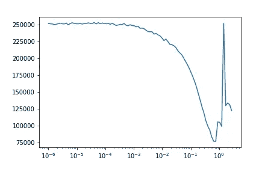

# 对比—过采样随机森林与增强数据

> 原文：<https://medium.com/analytics-vidhya/comparison-randomforest-with-oversampling-vs-augmented-data-bd7fcb96ef0f?source=collection_archive---------0----------------------->

卢卡·布拉沃在 [Unsplash](https://unsplash.com?utm_source=medium&utm_medium=referral) 上的照片

在这篇博客中，我想展示当在一个高度偏向的数据库上训练一个随机森林时，深度表格扩充可以带来的不同。在这种情况下，我们来看看信用卡欺诈，欺诈本身比非欺诈少得多。数据集可在[这里](https://www.kaggle.com/mlg-ulb/creditcardfraud)获得。

让我们看看非 frauf 案例比欺诈案例多多少:

总的来说，我们有 284.807 行，其中有 283.823 个非欺诈案例。为了利用深度表格扩充，我们需要缩放数据，然后只使用那些我们感兴趣的类，在这种情况下“类”等于 1。

为了让我们的模型工作，我们需要将我们的数据放入 DataLoader(这里我使用来自 deep data augmentation 的 DataBunch 类)。

现在我们已经准备好了。我们可以定义我们的可变编码器架构(这里:50–12–12–5–12–12–50 ),然后使用学习率查找器告诉我们最佳学习率:

我们为我们的学习率设置了一个理想的学习率和时间表:

现在，让我们训练模型:

让我们看看创建的数据是什么样子的:

# 训练随机森林

我们想要比较内置的 class_weight 功能与新方法的性能(剧透:如果你不使用任何权重，RandomForest 将总是预测 0)。因此，我们创建了三个数据帧:原始帧、附加了 fake_data 的原始帧、附加了带有噪声的伪数据的原始帧。

为了使事情更容易理解，让我们定义训练和评估结果的数据集:

首先，让我们在原始数据上训练模型，同时使用类出现的差异作为权重。

然后，我们使用扩充的数据帧:

哇，我认为这是相当惊人的。我们设法大大增加了我们能够发现的欺诈案件的数量。此外，我们没有对模型架构进行任何微调，只是简单地使用了 VAE 的默认结构，就取得了这些结果。

我希望这篇博客能给我们一些启示，为什么在高度有偏差的数据上使用这种方法值得一试。

另外，如果你想自己试试，我做了一个包，你可以安装并使用。这里是[回购](https://github.com/lschmiddey/deep_tabular_augmentation)。

拉塞

*原载于 2021 年 1 月 24 日*[*https://lschmiddey . github . io*](https://lschmiddey.github.io/fastpages_/2021/04/10/DeepLearning_TabularDataAugmentation.html)*。*