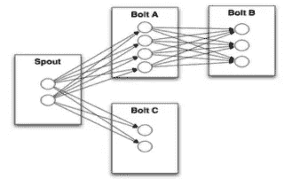

# 处理流数据的各种方法的比较

> 原文：<https://medium.com/analytics-vidhya/comparisons-amongst-various-methods-to-handle-streaming-data-a293f7be9087?source=collection_archive---------26----------------------->

近年来，在一些商场、图书馆、机场或者港口环境中，我们经常可以看到一些机器人在转来转去。他们以引导顾客而闻名。不仅如此，事实上，一些先锋公司还会使用机器人来收集这些人口密集区域的特征数据，并报告这些特征数据来进行快速清理和处理，从而提供有意义的对策或指导。商业转化如信息(广告)投放决策。

这些机器人将在不同的时间段按需交付，并在收集的数据发生重大变化时或在某个固定时间段内进行报告。当数据采集发生较大变化时，报告趋于频繁，后续数据清理和处理任务的需求会同步增加。

在本文中，我们将讨论如何在技术选择方面更恰当地处理这种查询处理场景。

场景特征和高效快速查询处理的要求:

# 1.数据通道连接能力

*   随着业务的扩大，机器人的交付将与数据通道同步增加。数据通道有足够的扩展灵活性，可以按需扩展。同时连接级别可以支持 10W+级别扩展。

## afka 可能是一个好工具

*   Kafka 作为一种通用的数据采集信息渠道，应用范围广泛，获取方式多样化。社区完善，学习成本低。Kafka 本身容易搭建，与下游大数据处理产品的协调方案成熟。
*   然而，卡夫卡扩张的动态过程是复杂的。
    有必要为额外的加工集群建立一个稳定的支持计划。

## 或者，消息队列 MQTT 解决方案

*   它支持数百万个连接，满足涵盖业务发展的要求，并为业务扩展留出足够的空间。
    MQTT 协议非常简洁，在终端和服务之间的传输上有优势。MQTT 支持各种消息所达到的 QoS 质量。以及各种客户端访问实现语言。可以实时观察客户端的连接状态，便于发现异常情况。
*   唯一的局限是大数据处理没有卡夫卡那么成熟。

# 2.简洁的数据清理能力

*   数据的处理本质上是数据的汇总和统计，逻辑实现并不复杂。对于数据本身的峰谷变化，有最简单有效的匹配伸缩处理能力就够了，不可取引入复杂的传统大数据级繁琐解决方案进行清洗。

## 大数据解决方案(Storm、Spark、Flink 等。)

*   一个开源的通用解决方案，信息量大，解决方案成熟。
*   挑战在于构造、操作和维护是复杂的，并且需要提供额外的监控和恢复方法。需要学习如何接受各种组件(下图是 Storm 的例子)。



风暴建筑

## 或者，函数计算方案

*   按需扩展和收缩，具有 100 毫秒级的扩展和收缩能力，适合数据量的峰谷变化。不需要管理清洁环境。概念也简单，学习成本低。
*   函数计算通常只在各种云厂商上可用。需求必须在云上运行。

# 3.灵活的数据访问能力

*   访问量是动态变化的，随着时间、节日、突发事件等不同，会有不可预测的幅度。变化，所以在这个业务中需要灵活的访问能力。业务端不希望通过限流来实现，因为这样会影响业务量本身。

## API 网关+功能计算解决方案

*   根据客户要求的数量进行实时弹性处理。按需使用，不用担心高峰时段，不会为闲置买单。自动提供专业访问来监控市场。
*   但是，少量的学习费用。

# 4.出色的存储容量

*   在这种情况下，数据写入和读取并发量很高，客户希望使用 NoSQL 进行存储。NoSQL 类型最能支持排序功能。本文介绍的方案中使用了 Redis，不再介绍更多的分析。

B 一起敲响，可以在阿里云上开发一个灵活的、连接的管道，具备优秀的数据存储和清理能力。


管道样品

## MQTT 节点。射流研究…

```
module.exports.handler = function(event, context, callback) { 
    var event = JSON.parse(event);
    var content = {
      path: event.path,
      method: event.method,
      headers: event.headers,
      queryParameters: event.queryParameters,
      pathParameters: event.pathParameters,
      body: event.body
    // Include logics here
    // Include logics to extract data from Redis
      }
    var response = {
         isBase64Encoded: false,
         statusCode: '200',
         headers: {
           'x-custom-header': 'header value'
         },
         body: content
       };
     callback(null, response)
 };
```

总结一下，在目前的大数据时代，各种脉搏数据的报告工具有很多，比如新能源汽车的传感器，公交车位置的报告，智慧物业管理的解锁，智慧停车场的停车管理，无人店的销售等等。在各种场景中，对上报数据的处理是无处不在的，上面提到的场景都可以在本方案中以 MQTT+FC+API Gateway 的方式引用优化来实现。