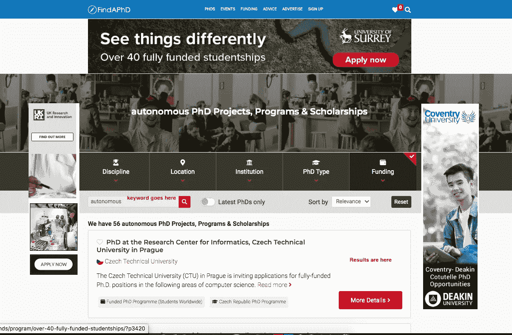

# 使用 python 汇编博士机会并将其发送到我的电子邮件

> 原文：<https://medium.com/analytics-vidhya/compiling-phd-opportunities-using-python-and-sending-it-to-my-email-8a5f253db0c9?source=collection_archive---------5----------------------->

在本教程中，我们将编写一个 python 脚本来抓取 findphd.com 某个特定领域的博士机会，将其编译成报告并发送到我的电子邮件中。


安德烈·亨特在 [Unsplash](https://unsplash.com?utm_source=medium&utm_medium=referral) 上的照片

# 介绍

我最近完成了我的机械工程学士学位，我希望进入研究生院学习机器人或自主系统。我生活的一部分。

我生活的另一部分是我喜欢写代码，所以我在看使用 python 的网络编程教程，他们教我使用 python 发送电子邮件。

所以我想，为什么不在网上搜索一下，看看机器人和自主系统领域目前的博士机会，然后写一份报告，发到我的邮箱里。它可以像一件日常的事情。

**因此，在本教程中，我们将构建一个脚本来抓取机器人和自主系统领域的博士机会，将其编译为报告，然后发送到我的邮箱。**

我正在使用这个特殊的项目**findaphd.com**网站。我发现这个网站更有前途，当我搜索我的研究生院学习的特定选择时。

虽然如果你像我一样积极地寻找奖学金和资助，你会订阅无数的电子邮件给你更新。但这只是针对你的区域和眼睛，所以没有过滤。

## 背景研究

这里是 findaphd.com 如何寻找任何不熟悉它的人，它有一个搜索框，你在里面输入你的研究关键词，它会显示结果。



做了一些初步研究，我发现了这些:

1.  当你搜索一个特定的关键词和非欧盟学生(因为我是非欧盟学生)时的网址看起来是这样的:

```
https://www.findaphd.com/phds/non-eu-students/?01w0&Keywords=autonomous&PG=4
```

术语是这样的，关键字搜索值被附加到查询的 Keywords={your keyword}处，并且在这种情况下查询 PG=4 表示页码 4。因此，我可以抓取该网站使用这个网址为我的特定关键字搜索

2.稍微检查了一下网页，发现每个结果都在有 **resultsRow 的 class 属性。**虽然我们还需要做进一步的清理才能得到标题、大学和描述。

**Python 包我们将使用** : **请求**(用于发出 url 请求) **beautifulsoup4** (用于抓取) **smtplib** (用于设置 smtp 服务器) **email** (用于编写要发送的电子邮件)

## 我们走吧。

# 第一步:网络抓取

这是我们将要抓取的 url 的结构。

```
https://www.findaphd.com/phds/non-eu-students/?01w0&Keywords={keyword_param}&PG={pageNumber_param}
```

**keyword_param** :是我们希望找到博士机会的关键字。在我的例子中**自治**显示了更多的搜索。

**pageNumber_param** :是从 1 开始的页码，根据可用的搜索结果增长。知道哪个页面在范围之内是很棘手的，但是我们稍后会解决它。现在我们默认 **pageNumber_param** 为 1。

## 我们在做什么？

请求 url 并使用 Beautiful soup 解析它。然后使用 web 浏览器的检查工具，我们得到了*标题*、*描述*、*大学*和*链接以阅读更多内容*。使用我们已经获得的名字，我们使用漂亮的 soup api 来为我们的代码获得那些值。

这是代码:

**第 5–20 行**:请求 url 并解析到 BeautifulSoup。第 5 行的参数化 url 和第 6、7 行的参数。标题是为了帮助我们像真正的客户端(例如 web 浏览器)一样发出请求。

**第 20 — 33 行**:根据 css 类名和 html 属性选择不同的分部。在第 32 行，我意识到如果没有主机 url(**https://www.findaphd.com**)，read more 的 URL 链接是不完整的，因此是第 33 行。

**第 35–36 行**:使用了从第 3 行导入的类 I，这是一种使它更简洁的方法，并将其附加到机会列表中——变量。这个类看起来是这样的:

就个人而言，我会把它放在一个名为 **generate_opportunities** 的函数中，这个函数的类名是 **PhdBot** 。所以它看起来有点像这样:

所以我们现在已经完成了机会方面的工作。

# 步骤二:构建 HTML 电子邮件

我们将构建发送给我们的 HTML 电子邮件。请记住，HTML 电子邮件将包含一个项目名称列表的报告，大学，描述和链接阅读更多。

请注意，纯文本邮件是一种选择，但如果可以的话，我真的很喜欢让事情看起来很美。

因此，我寻找了一个简单的电子邮件模板来使用，并在使用它来构造要发送给我们的电子邮件之前进行了测试。

以下是电子邮件模板:

**Ps:我已经从这里显示的代码中移除了 css 样式，完整的 html 文件可以在这里**[](https://github.com/mrsimi/phd_opportunities/blob/master/index.html)****找到。****

***原模板是 codepen 上的* [*这里的*](https://codepen.io/reallygoodemails/pen/PpLpEK) *。***

**我将用我从第一步的机会列表中生成的报告替换 **email_to_replace** 文本。**

**我们已经有了一个模板，现在让我们将机会列表转换成 html 内容。**

**在这里，向 PhdBot 类添加一个函数:**

**基本上，我们正在从机会列表中的每一项构建一个 **div** (html 语法)。**

****第 5–11 行**:我们用所有的 css 样式和占位符定义了 div 的结构，用于在 python 中的字符串格式中插入变量。**

****第 12 行**:我们使用 python 中的字符串格式插入标题、大学、描述和链接。然后我们把它们连接在一起。变量 **html_content** 帮助我们做到了这一点。**

****第 15 行**:我们正在返回内容，并使用 replace 函数清除一些转义序列。**

****第 17–18 行**:我们正在读取 html 模板(index.html)**

****第 20–21 行**:我们正在用整个生成的正文替换' **email_to_replace** '值。**

## **瞧，我们有了要发送的电子邮件！！！**

**接下来…**

# **步骤三:发送电子邮件**

**为此，我们需要访问一个电子邮件帐户来发送邮件。密码和用户名。正在使用的库是 **smtplib。在我的例子中，我为这个特殊的用例设置了一个 gmail。这将是发件人的电子邮件，我的主要电子邮件将是收件人的电子邮件。****

**但是有一点。若要允许脚本从一个电子邮件帐户向另一个帐户发送电子邮件，您需要打开“允许访问不安全的应用程序”。于是在登录发件人的邮箱账户时使用了这个链接【https://www.google.com/settings/security/lesssecureapps】[](https://www.google.com/settings/security/lesssecureapps)**

****代码:****

****这是我们添加到 **PhdBot** 类中的一个方法。****

****该函数接受收件人的电子邮件、主题和邮件正文。****

****第 6 -9 行:我们设置主题，from 和 to****

******第 15 行**:我们将 MIME 文本设置为一个 html 对象，然后将它附加到**第 17 行******

****然后在**第 20–25 行**:我们使用 ssl 通过安全连接将电子邮件从发件人发送到收件人。****

****如果你已经达到这个阶段，恭喜你。****

****尝试立即发送电子邮件至。你的 **main.py** 应该是这样的:****

****在这一点上，我们****

****这里有一个[链接](https://github.com/mrsimi/phd_opportunities.git)[【https://github.com/mrsimi/phd_opportunities.git】]到完整的代码。****

# ****结论****

****在本教程中，我们已经成功地抓取了一个网站，挑选出我们想要的各个部分，将其编译成电子邮件格式并发送出去。这一点我们可以扩展到其他几个领域。我们可以选择每个单独的部分，并在此基础上进行构建。开心就好，把它拆开，留下评论或问题。****

****编码快乐！！****