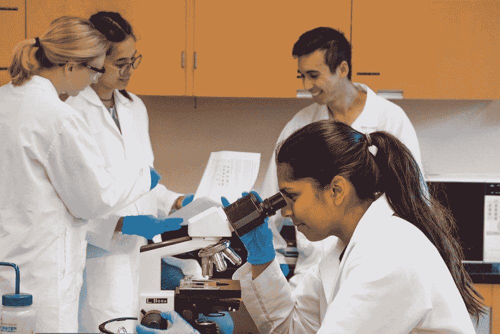

# 科学知识生产中的互补社会结构

> 原文：<https://medium.com/analytics-vidhya/complementary-social-structures-in-scientific-knowledge-production-e8daabf6316a?source=collection_archive---------25----------------------->

## 科学知识如何依赖社会生活？

图片来源:Unsplash([Tru“Tru”kat sande](https://unsplash.com/@iamtru)

科学家的刻板形象是一个孤独的研究人员关在实验室里，从事只有他自己能理解的项目。然而，科学的历史表明，科学知识是整个社会无数合作和共享知识的累积结果。Star 和 Griesemer (1989 年)在一个博物馆中展示了科学的社会性，Saunders (2010 年)在一个 CT 套件中描述了科学的社会性。然而，这两篇文章在用于实现科学知识生产的基本社会机制方面有所不同。Star 和 Griesemer 认为，科学知识生产依赖于在不同角色之间平稳过渡的能力，而 Saunders 认为，知识生产需要更明确的结构。这篇文章解释了这些看似矛盾的观点是如何在知识生产的不同阶段相互补充的。

Star 和 Griesemer 分析了伯克利脊椎动物学博物馆中各种利益相关者之间的互动，并提出了“边界对象”的概念(Star 和 Griesemer，1989 年，第 392 页)，以解释多样化的群体如何协作实现共同的目标。边界物体有助于调解博物馆研究人员的科学目标和提供标本的捕捉者的金钱目标之间的冲突，使各方能够流畅地交流和相互理解。

边界对象是“生活在多个社会世界中并且在每个社会世界中具有不同身份的对象”(409)。在对最佳实践和目标相互认可和达成一致后，边界对象成为所有相关方之间交流的共享平台。在不同的社会环境中，边界对象的流动性非常大，可以重新定义以适应每个社会角色的需要。对一些人来说，这些物品本身就是目的，而同样的物品对其他人来说只是达到更大目的的手段。Star 和 Griesemer 展示了加利福尼亚州如何成为一个边界对象，作为科学和管理目标的“区域焦点”，定义了博物馆作为一个整体的特定关注区域(409)，并展示了任何对象如何成为边界对象。他们通过识别四种不同类型的边界对象进一步发展了边界对象机制(410)。这包括所有各方为其特定需求可获得的系统分类的集合、一般概念的人造表示和存在于社会行为者之间的相同交叉点但包含不同机制的项目。

在博物馆的背景下，受管制的过程充当了特别重要的边界对象，它们很好地展示了边界对象机制。博物馆馆长 Joseph Grinnell 面临着为博物馆藏品保持严格的标本质量标准的挑战，尤其是在保存标本完整性以备存档方面。然而，出售标本的业余收集者和捕猎者有一套非常不同的优先权和知识，例如金钱收益，从狩猎的刺激中获得的快乐(402)。认识到这种利益上的差异，格林内尔不得不在严格执行他的标准和尊重收藏家的自主权之间取得平衡，同时考虑到双方知识水平的差异。因此，他创建并传播了一个关于标本收集的最佳实践框架。为了解决收集者缺乏科学知识的问题，格林内尔故意提取了收集者不需要知道的东西，并故意不涉及收集者工作中不影响标本质量的部分(407)。这些受管制的实践在拥有非常不同的内部目标和技能组合的各方之间流畅地交流的方式表明了边界对象机制在促进社会行动者之间的有效合作方面是多么强大。因此，边界对象对于协调参与科学知识生产的社会行为者的目标和最佳做法至关重要。

虽然在某些情况下，流动性对于社会参与者之间的交流至关重要，但等级结构在其他情况下可能会发挥重要作用。桑德斯将 CT 套件中的知识流动描述为类似于师傅和徒弟之间的知识转移(145)。Saunders 牢固地确立了 CT 套件中的角色层级。按照资历降序排列，CT 组由主治放射科医师、研究员、住院医师和医学生组成(147)。在这种情况下,“大师”是主治放射科医生，他们主要负责监控套房活动，并在会议和观察箱观察会议等社区环境中充当“学徒”居民和研究员的教师。

桑德斯强调了这种严格的等级结构是如何在 ct 套件中以某种“仪式”的形式表现出来的(157)。例如，在观察框会话期间，人们总是可以通过他们离观察框的距离来识别每个放射科医师的角色。最有经验的主治医生通常会把自己放在离观片箱更远的地方，让学生更详细地检查观片箱中的电影。CT 套件的特殊社会安排体现在每个角色的明确职责中。初级角色通常负责重复的任务，如在观众席“挂电影”，而主治医生不需要做这样的粗活(153)。这种责任通过重复练习和肌肉记忆将实践知识传授给学徒。学生还被要求记忆生物知识和掌握探究的艺术。为了实现这一点，主治医生通过提供指导和建设性的反馈，同时故意隐瞒信息以鼓励深思熟虑的分析，来带领他的学生揭开不寻常病例的神秘面纱(158)。不管教学方法，事实仍然是，桑德斯观察到一个相对一致的自上而下的教学风格之间的 ct 套件的社会结构层次。在这个层级中，知识的流动很难逆转，因为高级角色的经验远远超过了低级角色。

必须承认，知识可以从低年级学生流向高年级学生，特别是当涉及新技术时，因为与必须放弃旧方法并重新学习新程序的高年级学生相比，年轻人更有可能更快地适应技术中断。Saunders 在描述他观察到的机械视框的作用减弱及其对 CT 套件的社会结构的影响时，部分解决了这个问题(161)。然而，从这些病例中获得的知识量与主治放射科医生在日常操作中传授给初级放射科医生的大量知识和技能相比就相形见绌了。因此，Saunders 提出，为了确定诊断，CT 套件中的知识生产严重依赖于社会结构及其对每个放射科医师在产生和分析观察结果中的作用的影响。

尽管流动性和严格的等级制度看起来是矛盾的，但我认为这两种观点并不冲突，因为它们针对的是科学知识生产的不同阶段。这发生在三个阶段:收集、分析和交流。收集阶段主要涉及数据获取和分类。当收集的数据被处理和检查以揭示以前看不到的模式时，分析阶段产生洞察力。交流阶段严格地进行同行评审，并将发现提炼为我们通常与科学知识联系在一起的人工制品，比如研究论文。为了产生新的见解，必须教会初级科学家利用以前建立的知识和分析过程，然后将这些知识和分析过程应用于新收集的数据，重复同行审查和提炼的循环，并建立新的知识。当思维模式的转变挑战现有假设时，现有知识也将重新进入知识生产的循环。

参考这一知识生产过程，博物馆环境属于收集阶段，因为它强调标本质量和数据的系统分类，而 CT 套件环境适合交流阶段，因为它非常注重教学。每个阶段的特点也说明了每个机制的有效性。在与最常参与收集阶段的非科学团体打交道时，边界物体的流动性是一项宝贵的资产。相比之下，ct 套件的严格教学层级是有效的，因为科学知识通常在科学界内部交流，而科学界通常共享预先存在的一组共同知识和技能。例如，即使是新的放射科医生也已经从他们的医科学生时代就开始接受医学培训了。在科学界内部，边界物体作为两个世界之间的调停者的角色是不太必要的，因为科学家已经有了相似的目标和基本技能。博物馆和 CT 套件环境都包含分析阶段的元素，但是这两个环境的不同目标意味着它们的主要活动主要集中在科学知识生产过程的对比阶段。因此，不同的社会机制并不相互冲突，因为它们相互独立地朝着科学知识生产的同一目标努力。

总之，可以看出，Star 和 Griesemer 提出的边界对象机制和 Saunders 提出的严格教学等级制度并不矛盾，因为它们解决了科学知识生产不同阶段的需要。相反，可以说它们是相辅相成的，通过有效解决科学界和非科学界的优先事项和技能之间的差异，以及初级和高级科学家之间的经验差距，使知识生产周期从收集阶段顺利推进到交流阶段。

**参考书目**

桑德斯，B. (2010 年)。CT 套件:机械视窗时代的视觉学徒。在格拉斯尼 c .(编辑。)，技能愿景:在学徒和标准之间(第 145-165 页)。伯格汉图书公司。

斯达尔和格里斯默(1989 年)。制度生态学，“翻译”和边界物体:伯克利脊椎动物博物馆的业余爱好者和专业人士，1907-39。科学的社会研究，19(3)，387-420 页。